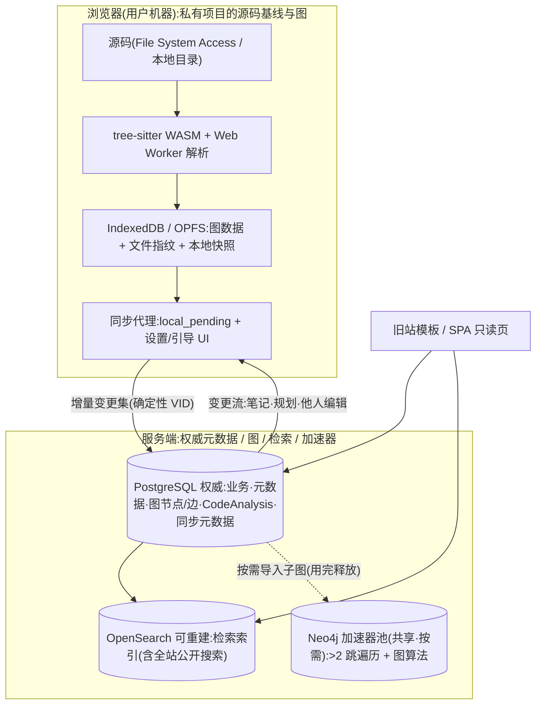

# 方案完整设计（定稿 · 施工图纸）

> **这份文档是什么**：**完整的最终设计** —— 一份可以照着施工的说明书，按阅读顺序编排，**只讲「最终是什么」，不讲「改过什么」**。
> **权威**：以各源文件为准；本文件由 **10 份源文档**合并生成，**生成物勿手改**。
> **重新生成**：`bash docs/build-full-design.sh`（幂等）。
> **先读**：**第 0 部分 · 战略与授权规划**（开源 / 商业边界 · 授权结构 · 功能开关表），再读主文 **§0.0 术语与命名**。

## 0. 给平台方 / 资助方 / 收购方（先读这一节）

| 你想知道的 | 看哪里 |
|---|---|
| **哪些可以开源、哪些是商业核心** | **【第 0 部分】S2 边界清单**（可开源 10 项 · 商业核心 10 项 · 三条判据） |
| **怎么授权、怎么收钱** | **【第 0 部分】S3 三层授权结构** |
| **我买下来能开哪些商业空间** | ★ **【第 0 部分】S4 功能开关表**（A 组可授权 · B 组授权不了） |
| **这个项目的独特能力是什么** | 【第 8 部分】附录 C（竞品与不可替代性）· 主文 **§2.3**（锚定与解释层） |
| **法律风险干不干净** | 【第 5 部分】附录 B · 【第 1 部分】**§6.0 发布许可核验** · **§2.3.14** |
| **能不能接手（可交接性）** | **【第 0 部分】S7** · 【第 2 部分】模块化架构 |
| **创始人会要什么** | **【第 0 部分】S6 三条底线**（署名 / 商标 / 付费关系） |

## 1. 一句话概览

**以「读懂陌生开源项目」为核心目标的代码图谱学习平台**：浏览器解压即解析 → 图谱提供**导航**、**锚点解释**提供说明、**阅读路径**提供阅读顺序；服务端只托管用户「显式公开」且通过**许可核验**的内容（正常**自动放行**，人工只兜存疑）；**私有内容永不上行、永不可公开**（其长期学习走桌面客户端）。

## 2. 技术组成

| 存储 | 角色 | 权威性 |
|---|---|---|
| **PostgreSQL** | 唯一权威：元数据 / `Job` / 权限 / **图节点·边** / 分析 / 审计 / `search_outbox` | 权威 |
| **OpenSearch** | 检索索引（含全站公开搜索） | 可重建、非权威、最终一致 |
| **Redis** | 限流 / 队列 / 热点邻域缓存 | 非权威、可随时重建 |
| **Neo4j Community（共享池）** | **按需图计算加速器**（>2 跳 / 图算法，用完释放） | 非权威、可随时重建 |

> **完整口径见【第 1 部分】§2 / §4.2 / §4.5 / §5.5** —— 该处为唯一权威定义；本节仅为速览。

## 3. 阅读顺序（本文件编排）

| # | 部分 | 源文件 | 定位 |
|---|---|---|---|
| **0** | ★ **战略与授权规划（先读）** | `backend-strategy-plan.md` | **唯一对外的战略章节**：开源 / 商业边界清单 · 三层授权结构 · 功能开关表 · 递进路线 · 三条底线 |
| 1 | 后端设计主文 | `backend-design.md` | 总体设计（目标架构、读懂体验与解释层、本地优先与发布合规、落地节奏、待拍板决策） |
| 2 | 后端模块化架构 | `backend-modular-architecture.md` | 13 模块 + 4 张 P0 表（表归属/事件/降级/错误码） |
| 3 | 附录 D · 数据契约细则 | `backend-contract-detail.md` | VID 编码、版本向量、fencing、请求体清单 |
| 4 | 附录 A · 权威矩阵与写者租约 | `backend-authority-matrix.md` | 权威四层、租约、outbox 状态机 |
| 5 | 附录 B · 权限注入与安全 | `backend-tenancy-security.md` | 威胁模型、注入清单、审计、错误码 |
| 6 | 附录 F · 可观测与容灾 | `backend-observability-dr.md` | 指标阈值、备份恢复、测试策略 |
| 7 | 附录 G · 导出与删除 | `backend-data-lifecycle.md` | 数据分类、导出、删除九步、验收 |
| 8 | 附录 C · 生态对标 | `backend-ecosystem-refs.md` | 引用核实、产品类竞品、浏览器分档、阈值依据 |
| 9 | 前端对接契约 | `frontend-contract.md` | 现状契约（§1–§13）+ 目标契约（§14–§20） |

**未收录**：附录 E（历史归档）、两份决策登记、4 份参考料。

## 4. 全文章节目录（可跳转）

- [S1 三条原则（本规划的前提） {#p0-1}](#p0-1)
- [S2 ★ 开源 / 商业核心边界清单（本部分最重要） {#p0-2}](#p0-2)
- [S3 授权结构 + 分层许可（★ 许可强度决定能否保住署名） {#p0-3}](#p0-3)
- [S4 功能开关表（「给平台的说明书」） {#p0-4}](#p0-4)
- [S5 递进路线 {#p0-5}](#p0-5)
- [S6 ★ 三条底线（可让渡控制权，不让渡这三样） {#p0-6}](#p0-6)
- [S7 可交接性（一个现在就该立的非功能目标） {#p0-7}](#p0-7)
- [S8 本部分与其他部分的关系 {#p0-8}](#p0-8)
- [0.0 术语与命名（唯一权威 · 先读） {#p1-1}](#p1-1)
- [0. 评审摘要(先行结论) {#p1-2}](#p1-2)
- [1. 背景与问题(实测证据) {#p1-3}](#p1-3)
- [2. 目标架构 {#p1-4}](#p1-4)
- [3. 客户端侧(本地优先):本地解析与存储 {#p1-5}](#p1-5)
- [4. 数据落位(字段级) {#p1-6}](#p1-6)
- [5. 同步设计(客户端 ↔ PG;检索索引最终一致) {#p1-7}](#p1-7)
- [6. 用户同步权限与防丢失 {#p1-8}](#p1-8)
- [7. 读路径映射(保证对外契约不变) {#p1-9}](#p1-9)
- [8. 并发、限流与作业模型 {#p1-10}](#p1-10)
- [9. 落地节奏(测试期 / 扩展期) {#p1-11}](#p1-11)
- [10. 风险与缓解 {#p1-12}](#p1-12)
- [11. 待评审决策(需要拍板) {#p1-13}](#p1-13)
- [12. 验收标准 {#p1-14}](#p1-14)
- [1. 模块化原则(五条) {#p2-1}](#p2-1)
- [2. 模块划分与依赖方向 {#p2-2}](#p2-2)
- [3. 模块清单(12) {#p2-3}](#p2-3)
- [4. 跨模块契约(四条流程) {#p2-4}](#p2-4)
- [5. 边界规则 {#p2-5}](#p2-5)
- [6. 模块化收益(验收方向) {#p2-6}](#p2-6)
- [7. 共享内核(不可拆 · 五项) {#p2-7}](#p2-7)
- [8. 实施路径(写死顺序) {#p2-8}](#p2-8)
- [9. 目录结构与依赖纪律 {#p2-9}](#p2-9)
- [10. 表归属矩阵 {#p2-10}](#p2-10)
- [11. 事件契约 {#p2-11}](#p2-11)
- [12. 降级矩阵 {#p2-12}](#p2-12)
- [13. 跨模块错误码契约 {#p2-13}](#p2-13)
- [14. 缺口归属与范围声明 {#p2-14}](#p2-14)
- [D1 128 位 VID 的物理编码 | [模块: 共享内核] {#p3-1}](#p3-1)
- [D2（★ 已整体删除） {#p3-2}](#p3-2)
- [D3 `CodeAnalysis` 的唯一写者 | [模块: parse] {#p3-3}](#p3-3)
- [D4（★ 已整体删除） {#p3-4}](#p3-4)
- [D5 `vid_op_rev`（★ 本轮整体删除） | [模块: graph] {#p3-5}](#p3-5)
- [D6 `CodeAnalysis` 与 `CodeAnalysisDerived` 的字段级合并 | [模块: parse] {#p3-6}](#p3-6)
- [D7 请求体字段清单 | [模块: sync] {#p3-7}](#p3-7)
- [D8 读路径统一契约 | [模块: graph+search] {#p3-8}](#p3-8)
- [D9 派生预计算契约 | [模块: parse] {#p3-9}](#p3-9)
- [A1 先分层:四种"权威"必须分开说 | [模块: 横切·分层] {#p4-1}](#p4-1)
- [A2 权威矩阵(裁决版) | [模块: 横切] {#p4-2}](#p4-2)
- [A3 · A4（★ 已整体删除） {#p4-3}](#p4-3)
- [A5 检索索引同步(`search_outbox`) | [模块: search] {#p4-4}](#p4-4)
- [B1 威胁模型(必须先承认的失败场景) | [模块: 横切] {#p5-1}](#p5-1)
- [B2 三条强制规则(不可协商) | [模块: 横切] {#p5-2}](#p5-2)
- [B3 逐接口注入清单(验收项) | [模块: auth+project] {#p5-3}](#p5-3)
- [B4 OpenSearch 专项 | [模块: search] {#p5-4}](#p5-4)
- [B5 图数据隔离(PG + 加速器) | [模块: graph] {#p5-5}](#p5-5)
- [B6 检索同步消费侧复核 | [模块: search] {#p5-6}](#p5-6)
- [B7 审计与可观测(验收项) | [模块: audit] {#p5-7}](#p5-7)
- [B9 客户端提交数据的校验与净化 | [模块: 横切] {#p5-8}](#p5-8)
- [B10 日志与可观测数据中的敏感信息(M11) | [模块: audit] {#p5-9}](#p5-9)
- [B11 登录与认证错误码矩阵 | [模块: auth+ratelimit] {#p5-10}](#p5-10)
- [F1 监控指标:阈值 / 通道 / 升级 / 静默 | [模块: observability] {#p6-1}](#p6-1)
- [F2 备份与容灾(M4) | [模块: 运维·备份恢复] {#p6-2}](#p6-2)
- [F3 测试策略(M6) | [模块: 横切·质量] {#p6-3}](#p6-3)
- [G1 数据分类与处置 | [模块: 横切+运维] {#p7-1}](#p7-1)
- [G2 导出(可携带权) | [模块: export] {#p7-2}](#p7-2)
- [G3 删除的执行顺序(避免半删状态) | [模块: deletion] {#p7-3}](#p7-3)
- [G5 审计保留期与备份策略的关系 | [模块: audit+运维] {#p7-4}](#p7-4)
- [G4 验收 | [模块: 横切] {#p7-5}](#p7-5)
- [C1 引用核实结果 | [模块: 横切] {#p8-1}](#p8-1)
- [C2 浏览器解析能力分档(硬问题 6 的处置) | [模块: 前端·解析分档] {#p8-2}](#p8-2)
- [C3 阈值依据与修订(§11.1) | [模块: 横切] {#p8-3}](#p8-3)
- [C4 对评审十条建议的处置 | [模块: 横切] {#p8-4}](#p8-4)
- [C5 附:两条口径修正(写入主文) | [模块: 横切] {#p8-5}](#p8-5)
- [C7 供应链安全(M12) | [模块: 运维·供应链] {#p8-6}](#p8-6)
- [C8 效率优化对标:GitNexus | [模块: 横切] {#p8-7}](#p8-7)
- [1. 响应形态(envelope)与归一规则 {#p9-1}](#p9-1)
- [2. 主链端点清单(全部已注册于 `projects/urls.py`) {#p9-2}](#p9-2)
- [3. 数据模型字段(`projects/models_graph.py`) {#p9-3}](#p9-3)
- [4. 写操作契约(CAS) {#p9-4}](#p9-4)
- [5. 权限与游客语义 {#p9-5}](#p9-5)
- [6. 新增端点实现约束(D7) {#p9-6}](#p9-6)
- [7. 认证与 CSRF 精确边界(D11 / D12) {#p9-7}](#p9-7)
- [8. `/edit/` 写操作完整语义(D13,已存在) {#p9-8}](#p9-8)
- [9. 分析面板数据映射(D14,不新增端点) {#p9-9}](#p9-9)
- [10. 上传 client(D15) {#p9-10}](#p9-10)
- [11. envelope 逐接口原始形态登记(D17) {#p9-11}](#p9-11)
- [12. SPA 认证端点 `/api/auth/*`(新增,D2/D8/D11) {#p9-12}](#p9-12)
- [13. 验收工具与环境事实(2026-09-10) {#p9-13}](#p9-13)
- [14. API 版本化与弃用登记 {#p9-14}](#p9-14)
- [15. 限流统一契约(对应主文 §8.1 + 附录 B11) {#p9-15}](#p9-15)
- [16. 前端合约协商(对应主文 §7) {#p9-16}](#p9-16)
- [17. 写路径契约(浏览器本地解析 → 上传) {#p9-17}](#p9-17)
- [18. 读路径契约(分片 + 派生就绪) {#p9-18}](#p9-18)
- [19. 客户端义务(本地模型 / 校验上限 / 文案,易漏项集中登记) {#p9-19}](#p9-19)
- [20. 读懂体验契约(阅读路径 / 解释 / 进度 / 发布审批 / 嵌入 / **媒体整合 / 发现层 / 创作者认证**) {#p9-20}](#p9-20)
- [21. 本轮同步的未决项(需评审裁决,勿自行拍板) {#p9-21}](#p9-21)

---

**门禁状态**：✅ **可开工** —— 检查器与「文档自检清单」已取消，**文档定稿即通过**。

---

---

# 【第 0 部分】战略与授权规划（先读）

> **来源**：`docs/backend-strategy-plan.md`
>
> **本部分看点**：① ★ 开源 / 商业核心边界清单（可开源 10 项 · 商业核心 10 项 · 三条判据）② 三层授权结构（开源 / 商业 / 商标）③ 功能开关表（可授权 vs 不可授权）④ 递进路线 ⑤ ★ 三条底线

# 战略与授权规划（先读）

> **为什么本部分在最前面**：前面所有技术设计都回答「**怎么建**」，本部分回答「**给谁看、谁能拿、拿什么换什么**」。
> ⚠ **这是唯一一份面向「外部读者」（平台方 / 资助方 / 收购方）的章节** —— 其余部分面向实施团队。

**核心原则（一句话）**：**开源「让人相信你的部分」，保留「让人离不开你的部分」。**

> ⚠ **★ 对外提供的阅读提示（本部分含未公开的谈判参数）**
>
> | 给谁看 | 给哪些 | ⚠ **不给哪些** |
> |---|---|---|
> | **公开发布**（仓库 / 演示视频 / 网站） | **S2**（边界清单 · 署名工具箱 · 同类产品）· **S4**（功能开关表）· **S7**（可交接性） | ⚠ **S3 的许可条款细节** · ⚠ **S6 三条底线** · ⚠ **S5.2 接触对象的切入点** |
> | **一对一洽谈时** | 上面全部 | — |
>
> ★ **理由**：**谈判参数一旦公开，就没有谈判空间**。**S2 / S4 / S7 是「吸引对方」的材料；S3 / S6 是「谈的时候才亮出来的牌」。**

---

## S1 三条原则（本规划的前提） {#p0-1}

| # | 原则 | 说明 |
|---|---|---|
| **1** | **无外部助力时，主动收窄商业空间以规避法律风险** | 这是**策略**，不是架构限制。收窄的每一项都**标注了放开条件**（见 S4） |
| **2** | ★ **不写死**：每一项约束都要留下「**可被授权打开**」的接口 | 否则**任何平台都无法接手**（他们买不到可扩展的空间） |
| **3** | ★ **可让渡控制权，但不让渡三样东西** | 见 **S6 三条底线**（署名 / 商标 / 付费关系） |

> **本规划要达成的状态**：**平台方拿到授权 → 可以放开商业空间 → 网站做大 → 更多人学会读源码**；即使原作者的运营权被取代，**署名与授权费仍然成立**（双赢）。

---

## S2 ★ 开源 / 商业核心边界清单（本部分最重要） {#p0-2}

### S2.1 可以开源（放 GitHub 等公开仓库）

**判据**：它是「**标准**」、是「**信任证明**」、或「**单机就能跑**」。

| # | 组件 | 为什么可以开源 |
|---|---|---|
| 1 | **解析器 / 语法规则 / `uid` 生成规则** | 最容易收到社区贡献；且**人人可写解析器**，不构成壁垒 |
| 2 | **图模型 + VID 编码**（确定性 `sha256_16`） | ★ 这是「**标准**」不是「产品」—— 公开才能成为事实标准 |
| 3 | **锚定层数据模型**（锚 / 解释 / 阅读路径 / 提问） | ★ **「坐标系」的规格公开，才有开放 API 与开放格式的战略价值** |
| 4 | **`.webapkg` 开放格式 + 开放 API 契约** | 已定为战略目标（主文 §2.3.9） |
| 5 | **浏览器端（本地优先解析 + 会话态）** | 前端不是壁垒；且社区能帮修浏览器兼容与性能 |
| 6 | ★ **L1 许可核验**（白名单 + 仓库级扫描） | ★ **公开它 = 公开「我们很干净」** —— 是**法律信任的证明**，不是负担 |
| 7 | **避风港相关实现**（举报 / 通知-删除流程 / 软删除 / 审计留痕） | 同上：**合规透明本身就是吸引力**（大平台最怕黑盒） |
| 8 | **审计日志模型**（`AuditLog` 结构） | 让第三方**能自行验证「平台可追溯」** |
| 9 | **不可变快照 + 幂等机制**（`parse_hash` / 单写者串行） | 是**机制**不是产品 —— 公开它能让别人复用这套「可信图」的解法 |
| 10 | ★ **单机自托管部署脚本**（PG + Redis 的最小闭环） | ★ **「可交接性」的前提** —— 见 S7 |

### S2.2 商业核心（不开源，保留授权能力）

**判据**：它是「**产品**」、是「**规模优势**」、或「**企业采购的硬要求**」。

| # | 组件 | 为什么是商业核心 |
|---|---|---|
| 1 | ★ **加速器池**（图计算引擎的共享池：申请 / 排队 / 独占 / 释放 / 亲和调度 / 驱逐规则） | **大规模图算法的成本与性能优势** —— 个人玩家跑不起来，这正是企业愿意付钱的部分 |
| 2 | ★ **多租户与组织管理**（组织 / 团队 / 角色 / 配额） | ★ **企业版的入口** |
| 3 | ★ **SSO / 目录同步 / 账号生命周期** | 企业采购的硬性要求（几乎一票否决项） |
| 4 | ★ **审计增强与合规报表**（导出 / 保留策略 / 取证视图） | 金融、政企、上市公司的合规需求，**付费意愿最强** |
| 5 | ★ **企业私有部署的运维工具**（升级 / 备份 / 灰度 / 监控面板） | 部署与运维成本是企业在意的核心 |
| 6 | ★ **派生预计算与缓存调度**（派生指标的命中策略与调度） | **规模化的成本优势** |
| 7 | ★ **AI 草稿生成的编排与提示工程** | 若将来做：**模型调用成本与效果调优是壁垒** |
| 8 | ★ **人工审核工作流**（发布审批的运营中台） | 关系到一个关键商业空间能否打开：**用户上传代码包公开**（见 S4 的 A2） |
| 9 | ★ **内容指纹库与判据**（防换名重传） | 防滥用的核心资产 |
| 10 | **白标与品牌定制**（去 logo / 多品牌） | 白标是企业采购的常见诉求 |

### S2.3 遇到新功能，怎么判断放哪边（三条判据）

| 判据 | 开源 | 保留 |
|---|---|---|
| **① 它是"标准"还是"产品"？** | **标准**（别人愿意照着实现） | **产品**（别人愿意付费使用） |
| **② 它是"单机可跑"还是"必须有规模才有效"？** | **单机可跑** | **必须有规模**（成本 / 性能优势） |
| **③ 它是"信任证明"还是"成本优势"？** | **信任证明**（透明才可信） | **成本优势**（省下的钱就是价值） |

> ★ **一句话**：**开源「让人相信你的部分」，保留「让人离不开你的部分」。**

### S2.4 ⚠ 边界必须现在画死

**理由**：**已发布的许可不可撤回** —— 一旦开源了某块，**将来收不回来**。

| 要求 | 说明 |
|---|---|
| **① 边界写在代码结构里** | 开源仓库与商业模块**物理分离**（不同目录 / 不同包），**不靠"心照不宣"** |
| **② 核心必须能独立运行** | 开源部分交付时**必须能单机跑起来**（否则无人能验证与接手） |
| **③ 新增功能先判归属** | 每个新功能在合并前**必须过一次 S2.3 的三条判据**并登记结果 |

---

### S2.5 ★ 署名保护工具箱（「担心被抄且丢了署名」时用这个）

> **前提**：**「想法」不受法律保护**（思想 / 表达二分法）—— 所以**目标不是「不让别人知道」，而是「让别人知道这是你的」**。

**工具一 · 时间戳证据链（几乎免费，让「我先想到的」可证明）**

| # | 工具 | 成本 | 效果 |
|---|---|---|---|
| **1** | ★ **公开仓库的 git commit 时间** | ≈0 | **不可篡改的时间戳** —— 最强的「我先想到」证据 |
| **2** | ★ **Zenodo DOI**（免费为开源项目发放永久标识） | ≈0 | **学术级永久标识** —— 比口头主张强得多 |
| **3** | **公开发布（视频发布时间 + 内容）** | ≈0 | 传播 + 时间戳，一举两得 |
| **4** | **商标注册（名字）** | 低 | ★ 「**这个名字是我的**」有法律效力 |
| **5** | ⚠ **不把未发布的东西先给平台方看** | — | 保密协议的执行力**很弱**，签了也难执行 |

★ **建议顺序**：**先 git 提交（本地时间戳）→ 再公开发布（公开时间戳）→ 同时打 DOI → 有了数据再谈。**

**工具二 · 认知保护（最便宜、最有效的一招）**

> **公开地、反复地、用一个固定说法讲这件事。**

| 固定说法（示例） | 效果 |
|---|---|
| **「AI 时代，代码解释需要一个可验证的坐标系」** | 说得越多、越一致，**别人抄的时候就越难摆脱「这是跟某某学的」** |
| **「AI 答不了『这段解释是对哪个版本说的』」** | 让你的名字与这个问题**绑定** |

⚠ **反面做法（必须避免）**：每次都换说法、换角度 ⇒ **别人抄的时候没有任何心理负担**。

**工具三 · 许可条款** —— 见 **S3**

> ★ **要保住署名，反而必须开源 —— 但要用「带署名可见要求」的许可**（见 S3.1）。
> ⚠ **保密不但保不住署名，还会让你失去唯一的法律杠杆。**

### S2.6 ★ 已知的同类产品（决定你的时间窗口，必须先核实）

> ⚠ **假设修正**：「平台方只是缺想法、不缺执行力」—— **这个假设不成立**。

| 已有的东西 | 说明 |
|---|---|
| ★ **GitHub permalink**（永久链接到某个 commit 的行） | **这就是「锚定」的技术原型** —— 已存在多年 |
| **Sourcegraph** | 代码搜索 + 精确到版本与行的引用 |
| ★ **AI 自动生成的代码库讲解**（如 Devin / Cognition 的 DeepWiki） | ⚠ **最接近本产品的形态**：公开可访问 + AI 生成讲解 |
| **CodeTour · CodeSee · Swimm** | 代码导览与可视化 |

★ **结论**：**平台方不是「没想到」，而是「试过 / 想过，但没做那三件他们不愿意做的事」**：

| # | 他们不愿意做的事 | 为什么 |
|---|---|---|
| **1** | **锚定到不可变版本** | 技术上不难，**产品上没人愿意承诺「这份解释只对 abc123 有效」** |
| **2** | **让社区署名写解释** | 他们做的是 **AI 生成**，不是**社区众包** |
| **3** | ★ **承认解释可能错、可追溯、可追责** | ⚠ **这与 AI 产品的营销逻辑天然冲突** |

> ★ **一句话**：**本项目的护城河不是「想法」，而是「组织意愿」** ——
> **平台方越不愿意承认自己可能错，本项目的窗口就越长。**
> ⚠ **但窗口的宽度必须自行核实**（去查同类产品当前的状态），**不要假设它是无限的**。

---

## S3 授权结构 + 分层许可（★ 许可强度决定能否保住署名） {#p0-3}

### S3.1 分层许可（⚠ 不要全都用同一种许可）

| 层 | 内容 | ★ 建议许可 | 为什么 |
|---|---|---|---|
| ★ **核心** | 解析器 · 图模型 + VID · **锚定层** · 浏览器端 | ★ **强 copyleft（AGPL 类）**，或**「署名必须在 UI 可见」的自定义开源许可** | ★ **改了就得更开源** + **署名必须让用户看到**（不是「关于」页的小字） |
| **规格层** | 开放格式（`.webapkg`）· 开放 API 契约 | **最宽松许可（MIT / Apache 类）** | ★ **要成为事实标准，越宽松越好** —— 规格本身不是卖点，**被广泛实现才是** |
| **商业层** | 加速器池 · 多租户 · SSO · 审计增强 · 白标 | **专有 + 商业授权** | 收钱 |

> ⚠ **为什么不能全用一种许可**：「要成为标准的」用最宽松的（**怕别人不用**）；「怕被抄的」用最强 copyleft（**怕别人白拿**）—— **两种目标相反，不能合用一个许可**。

### S3.2 ★★ 为什么强 copyleft 能把「抄」变成「买」（最重要的一招）

> **强 copyleft 的杀手条款**：**任何人修改了代码并通过网络提供服务，必须开源自己的全部修改。**

| 平台方的动作 | 后果 |
|---|---|
| **直接抄走代码** | ⚠ **必须开源他们自己加的全部修改** —— 这是他们最不能接受的 |
| **闭源使用** | ❌ **违法**（该许可明确覆盖网络服务场景，**这正是它的设计目的**） |
| ⇒ **他们的理性选择** | ★ **来买商业许可** |

★ **这就是「双许可」**（强 copyleft 给社区 + 商业许可给企业）—— 它**恰好实现了想要的效果**：**要么署名开源，要么付钱**。

⚠ **代价（必须诚实说）**：**强 copyleft 会吓跑一部分企业用户** ⇒ **必须配双许可**，否则企业根本不敢碰 —— **而双许可正是收费入口**。

### S3.3 三层授权结构

| 层 | 内容 | 给谁 | 换取什么 |
|---|---|---|---|
| **① 开源许可** | **S2.1 全部组件**（按 **S3.1** 分层选许可） | **所有人**（免费，含署名要求） | ★ **信任 + 社区贡献 + 被平台看见** |
| **② 商业许可** | **S2.2 全部组件**（企业自托管 / 二次开发 / 白标）**+ 核心的商用豁免** | **企业 / 平台方** | ★ **授权费**（一次性或年费） |
| **③ 商标与运营授权** | **谁能使用本平台名称、谁能运营公开实例** | **合作方 / 收购方** | ★ **商标授权费 + 署名保留** |

> ⚠ **关键**：**没有第②③层，就没有「利可图」的载体** —— 面对「完全开源（宽松许可）」，平台的理性动作是**复制**，而不是**付钱**。

---

## S4 功能开关表（「给平台的说明书」） {#p0-4}

**用法**：每一行 = **一个现在关掉的功能** + **为什么关** + **拿到授权后能开什么** + **谁承担风险**。

### S4.1 ★ 可授权的（关了只是当前策略，授权即可放开）

| # | 功能 | 现在 | 为什么关 | ★ 放开条件 | 放开后解锁的商业空间 |
|---|---|---|---|---|---|
| **A1** | **公开注册** | 邀请制 | 陌生人内容的法律敞口 | 有法务 + 审核能力 | **用户规模爆发** |
| **A2** | **用户上传代码包公开** | 不可公开 | 来源不可核验 | 有法务 + 人工审核人力 | ★ 覆盖**私有库 / 无托管平台的项目** —— **市场大幅扩容** |
| **A3** | **更多托管平台**（GitLab / Bitbucket / 自建 Git） | 仅两家 | 适配成本 + 每多一家多一份风险 | 有工程资源 + 法务 | 覆盖**更多开发者与企业自建 Git** |
| **A4** | **站内截流 / 内容托管** | 强制跳转 | 怕被封 + 怕被诉 | **平台背书**（不再怕被封） | **流量留存** —— 广告 / 会员的基础 |
| **A5** | ★ **内容级变现**（广告 / 会员 / 分成） | 不提供 | 避风港要件 | 平台背书 + 法务 | ⭐ **主要收入来源** |
| **A6** | ★ **企业私有部署**（SSO / 组织 / 审计增强） | **未设计** | 私有内容不上行 | 有企业客户 | ⭐ **最现实的付费方** |
| **A7** | **AI 面向公众提供**（不只是草稿辅助） | 定性为草稿辅助 | 生成式 AI 监管 | 完成备案与合规 | **AI 增值服务** |
| **A8** | **赞助与商业化呈现** | 仅允许整体赞助 | 避风港要件 | 法务 + 呈现方式设计 | 赞助收入 |

### S4.2 ⚠ **不可授权的**（别指望「授权就能开」）

| # | 项 | 为什么授权不了 |
|---|---|---|
| **B1** | **copyleft 许可的项目入库** | ⚠ **那是第三方权利人的权利，不是本平台的** —— 平台授权无效，须**逐个权利人**同意或特定许可模式 |
| **B2** | **无许可证（保留所有权利）的项目** | 同上 |
| **B3** | **不满十四周岁用户的个人信息处理** | 法定要求**监护人同意**，**不是商业决策** |
| **B4** | **第三方内容的缓存与二次分发** | 受对方平台条款与著作权约束 |
| **B5** | **平台无法「防止」侵权** | ⚠ **行业通例**（GitHub 亦然）—— 法律期待的是「**合理注意义务 + 通知-删除 + 重复侵权者终止**」，**不是「零侵权」** |

> ★ **S4.2 的作用**：防止本平台或接手方误以为「**钱够了就能开**」。**A 组可以卖，B 组卖不了。**

---

## S5 递进路线 {#p0-5}

| 阶段 | 目标 | 关键动作 | ★ 对外产出的「证据」 |
|---|---|---|---|
| **P0 · 跑通最小闭环** | 能跑、能演示 | **削减一期成本**（见下） + 打通最小链路 | 一个能用的网站 |
| **P1 · 内容启动** | 有可展示的内容 | **录制演示视频并传播** + **邀请 10–30 人** + **自己写首批解释** | ★ **第一批真实数据 + 内容量** |
| **P2 · 公开可见** | 影响力扩散 | 视频传播 + **开放只读浏览**（不开放注册） + 可达性优化 | ★ **访问数据 + 解释条数 + 覆盖项目数** |
| **P3 · 接触平台方** | 找到资助 / 合作 | 主动联系（见 S5.2） | ★ **本部分 + 合规白皮书 + 送审稿** |
| **P4 · 授权 / 被收购** | 落地合作 | 按 **S3 三层授权** 谈 | ⭐ **双赢** |

### S5.1 ★ 一期成本必须削减（最容易把项目拖死的地方）

| 现在要的 | 建议 |
|---|---|
| PG + **检索索引** + Redis + **图计算加速器池** | ★ **一期只留 PG + Redis** —— 后两者推迟到「**真有用户量**」再上 |
| 全部模块一次抽齐 | 先抽 **认证 / 项目 / 图** 三个核心 |
| 多存储口径 | 一期**单库**就够 |

> ⚠ **理由**：**还没有收入，却要背一套搜索引擎 + 图数据库的运维成本** —— 这是个人项目最常见的死法。

### S5.2 P3 接触对象（按匹配度排序）

| 类型 | 为什么匹配 | 建议切入点 |
|---|---|---|
| ★★ **AI 代码工具团队** | ⚠ **他们的痛点是「AI 说的对不对、对哪个版本」** | ★ **「我不是竞品，我是你们的信任层」** —— 这一句能把**竞争关系变成互补关系** |
| ★ **大厂的开发者生态部门** | 他们要「开发者生态」的资产 | **法律干净 + 架构可整合** ⇒ **收购与整合风险低** |
| ★ **云厂商** | 他们要「云上的开发者场景」 | 本平台是**学习 / 上手场景**的入口 |
| **开源基金会 / 教育机构** | 社会价值明确 | 资助（金额小但**背书强**） |

---

## S6 ★ 三条底线（可让渡控制权，不让渡这三样） {#p0-6}

| # | 底线 | 为什么 |
|---|---|---|
| **1** | **开源许可的署名要求（不可撤回）** | 即使运营权被取代，**代码上仍然留有原始作者的名字** |
| **2** | **商标权不转让**（可独家授权，但不售卖，除非对价充分） | ★ **这是最后的谈判筹码** |
| **3** | **保留一个付费关系**（授权费 / 顾问费，哪怕象征性） | ⚠ **免费全部让出 = 连「是谁做的」都留不下** |

> ★ **原则**：**可以不要控制权，但要留下「署名 + 商标 + 一个付费关系」。**

---

## S7 可交接性（一个现在就该立的非功能目标） {#p0-7}

**背景**：平台方接手的**前提是源码能被接手**。

| 要求 | 现状 | 待办 |
|---|---|---|
| **① 架构干净、文档完整** | ✅ **强项**（模块化 + 契约 + 送审稿） | — |
| **② 能独立跑起来（自托管）** | ⚠ 需设计 | ★ **把「单机自托管」列为一期非功能需求** —— 要能**一条命令跑起来** |
| **③ 依赖尽量少** | ⚠ 需削减 | 见 **S5.1** |

> ★ **这条成本不高，但决定平台方能不能接** —— 「**别人也能跑起来**」比「**我自己能跑**」重要得多。

---

## S8 本部分与其他部分的关系 {#p0-8}

| 本部分 | 对应主文位置 |
|---|---|
| **S2 开源 / 商业边界** | 无对应（本部分独有） |
| **S3 三层授权** | 无对应（本部分独有） |
| **S4 功能开关表** | 与 **H1–H6**（约束分级）、**§6.0(a1)**（发布闸门）、**§6.0(a6)**（分期合规路线）配套 |
| **S5 递进路线** | 与 **§9 落地节奏** 配套（P0 对应阶段 0/1） |
| **S6 三条底线** | 无对应（本部分独有） |
| **S7 可交接性** | 与 **模块化架构** 的实施路径配套 |

> ⚠ **约束分级提示**：主文 **H1–H6** 中，**部分条目是法律性硬约束（不可放开）**，**部分是当前风险策略（可按 S4.1 的放开条件逐项放开）**。**接手方必须区分这两类**，否则会**低估本平台的市场空间**。

---

# 【第 1 部分】后端设计主文

> **来源**：`docs/backend-design.md`
>
> **本部分看点**：① §0.0 术语与命名(先读) ② §2 目标架构 / **§2.3 读懂体验(L0–L11:锚定 / 阅读路径 / 图不可变 / 快照共享 / 媒体整合 / 发现层)** ③ §4 数据落位(三存储 + 加速器) ④ §5 同步设计 ⑤ **§6.0 发布许可核验(Gate 0/1/2 三车道)** ⑥ §9 落地节奏 ⑦ §11 待拍板决策

# 后端解析链路设计

> **本文档用途**:提交评审的完整设计方案(现状 → 目标 → 落位 → 同步 → 节奏 → 风险 → 验收)。
> 文档体系:`backend-decisions.md`(决策 B<n>)、`backend-parse-flow-current.md`(现状流程与数据结构)
> `backend-redesign-notes.md`(实测环境与缺陷)、`frontend-contract.md`(HTTP 契约)。
>
> **七份附录**:
> **附录 A** `backend-authority-matrix.md`(权威矩阵 + outbox 状态机;★ **写者租约、文件级版本向量已删除**)
> **附录 B** `backend-tenancy-security.md`(权限强制注入规范 + 路径安全 + 客户端数据校验净化)
> **附录 C** `backend-ecosystem-refs.md`(生态对标与引用核实 + 浏览器解析能力分档 + 阈值依据)
> **附录 D** `backend-contract-detail.md`(**数据契约细则:P0 实施门槛** —— VID 物理编码与哈希选型、SQL DDL
> `CodeAnalysis` 唯一写者;★ **`file_rev` 发号与写权锁语义已删除**)。**术语冲突时以附录 D 为唯一口径。**
> **附录 E** `backend-implementation-gates.md`(**实施门槛清单** —— + + 跨领域 3 项 + 的逐条状态与收口条件)
> **附录 F** `backend-observability-dr.md`(**可观测、容灾与测试** —— 监控阈值/告警通道/升级与静默、备份 RPO·RTO 与恢复时 outbox 处置、测试策略与 CI 硬门槛)
> **附录 G** `backend-data-lifecycle.md`(**数据导出与删除/GDPR** —— 数据分类处置、删除执行顺序与验收)。
>
> **概念一致性范围**:上表每条都必须在**主文相关章节 + 附录 A + 附录 D + 附录 F** 同时成立;其中 **schema 类条目**(PG 字段、`lifecycle`、PG 表/列;★ 本轮删 `vid_op_rev`)要求 **六处一致**:**§3.3(浏览器本地模型)+ §4.1(PG 表清单)+ §4.2(PG schema)+ D1.2 + D1.3 + D1.5.3**。历史处置表(E1–E5)按**归档**处理,**不作为权威口径**。
>
> ②**文档与代码必须同版本同步(M7)**:代码改动若触及**契约/字段/阈值/算法**,必须在**同一提交**里更新对应文档,并在 `backend-decisions.md` 追加"文档-代码同步"条目;
> ③文档头部版本号(`v3.x`)随每次评审稿修订递增,且与决策编号**一一对应可追溯**。

---

## 0.0 术语与命名（唯一权威 · 先读） {#p1-1}

> **为什么放在最前**：本方案最大的理解成本不是机制，而是**同一概念有多种写法**（`Project.key` / `project_key` / `<key>` / `project_id`）。本节收敛为**一条规则**：**同一物在任何层都叫同一个名字**（模型字段 / DB 列 / JSON 字段 / URL 参数 / 客户端变量**逐字相同**）。附录 A–G、模块化文档、前端契约**只引用不复制**。

| 术语 | 类型 | 示例 | 用途（唯一口径） | **禁用写法** |
|---|---|---|---|---|
| **`project_ref`** | 字符串（文本编码） | `proj_4f7a9c2e8b1d4f6a9c2e8b1d4f6a9c2e` | **项目唯一身份**：URL / 请求体 / 响应体 / 本地存储 / 审计 / 分片 / 目录名 / PG PK 与 FK / PG 属性 / 检索 filter / **VID 公式输入** | `project_id`、`project_key`、`Project.key`、裸 `key`、`project_num`、`vid_seed` |
| **`user_id`** | 整数 | `123` | **用户唯一身份** = `auth_user.id`：审计 / 写权令牌 / 同步状态 / 分享绑定 / 路径隔离 | 把 `username` 当标识 |
| **`owner_user_id`** | 整数 | `123` | **项目归属**（FK → `auth_user.id`）；**不编入 `project_ref`** | `owner`（类型不明的写法） |
| **`uid`** | 字符串 | `src/a.c:main` | 节点在**项目内**唯一身份 | — |
| **`vid`** | 字符串（32 位小写 hex） | `0f3c…` | 节点在**图内**唯一身份 = `sha256_16(project_ref ‖ "\0" ‖ uid)` | `vid_seed` |

**编码规则（一个值、两种编码、一条规则）**：`project_ref` 的值 = **128 bit**；**文本编码 = `proj_` + 32 位小写 hex**（**唯一对外表示**）；**PG 存储编码 = `uuid`（16 B）**。二者一一对应，**不得另起名字**（与既有的 `uid_hash_128 BYTEA(16)` ↔ `vid` 32 hex 同型）。

**生成与唯一性**：`secrets.token_hex(16)`（密码学安全随机，**禁止**时间戳 / 自增 / 用户名等可枚举素材）；唯一性**以 DB `UNIQUE` 为权威**，`create` 时捕获 `IntegrityError` 重试（上限 **5** 次 → `503` + 告警）；**生成函数唯一**。

**不可变**：一旦创建**永不修改**；不提供任何"改 `project_ref`"接口（用户想改名走 `name`）。

**形态与边界**：严格 `^proj_[0-9a-f]{32}$`（**固定 37 字符、小写**）；路由转换器与视图层**直接严格校验**（无存量数据 → 不做宽放行）；**不参与授权判定 / 不得反推归属 / 不得作为授权凭证**。

**历史改名（仅此一处登记）**：`device_id → writer_token`；`project_id`（请求体字段名）→ `project_ref`；`Project.key → project_ref`。检索旧名前**先看本节**。

## 0. 评审摘要(先行结论) {#p1-2}

| 项 | 结论 |
|---|---|
| **核心方向** | 把**解析与图存储前移到浏览器**(参照 GitNexus),服务端只做"权威元数据 + 协作 + 检索";目标是把 CPU、内存、带宽三样压力从服务器挪到用户机器 |
| **技术栈** | 浏览器(IndexedDB/OPFS + tree-sitter WASM) + PostgreSQL(权威业务) + PG(权威图) + OpenSearch(可重建检索索引);**LadybugDB WASM 列为浏览器图存储候选实现**(附录 C1) |
| **落地节奏** | **测试期**:浏览器优先 + **三存储 + 加速器全部部署**(PostgreSQL + PG + OpenSearch + Redis,**无"单库过渡"阶段**);**扩展期**:按规模调分片/副本与索引策略 |
| **数据归属(权威分层)** | 单说"图权威在哪"会自相矛盾,已按**四层**定稿:**存储/读权威** —— 服务端图在 PG(**仅 `hosted` 项目**)、本地图在浏览器;**生成权威** —— 由 **项目位置（`local`/`hosted`）** + **写者租约**决定;**冲突裁决权** —— 私有=租约持有者、协作/公开=服务端。完整矩阵见**附录 A2** |
| **连接机制** | 三条线:**128 位确定性 VID** + **写者租约**(单写者保证)+ **检索索引同步(`search_outbox`)** 发件箱**(双向、幂等、可离线、**分目标状态机**) |
| **兼容性** | **对外 HTTP 契约不变** → 旧站模板零改动;**前端需大改**(本地解析与同步 UI),此前"暂不动前端"的约束已被本方向取代 |
| **最大风险** | 解析器要从 Python **重写为 TS/WASM**(工作量约占一半);浏览器内存上限决定"大项目仍需服务端解析";**浏览器侧只能做语法级,C/C++ 语义级必须留在服务端**(§3.1) |
| **待评审决策** | 主文 §11 列出 **15 项待评审决策** —— 这 **15 项未再新增**+ **附录 G** 的细则(A6 / B8 / C6 的裁定值已迁入正文);**处置记录与收口状态**见**附录 E 顶部的「当前门槛速查」**(内含**最新两轮**,无需在本行硬编码轮次 —— 避免"每轮都要改主文") |

---

## 1. 背景与问题(实测证据) {#p1-3}

### 1.1 实测环境

| 项 | 实测值 |
|---|---|
| CPU / 内存 | ★ 已脱敏（`B158`）—— ★ 按实测能力设定并发 |
| 内存实测补充(评审期间复测) | `total 7894MB`、`swap 4095MB`(曾用 973MB,压到换页);常驻大户是 **IDE 自身**:extension host ~607MB、fileWatcher 70MB、markdown LSP 71MB;另有遗留 `npm run dev` + 2×`vite` ≈250MB(已停,见决策 B29) |
| 磁盘 | `/` = 本地 ext4(满足 `os.replace` 同目录 rename 原子性) |
| 关键设置 | `job_max_per_user=1`、`job_max_queued_global=200`、`job_child_memory_mb=1024`(已由 2048 校准)、`job_default_timeout_s=1800`、`SHARD_SPACE=64`(硬编码) |
| 单作业基线 | 22 文件 C 工程:上传 0.12s / 解压 0.31s / 队列 1.55s / 解析 1.53s / **总计 3.51s**;子进程峰值 **71MB**、CPU **1.0s**;产出 267 节点 / 262 边 |

### 1.2 现状链路(两段,不是一段)

| 阶段 | 执行位置 | 约束 |
|---|---|---|
| 上传落盘 + **解压** + compile_commands 提取 + clangd 注入 | **web 进程的后台线程** | **无并发上限、无 RLIMIT、不受 worker 数控制** |
| **解析**(tree-sitter / ast → 图数据) | worker 子进程 | worker 数、RLIMIT、租约、`job_max_per_user=1` |

详尽流程见 `backend-parse-flow-current.md`(9 个阶段、2 个状态机、10 张表、磁盘布局)。

### 1.3 已修缺陷(3 个,均来自真实运行)

| 编号 | 现象 | 根因 |
|---|---|---|
| B3 | worker `active` 却永远领不到作业 | 子进程 `connections.close_all` 把明文 `COM_QUIT` 写进**从父进程继承的同一个 TLS socket** → 父进程此后所有查询 `InterfaceError(0,'')` |
| B4 | 上传端点 100% 500 | `check_owner(..., builtin_status=403)` 参数已随 builtin 退役删除 → `TypeError` |
| B5 | `cleanup:backups` 作业崩溃 | `for pid, in ...values_list(flat=True)` 对 int 解包 |

### 1.4 待查缺陷(7 项)

| 编号 | 问题 | 影响 |
|---|---|---|
| B7 | **投递被拒 = 硬失败**(项目直接置 `error`「系统繁忙」),而非排队 | 用户侧表现为"手快点两次就变 error" |
| B8 | **web 仍在读写源码**(解压线程) | 集群硬阻塞;违反设计 §21.6「web 无状态」 |
| B9 | 缺 `fs_backend` 启动自检 | 挂错 FS 时静默写坏 |
| B10 | `SHARD_SPACE` 硬编码 64、`job_shard_space`/`job_worker_count` 是死配置 | 并发上界不可配 |
| B11 | SIGTERM 打断作业(设计期望"跑完再退") | 重启 worker 把用户项目打成 error |
| B13 | 诊断键 `emit_error/clamped_limits/unresolved/by_confidence` 恒 0 | 「限制全可见」名不副实 |
| B14 | parse 的 `dedup_key` 按项目(同项目同时只能一个作业) | 与 B7 叠加放大失败面 |

---

## 2. 目标架构 {#p1-4}

### 2.1 总览



### 2.2 职责边界

| 组件 | 角色 | 权威范围 |
|---|---|---|
| **浏览器** | 私有项目的解析执行者与本地图持有者 | `local`(未发布):存储权威 + 读权威(**服务端无记录**);`hosted`:本地仍是**生成权威**,**服务端托管公开内容**;多端/协作:仅为租约持有者时承担**生成权威** |
| [模块: infra] **PostgreSQL** | **唯一权威存储** | 用户/权限/配额、`Project` 元数据、`Job`/`WorkerNode`、**图节点/边(`graph_node`/`graph_edge`)**、`CodeAnalysis`、笔记、规划 `spec`、审计、`AppSetting`、同步元数据、**检索同步队列(`search_outbox`)**（**只含 `hosted` 项目**） |
| [模块: graph] **图(PG 内)** | **图的存储权威与读权威** | 图节点/边**与元数据同库**(`graph_node`/`graph_edge`)。⚠ **它不是"生成权威"** —— 数据来自租约持有客户端或服务端解析管线(附录 A1)。**1–2 跳邻域查询直接走 PG**;客户端本地图优先(零网络) |
| [模块: platform] **平台定位(服务端)** | **以「读懂陌生开源项目」为核心目标的代码图谱学习平台**(★ 追加:**兼「代码解释的坐标系」—— 生态定位 = 整合者,不是竞争者**) | **主职 = 让任何人从零读懂一个陌生代码库** —— 图谱提供**导航**、节点解释提供**说明**、**阅读路径**提供**顺序**(见 **§2.3**);`hosted` 发布用于分享与协作。★ **生态定位(§2.3.14)**:**代码的家在 GitHub、内容的家在 B 站 / CSDN / 掘金 —— 本平台只提供「锚定(坐标系)」能力**,与其**互利共赢**,不做内容竞争:**内容默认跳转、主动给对方导流**、**署名不可剥夺**、**不复制正文**、**不站内截流**、**不爬虫不缓存**。⚠ **一句话**:「**我抢不过大平台,硬抢会被封;我要的是互利共赢**」。**只托管「显式公开」的内容**(源码 / 图谱 / markdown 笔记 / 元数据与统计,**逐项由用户勾选**),且**必须通过许可核验**(§6.0:**自动核验为主、人工只兜不确定**)。对 `local` 项目**零记录**;⚠ **私有内容(含公司闭源代码)不在服务端托管范围** —— 只在浏览器会话内浏览,长期学习用**桌面客户端**(§3.4)。与 GitHub 的关系是**互补而非替代**:GitHub 面向「改代码的人」(协作 / 评审),本平台面向「**读懂代码的人**」|
| [模块: search] **OpenSearch** | 检索(含**全站公开搜索**与相关度排序;**只索引 `hosted` 项目**) | `code_node` 索引(**可重建、非权威**、**最终一致**);**不承担隔离职责**(附录 B4) |
| [模块: ratelimit] **Redis** | 共享易失状态(**非权威**) | 限流计数、`paused` 门禁标志、队列中介/锁、**加速器任务队列 + 热点邻域缓存**;**可随时重建** |
| [模块: accelerator] **Neo4j Community(共享池)** | **按需图计算加速器**(>2 跳遍历 / 图算法) | **非权威、可随时重建**;**申请 → 排队 → 单项目独占 → 用完释放**;实例池可横向加机器(§4.5) |

> **口径收敛说明**:v1 在 §0 写"图权威在 PG"、§2.2 写"私有项目是副本"、§5.7 写"私有小项目图权威在浏览器",三句同时成立会在多端场景打架。
> 现按**生成/存储/读/裁决**四层拆分(附录 A),三处表述同时成立且互不冲突。
> **三存储 + 加速器(先读)**:目标架构 = **PostgreSQL(唯一权威;含图节点/边)+ OpenSearch(检索,可重建、最终一致)+ Redis(易失共享状态,非权威)**;**另配 Neo4j Community 共享加速器池(按需、非权威、用完释放)**,仅承担 **>2 跳遍历与图算法**;**一期即部署,不存在"二期才接"的阶段划分**;现状 **MySQL** 仅测试数据,**不迁移、直接切换**。

### 2.3 读懂体验:解释层与阅读路径

> **定位**:平台相对 GitHub / CSDN 的差异**不在「画得出图」**,而在**「解释钉在代码上」**。GitHub 有源码没解释,CSDN 有解释没源码 —— 本节把两者绑成一个东西:**代码的解释层**(annotation layer)。

#### 2.3.1 L0 锚定(地基)

> ★ **前提:源码与图不可变**(§2.3.12)—— 因此**锚是永久稳定的**,不需要「重定位」机制。这是整套解释层能站住的地基。

| 锚类型 | 形态 | 稳定性 | 用途 |
|---|---|---|---|
| **符号锚** | `uid`(`file_path:line` + kind,**已有**) | ★ **永久稳定** | **主力**:解释一个函数 / 变量 |
| **行区间锚** | `{path, line_start, line_end}` | ★ **永久稳定** | 解释宏、结构体字段块 |
| **提交锚** | `{repo, commit}` | ★ **永久稳定** | 解释库 / 阅读路径的**版本基准** |

**硬约束 ①:锚是「稳定引用」,不是「可重定位的指针」。**

- **源码快照不可变** → `uid` 与行号**永不漂移** → **不存在「解释可能过时」**;
- 因此**不引入** `relocated` / `needs_review` 这类重定位机制:**没有漂移,就没有搬迁**;
- **跨版本对照是另一件事**(不是「搬迁」):`commit A` 与 `commit B` 的图**各是各的**,解释仍锚在 A 上;需要时提供**对照视图**(§2.3.13),明确告诉你「你读的版本与解释的版本不同」—— **不猜、不搬**。

> **为什么这反而比 CSDN 强**:CSDN 的文章**不会告诉你写的是哪个版本**;本平台的解释**锚定在不可变的 commit 上**,所以**永远与代码一致**。

**硬约束 ②:解释正文禁止内嵌大段源码,只允许存锚点。** 渲染时从**锚定版本**读取代码并按行区间显示。

- **法律**:引用而非复制(显著降低侵权风险);
- **学习**:代码永远与版本一致,**不会出现「文章里的代码已经变了」**;
- **实现**:正文只存锚点 + 说明文字,代码由读路径按锚渲染。

#### 2.3.2 L1 双向绑定(CSDN 是单向的,这里做成双向)

| 方向 | 交互 | 依赖 |
|---|---|---|
| **代码 → 解释** | 图 / 代码上点一行 → 侧栏显示「这里 N 条解释 / M 个提问」 | 反查索引 `anchor → [解释, 提问, 路径步骤]` |
| **解释 → 代码** | 解释正文里的引用(`` `uid` `` 或 `` `src/a.c:42` ``)**可点击跳转** | 渲染层锚点解析 |

> **反查索引必须建**:它是「解释密度」(§2.3.4)、「该节点是否已有人解释」与「提问悬挂在代码上」的共同基础。

#### 2.3.3 L2 阅读路径(教学顺序;**第一差异点**)

> **为什么不是自动生成**:自动工具给不出**教学顺序**。读内核的正确顺序是**时间顺序**(上电 → 保护模式 → 分页 → `main` → 子系统初始化),而 `CALLS` 的拓扑序给不出它。因此**人策展为主,机器只出初稿**。

**数据模型**

```text
ReadingPath {
  id, project_ref, snapshot_ref, ← ★ 锚定的**不可变快照**(§2.3.12);无需"健康度"
  title, intro, target_reader, ← 「给谁看」:零基础 / 有语言基础 / 熟悉该系统
  prerequisites: [ConceptRef], ← 前置知识(GDT / 分页 / 中断 …)
  steps: [PathStep],
  author, forked_from, license ← 可 fork / 可署名 / 许可随内容
}
PathStep {
  order,
  anchor, ← 锚(符号锚为主)
  title,
  body_md, ← 讲什么(不含大段源码,见硬约束 ②)
  why_now, ← ★★ 为什么现在读它(必填)
  what_to_notice: [str], ← 读的时候注意什么(≤3 条)
  check: { question, answer }?, ← 自检题(选填,UI 强引导)
  next: [step_id]? ← 可选分叉
}
```

**`why_now` 必填、`check` 选填的理由**:`why_now` 是「导览」与「文档」的分界线,缺了它就只是又一个索引;而 **`check` 强制必填会抬高创作门槛 → 内容变少 → 学习体验反而变差**,故只做 UI 强引导。

**示例(Linux 0.11 的时序优先路径)**

| # | 锚 | why_now | 前置 |
|---|---|---|---|
| 1 | `boot/bootsect.s:_start` | 上电后第一条指令。**先理解「只有 512 字节能做什么」**,后面所有设计都是被这个逼出来的 | 实模式 |
| 2 | `boot/setup.s` | 从实模式进保护模式。**这里是「为什么要有 GDT」的第一个答案** | GDT |
| 3 | `boot/head.s` | 开启分页 → 建立第一个页表。**看懂这里,后面 `fork` 的写时复制才有根** | 分页 |
| 4 | `init/main.c:main` | 终于进 C。**这里是全书的目录**(`main` 里调用的顺序 = 子系统初始化顺序) | — |
| 5 | `kernel/sched.c:schedule` | 第一个进程是怎么起来的 | TSS / 上下文 |

**生成方式(三条并存,解决「谁来写」)**

| # | 来源 | 成本 | 作用 |
|---|---|---|---|
| 1 | **自动出初稿**:从 `entry_points` + `processes` 拓扑序生成步骤骨架,`why_now` 留空待填 | 低 | 用户拿到的是半成品,比白纸好写十倍 |
| 2 | **人工策展** | 高 | 高质量路径,可 fork / 协作 / 署名 |
| 3 | **从笔记聚合**:已有 `NodeNote` **一键提升为路径步骤** | 极低 | **让写过的笔记自动变资产**(冷启动关键) |

#### 2.3.4 L3 众包与竞争(借鉴 CSDN 的生态,补上它缺的锚定)

| CSDN 做到了 | 本平台的版本 | 额外优势 |
|---|---|---|
| 任何人都能发文 | **任何人都能针对一个锚写解释**(不要求写整篇) | 门槛更低:**一句话也能提交** |
| 多篇文章讲同一件事 | 一段代码下**允许多份解释并存**(不同深度 / 语言 / 作者) | 可对比、可投票、可采纳 |
| 评论区 | **锚定提问 + 回答**(问题钉在具体代码行上) | 提问不再脱离上下文 |
| 阅读量 / 点赞 | 赞同 / **被路径采纳** / 新鲜度 三重排序 | **「被采纳」比「点赞」更能筛出好内容** |
| 标签分类 | 难度 + 前置知识 + 语言 | 可精准过滤 |

> **答案可以「沉淀」为正式解释**:高赞回答 → 一键提升为该锚点的解释 → 计贡献者署名。这是把「提问社区」转化为「知识库」的通道。

#### 2.3.5 L4 解释密度热力图(CSDN 隐含存在,这里变成产品)

- **热力图**:一个函数 / 一行被多少条解释、提问、路径步骤引用 → **深色 = 公认难点**;
- **冷点** = 没人解释过 → 既是「待认领任务」,也是「这里可能不重要 / 没人读过」的线索;
- **用途**:打开陌生项目,先看**哪里最红**就知道该重点读哪里。**GitHub 与 DeepWiki 都没有这个信号**。

#### 2.3.6 L5 难度分层(对 CSDN 最大使用痛点的正面攻击)

- 每条解释 / 每条路径标 `target_reader`(零基础 / 有语言基础 / 熟悉该系统);
- 读者声明自己的水平 → 默认只显示匹配项;
- 路径的 `prerequisites` 渲染为「**读这里之前,先看这 2 个概念**」的可点链接 —— 对内核类项目是刚需。

#### 2.3.7 L6 进度与复习(长期学习行为)

| 功能 | 说明 |
|---|---|
| 已读标记 | 路径步骤 / 节点级「已读」 |
| 断点续读 | 打开即回到上次那一步(「继续读第 7/23 步」) |
| 稍后读 | 把「看不懂、先跳过」的锚存成清单 |
| 自检统计 | 走完一条路径:X 步自检答对 Y 步 |
| 间隔复习(可选) | 只对 `check` 题做 |

> ⚠ **只对公开项目可用** —— 私有项目是会话态(§3.3),关掉即丢,写进度会丢。

#### 2.3.8 L7 与 AI 的分工(必须写死,否则被替代)

| 环节 | AI 做 | 人做 |
|---|---|---|
| 初稿 | ✅ 生成「这段代码大概在做什么」 | — |
| 确认 | ❌ | ✅ 点「确认 / 纠正」 |
| 标注 | `source=ai_draft` + `confidence` | `source=human` / `human_reviewed` |

- **`source` 必须在 UI 可见**(复用前端契约 §19.4 的「来源与置信度」纪律);
- ⚠ **法律护栏**:AI 输出中**原文代码片段 ≤ 20 行**,超限只给锚点链接 —— 避免 AI 成为代码复制分发器;
- 原则:**AI 负责「有没有」,人负责「对不对」**。

**★ 本轮补：AI 生成内容的标识义务（现行法规，不因内测豁免）**

| 项 | 规定 |
|---|---|
| **法规依据** | 《生成式人工智能服务管理暂行办法》（2023-08-15 施行）+ ★ **《人工智能生成合成内容标识办法》（2025-09-01 施行）** |
| **服务定性（必须先定）** | ★ 本平台**不是「面向公众的 AI 服务」**，而是「**用户主动触发的草稿辅助**」—— **不主动生成、不面向公众独立提供 AI 服务**；⚠ **该定性需外部法务确认** |
| **显式标识（强制）** | ★ UI 上**必须出现「AI 生成」字样**（不能只有内部字段 `source=ai_draft`）—— 现有 §2.3.8 只要求「`source` 可见」，**本轮加严为"必须有中文可见标识"** |
| **隐式标识（强制）** | ★ `source = ai_draft` 字段**必须保留在**：①`.webapkg` 导出包 ②**embed 响应** ③**开放 API 响应** —— 使**离开本平台后仍可追溯**（`ai_draft` 内容不得在导出 / 嵌入时被抹掉） |
| **成本说明** | ⚠ 这三条**成本极低**（UI 文案 + 字段保留），**没有理由推迟到公开测试后** |

#### 2.3.9 分发:可嵌入 + 开放格式 + 开放 API(战略目标)

| 能力 | 说明 |
|---|---|
| **可嵌入(embed)** | 解释 / 阅读路径可嵌入第三方页面;**强制显示 license + 作者 + 来源仓库**(分发必须带许可信息) |
| **开放格式** | 锚点 + 解释 + 路径的格式公开,允许第三方实现(复用 `.webapkg` 的既有导出口径) |
| **开放 API** | 只读的解释 / 路径可被 IDE 与代码托管集成 |

> **战略含义**:从「一个网站」变成「**一层可被集成的能力**」。与 GitHub **互补而非替代** —— GitHub 是代码的**家**(可写),本平台是读懂代码的**书房**(只读、可引用、锚定 commit)。

#### 2.3.10 UGC 落点与合规边界

> ★ **本轮重写** —— 原文「UGC **只对公开项目**开放 ⇒ 法律风险被**结构性消掉**」已被「`local` 项目**也可写 UGC**」（H5）推翻；⚠ **但法律逻辑其实更强了**，只是要换个说法。

**新的唯一口径**：**内容可以产生在任何地方，但只有合规处的才会被平台传播。**

| 落点 | 用户可写 | 平台是否传播 | 平台的角色 |
|---|---|---|---|
| ★ **`local`（私有）项目的 UGC** | ✅ **可写**（H5） | ❌ **永不传播** —— 本地持久化 · 写路径**零网络** · **永不上行** | ★ **平台不知情** ⇒ **不构成「信息存储空间提供者」⇒ 无分发者责任** —— **私有笔记在本平台这里等于不存在** |
| **`hosted`（公开）项目的 UGC** | ✅ 任何登录用户（§2.3.11 通道③） | ✅ 传播 | **存储空间提供者** ⇒ 适用**避风港**（M9）+ **通知-删除 SLA 24h** |
| **外部文章导入** | 仅允许导入**本人**文章 | — | 他人文章只做「摘要 + 原文链接」，**不复制全文**（本期不做他人导入） |

> ★ **为什么这比原来更强**：旧表述把内容**限死在**合规处（**限制用户**）；新表述是**平台只对合规处的内容承担责任**（**不限制用户，但划清责任**）。两者都优于「为了合规而禁止用户写作」。

#### 2.3.11 写入通道分层(权限 × 并发,两轴分离)

> ★ :源码与图**用户永不可写** → **写者租约 / fencing / 版本向量 / 冲突合并 / `diverged` 全部删除**;唯一的图写入者是**服务端解析作业**(每个快照只写一次),而它的串行由**现有 `Job.dedup_key(KIND_PARSE, "proj:<ref>")`** 天然保证 —— **一个 `dedup_key` 替代了整套 `ProjectWriterLease`**(见 §5.3 / §2.3.12)。
>
> **两轴不得合并**:**「谁能写」是权限轴**,**「同时只有谁能写」是并发轴**;只有"并发是常态"的通道才需要后者。

**判据:数据性质决定并发模型**

| | **图快照 / 源码** | **图修补**(唯一例外) | **UGC**(解释 / 提问 / 笔记 / 阅读路径) |
|---|---|---|---|
| 数据性质 | **内容寻址的不可变快照** | 低频、小范围可信 | **追加型**,条目粒度 |
| 冲突后果 | **不存在**(只写一次) | ≈ 0(几个人一年改十几次) | 同一条被两人同时改(刷新即恢复) |
| 正确机制 | **`Job.dedup_key`**(服务端串行) | ★ **LWW + 全量审计** | **条目级 `rev` CAS** |
| 误用代价 | 加租约 = **为不存在的前提付保费** | 加租约 = 同上 | 加项目级租约 → **别人改图时,我就不能写解释** |

> ★ **低保频通道原则**:并发控制的**成本是固定的**(租约 / CAS / 合并 / 状态机),**收益却正比于并发频率**。当频率低到「**并发概率 ≈ 0**」且写入者是小范围可信群体时,**LWW + 全量审计**严格优于租约 / CAS / 合并。

**四个通道(谁能写)**

| 通道 | 谁可写 | 并发控制 | 冲突返回 |
|---|---|---|---|
| ① **图快照生成**(首次解析 / 重解析) | **服务端解析作业**(**唯一写者,每快照只写一次**) | `Job.dedup_key`(现有) | — |
| ② **图修补**(增删节点 / 边) | **项目维护者**(`can_edit` = owner + `share_user_ids`,**可多人**);另:**任何登录用户可提「勘误建议」→ 维护者采纳**(§2.3.12) | ★ **无** —— **LWW + 全量审计** | 无 |
| ③ **解释 / 提问 / 回答 / 笔记** | **任何登录用户**(且 `can_view(ctx, project_ref)` 为真) | **条目级 `rev` CAS** | `409 stale_rev` |
| ④ **阅读路径** | **任何登录用户可新建 + 可 fork**;**编辑仅限本人创建的** | `rev` CAS + `owner_user_id` | 同上 |

> ★ **硬约束(可验收)**:通道 ②③④ **一律无写者租约、无 `lease_epoch`、无 fencing** —— 这套机制**已整体删除**(§5.3 / 附录 A3 / A4 / D4 已删)。文档、代码、前端三处**不得再出现** `lease_epoch` / `writer_token` / `stale_writer` / `stale_baseline` / `diverged`;出现即**按缺陷处理**。

**删除 / 修补权限矩阵(通道 ②③④)**

| 角色 | 权限 |
|---|---|
| **内容作者本人** | ✅ **可删自己的**解释 / 提问 / 阅读路径 —— ⚠ **必需**:写错改不掉则**无人敢写**(与「让好解释被写出来」的第一优先级直接冲突) |
| **项目维护者**(`can_edit` = owner + `share_user_ids`,**可多人**) | ✅ **可增删图节点 / 边**(通道 ②,LWW + 审计,§2.3.12);✅ 可删该项目下**任何人**的解释 / 阅读路径;✅ **采纳勘误建议** |
| **网站管理员**(`is_staff`) | ✅ 可删 / 修**任何**项目下的;**可调整维护者名单** |
| 其他任何用户 | ❌ `403`(但可**提交勘误建议**,§2.3.12) |

- **删除一律软删除 + 记 `AuditLog`**(操作者 / 目标 / 原因 / 时间)+ **可申诉**;
- **采纳 / 下架 / 移出**:仅**项目维护者 / 网站管理员**(§2.3.4 的「答案沉淀为解释」通道;**勘误建议的采纳同一条通道**);
- ⚠ **不得原地编辑他人的解释** —— 改为**并列新增**(§2.3.4「多份并存」的设计本意)或走「提议修订」。理由:改动他人正文会破坏**署名与可追责**,而**署名与可追责正是本平台相对 AI 生成内容的立身之本**(§2.3.8)。

**反滥用三件套(「任何人可写」的前置条件,缺一即不可上线)**

| # | 措施 | 复用现有机制 |
|---|---|---|
| 1 | **速率限制**:每用户每 N 秒 M 条 + **每锚点每天上限** | Redis 限流(§8.1)+ `AccountLock` |
| 2 | **举报入口 + 软删除 + 审计 + 重复侵权者封禁** | `POST /api/report/`(§20.3)+ `AuditLog` |
| 3 | **游客只读**:未登录**仅可读**,写一律 `401` | 现有游客只读口径(§6.1) |

> 「新账号写入进待审队列」这类**信誉机制本期不做** —— 会抬高门槛导致内容变少,与「降低创作门槛 = 提高沉淀量」的第一优先级相悖;**留作后手**(与 §6.0(a1) 的 C 车道同级思路)。

#### 2.3.12 L8 图不可变与维护者修补(★ 底层前提,一切简化的来源)

> **一句话**:**源码与图是「不可变快照」** —— 用户**永不可写**;**唯一例外是维护者的手工修补**(概率极低,故**零并发控制**)。
>
> ★ **「不可变」的粒度（本轮补写，防实施者各自理解）**
>
> | 层 | 载体 | 是否可变 | 说明 |
> |---|---|---|---|
> | **解析产物级** | `(repo, commit, parser_v)` ⇒ `parse_hash` | ❌ **永不变** | 同输入 ⇒ 同产物；`parse_hash` 锁定它（**不含修补**） |
> | **图级** | `project_ref` 的图 + `graph_rev` | ⚠ **仅维护者可变** | 修补 ⇒ `graph_rev + 1`（**LWW + 全量审计**） |
> | **项目级** | `project_ref` 的元数据 / UGC | ✅ 可变 | 名称 / 简介 = 维护者改；UGC = 通道③④（条目级 `rev` CAS） |

**为什么图必须不可变(四条,按重要性排序)**

| # | 理由 |
|---|---|
| **1** | **锚定的前提**:锚稳定 ⟺ 源码不变(§2.3.1)。图可变则锚永远在漂 → **解释层的信任崩塌** |
| **2** | **定位的必然**:「读懂」的对象是**一份确定的历史快照**,不是流动的代码 —— 你是在**读书**,不是在**写书** |
| **3** | **并发问题结构性消失**:图 = 服务端唯一写者 + 每快照只写一次 → **租约 / fencing / 版本向量 / 冲突合并 / `diverged` 全部不需要** |
| **4** | **图成为纯函数结果**:`(repo, commit, parser_v) → 图`,**可重算 ⇒ 任何副本都可丢弃**(强化 §5.2「确定性 VID 天然支持离线」) |

**三个写者身份(边界写死)**

| 谁 | 能否写图 | 说明 |
|---|---|---|
| **普通用户** | ❌ **永不可写** | 源码 / 图 / 节点 / 边**一律只读**(唯一例外见下) |
| **项目维护者** | ⚠ **仅"修补"**(增删节点 / 边) | 通道 ②(§2.3.11);**LWW + 全量审计** |
| **服务端解析作业** | ✅ **唯一的快照写者** | 每个 `(repo, commit, parser_v)` **只写一次**;串行靠 `Job.dedup_key` |

**手工修补(通道 ②)四条规则**

| # | 规则 | 理由 |
|---|---|---|
| 1 | **直接改图**,不做「叠加层」 | 下游(阅读路径 / 锚 / 热力图)都看**同一张图**,不必每次渲染都叠一次 |
| 2 | 节点 / 边带 **`origin = parsed \| manual`**(复用现有 `origin` 字段),UI 上人工项**有视觉标记** | 保住 §19.4「**来源与置信度必须标注**」纪律 —— 看得见「哪些是机器给的、哪些是人修的」 |
| 3 | ★ **零并发控制**:LWW,**无 CAS、无租约、无合并** | 低保频通道原则(§2.3.11):并发概率 ≈ 0 |
| 4 | ★ **但必须有全量审计**:谁 / 何时 / 加了删了什么 / 为什么 → `AuditLog` | ⚠ **「用户全权负责」的技术前提就是「可追溯」** —— 没有审计,「全权负责」就变成「没人负责」 |

**勘误建议(第二条入口,零新增机制)**

图修补有**两种强度**,对应两种身份:

| 强度 | 谁 | 机制 |
|---|---|---|
| **轻 · 建议** | **任何登录用户** | 提「勘误建议」(`Erratum`):`{target: uid 或 (from_uid, to_uid, type), 动作: add_edge \| remove_edge \| fix_signature, reason}` → **复用 UGC 通道**(条目级 `rev` CAS) |
| **重 · 直接改** | **项目维护者** | 直接增删节点 / 边(LWW + 审计) |

> **为什么必须留「轻」这条**:①解决**冷启动**(还没有维护者时,修正也能积累);②避免公共快照的修补权变成「**谁先导入谁占位**」(§2.3.13);③与 §2.3.4「答案可以沉淀为解释」**完全同构** —— **勘误建议可以沉淀为图修补**。

**删除节点不删解释(零新增机制)**

锚是 `uid` **字符串**;图里查不到该 `uid` → 渲染为「**该节点已被维护者移除**」。**不需要** `orphaned` 状态机、不需要迁移、**不删除任何人的内容**。

#### 2.3.13 L9 快照共享(同一份源码 → 一张图)

> **规则**:★ **唯一键 = `(repo, commit, parser_v)`**（本轮修正）—— 第一个人导入后,后续想读**同一解析产物**的人**复用同一张图**,不重复解析。
>
> ⚠ **为什么必须带 `parser_v`**：`parse_hash` 的输入含 `parser_v`,**解析器升级会算出不同哈希** ⇒ 若唯一键只写 `(repo, commit)`,则"同一 commit 却有多个快照"会**打破唯一性假设**。
> ⇒ 正确表述：**同一 `(repo, commit)` 可以有多个 `parser_v` 的快照**;**默认展示 `parser_v` 最新的那份**,**旧快照保留**（锚在旧快照上的解释**仍可读**）。

| 收益 | 说明 |
|---|---|
| **沉淀** | **1000 人读 Linux 0.11 = 1 张图 + 1000 份解释** —— 解释累积在**同一棵树**上 |
| **热力图才有意义** | §2.3.5 的「解释密度」若人各一张图,永远是孤岛;共享后它统计的是**全社区的注意力** |
| **存储 / 算力** | 同一 commit 不重复解析 |
| **锚的坐标系统一** | 所有人**从同一个快照出发** → 解释可互相引用、可对比 |

**边界(四条,必须写死)**

| # | 规定 |
|---|---|
| 1 | **仅公开项目共享** —— `local`(私有)项目**零上行**,不存在共享(H1) |
| 2 | **个人数据仍私有**:个人笔记 / 阅读进度挂在 **`(user, snapshot)`** 上,**不进共享区** |
| 3 | ⚠ **维护者来自「被授权」,不来自「先导入」** —— 防止「**导入即抢注**」:首个导入者只是**初始维护者**,平台管理员可调整名单(复用 `is_staff`);且**任何人可提勘误建议**(§2.3.12)作为兜底 |
| 4 | ★ **谁能建立快照（本轮新增，呼应 H6 / §6.0(a1)）** —— 建立者**必须**是 **① owner（Gate 0 归属验证通过）** 或 **② 命中 L1 宽松白名单 ∩ `AppSetting.third_party_publish = true`**（★ **默认 `false`**）；**两类都不满足 ⇒ 不建立**（唯一例外 = 管理员特批）。⚠ **建立者 ≠ 原作者时必须显著标注**「**由 @X 建立 · 源代码著作权归原作者**」，且**原作者可一键认领**（§2.3.14）⇒ 认领后转 owner 身份 |

**跨版本对照(替代原「锚重定位」)**

仓库更新后:

- ✅ **旧解释完全不受影响** —— 它们锚在 `abc123`,**永久有效**(代码确实不同了,**这是正确行为**);
- 想读新版本 → 导入新 commit → **新快照**(新 `project_ref`);
- 需要时提供**对照视图**:「`abc123` → `def456`:12 个函数变了,**3 篇解释不适用于新版本**」;
- ⚠ **不把解释「搬」到新版本** —— 搬可能搬错;**明确告知版本差异**比「猜测搬迁」更诚实、更有用。

#### 2.3.14 L10 媒体锚定与外部整合(★ 生态定位:做「坐标系」,不做「内容平台」)

> **一句话**:**内容在别处(B 站 / CSDN / 掘金 / GitHub),坐标在你这里。** 本平台**不生产内容、不托管视频、不抢流量** —— 只提供**锚定能力**,让别人的内容**精确指向代码**。
>
> **用户原话(定位来源)**:「**我不是要和这些大平台抢流量,我抢不过的,硬抢会被封。我要的是互利共赢**。」

**生态位与先例**

| | 谁 | 角色 |
|---|---|---|
| 代码 | **GitHub 等** | 代码的**家**(权威、可写) |
| 内容 | **B 站 / CSDN / 掘金** | 内容的**家**(生产、口碑) |
| **坐标** | **本平台** | **把两者焊在一起的坐标系** |

> **先例佐证**:「整合者」是**被验证过的生态位** —— **Genius**(只做歌词逐行注释,不生产音乐)· **IMDb**(只索引电影,不拍电影)。

**三种外部来源 → 三种卡片形态**

| 来源 | 卡片形态 | 关键点 |
|---|---|---|
| **B 站 / YouTube** | 封面 + 标题 + **时长 + `▶ 03:21`** + 来源署名 | **秒级跳转**(`?t=` / `?start=`) |
| **CSDN / 掘金等技术博客** | 标题 + **作者自写一句话** + 作者 + 链接 | ⚠ **不复制正文 / 原文摘要** |
| **原创图 / 示意图** | 图 + 说明 | ★ **一期只支持「外部链接」** —— 作者把自制图放在**自己的仓库**(GitHub 等)⇒ 既**零托管**又**归属可验证**(见下方 **M10**) |

**时间轴锚定(Timeline Anchor)—— 媒体与代码的坐标系**

- 存 **`{provider, external_id, t_start, t_end}`**,**不存视频副本**;
- **`t_start` / `t_end` 是「跳转」的必要字段**(`?t=201` / `?start=201` 精确到秒),**不是"为内嵌预留"**;
- **双向跳转(设计目标;一期只做「代码 → 媒体」方向)**:
  - **代码 → 媒体**:点某段代码 → 跳到视频**精确到秒**的那一刻;
  - **媒体 → 代码**(需站内播放,一期不开放):播放时**代码视图自动滚动高亮** —— ⚠ 此能力**只有本平台有**(B 站 / YouTube 不知道自己在讲哪段代码)。

**硬约束 M1–M10(全部写死;违反即按缺陷处理)**

| # | 约束 | 理由 |
|---|---|---|
| **M1** | ⚠ **默认「跳转」,不做站内截流** | **互利共赢的技术前提** —— 给对方带去播放量 / 阅读量;内嵌会减少对方流量 → **招致封锁**(而"抢流量"本就抢不过)。**且法律更优**:普通跳转链接的定性风险最低 |
| **M2** | **署名不可剥夺**:`source_platform` + `author` + `source_url` **三字段必填且必须可见可点**,前端**不得隐藏、不得折叠** | 法律(**署名权**)+ 共赢(**对方的回报**) |
| **M3** | **不复制正文**:文章类**只放「作者自写的一句话」**;解释正文引用他人文字**超规定字数即拒绝** | 版权底线(与 §2.3.1 硬约束② 同源) |
| **M4** | **`embed_allowed` 的开启前提 = 三方同时成立**:① 对方平台 ToS 明确允许 ② **内容作者本人确认** ③ 许可允许再分发 —— **缺一即强制跳转** | ★ 修正原设计(原为"提交者勾选" —— ⚠ **提交者常常不是作者,无权决定**) |
| **M5** | ★ **外部内容失效不损内容**:`state=dead` → 显示「原内容已失效」,**解释正文与代码锚点照常可用** | 内容**不得依赖你控制不了的外部资源** |
| **M6** | **署名 ≠ 授权**(重要澄清):署名只解决**人身权**(署名权),**不解决财产权**(复制权 / 信息网络传播权) | ⚠ 防止"标了来源就以为没事" |
| **M7** | **合理引用边界**(《著作权法》第 24 条「适当引用」):呈现必须落在「**介绍 / 评论 / 说明**」范围内;只给「标题 + 链接 + 自写一句话」;**不得替代原内容的访问** | 合规核心条款 |
| **M8** | **不爬虫、不缓存对方内容、支持按 provider 一键屏蔽**(配置项) | 防被封 + 防侵权 |
| **M9** | **避风港五条**(《信息网络传播权保护条例》):①标明内容托管于第三方 ②**不改变**对方作品(**不得加水印 / 不得二次包装**) ③不知道也不应知侵权 ④⚠ **不从中直接获得经济利益**(→ **外部引用卡片周边不得做广告变现**) ⑤**接到通知即删(SLA 24h)** | 平台免责基础 |

**封面图(★ 定稿:系统生成,零上传)**

> ⚠ **不采用「作者自制封面」** —— 原因:★ **「禁止源码截图」是一条不可执行的规则**(无法检测用户上传的图是否含他人作品 / 他人照片),**等于纸面防线**;**「栽在这里太亏了」** ⇒ **唯一可靠的解法是「零上传」**(用户裁定)。

| 方案 | 结论 |
|---|---|
| ★ **系统生成封面(默认)** | ✅ **定稿** —— 由 **`anchor` 哈希派生确定性抽象图形**(渐变 + 几何纹理)+ **类型图标**(`▶` / `📄` / `◇`)+ **时长**(video)+ **来源文字名**;**程序生成、无原作** ⇒ **无版权 / 无商标风险**;确定性 ⇒ **同一锚点永远同一张图**(可缓存、视觉一致、无需审核) |
| ★ **来源标识只用文字名** | ⚠ **不使用对方官方 logo 图片**(**商标边界**)—— 只用**文字平台名**(如「B 站」)或**自绘通用图标** |
| **无图占位卡** | ✅ 降级兜底(与系统生成同构,**无素材**) |

**★ M10(新增硬约束):一期平台不托管任何用户上传的媒体文件**

> **视频 / 图片 / 音频一律只存指针,不存文件。**

| 媒体 | 一期形态 |
|---|---|
| 视频 | **外部链接**(`provider` + `external_id` + 时间戳) |
| 文章 | **外部链接** + 作者自写一句话 |
| 示意图 | **外部链接**(⚠ 建议放**作者自己的仓库** ⇒ 归属可验证) |
| **封面** | **系统生成**(零素材) |

**收益(一次拿到四条)**:①**零版权风险**(**无上传即无侵权**) ②**零存储 / 零 CDN / 零转码** ③**无需图片审核**(没有图片) ④**与 M8「不缓存对方内容」哲学一致** —— 平台始终只是「**指针索引**」,**不是「内容托管方」**。

**回流标识(★ 共赢从口号变成「可验证事实」)**

- 跳转 URL 带**来源标识**(如 `?from=<本站域名>`);
- ⚠ **必须匿名**:不得携带任何**用户标识**(PIPL / GDPR);读者来源分析**只在本平台后台做聚合**;
- **对方能在自己的后台看到「流量来自本平台」** —— **没有这一步,对方无法知道你给它导流**,共赢就不成立。

**反向整合(闭环 —— 这才是「整合」的真正含义)**

| 平台 | 他们**结构上做不到**的 | 本平台提供 |
|---|---|---|
| **CSDN / 掘金** | 文章里的代码**不能点、不能跳、且会过时** | **锚点卡片 embed**(永远指向不可变 commit) |
| **B 站 UP 主** | 观众看完视频**不知道代码在哪** | **带时间戳的代码锚点**(「3:21 讲的就是这个函数」) |
| **GitHub 仓库** | README 讲不清**阅读顺序** | **阅读路径 embed** |

> ★ **闭环**:他们的内容 → **本平台锚定** → 读者跳去他们那儿(**给流量**)→ 他们把**锚点卡片嵌回**文章 / README(**本平台的能力增强他们的内容**)→ 他们的读者来到本平台。**内容与流量双向流动,谁都不被取代。**

**创作者认领与回报(★ 共赢的发动机)**

| 机制 | 说明 |
|---|---|
| **认领** | 创作者注册后凭**来源账号验证**认领署名为自己的 `MediaRef` → 署名可信 + 获得编辑权 |
| **回报面板** | 「你的内容被锚定到 **N 个代码位置**、被 **M 人**看到、带来 **K 次跳转**」 |
| **主动通知**(可选,**需作者同意**) | 去 B 站 / CSDN 告知「你的视频被锚定到 Linux 0.11 第 3 步了」← **最便宜的拉新** |
| **账号绑定** | 绑定 B 站 / YouTube / GitHub → 显示「**已认证创作者**」;未绑定时**必须显示**「**署名由提交者填写,平台未做核实**」(← **避风港关键:平台不"明知"**) |

**★ 第三方身份与归属验证(用户裁定:「用第三方登录验证仓库里的作品确实是他的」)**

> **这是权利核验的最强手段** —— 把「权利人声明」(纸面)升级为「**可验证的归属事实**」。**落点 = §6.0(a1) 的 Gate 0**。

**三层验证**

| 层 | 验证内容 | 手段 |
|---|---|---|
| **① 身份** | 「你真的是 GitHub 账号 `@alice`」 | OAuth 登录 |
| **② 归属** | 「`github.com/alice/foo` **确实在 alice 名下**」 | `GET /repos/alice/foo` → `owner.login == oauth.login` |
| **③ 关系** | 「这是原创还是 **fork**」 | `repo.fork` / `repo.parent` |

**分级:各平台能验证到什么**

| 来源 | 能验证 | 可否用于放行 |
|---|---|---|
| **GitHub / GitLab / Gitee** | ✅ **强**:身份 + 仓库归属 + fork 关系 | ✅ **可作为 Gate 0 前提**(§6.0(a1)) |
| **B 站** | ⚠ **中**:只能证明「**你是发布者**」 | ❌ **不能** —— 转载视频的 UP 主**不是版权人**;仅用于**署名认证** |
| **CSDN / 掘金** | ⚠ **弱**(OAuth 不普及) | ❌ 只做跳转卡,不做归属验证 |

**四项边界(写死,防过度期待)**

| # | 边界 |
|---|---|
| 1 | ⚠ **归属验证 ≠ 版权验证**:`repo.owner == 你` 证明「**仓库归你**」,**不等于**「**你拥有著作权**」(仍可能「把别人的代码放进自己 repo」「公司代码借个人账号发布」) |
| 2 | ⚠ **不改变 H1**:验证归属**不解锁**私有内容上行 —— **H1 是为「隐私」设的,不是为「版权」** |
| 3 | ⚠ **不改变红旗标准**:验证只抬高"明知"门槛,**明显侵权仍不能免责** |
| 4 | ⚠ **平台无法「防止」侵权** —— 这是**行业通例**(GitHub 亦然);兜底 = **通知-删除 + 重复侵权者终止 + 内容指纹黑名单** |

**★ 不阻塞创作(关键平衡)**

| 动作 | 需要验证吗 |
|---|---|
| 读(浏览 / 走路径) | ❌ 不需要(游客只读) |
| **写解释 / 提问 / 写阅读路径** | ❌ **不需要**(默认署名「**未核实**」) |
| ⚠ **发布源码 / 图谱** | ✅ **必须**(Gate 0) |
| **认领已有媒体署名** | ✅ **必须**(否则谁都能认领) |

**★ 跨平台身份打通(意外收获,直接服务「坐标系」定位)**

| 能力 | 说明 |
|---|---|
| **一个创作者绑定多个平台** | GitHub `@alice` + B 站 `@某某` + CSDN → **聚合成一个 `CreatorIdentity`** |
| **创作者主页** | 在该身份下聚合并展示他的**全部内容**(repo / 视频 / 文章)+ **回报面板** |
| ★ **跨平台作者认证** | 「这两个 GitHub repo 和这个 B 站视频是**同一个人**」—— **这正是"坐标系"该做的事**,也是**创作者愿意来认领的最强理由** |

**最小权限(隐私合规)**

| 平台 | 建议 | 说明 |
|---|---|---|
| **GitHub** | 优选 **GitHub App(细粒度权限)**;退一步 OAuth + **`read:user`** | ⚠ **不申请 `repo` 全权** —— 那会读到用户的私有仓库列表 |
| **B 站** | 开放平台最小 scope | 仅用于署名认证 |
| **CSDN / 掘金** | — | 一期不做 |

> ⚠ **关键**:验证**公开仓库**的归属,**用公开 API 就够**(OAuth 只需证明"你是这个账号")—— **不需要任何读私有内容的权限**。

**授权分级(`license_status`)**

```
MediaRef.license_status ∈ { cited（默认·仅合理引用） / authorized（作者已授权） / licensed（已签许可） }
```

| 级别 | 能做什么 | 谁决定 |
|---|---|---|
| `cited`(**默认**) | **只跳转** + 署名 | 提交者 |
| `authorized` | 可 embed、可显示更多上下文、可缓存元数据 | **作者本人**(认领或授权) |
| `licensed` | 可正式合作(平台间协议) | 双方 |

**★ 一期只做「跳转卡」:内嵌播放「设计留位、实现不留」**

> ⚠ **先澄清一个常见误解**:**iframe 内嵌的流量不经过本平台服务器**(视频流由对方 CDN 出),**带宽几乎为零**;真正会爆带宽的是**自托管 mp4**(已定不做)。**因此"一期不开放内嵌"的理由不是带宽,而是法律与共赢**(M1 / M4 / M9)。

| 层 | 一期怎么做 | 理由 |
|---|---|---|
| **数据字段** | ✅ **现在写全**:`embed_allowed`(默认 `false`)、`license_status`、`t_start` / `t_end` | 字段是「事实描述」,不是"预留分支";将来开启**不需改表 / 迁移** |
| **契约位点** | ✅ **现在定**:`embed_allowed` **存在但恒为 `false`** | 前端**不需要改代码**,将来开启只是后端开始返回 `true` |
| **渲染实现** | ❌ **一期不实现**播放器组件、**不写 embed 渲染分支** | 遵循 B90「**不预留未采用的替换分支**」,避免死代码 |
| **UI 入口** | ❌ **一期完全不出现"站内播放"字样** | 避免期待落空 |

**三级门(写进设计;一期不实现分支)**

```
AppSetting.media_embed_enabled = false // 全局总闸(一期锁定 false)
AppSetting.media_embed_providers = [] // 允许内嵌的 provider 白名单(一期为空)
MediaRef.embed_allowed = false // 单条(一期恒 false)
MediaRef.license_status = "cited" // cited | authorized | licensed

embed 渲染 ⟺ 总闸 true ∧ provider ∈ 白名单 ∧ license_status = "authorized" ∧ embed_allowed = true
          ── 任一不成立 → 一律渲染「跳转卡」
```

**开启 embed 的四个前置条件(缺一不得开启)**

| # | 前置 | 为什么 |
|---|---|---|
| ① | **法律复核**(加框链接 / 深层链接的定性风险) | 风险最高处 |
| ② | **provider 逐一核对 ToS** | 白名单不能想当然 |
| ③ | **建立 `authorized` 授权流程** | 决定权必须回到作者 |
| ④ | **Cookie / 隐私同意机制** | 第三方播放器带追踪器(PIPL / GDPR) |

**失效处理与检查**

| 情况 | 行为 |
|---|---|
| 视频 / 文章被删 | `state = dead` → 卡片显示「**原内容已失效**」,**解释正文不损** |
| 视频被重新剪辑 | ⚠ **时间戳可能失准** → 显示「**该时间点可能已失准,请确认**」 |
| 定期检查 | 服务端**低频 HEAD 检查**(如 30 天一次)→ 更新 `state` |
| 读者报告 | 卡片「**报告失效**」入口(复用 `/api/report/`) |

**★ 版权与署名前置:三处卡口(用户要求:创建时就加要求,写解释时也加)**

| # | 时机 | 要求 |
|---|---|---|
| **①** | **创建项目时** | **创建向导必须显示一次「版权与署名须知」**:①**只导入你有权使用的代码** ②**引用他人内容必须署名** ③**发布前必须通过许可核验**(§6.0 Gate 1/2)。⚠ **不阻塞本地使用**;**须知随 `.webapkg` 一并携带**(本地留痕) |
| **②** | **写解释 / 挂媒体时** | **引用外部内容(video / article / diagram)→ 署名三字段必填**(缺一即 `400`);正文引用他人文字**超规定字数即拒绝**;AI 草稿必须标 `source=ai_draft`(§2.3.8);**引用块必须结构化**(`>` 引用 + 来源链接),**不得裸文本** |
| **③** | **发布时** | **权利人声明 + 许可核验**(§6.0 Gate 1/2,**已定**) |

> ★ **为什么「创建时」是教育、「发布时」才是硬闸门**:`local` 项目**服务端零记录**(§6.0)⇒ 创建时**没有可分发的对象**,硬校验既无对象也无依据;但**提前一次告知**能避免用户走完整套流程才发现不能用。

**举报范围扩展**

- `/api/report/` 的受理范围**必须包含**:①侵权 ②**署名错误 / 冒名** ③**外部内容已失效**(→ 转 `state=dead`);
- 处理走同一状态机 `public → taken_down`,**SLA 24h**。

**外部文档义务(三份,缺一即合规不完整)**

| # | 文档 | 必须写明 |
|---|---|---|
| 1 | **用户协议** | 本平台是「**链接索引与锚定服务**」,**不托管第三方内容**;用户提交即承诺**其有权署名**;侵权通知通道 |
| 2 | **隐私政策** | 回流标识为**匿名**;**不向第三方传递用户身份** |
| 3 | **通知—删除 SOP** | **SLA 24h** + **公开可查的著作权人联系渠道** + 重复侵权者终止(已有) |

> ★ **三份文档的唯一落点与验收（本轮收口，去重）**：⚠ 本节与 **§6.0(a5)** 曾**各写一遍**（重复表述）—— **以本节为唯一口径**，§6.0(a5) 只引用不重述。
> **落点**：三份文档为**产品交付物**（不是代码资产），必须在**公开测试前**具备；**每份文档在仓库内有唯一文件**，`用户协议 / 隐私政策 / 通知-删除 SOP` 的**版本号**须与本次发布一致。
> **验收（可执行）**：①三份文档**均存在**且**可公开访问**（不需要登录）②**著作权人联系渠道**在文档与页脚**均可查** ③**SLA 24h** 写入 SOP 并有**可执行的处置步骤** ④每次修订记 `AuditLog`。

**★ 本轮补 A：`.webapkg` 离线自传的法律边界（必须写进用户协议）**

| 项 | 规定 |
|---|---|
| **性质** | `.webapkg` 是**用户自行导出的本地文件**，**平台不参与、不托管、不知情** —— 它**不是平台的分发通道** |
| ★ **责任归属** | **导出包的内容与后续传播，由用户自行负责**；平台**不因用户之间传递该文件而承担分发者责任** |
| **用户协议必须写明** | ①导出包**可能包含你本地的私有笔记与图** ②**你不得将其传播到公开渠道**（若其中含他人代码 / 内容）③**平台无法知晓、也无法代为删除本地文件** |
| **内测期** | ⚠ 邀请制下，**参与者之间的文件传递同样适用本条款** |

**★ 本轮补 B：缓存边界（澄清 M8「不缓存对方内容」）**

| 缓存对象 | 是否允许 |
|---|---|
| **平台自己生成的内容**（系统生成封面 · 图快照 · 解释正文的 CDN 缓存） | ✅ **允许**（不涉及第三方内容） |
| ⚠ **第三方内容**（B 站 / YouTube 的视频、封面图、文章正文） | ❌ **一律不缓存** —— 只存**用户提交的链接**（M8）；**不做服务端拉取、不做缩略图抓取** |

**★ 本轮补 C：下架后被举报者的权利（防滥用举报 —— 直接影响「任何人可写」的生态）**

| 项 | 规定 |
|---|---|
| **知情权** | 项目被 `taken_down` 时，**必须通知项目维护者**（含**理由摘要** + **依据的举报类型**），**不得静默下架** |
| **申诉时限** | 维护者可**在 N 天内申诉**（起步 **7 天**，可配）；期间内容**保持不可见**（保守），**但数据不删** |
| **申诉结果** | 申诉成立 ⇒ 恢复 `public` + 记 `AuditLog`；不成立 ⇒ 保持 `taken_down` + **给出可读理由** |
| ★ **恶意举报反制** | **同一账号**在窗口内**举报多数不成立** ⇒ **降低其举报权重 / 限制举报频率**；**重复恶意举报 ⇒ 封禁**；⚠ **举报人与被举报人的身份互不可见** |

#### 2.3.15 L11 发现层与创作者激励(借鉴短视频的「分发效率」,不借鉴其「消费方式」)

> **一句话**:借**分发**,不借**无限流**。**钩子负责拉人进来,路径负责把人留下来。**

**为什么可以借(零件已具备 80%)**

| 短视频平台 | 本平台对应物 | 状态 |
|---|---|---|
| UP 主 / 创作者 | 解释作者(**可署名**、可 fork 路径) | ✅ 已有(§2.3.3 / §2.3.4) |
| 一条视频 | 一个锚点上的解释 | ✅ 已有(§2.3.1) |
| **前 3 秒的钩子** | **`why_now`**(**已定为必填**) | ✅ 已有(§2.3.3) |
| 弹幕 / 评论 | **锚定提问 + 回答** | ✅ 已有(§2.3.2) |
| 合集 / 播放列表 | **阅读路径**(可 fork、可署名) | ✅ 已有(§2.3.3) |
| 点赞 / 投币 | 赞同 / **被路径采纳** | ✅ 已有(§2.3.4) |
| **完播率** | **`ReadProgress`**(步骤完成率 / `read_uids`) | ✅ 已有(§2.3.7) |
| 热门 / 趋势 | **解释密度热力图** | ⚠ 有数据,未产品化(§2.3.5) |
| **推荐流 / 发现页** | — | ❌ **缺(本节新增)** |
| **关注 / 追更** | — | ❌ **缺(本节新增)** |
| **创作者激励** | — | ❌ **缺(本节新增)** |

**⚠ 借 / 不借(硬边界)**

| 借 ✅ | 不借 ❌ | 理由 |
|---|---|---|
| **卡片流(有边界)** | **无限下滑** | 读代码需要**深度专注**;无限流训练的是"划走" |
| **单条即入口** | **脱离上下文的碎片** | 刷完 100 个函数 = 什么都没读懂 |
| **按「完成率 + 被采纳」排序** | **按停留时长排序** | ⚠ **时长会被"看不懂卡住"污染** —— 在代码场景里是**负向**信号 |
| **关注作者 / 追更** | 自动播放连播 | — |
| **分享卡片** | 只给钩子不给深度 | 卡片**必须能一键跳进完整路径** |

**`CodeCard`(发现层的最小单元;★ 聚合视图,不新增内容实体)**

```
CodeCard {
  anchor, ← 不可变锚(§2.3.1)
  hook, ← = why_now(必填)
  body_md, ← 解释正文(禁内嵌大段源码)
  code_preview, ← 渲染时从锚定 commit 读取(不存副本)
  media_refs[], ← 关联的外部媒体(§2.3.14)
  author, source, ← 署名 + 来源 / 置信度(§19.4)
  path_ref, ← ★ 必填:属于哪条路径的第几步
  stats { adopted, upvotes, questions, reads }
}
```

> ★ **硬约束**:★ **每张卡片必须回链路径**(`path_ref` **必填**)—— **不得出现「无归属的卡片」**(防碎片化焦虑)。

**「一条解释」就是「一条短视频」—— 这是 B103 的直接产物**

| 为什么成立 | 依据 |
|---|---|
| **锚定不可变 commit** ⇒ 一条解释**可脱离项目页独立传播而不失真** | §2.3.12 |
| **`why_now` 已必填** ⇒ 它本来就是**钩子** | §2.3.3 |
| **快照共享** ⇒ 一条解释**天然有唯一坐标**,不重复、不歧义 | §2.3.13 |

**推荐信号(★ 大部分现成)**

| 短视频信号 | 本平台信号 | 来源 |
|---|---|---|
| 完播率 | **路径步骤完成率 / `read_uids`** | `ReadProgress` |
| 点赞 | **被路径采纳 > 赞同** | `Annotation.adopted` / `upvotes` |
| 评论热度 | **锚点上的提问数** | `Annotation.kind=question` |
| 内容难度 | **解释密度** | §2.3.5 |
| 完读深度 | `depth`(零基础 / 有基础 / 熟悉) | §2.3.6 |
| 转发 | embed 引用次数 | §2.3.9 |

**★ 本平台独有:「看不懂」是正向信号**

> 短视频里"用户流失"是坏事;**在代码学习里,一个人提问 = 他真的在读**。

```
卡片分数 = 路径完成率 × w1
         + 被采纳次数 × w2 ← ★ 主信号(比点赞硬)
         + 引用该锚的路径数 × w3
         + 提问数 × w4 ← ★ 困惑度 = 价值信号
         - 停留时长异常 ← ⚠ 反向:卡住 ≠ 吸引
```

> ★ **硬约束**:**推荐排序主信号 = 「被路径采纳 + 完成率」**;**明确不使用停留时长作为正向信号**(防"标题党化"与"无限流化")。

**★ 冷启动不依赖协同过滤**:用**几何 / 内容信号**即可(`is_entry` 入口点、调用深度、被引用次数、结构复杂度)—— **全是 §2.3 已有的分析产物**。

**落地分档**

| 档 | 功能 | 依赖 |
|---|---|---|
| **A** | **发现页 `/discover`**(**有边界**的卡片流,非无限流);**卡片分享**(⚠ **必须带 `license` / 作者 / 来源仓库**,§2.3.9);**关注作者 / 项目**;「**继续读**」常驻入口(进度环);**首页改造**(搜索框 → **精选路径 + 卡片流**) | `CodeCard` 聚合 + `Follow` 表 + `ReadProgress` |
| **B** | 个性化推荐(按 `depth` + 已读 + 热力图);**创作者面板**(被采纳数 / 读者数 / 提问数);**学习连续天数 / 里程碑**(⚠ **不做排行榜**,防刷量);「**30 秒读懂一个函数**」模板(钩子 + 3 个要点 + 一个自检题) | — |
| **C** | **embed 小组件**(嵌进博客 / README / CSDN ← 最便宜的拉新);开放 API / 开放格式;客户端离线学习包 | §2.3.9 / §2.3.14 |

**⚠ 两个必须防的坑**

| 坑 | 后果 | 防线 |
|---|---|---|
| **标题党化** | 解释质量下降 | ★ 排序主信号用「**被路径采纳**」而非「点赞 / 播放量」 |
| **碎片化焦虑** | 刷了 100 张卡仍"什么都没学会" → 流失 | ★ **每张卡片 `path_ref` 必填** + 「进入完整路径」按钮 |

**战略判断(与 §2.3.14 同源)**

> 短视频的逻辑:**内容 = 一次性消耗品 → 必须不断生产新内容**(护城河 = 推荐算法)。
> 本平台的逻辑:**解释锚定在不可变 commit → 永不腐烂(B103)**(护城河 = **推荐算法 + 永不腐烂的内容资产**)。
> ⇒ 本平台能做出短视频**做不出**的东西:**「可以刷,但刷进去的东西会留在原地等你回来」**。

---

## 3. 客户端侧(本地优先):本地解析与存储 {#p1-5}

#### 3.0 浏览器基线能力集（硬底线）

> **底线**：浏览器端**只依赖全主流可用的能力**；Chromium 独有的一律作为「**渐进增强**」，**不得出现在必需路径**上。
> **支持矩阵**：Chrome / Edge **≥ 80** · Safari **≥ 16.4** · Firefox **≥ 113**（Baseline 2023 起）。

| 能力 | 基线选型（全主流） | 降级链 |
|---|---|---|
| **选包** | `<input type="file">` / `<input webkitdirectory>` / **拖放**（`webkitGetAsEntry`） | 目录选择不可用 → 提示打成 `.zip` / `.tar.gz` |
| **解压** | `DecompressionStream` + 纯 JS 解析 tar / zip 中央目录（**Worker 内流式**） | 老浏览器 → **纯 JS inflate（fflate）回退** |
| **落盘** | **会话级临时工作区**（**内存优先**；大项目可临时用 OPFS，**关闭 / 刷新即弃**） | 内存不足 → 提示「导出 `.webapkg`」或「由服务器解析」 |
| **解析 / 图 / 搜索 / 导出** | tree-sitter WASM + Web Worker / Canvas·WebGL / IndexedDB 本地索引 / `<a download>` | 内存不足 → 「仅统计 + 局部图」降级 |

**Chromium 渐进增强（可用则更好，不可用功能不缺）**

| 能力 | 增强点 | 降级 |
|---|---|---|
| `showDirectoryPicker`（FSA） | **在系统文件管理器里直接看到 `src/`**、免复制直读、增量 | 不可用 / 授权被拒 / 续权失败 → **静默降级 OPFS 工作区** |
| `showSaveFilePicker` | 保存 / 导出体验更好 | `<a download>` |

> **桌面客户端（以后）**：基线能力的**超集**（真·本地目录 / 原生解析器 / 更大内存 / 后台任务）；**服务端契约只依赖基线** → 超集客户端复用同一契约，不加协议分支。
> **FSA 使用约束**：需 **HTTPS（安全上下文）+ 用户手势**触发；目录句柄可持久化但**可能需重新授权** —— 一律按「特性检测 + 失败降级」处理。
>
> **多客户端一致性锚点（契约边界）**：跨客户端（浏览器 / 桌面 / 服务端管线）**必须逐位一致**的只有三样 —— **`parser_v`**（解析器版本）、**`uid_rule_v`**（uid 生成规则版本）、**VID 算法固定 `sha256_16`**（含固定测试向量）；其余（存储介质、解析实现、UI 框架）**均属客户端实现细节，服务端契约不依赖**。

### 3.1 解析器

| 项 | 方案 |
|---|---|
| 语法层 | `web-tree-sitter` + 各语言 `.wasm` 语法包(C / Python 一期,C++ 仅高置信子集),与现有 Python 侧同源(tree-sitter),规则可复用 |
| 执行位置 | **Worker 池**(池大小 / chunk 字节预算 / 两层分发 / 懒创建 / 熔断隔离 / Worker 级内存上限 —— **完整规范见 §3.1.2**),主线程只做 UI |
| 增量 | 以 `(file_path, sha1)` 指纹比对,只解析变化文件(与现有 `incr.py` 思路一致) |
| 产出 | 与现有 `CodeNode` / `CodeEdge` **schema 同构、内容分级**:字段名/类型一致(uid / kind / name / qname / file_path / line / signature / 边类型 / confidence / resolution / site_count),但**精度分级** —— 浏览器侧为语法级(`resolution=syntactic`),服务端为语义级 |
| 语言支持 | **一期:C + 汇编**(语法级;**汇编只做「标签级」** —— 符号 / `call` / `jmp` 目标,不追求完整汇编调用图);**Python 紧随其后**;C++ 仅**语法级高置信子集**;Go/Java 等按语法包增量接。⚠ **汇编必做**:内核类项目的真实入口是汇编引导链(`bootsect.s → setup.s → head.s`),缺它则「**阅读路径的起点断裂**」(§2.3)。内联 `asm` **不解析**,但保留为**可挂说明的锚点** |
| 降级 | 语法包缺失、能力不足(语义级需求)或项目超阈值 → 走服务端解析(现有链路)，**但仅限已公开(`hosted`)项目**；**私有项目不得降级到服务端**（§6.0 H4）—— 只在浏览器内降级为「仅统计 + 局部图」 |

### 3.1.1 能力分档

`web-tree-sitter` **只能做语法层**。C/C++ 的精确调用图依赖重载决议、模板实例化、虚函数动态派发、宏展开与跨编译单元/系统头信息 —— 这些需要 `compile_commands` + clangd,浏览器内基本不可得。

| 能力 | 浏览器(语法级) | 服务端(语义级) |
|---|---|---|
| 定义/引用/类/函数/变量、include/import/继承(语法可见) | ✅ | ✅ |
| 语法级调用关系(同文件/同名匹配) | ✅ 启发式 | ✅ 精确 |
| 精确调用图、宏展开、跨编译单元、系统头 | ❌ | ✅ 依赖 clangd |
| 标注 | `resolution=syntactic`、`confidence` **0.6–0.8** | `resolution=qualified/semantic`、`confidence` **1.0** |

推论(已写入附录 C2):

1. 浏览器图 = 语法级 + 启发式,**允许不精确**;服务端图 = 语义级 + 精确
2. **契约测试收窄**:只比 `uid` 集合 + 边类型计数 + 关键入口点集合,**不比 `confidence`、不比边逐条一致**(否则双端永远无法对齐)
3. 前端必须**标注图的来源与置信度档**(`本地/语法级` vs `服务端/语义级`),避免用户误信

> **工作量提示**:现有 `projects/parsing/*` 是 Python 实现(tree-sitter Python 绑定 + Python `ast`),
> 浏览器侧需 **TS 重写**;这是本方案最大的一块工作量(建议单独立项、按语言分批交付)。
> **供应链约束(附录 C7/M12)**:语法包(tree-sitter WASM)**必须锁定版本 + 校验 sha256**(不走 CDN 直连);**语法包升级 = 解析行为变更**,必须走 §9 的"uid 规则版本化 + 全量重传 + 旧 VID 墓碑"流程。

### 3.1.2 Worker 池与解析缓存

⚠ **确定性前提(先读)**:本节所有缓存机制**只缓存解析产物(AST + 符号提取结果)**,**绝不缓存 VID**;VID 每次由 `uid` **现算**(算法**固定 `sha256_16`**、不可变 —— 已删除"`hash_algo` 可迁移 / 迁移后全量重算")。缓存 key = **`parser_v` + `file_sha256`**,任一变化即失效(与"解析器升级触发全量重传"同源)。

**① Worker 池(P0)**

| 项 | 规范 |
|---|---|
| 池大小 | **`min(8, max(1, cores - 1))`**(核数取 `navigator.hardwareConcurrency`),**起步值,可配**;上限不超过 16 |
| 两层分发 | 主线程按 **chunk 顺序**处理(控内存)→ chunk 内拆 **sub-batch** 并行分发;按 **chunk** 而非"按文件"分发,避免大文件拖慢单 Worker |
| chunk 切分 | **按字节预算**(起步 **20MB**),**不按文件数** |
| 池懒创建 | **仅首次 cache miss 时创建**;温缓存全命中时**不加载 Worker 脚本与 tree-sitter WASM / 原生绑定** |
| 熔断恢复 | 慢 Worker 可重试或拆分;**失败重试一次 → 仍失败则隔离该文件并记审计**;隔离后重新拉起 Worker 槽位 |
| **Worker 级内存上限(P1)** | 每 Worker 起步 **512MB**:超限**中止当前文件解析 + 记审计**(**不整体降级到服务端**);与项目级阈值(文件数 / 字节 / 节点数)**两级并存** |
| **池预热(P3)** | worker 启动自检新增"**解析池预热**"(预加载语法包与 WASM);**预热时执行既有 WASM 哈希校验**,与供应链安全要求一致 |

**② 内容寻址解析缓存 `parse_cache`(P0)**

- **落位**:IndexedDB **独立 store `parse_cache`**(见 §3.3 数据模型;大项目再评估迁 OPFS)
- **key** = **`user_id` + `project_ref` 命名空间** + `parser_v` + **`file_sha256`**( —— 不再有 `hash_algo` / `chunk_hash` / `uid_rule_v`,三者已删除或固定) 
- **value** = Worker 原始解析结果(AST + 符号提取),**不含 VID**
- **读取顺序**:`parse_cache` **命中 → 直接重放结果、跳过 Worker 分发**;未命中 → 提交 Worker 池 → 回填缓存
- **事务边界**:缓存写入可在 **IndexedDB 事务之外**完成(不违反 §3.3 的单事务硬约束)
- 🔴 **禁止**:把 VID、`lifecycle` 判定结果或任何**依赖算法的派生值**写进缓存 —— 否则算法迁移后会出现"新旧 VID 混用"
- **"是否引入引用计数 / GC"的决策判据**:
  - **定稿 = 默认不做,且【删除"跨项目命中率"判据】**:key 含 `project_ref` → **"随项目删除联删"语义天然成立**(与附录 G 一致),实现最简单、没有悬挂对象;
  - ⚠ 把"**同一 chunk 跨项目命中率 ≥ 30%**"作为评估 GC 的**第一条判据**,但 已把 `project_ref` **写进 key** → **不同项目的 chunk 必然不同 key** → 该命中率**恒为 0**,判据**永远不可能成立** → **删除该判据**;§3.3 与 **附录 F1** 同步移除该埋点指标;
  - **仅当同时满足两条**才评估 GC:①该用户 `parse_cache` 占用**接近配额(≥ 80%)**且已成为主要占用方 ②**可执行判据**:⚠ 原写"**保留多份历史 chunk 版本**带来的空间收益可量化" **不可执行** —— key 是 **chunk 内容哈希**,多个版本 = **多个互不相关的 key**,**没有"版本先后"关系**,无从识别"哪些是历史版本"。**改为二选一**(以实测为准):ⓐ统计"**同一 `(user_id, project_ref, path)` 下保留的 key 数 > N(起步 N = 5)**"的行占比;ⓑ在 `parse_cache` 记录 **`last_used_at`** 并**按 LRU 清理**;
  - **禁止为"可能存在的复用"提前引入 GC** —— 它会把"随项目删除联删"改写成"引用归零才删",**直接冲击附录 G 的删除语义**与"删账号清命名空间"的验收。
  - **埋点落位**:①**上线时机** = **阶段 1 · 测试期起**(与本地图缓存同期,不等到阶段 2)②**责任人** = **前端作者**③**观测面板** = **附录 F1 的「`parse_cache` 本地命中率」指标**④**口径** = `命中 chunk 数 / 全部 chunk 请求数`,**按项目 + 按周聚合(不跨项目)**;⑤**判据复核周期**:每阶段结束复核一次,**未达标则继续默认不做 GC**。
  - **隐私边界**:"**跨项目命中**"**仅指同一 `user_id` 内的跨项目**(同一用户的多个项目)**绝不跨用户**;**埋点只上报聚合数值**(命中率 / chunk 数),**不上报 chunk 内容、文件路径、项目标识**;**本地缓存按 `user_id + project_ref` 命名空间**(§3.3 已有),**删除 / 登出按附录 G 联动清理**;⚠ 若将来要放宽到跨用户复用 → **必须重做隐私评估并走评审**,不得由实现自行选择。

**③ 与"文件级跳过"的关系**:现有 `(file_path, sha1)` 指纹比对**保留**(粗粒度、零成本);`parse_cache` 是**其之上叠加的细粒度层**,解决"改了 1 个文件、仍要重新解析该文件全部 AST"的问题。

### 3.2 存储

| 存储 | 内容 | 说明 |
|---|---|---|
| **IndexedDB** | 图数据(节点/边)、文件指纹、笔记草稿、`local_pending`、最近 N 个 epoch 的本地快照 | 主体;**直接用 IndexedDB**;**核心写路径必须单事务** |
| **OPFS**（**仅会话级临时**） | 大项目的**临时**工作区：**不承诺持久化、不调用 `persist`**，会话结束即失效 | 浏览器内部实现细节 |
| **FSA**（**渐进增强**，非前提） | 「直接打开我的项目文件夹」（**只读 / 会话内**）；不可用或授权被拒 → **静默降级到会话内存** | 仅 Chromium |

### 3.3 本地数据模型(浏览器 · **会话态**)

> **⚠ 持久化范围（★ 本轮收窄 B97）**：
> - **`local`（私有）项目：允许浏览器持久化** —— 图 + **用户创作的 UGC（解释 / 提问 / 阅读路径）** 落 **IndexedDB / OPFS**，**关闭浏览器不丢**。
> ⚠ **理由**：B97「不持久化」的本意是**避免「本地副本 vs 服务端权威」的一致性问题**；而 `local` 项目**不存在服务端副本**（数据只有一份，在本地）⇒ **持久化不引入任何一致性问题**。
> - **`hosted`（公开）项目：不承诺本地持久化** —— 数据权威在服务端，本地仅为会话态缓存。
> - **源码仍为会话态**（内存优先；大项目可临时用 OPFS），**关闭即弃** —— 长期保存靠**导出 `.webapkg`** 或**桌面客户端**（§3.4）。
> - ★ **硬约束**：`local` 项目的本地内容**永不触发任何上行**（连「是否已公开」的探测都不做）—— H1 / H5 的必然要求，**可验收**。

> ⚠ 
>
> - **命名空间**:下列所有 store(含 **`parse_cache`**)的 key **必须带 `user_id` + `project_ref` 前缀**。现状按 **origin** 存储 → **多用户共用浏览器时,B 可读到 A 的项目数据**(越读)。
> - **登出 / 切换账号**:**强制清理或锁定**该用户命名空间(**不得只隐藏 UI**)。
> - **删账号 / 删项目**:客户端**必须清理对应命名空间**(与附录 G1 联动),`parse_cache` 亦在其列。
> - **`parse_cache` 的 key 加 `project_ref`**:使"**随项目删除联删**"语义成立;代价是**放弃跨项目复用**。备选(引用计数 / GC,删除项目只减引用)若评审否决本方案则改用。

> 分工写死：
> - **私有项目（`local`，含公司闭源代码）= 本地优先的完整学习体验**：**源码会话态**（关掉即弃）；**图 + UGC（解释 / 提问 / 阅读路径）允许持久化在本地**（H5）—— ★ **可自由创作，只是永不上行**。
> - **公开项目（`hosted`）= 社区共享的学习体验**：解释 / 阅读路径 / 提问 / 进度**走服务端持久化**，**任何人可读、可写**（§2.3.11 通道③）。
> - **就地引导（三选一，不弹窗劝退）**：文案统一为「① 学习**公开项目**（有人写好的解释与阅读路径）② 导出 `.webapkg` ③ 等待桌面客户端」—— ⚠ **私有项目同样可以自己写解释**（本地保存），引导**不得**说「私有项目不能创作」。
> - ⚠ **服务端能力对私有项目全部封闭**：服务端解析 / 语义级 / 深分析加速器（>2 跳）/ 服务端检索 **一律不可用**（§6.0）；**唯一例外是 UGC 的本地落盘**（不经服务端）。

```
local_project { project_ref, src_root_ref, hosted, visibility,
                  snapshot{ repo, commit, parser_v, parse_hash }, ← ★ 快照标识(幂等唯一依据,§5.3)
                  files[{ path, sha1 }] } ← 仅完整性清单;**无版本协商字段**
local_node { vid(32 位小写 hex,附录 D1), uid, kind, name, qname, file_path, line,
                  signature, is_entry, is_dead, cluster, project_ref, graph_rev,
                  lifecycle('active'|'hidden'|'deleted') } ← 此处是 `deleted: bool`,与 D1.3 的 lifecycle 枚举不一致;**迁移期必须保留旧值**
local_edge { vid_from, vid_to, type, confidence, resolution, site_count,
                  level, origin, project_ref, graph_rev,
                  lifecycle('active'|'deleted') } ← 边同样用 lifecycle
local_annotation { project_ref, anchor_id, kind('annotation'|'question'|'answer'),
                   body_md, author_user_id, source, created_at, updated_at, rev }
                   ← ★ 本轮新增:**私有项目的本地解释 / 提问**(H5;仅本地,永不上行)
local_path { project_ref, path_id, base_snapshot_ref, title, intro,
                   target_reader, steps[], author_user_id, rev }
                   ← ★ 本轮新增:**私有项目的本地阅读路径**(H5;仅本地)
local_snapshot { project_ref, blob_ref, created_at } ← 会话态导出点(§6.2)
                  ↑ ★ 两张表:**local_pending**(无"待上传队列"—— 图不可变)、**local_conflict**(无冲突,§5.6)
parse_cache { **user_id, project_ref**, key, file_sha256, parser_v, payload, created_at, hit_count }
                  payload(AST + 符号提取结果,**不含 VID**), created_at, hit_count } ← 内容寻址解析缓存(§3.1.2)
                  ↑ 命中即重放、**不启动 Worker**;写入可在 `tx` 之外;**必须随项目删除联删**(附录 G,补)
```

### 3.4 桌面客户端(以后):私有内容学习的唯一正解

> **定位**：客户端 = **基线能力的超集**（真·本地目录 / 原生解析器 / 更大内存 / 后台任务）；**服务端契约只依赖浏览器基线** → 客户端复用同一契约，**不加协议分支**（§3.0）。
>
> **为什么必须有它**：**浏览器不做持久化**（B97）+ **私有源码永不上行**（§6.0）两条合在一起 → 私有项目的**长期学习**在浏览器内**不可能成立**（关掉页面即丢）。客户端是唯一解。
>
> **低成本验证**：设**客户端等待名单**（留邮箱即可）—— 用真实需求数据决定排期，而不是拍脑袋；它同时是私有项目用户的**出口**（不是劝退）。

---

## 4. 数据落位(字段级) {#p1-6}

### 4.1 PostgreSQL(权威)

| 表 | 关键字段 | 备注 |
|---|---|---|
| `auth_user` / `UserProfile` | `storage_quota_mb`、`used_bytes`、`used_db_bytes` | 配额原子扣减 |
| [模块: project] **`Project`** | **`project_ref` 规范见 §0.0 / §4.4**;**`project_ref/name/icon/category/desc/is_public/owner_user_id`**、`source_path`、`parse_status/progress/error`(;本字段仅**展示缓存**,由作业事件回写、可丢失可重建)、`parse_epoch`、`parse_lang/parse_langs/parse_langs_v`、`graph_rev`、**`next_graph_rev`**( —— `UPDATE project SET graph_rev = next_graph_rev, next_graph_rev = next_graph_rev + 1 WHERE project_ref = $ref RETURNING next_graph_rev`;**放弃全局序列**,上传频率不高、**锁一行可接受**)、`active_job`、`parse_limits`、`parse_exclude_*`、**`visibility`**、**`graph_sync_status`**、**`uid_rule_v`**(uid 生成规则版本,§9) | :①**删 / ** —— 算法**固定 `sha256_16`、禁止迁移**;**换算法 = 新建项目 / 新图空间 + 旧项目只读导出后重建**;②★ —— 图不可变 ⇒ **无写者租约、无 `lease_epoch`**(§2.3.12);③`paused` **降为运维标志**(不进项目状态机)、`pending_repair` → **outbox `dead` + 卡片提示**、`inconsistent` → **作业失败 + 告警**、`migrating` **随迁移链删除**。锁与 fencing 依赖行级事务;**不设 `graph_sync_epoch`**(版本口径只有 `graph_rev` 与 `parse_epoch`) |
| [模块: infra·作业注册中心] **`Job` / `WorkerNode`** | `kind/state/dedup_key/fence/lease_until/shard/payload`、`attempts/timeout_s` | 队列、租约、幂等 |
| [模块: parse] **`CodeAnalysis`** | `stats`、`lang_breakdown`、`diagnostics`、`entry_points`、`processes`、`clusters` | **前端读的就是它**(JSONB) |
| `NodeNote` / 孤儿笔记 | `uid`、`meta`、`content`、**`based_on{repo, commit, rev}`** | 协作数据;**`based_on` = 「笔记过期提醒」的唯一依据**(§2.3.1);无它则无法判断笔记写于哪个代码版本 |
| 规划层 | `spec`、`planned_sig`、`baseline_sig`、`actual_sig`、`sig_match`、转正记录 | 协作数据 |
| [模块: audit] `AuditLog` / [模块: infra·配置中心] `AppSetting` | — | 审计与设置 |
| [模块: project] **`CodeAnchor`**(新) | **主键 = `anchor_id`**;`project_ref`、`kind`(`symbol` \| `line_range`)、`uid`?(**仅 `kind=symbol` 有值;`line_range` 为 `NULL`**)、`path`、`line_start`、`line_end`、`commit`;**无 `state` 字段** | **解释层的锚**(§2.3.1);★ **反查索引一律按 `anchor_id`**(不按 `uid`)—— 这样 `line_range` 类锚**同样可被反查 / 计入热力图**(§2.3.5);图不可变 ⇒ 锚永久稳定,不需要 `relocated` / `needs_review`(§2.3.12) |
| [模块: project] **`Annotation`**(新) | `anchor_id`、`kind`(`annotation` \| `question` \| `answer`)、`author_user_id`、`body_md`、`source`(`ai_draft` \| `human` \| `human_reviewed`)、`depth`、`upvotes`、`adopted`、`rev` | 解释 / 提问 / 回答**共用一张表**;**正文禁止内嵌大段源码**(§2.3.1 硬约束 ②);**只对公开项目开放** |
| [模块: project] **`ReadingPath` / `PathStep`**(新) | `base_commit`(**= 不可变快照的 commit**)、`target_reader`、`prerequisites`、`author_user_id`、`forked_from`、`order`、`anchor_id`、`body_md`、**`why_now`(必填)**、`check`?;**⚠ 无 `health` 字段** | **阅读路径 = 一等实体**(§2.3.3);`why_now` 必填、`check` 选填;★ **图不可变 ⇒ 无「路径健康度」**(§2.3.12);**只对公开项目开放** |
| [模块: project] **`ReadProgress`**(新) | **主键 `(project_ref, user_id)`**、`path_id`、`step`、`read_uids`、`updated_at` | **长期学习状态**(§2.3.7);只对公开项目;**不含源码 / `file_path`** |
| [模块: project] **`MediaRef`**(新) | `anchor_id`、`kind`(`video` \| `article` \| `diagram`)、`provider`、`external_id`、`url`、`t_start` / `t_end`(仅 `video`)、`title`、**`note`**(作者自写一句话)、`embed_allowed`(**恒 `false`**,§2.3.14)、`license_status`(`cited` \| `authorized` \| `licensed`)、`state`(`ok` \| `dead`)、**`source_platform` / `author` / `source_url`(署名三字段,★ 非空)**、`claimer_user_id`?、`author_user_id`、`rev`;**⚠ 无 `cover` 字段** | **媒体锚定与外部整合**(§2.3.14);★ **署名三字段非空**(M2);**默认跳转、不站内截流**(M1);**外部失效不损内容**(M5);**★ 一期零托管所有用户上传媒体**(M10);**封面不落库** —— 由前端按 `anchor` 哈希**确定性生成**(M10);写权同 §2.3.11 通道③(任何登录用户,条目级 `rev` CAS);**创作者可认领**(§2.3.14) |
| [模块: project] **`Follow`**(新) | **主键 `(follower_user_id, target_kind, target_id)`**;`target_kind ∈ {user, project, path}`、`created_at` | **关注 / 追更**(§2.3.15);用于发现层推送新解释;只对公开项目 / 用户 |
| [模块: platform] **`Report`**(扩展) | 现有 `POST /api/report/`;**`reason` 枚举扩展为** `infringement` \| **`misattribution`(署名错误 / 冒名)** \| **`dead_media`(外部内容失效)**`;`sla_until` | **举报范围扩展**(§2.3.14);**M9 避风港义务**:接到通知即删,**SLA 24h** |
| [模块: auth] **`CreatorIdentity`**(新) | **主键 `(user_id, provider, provider_account_id)`**;`provider ∈ {github, gitlab, gitee, bilibili, csdn, juejin}`、`provider_login`、`verified_at`、`scopes`(**仅存授权范围,不存令牌**) | **第三方身份与归属验证**(§2.3.14 / §6.0(a1) **Gate 0**):OAuth 绑定 + 归属校验(`repo.owner.login == provider_login`);**最小权限**(⚠ 不申请读私有仓库);**一个用户可绑多平台 → 跨平台身份打通 → 创作者主页**;⚠ **只证明「账号归属」,不证明「著作权」** |
| [模块: platform] **`Blocklist`**(新) | `kind`(`content_fingerprint` \| `provider` \| `account`)、`value`、`reason`、`added_by`、`added_at` | **内容指纹黑名单**(防「换名重传」,§6.0(a1));`provider` 类 = 一键屏蔽某来源平台(§2.3.14 M8);⚠ 命中即拒绝并记审计 |
| [模块: audit] **`PublishReview`**(新) | `project_ref`、`state`(`pending_review` \| `approved` \| `rejected` \| `taken_down`)、`license_spdx`、`declared_by`、`reviewed_by`、`reason` | **发布许可审批**(§6.0(a1));与 `Job(kind=publish_review)` + `AuditLog` 配套 |

| [模块: graph] **`graph_node`**(权威图·节点) | `project_ref`、`uid`、`vid`(**两端一致的内容指纹**)、`kind/name/qname/file_path/line/signature`、`is_entry/is_dead/cluster`、`lifecycle`、`graph_rev`;**主键 `(project_ref, uid)`**;★ **本轮删 `vid_op_rev`** | **图的唯一权威**(与元数据同库同事务);1–2 跳邻域查询的物理基础;图不可变 ⇒ **每 `(project_ref, uid)` 只写一次**,`vid_op_rev` 的「乱序防护」**失去防护对象**(§5.3) |
| [模块: graph] **`graph_edge`**(权威图·边) | `project_ref`、`from_uid`、`to_uid`、`type`(12 种)、`confidence/resolution/site_count/level/origin/dangling`、`lifecycle`、`graph_rev`;**主键 `(project_ref, from_uid, to_uid, type, origin)`** | 出/入边各一索引;★ **主键含 `origin`** —— 人工修补边(`manual`)必须能与解析边(`parsed`)**共存**(§2.3.12);★ **本轮删 `vid_op_rev`** |
| [模块: search] **`search_outbox`**(新) | `uid`、`op`、`graph_rev`、`payload`、**`state`(3 态:`pending \| done \| dead`)**、`attempts`、`last_error`、`next_retry_at`、`created_at`;**唯一约束 = `UNIQUE(project_ref, uid)`** | **检索索引同步队列**(**单目标**;成功即删行;`dead` 不阻塞水位);图落 PG 后**不再有图消费者**;★ (唯一权威):原 D5.1 的 `UNIQUE(project_ref, graph_rev, vid, target)` **作废** —— 单目标后无 `target`,且图不可变 ⇒ 同一 `(project_ref, uid)` 只入队一次,**不需要 `graph_rev` 参与去重** |
| **`edge_type_count`** | `project_ref`、`type`、`n` | `by_type` 计数(边不入 ES) |
| [模块: accelerator] **`accelerator_node`**(新) | `node_id`、`base_url`、`status(up\|down\|draining)`、`max_memory_mb`、`mem_used_mb`、`max_concurrency`、`queue_depth`、`heartbeat_at` | 加速器池成员注册表(**端点为唯一抽象**,企业版集群也只是 1 条记录) |
| [模块: accelerator] **`accelerator_assignment`**(新) | **主键 `project_ref`**、`node_id`、`loaded_graph_rev`、`loaded_at`、`last_used_at`、`bytes_estimate` | **项目亲和**:哪个项目已载在哪个实例(决定复用还是重导) |
| [模块: accelerator] **`graph_analysis_result`**(新) | `project_ref`、`graph_rev`、`kind`、`args_hash`、`result`、`created_at`;**主键 `(project_ref, graph_rev, kind, args_hash)`** | 深分析**结果缓存**(同参数复用 → 释放实例也不丢结果) |
| [模块: accelerator] **`accelerator_grant`**(新,**管理员授权**) | **主键 `user_id`**(FK → `auth_user.id`)、`granted_by`(管理员 `user_id`)、`granted_at`、`expires_at`(可空 = 长期)、`max_runs_per_day`、`max_subgraph_nodes`、`note`;**吊销** = 删除行或置 `revoked_at` | **默认无授权、无权限不得使用加速器**;未授权 → `403 graph_analysis_not_authorized`(**不进队列、不占实例、不导入子图**);授权/吊销**必须记审计** |

| **⚠ 删除:整套"同步状态 / 写权"表全部移除** | `ProjectSyncState`(客户端同步视角)、`ProjectWriterLease`(写者租约)、`DeviceSession`(`writer_token` 签发台账)**随「图不可变」(§2.3.12)一并删除** —— 图不可变 ⇒ **无写者、无租约、无 fencing、无客户端同步水位**。**登录会话本身不受影响**(会话态由既有 session 机制承载,与 `writer_token` 无关) | — | — |
| **⚠ 减法:本清单只列"当前架构"** —— `PageSequence` / `PageAssignment`(多标签页 `page_seq` 仲裁)、`ProjectDeletion`(删除墓碑,改用 `Job`)、`graph_rev_seq`(改用 `Project.next_graph_rev`)、`AuthRateCounter`(限流 DB 兜底)、`AuditSecurityDetail`(审计高保真通道)、`graph_migration_log`(哈希迁移审计)**均已移除或后置**,逐条理由见 **附录 E27** | — | — |
| **⚠ 删除进度载体** | **删除进度 = `Job`(`kind=project_delete` + `payload.step`)**,不再有 `ProjectDeletion` 表;**该作业行不随项目删除**(删除流程必须把"自身"排除在"按项目删除"之外 → 与 §G3 同型悖论) |
#### 4.1.1 配置项清单(含**归属**:`AppSetting` / 按项目)

> **为什么要有这张表**:`AppSetting` 的配置项**散落在 A / D / F / 主文 §8 各处**,运维与实施看不到全貌,容易"改了这里忘了那里"。**本表是配置项的唯一起点**;每项在正文的权威定义仍在其所属章节(本表只索引,**不复制**)。

| 配置项 | **归属** | 用途 | 起步值 / 取值 | 权威章节 |
|---|---|---|---|---|
| `job_shard_space` | `AppSetting` | 分片空间 | **256** | 主文 §8 |
| `job_max_per_user` | `AppSetting` | 单用户并发作业 | 现状 **1** | 主文 §8 |
| `extract_max_mb` | `AppSetting` | 解压上限 | ≤ 1024 | §5.4 / 上传链路 |
| `search_outbox_max_attempts` | `AppSetting` | 检索索引同步重试上限(超限进 `dead`) | 见附录 A5.1 | 附录 A5.1 |
| **`parser_v`** | `AppSetting` | 解析器版本(**`parse_cache` key 组件**) | 见 §3.1.2 | 主文 §3.1.2 + §9 |
| 登录三桶限流(失败 / 成功 / 总量) | `AppSetting` | 认证链路限流阈值 | 见 §8.1 | 主文 §8.1 |
| `anon_rule_v` | `AppSetting` | 归档匿名化规则版本 | **2**(= 16 hex;`1` = 8 hex,已废止) | 附录 B10 |
| **`trusted_proxy_cidrs`** | `AppSetting` | **可信反向代理 / 网关的 CIDR 列表**(`ip` 解析用) | **空**(默认空 = **一律用 `REMOTE_ADDR`**;配置后才解析 `X-Forwarded-For` 的**最后一个非可信地址**) | 主文 **§8.2** |

> **归属列的含义**:本表**只收"配置项"**(即"改一个值就能改变行为"的项),并用**归属列**标明它的**真实落位** —— `AppSetting` = 真存在 `AppSetting` 表里;**`Project`(按项目一行)** = 存在 `Project` 行上,**不在 `AppSetting`**。⚠,实施者会去 `AppSetting` 表里找 → **找不到**,F3 7.2 的"配置项 ↔ 本表"交叉断言也会**误报**。
>
> **进度口径**:解析进度 / 状态的**唯一权威 = `Job`**(作业记录);`Project.parse_status / parse_progress / parse_error` 仅作**展示缓存**(由作业事件回写、可丢失可重建);两者不一致时**以 `Job` 为准** —— 前端卡片可读缓存,**详情 / 轮询以 `Job` 为准**。

> **维护规则**:新增任何 `AppSetting` 项时,**必须在正文定义处与本表同时登记**(与"新增字段必须登记 §4.1"同源);**归属非 `AppSetting` 的项**(如 `parse_limits` / `parse_exclude_*` 等**按项目**的项)**只登记归属、不建 `AppSetting` 行**。CI 的 F3「**7.2**」集**已扩展两条断言**:①"配置项 ↔ 本表"交叉登记;②**扫描范围已含 §4.1.1 与 §8.2**(见附录 F3 7.2 —— 只声明"可扩展"却没写进范围,属于**声明了却抓不到**)。
>
> **相关指针**:①**术语与命名 / 历史改名**见 **§0.0**(唯一权威;检索旧名前先看它);②**`project_ref` 规范**见 **§4.4**;③**表清单 → §4.1**、**请求体字段 → §5.4 + 附录 D7.1**、**端点 → 附录 B3**、**新增存储的删除口径 → 附录 G1.1**。


#### 4.1.2 假设 A 定义

> ★ —— 原「A-1 写权令牌安全底线」的前提是「**客户端持写权对图写入**」;「**图不可变**」(§2.3.12)之后**不存在客户端图写入** ⇒ `writer_token` / `DeviceSession` / `ProjectWriterLease` **全部移除**,假设 A 无剩余项。
>
> **被删的只是「写权身份」,「登录身份」不受影响** —— 认证 / 会话 / `can_view` / `can_edit` 仍走既有机制,与 `writer_token` 无关。

**多标签页(原 A-2)**:**随租约一并删除** —— 无租约 ⇒ **不存在"谁接管"**;**同一账号多标签页可同时正常使用**(写 UGC 走条目级 `rev` CAS;图仅维护者修补,且为 LWW,§2.3.12)。

### 4.2 图节点/边(PG 权威)

| 对象 | 内容 |
|---|---|
| **表 `graph_node`** | `project_ref`、`uid`、`vid`(**两端一致的内容指纹** = `sha256_16(project_ref ‖ "\0" ‖ uid)`)、`kind`、`name`、`qname`、`file_path`、`line`、`signature(≤512)`、`is_entry`、`is_dead`、`cluster`、`lifecycle('active' \| 'hidden' \| 'deleted')`、`graph_rev`;**主键 `(project_ref, uid)`**（★ 删 `vid_op_rev`） |
| **表 `graph_edge`** | `project_ref`、`from_uid`、`to_uid`、`type`、`confidence`、`resolution`、`site_count`、`level`、`origin`、`dangling`、`lifecycle('active' \| 'deleted')`、`graph_rev`;**主键 `(project_ref, from_uid, to_uid, type, origin)`**（★ 删 `vid_op_rev`、补 `origin`） |
| **边类型**(12 种) | `CALLS` / `IMPORTS` / `EXTENDS` / `IMPLEMENTS` / `OVERRIDES` / `READS` / `WRITES` / `USES_TYPE` / `INSTANTIATES` / `DEFINES` / `MEMBER_OF` / `SAME_AS` |
| **索引(隔离与查询的物理基础)** | 出边 `(project_ref, from_uid, type)`、入边 `(project_ref, to_uid, type)`、`(project_ref, kind) WHERE lifecycle='active'` |
| **写入（★ 本轮重写）** | `INSERT … ON CONFLICT (project_ref, uid) DO NOTHING` —— 图不可变 ⇒ **已存在即忽略**（幂等由 `parse_hash` 在更上层保证，§5.3）。⚠ **原 `WHERE vid_op_rev < EXCLUDED.vid_op_rev` 已删除**：图不可变后该条件**永不为真**，且 `vid_op_rev` 列已移除 |
| **查询分层** | **1–2 跳**:索引 + 递归 CTE(附录 D1.4),**服务端夹取跳数 / 行数**;**>2 跳与图算法**:走加速器池(§4.5) |
| **组织方式** | 单表 + `project_ref` 为分区键(不做"每项目一库/表");**`vid` 不再是跨库主键**,只作两端一致的内容指纹(客户端本地图 + 增量 diff 用) |
| **不落图表的字段** | `params`、`metrics`、`extra`(重载)、`spec`(规划)、`doc`、笔记正文、`sites` 明细 —— 仍在 PG 业务表,**同库同事务** |

**为什么不再需要"跨库一致性"机制**:图与元数据同库 → ①**无发件箱**(读写同事务,写完即可见)②**无图水位**(无消费进度)③**无 `FETCH`/`WHEN` 守卫**(行版本比较即可)④恢复 = **PG PITR 一套**(附录 F2)。

### 4.3 OpenSearch(可重建检索索引)

| 项 | 决定 |
|---|---|
| 索引 | **单一全局 `code_node`**,字段 `project_ref` + `routing=project_ref`(避免分片爆炸) |
| 分片 | 测试期 **1 主分片 / 0 副本**;规模上来再调 3 |
| 模糊匹配 | 主用 **`wildcard` 字段类型**(索引膨胀远小于 ngram);精确/聚合用 `keyword`;ngram 仅作退路(`min_gram=3,max_gram=8`)。⚠ **`wildcard` 是逐字符扫描,构造 `*a*b*c*…` 即可单查询拖垮集群**(单全局索引 → 影响所有租户)→ 必须配下行防护 |
| **检索滥用防护(必做)** | ①`q` 长度 **≤128 字符** ②通配符 `*`/`?` **≤3 个** ③查询**超时 500ms**,超时返回空 + 记指标 ④**按用户限流**(建议 10 QPS)⑤**熔断**:同类查询失败率超阈 → 降级为 `keyword` 精确匹配 ⑥评估以 `ngram + match_phrase` 替代 `wildcard`(成本有固定上限) |
| 刷新 | `refresh_interval=5s`(或批量导入后手动 refresh) |
| `_source` | 保留,但只写过滤与展示必需字段 |
| 不入 | **边**(`by_type` 计数走 PG 计数器表) |

---

### 4.4 `project_ref` 规范

> **为什么单独成节**:`project_ref` 是**项目对外的唯一身份**,却只在 §4.1 的 `Project` 行里出现过一次;它的生成、唯一性、不可变性、字符集、**严格形态校验**、审计与「不得作为授权凭证」的边界,此前**只存在于代码**。本节把它们收敛为**唯一权威** —— 附录 A/B/D 与 `frontend-contract.md` **只引用不复制**(本项目的高频缺陷正是「两处各写一份导致漂移」)。
> **三线并列(不得混读)**:**4.4.2 = 现状实测(已实现)** / **4.4.3 = 目标规范(未实现)** / **4.4.5 = 待评审裁决**。

#### 4.4.1 三者分工:谁是身份、谁是路径、谁是标签

> 直接回答一个反复出现的疑问:**项目名由用户自取、可能重名,那怎么区分不同项目?** 答案是**分工** —— 名字**不负责**区分。

| 问题 | 由谁回答 | 依据(可核对) |
|---|---|---|
| **项目是谁**(唯一身份) | **`project_ref`** —— `unique=True` | `projects/models.py:7`;`models.py:8` 的 `name` **无唯一约束** → 同名项目**只有 key 可区分** |
| **数据在哪**(路径权威) | **`Project.source_path`** —— 创建时绑定并存库 | 读写处处用它:`projects/jobs/ops.py:33,37,153`、`parser_service.py:52,61,76,107,154,157`、`upload_service.py:176,185,253-268`;**全仓库没有任何"按目录名反查项目"的代码** |
| **人看到的标签** | **工作区目录名** —— 目标规则 `<项目名>_<project_ref 后 8 位>`(见 4.4.3) | 可读 **+ 可反查唯一项目** |

**两条不变量(硬)**

1. **改 `name` → `project_ref` 不变**;目录名**跟随重命名**(目标行为,见 4.4.3 改名联动)。
2. **改 `project_ref` → 默认禁止**(见 4.4.3 不可变);`source_path` 技术上可回写,但目录名由 `project_ref` 派生 → 代价更大。

**两条边界(易被误用,先写死)**

- **`project_ref` 是图数据的身份来源**:VID = `sha256_16(project_ref + "\0" + uid)`(附录 D1)→ **`project_ref` 不可变 ⇒ 图数据稳定**;
- **`project_ref` 不参与授权判定**:所有访问走 `permission_service` 的 `can_view` / `can_edit` / `view_err` / `edit_err`(协作靠 `share_user_ids`(**用户名 JSON**,`models.py:22`)与 `share_token` 的 `hmac.compare_digest`,`permission_service.py:38-51`)—— 硬约束见 4.4.3。

#### 4.4.2 改造前现状（**仅作实施对照**;代码里字段名现为 `key`）

> ⚠ **本节记录改造前的代码事实**（`key` 字段名、`proj_<用户名>_<8hex>` 旧形态、`uuid4` 判重等），仅作**实施对照**；**目标规范见 §4.4.3**，新代码一律按 **§0.0** 命名。

**(a) 生成与唯一**

| 项 | 现状 | 依据 |
|---|---|---|
| 格式 | `proj_<用户名消毒后≤20字符>_<uuid4.hex[:8]>` —— **用户名被嵌进 key**;用户名段 `re.sub(r'[^a-zA-Z0-9_\-]', '_', username)`,空用户名 → `guest` | `projects/services/project_service.py:66-74` |
| **随机部分熵** | **8 hex = 32 bit** | 同上 |
| 判重 | `Project.objects.filter(key=key).exists`(**SELECT-then-INSERT,有竞态窗口**)+ 循环重试 **20 次**,失败 → `500 "标识生成失败,请重试"` | `project_service.py:66-74`、`:115-117` |
| 权威唯一性 | 模型层 `unique=True`(**DB 约束才是最终权威**) | `projects/models.py:7` |
| 用户可否自定义 | **不可**(`create_project` 不接受 body 里的 key) | `project_service.py:103-126` |
| **重复实现** | **copy 分支另有一份同款生成**(`proj_<用户名>_<8hex>` + 重试 20 次) | `projects/services/parser_service.py:96-102` |

**(b) 字符集与长度(实测存量)**

- 库内 **9 个项目,9/9 全部符合** `proj_<user>_<8hex>` 形态,**历史遗留形态(`myproj` 这类)= 0 条**(注意:`models.py:7` 的注释里假设存在该形态)。
- 字符集实测**全部落在 `[A-Za-z0-9_-]`**;**含大写 = 0 条**;长度分布 `{32:2, 34:1, 19:5, 16:1}`(由用户名段长度决定)。

**(c) 不可变(事实上成立,但无文档规定、无 DB 约束)**

- `update_project` 只处理 `name` / `icon` / `category` / `desc` / `is_public`,**从不改 `key`**(`project_service.py:152-195`)。

**(d) 审计(已有)**

| 动作 | 审计 | 依据 |
|---|---|---|
| 新建 | `action="create_project"`, `target=proj.key` | `project_service.py:142-148` |
| 编辑(含改名) | `action="update_project"`, `target=proj.key` | `project_service.py:191` |
| 复制 | `action="project_copy"`, `target=源 key`, `detail=新 key` | `views/projects.py:78-84` |
| 删除 | `action="delete_project"`, `target=key` | `project_service.py:236` |

**(e) 路径体系:磁盘上三套规则并存(本次发现的真实不一致)**

| 路径角色 | 规则 | 依据 | 性质 |
|---|---|---|---|
| 工作区目录(**新建 / 上传**) | **按项目名**(`_project_dirname`;同名用 `_2/_3` 序号) | `project_service.py:77-90`(注释:**"以项目名称为基础,与 key 彻底解耦(2026-08-23)"**)、调用点 `:135`、`upload_service.py:258-266` | 已实现 |
| 工作区目录(**复制**) | **按 project_ref**(`<user_dir>/<project_ref>`) | `parser_service.py:104` | ⚠ **未跟随解耦改造,规则不一致**(见 4.4.5) |
| 旧平铺源码目录 | `<UPLOAD_ROOT>/<project_ref>`(**仅兜底**) | `project_service.py:228`;删除时兼容清理 `:206-209` | 存量兼容 |
| `.lspdb` 编译数据库 | `.lspdb/<uid>_<username>/<project_ref>/` | `core/common.py:132-140` | **机器命名空间,按 project_ref(保留)** |
| 编译产物 | `UPLOAD_ROOT/build/<uid>_<username>/` | `core/common.py:100-105` | 按用户,**与项目无关** |
| 用户工作区根 | `UPLOAD_ROOT/users/<uid>_<username>/` | `core/common.py` `_user_dir` | — |

**(f) 现状的四个已知弱点(4.4.3 逐条给目标)**

1. **key 嵌用户名** → 用户名随 URL / 审计 / 书签 / 日志扩散,且格式**暗示归属**(与"不得反推归属"冲突);
2. **随机段仅 32 bit** → **不是漏洞**(授权不读 key),但它是"key 像秘密"的错觉来源,也不利于字符集与形态约束;
3. **`source_path` 可能指向子目录** → `upload_service.py:183-185` 的 `_probe_src_dir`(`:61-81`)在"根目录无源码、且只有一个含源码的子目录"时返回**该子目录** → 任何"拿 `source_path` 当项目目录"的写法**都不成立**(4.4.3 的改名联动必须**向上回溯**);
4. **改名不重命名目录** → 全仓库无项目目录 `os.rename`(仅 `backup_tasks.py:106`、`codetools/views/files.py:253` 的**文件级**改名)→ 目录名会与项目名脱节;且现状 `_2/_3` 序号**不稳定、不可反查**。

**(g) `project_ref` 的依赖清单(不可变性的理由,4.4.3 引用)**

| 档 | 依赖点 | 依据 |
|---|---|---|
| **强**(改 project_ref 即断) | URL 路径(20+ 条 `<str:project_ref>`)、审计 `target` 历史、在途作业幂等键 `dedup_key(project_ref)`、分片 `shard_of(project_ref)`、`.lspdb` 缓存目录、旧平铺兜底路径、**工作区目录名(规则 B 由 key 派生)** | `projects/urls.py`、`models_job.py:176`、`jobs/__init__.py:48,100`、`ops.py:53`、`parser_service.py:43` |
| **弱**(可重建) | `.lspdb` 缓存内容、派生结果种子(`project_ref` 哈希) | `backend-design.md:588`、`backend-contract-detail.md:588` |
| **不受影响** | **图数据(VID / PG行)** —— VID 用数字 `project_ref` | `backend-contract-detail.md:29-30` |

#### 4.4.3 目标规范(**本次定稿**;代码改动清单见 4.4.6)

**(a) 生成**

| 项 | 目标 | 理由 |
|---|---|---|
| 格式 | **`proj_` + `secrets.token_hex(16)`** = **37 字符**(`proj_` 5 + 32 hex) | **不嵌用户名** → 不泄露、不暗示归属 |
| **熵** | **≥ 128 bit**(随机部分 16 字节) | 一次做到位,避免将来再改 |
| 随机来源 | **密码学安全随机**(`secrets`);**禁止**时间戳 / 自增 / 用户名等可枚举素材 | — |
| 形态校验 | 严格正则 **`^proj_[0-9a-f]{32}$`**(**小写 hex**) | 禁变长 / 大写歧义 |
| 唯一性 | **以 DB `unique` 为权威**:`create` 时**捕获 `IntegrityError` 重试**(而非只做 SELECT 预检) | 消除 `project_service.py:66-74` 的**竞态窗口** |
| 单一实现 | **统一走一个生成函数**,删除 `parser_service.py:96-102` 的重复实现 | 消除"两处生成规则漂移" |
| 用户自选 | **继续禁止** | 见 4.4.1 身份职责 |

**(b) 字符集与判重(目标)**

- **允许字符集** = `proj_` 前缀固定 + `[0-9a-f]{32}` → **只允许小写**;
- **禁用保留词**(将来若放开前缀):`new`、`api`、`static`、`app`、`admin`、`project`、`docs`、`default`、`null`(避免与路由 / 静态资源 / 占位符混淆);
- **判重一律大小写不敏感**(实测无大写,成本为零);
- **长度与形态(定长,无例外)**:**固定 37 字符**(`proj_` 5 + 32 hex 小写)→ **DB 列 `uuid`(16 B)**;应用层与 DB 层**不再存在"宽放行 vs 列约束"冲突**(无存量数据);
- **URL 层与视图层(直接严格)**:路由转换器 = `^proj_[0-9a-f]{32}$`;**形态不符 → 404**(与"项目不存在 / 无权"同码,不再单列"形态错误");
- **导入 / 外部同步入口**:若将来出现(`.webapkg` 导入等),**必须由生成器分配新 `project_ref`**、不接受外部提供 → 入口上不存在"以既有 ref 建项目"的路径。

**(c) 不可变(硬)+ 代价清单**

- **规则**:`project_ref` 一旦创建**永不修改**;**不提供任何"改 project_ref"的接口**(用户想改名走 `name`,见 4.4.1)。
- **代价清单**(依据 4.4.2(g)):**强依赖** = URL / 书签、审计 `target` 历史、在途作业幂等键、分片位置、`.lspdb` 目录、旧兜底路径、**工作区目录名**;**弱依赖** = 缓存内容、派生种子(**可重算**);**图数据不受影响**(VID 用数字 `project_ref`)。
- ⚠ **与"路径解耦"不冲突(本条的要点)**:`project_ref` **不是**路径权威(`source_path` 才是);工作区目录名带 project_ref 指纹属**标签层**派生 → 因此"**project_ref 不可变**"与"**目录名随 `name` 变**"可并存 —— 目录名里那段 project_ref 指纹**恒定不变**,变的只是名字段。

**(d) 路径体系(规则 B,目标)**

| # | 规则 | 说明 |
|---|---|---|
| 1 | **工作区目录名 = `<清洗后项目名>_<project_ref 后 8 位>`**(恒定带后缀) | **永不冲突**(project_ref 唯一)+ **可反查唯一项目**;替代现状 `_2/_3` 序号 |
| 2 | **长度**:项目名段 ≤ **60** + `_` + **8** = ≤ **69 字符**;中文按 UTF-8 3 字节 ≈ **≤189 字节** < 255 上限 | 与 `_project_dirname` 现有 `[:60]` 截断一致 |
| 3 | **冲突兜底**:理论上不会发生;若 `<名>_<project_ref 后 8 位>` 已存在且**不属于本项目** → 依次用 key 后 **16**、**32** 位;仍不行 → **报 500 并记审计** | 防御性 |
| 4 | **`.lspdb/<uid>_<username>/<project_ref>/` 继续按 project_ref,不改** | 机器命名空间按 project_ref 唯一是正确设计(**撤回此前"去 project_ref 段"的表述**) |
| 5 | **旧平铺 `<UPLOAD_ROOT>/<project_ref>`** 只作存量只读兜底,新项目**不再产生** | `source_path` 已绑定的优先用 |
| 6 | **存量目录不批量改名**:既有项目保持原目录名(`<名>` / `<名>_2`),只有**新建**与**改名**落到规则 B | 零风险,不搞一次性迁移 |
| 7 | **总不变量**:`project_ref` 与任何路径**不得互为推导依据** —— 路径一律经由 `source_path` 解析;目录名里的 project_ref 指纹仅供**人看与反查** | 与 4.4.1 一致 |

**(e) 改名联动(目标)**

1. **定位**:从 `source_path` **向上回溯**到 `<user_root>` 的**直接子目录**(即项目目录)—— ⚠ **不得直接把 `source_path` 当项目目录**(它可能是 `_probe_src_dir` 探测出的子目录,见 4.4.2(f)-3);
2. **校验**:对回溯结果与 `user_root` 分别 `realpath`,做**包含性断言**(沿用 `upload_service.py:260-268` 的写法);
3. **重命名**:`os.rename(<旧项目目录>, <user_root>/<新名>_<key8>)`;
4. **回写**:`source_path` **等于**项目目录 → 指向新目录;是其**子目录** → **整体替换前缀**;
5. **失败不阻断**:改名仍然成功;只记**日志 + 审计**(`source_path` 仍权威,功能不受影响);
6. **审计**:无论 rename 成功或失败,**必须记录旧目录名 → 新目录名**。

**(f) 「不得作为授权凭证」硬约束(零成本 —— 当前已满足,写死防未来)**

1. **`project_ref` 是公开标识**:**禁止**用它替代 `view_err` / `edit_err` 做任何权限判定;禁止写"知道 key 才能访问"这类逻辑;
2. **禁止**把 `project_ref` 用作签名密钥、加密盐、分享口令或任何凭据;分享一律走 `share_token`(`hmac.compare_digest`);
3. **禁止**从 `project_ref` 反推归属(不得因 `proj_<某用户名>_…` 就认定"这是某人的项目");**新格式已不嵌用户名**;
4. **越权统一 404**(与附录 B4 一致);
5. `project_ref` **出现在 URL / 日志 / 审计里不算泄露**(它是标识)。

**(g) 审计(目标增量)**

| 动作 | 要求 |
|---|---|
| 新建 / 编辑 / 复制 / 删除 | 已有(见 4.4.2(d)),继续 |
| **改名联动**(目录 rename) | **新增**:记 `old_dirname → new_dirname` + 成功 / 失败 |
| 回收 / 回填(**若发生**) | **必须审计**:记 `project_ref` + 依据(**不提供改名**,见 §4.4.5 #3) |
| 脱敏 | **`project_ref` 本身不脱敏**(公开标识);但**审计记录的访问必须受限**(附录 B10) |


**(h) 归属与列表索引（PG：**不会**为外键自动建索引，必须显式建）**

```sql
CREATE INDEX idx_project_owner_active -- 「我的项目」列表
  ON project (owner_user_id, updated_at DESC)
  WHERE lifecycle = 'active'; -- 部分索引:不含已删项目
CREATE INDEX idx_project_public_active -- 游客的公开项目列表
  ON project (updated_at DESC)
  WHERE is_public AND lifecycle = 'active';
-- 分页统一用游标 (updated_at, project_ref),禁止深分页 offset(与 §18 一致)
-- 展示用聚合(非权威、可对账修正):UserProfile.project_count
-- 大数据量后手:project / `graph_node` 按 owner_user_id HASH 分区(删除可降为 DROP PARTITION)
```

#### 4.4.4 `project_ref` 禁止回收复用


- **禁止**把已删除项目的 `project_ref` 分配给新项目;**生成端必须查删除作业记录**;
- **理由**:①审计 / 日志里的历史 `project_ref` 会指向**错误对象** ②外部书签 / 分享链接会**突然指向别人的新项目** ③派生种子复用会导致"同一 key 不同图"的**可复现性污染**;
- **落地**:复用 **`Job`**(`kind=project_delete`,记录内保留 `target_key` + `finished_at`),**不引入 `ProjectKeyTombstone` 表**;生成端分配 `project_ref` 前查 `Job(kind=project_delete, target_key=<新 key>)`(**索引 `(kind, target_key)`**),命中即**换新 `project_ref`**;
- **保留期**:对齐附录 G(审计保留 **2 年**)→ 该类 `Job` **保留 ≥ 2 年**、**不随项目删除清理**(它记录的正是"这个 key 曾被用过");
- **注**:新格式 128 bit 后撞上概率 ≈ 0 → 本条属**规则完备性**,优先级 **P2**。

---

#### 4.4.5 待评审裁决(每条 = 建议 + 理由 / 代价 + 待确认)

| # | 议题 | **建议** | 理由 / 代价 |
|---|---|---|---|
| 1 | 熵 **32 → 128 bit**、**去用户名** | **定稿(方案 Z)**:`project_ref` = `secrets.token_hex(16)`(**128 bit**)、**不嵌用户名**;**无存量 → 无迁移** | 生成与形态见 **§0.0**(唯一权威);形态固定 `^proj_[0-9a-f]{32}$` |
| 2 | 是否**禁大写**? | **定稿:是**(仅小写 hex) | 形态固定、无存量 → 零歧义 |
| 3 | 是否引入**别名表**? | **定稿:不做** | ①`project_ref` **不可变** ②**无存量 `project_ref`** ③别名表会给**每个请求永久加一层解析** |
| 4 | 回收禁令**保留期与落点** | **定稿:≥ 2 年**(对齐附录 G)+ **复用 `Job`(`kind=project_delete`)**(**不新增墓碑表**) | ①`AuditLog` 归档后会丢、且**业务判定不应依赖审计层**;②`Job` 已有 `target_key` + 保留调度 → **零新表** |
| 5 | 长度上限? | **定稿:定长 37**(`proj_` 5 + 32 hex) | DB 列 `uuid`(**16 B**);**不存在"宽放行 vs 列约束"冲突**(无存量) |
| 6 | **copy 分支目录命名**统一? | **统一到规则 B**(`_project_dirname`) | `parser_service.py:104` 现按 project_ref,与 `:135` / `upload_service.py:266` 不一致 |
| 7 | **存量目录是否改名**? | **不改** | `source_path` 已绑定优先用;批量改名有中断风险、零收益 |
| 8 | 悬空字段 `uid_name` | **定稿:删除** | 全仓库 **0 命中**;`local_project` 新字段表已移除(§3.3 / 前端 §19) |
| 9 | `share_user_ids` 存**用户名** | **定稿:改 `share_user_ids`(`user_id` 列表)** | 用户名**可变** → 改名断链;归属统一走 `owner_user_id` / `user_id`(见 §0.0) |

---

#### 4.4.6 下一轮代码改动清单(**本轮只登记,不实施**)

> （无存量 → 全部一次到位）：①模型列 `Project.key` → **`Project.project_ref`**（含全仓库引用与审计 `target`）；②路由转换器 → `^proj_[0-9a-f]{32}$`；③**删除"数字主键参与 VID"的全部代码路径**；④按 §4.4.3(f) 新增**归属 / 公开列表索引**；⑤`share_users` → **`share_user_ids`**（用户名 → `user_id` 一次性映射）；⑥客户端单一函数 `computeVid(projectRef, uid)`。

| # | 改动 | 位置 | 规模 |
|---|---|---|---|
| 1 | 新生成规则(去用户名 + 128 bit + `IntegrityError` 重试) | `projects/services/project_service.py:66-74` | 1 函数 |
| 2 | 删除重复的生成实现,统一调用 | `projects/services/parser_service.py:96-102` | 删 1 段 |
| 3 | `_project_dirname` 改为**规则 B**(名 + project_ref 后 8 位,含冲突兜底) | `project_service.py:77-90` | 1 函数 |
| 4 | copy 分支改用 `_project_dirname` | `parser_service.py:104` | **1 行级** |
| 5 | `update_project` 加**改名联动**(回溯定位 → rename → 回写 `source_path` → 失败不阻断 + 审计) | `project_service.py:152-195` | 1 段 |
| 6 | **形态校验** | **路由转换器直接严格**:`^proj_[0-9a-f]{32}$`(**固定 37**);**形态不符 → 404**(与"不存在 / 无权"同码);**导入入口必须由生成器分配新 `project_ref`**(不接受外部提供) | `projects/urls.py`(实测 **33 条**)、视图层(`_proj` 等) | **定稿** |
| 7 | `.lspdb` 目录 | **不改** | — |

> **顺序建议**:1 → 4 → 3 → 5 → 2 → 6。其中 **1 / 3 / 4 / 5 是同一批**(都与生成与目录相关),建议一次做完并跑回归。

---

#### 4.4.7 引用关系

| 方向 | 对象 | 说明 |
|---|---|---|
| 本节引用 | `frontend-contract.md` | `project_ref` 是前端 URL 参数(前端统一 `encodeURIComponent`) |
| 本节引用 | `backend-decisions.md` **B64** | 本节的决策登记(唯一权威副本) |
| 本节引用 | `frontend-decisions.md` **D67** | 前端可见面登记 |
| 被引用 | 主文 §4.1 的 `Project` 行 | 指针:"`project_ref` 规范见 §0.0 / §4.4" |
| 被引用 | 附录 B(逐接口注入清单附近) | 指针:"含'不得作为授权凭证'硬约束,见主文 §4.4" |
| 被引用 | `frontend-contract.md` §2 | 1 行指针 |

---

### 4.5 加速器池(Neo4j Community · 共享按需)

> **定位**:加速器**只做"PG 不擅长"的事** —— **>2 跳遍历**与**图算法**(环检测 / 度统计 / 将来的 Louvain / PageRank / 最短路)。**1–2 跳不占用它**(走 PG 或客户端本地图)。**非权威、可随时重建**:丢了从 PG 重灌。

**(a0) 鉴权前置(管理员授权制;用户裁定 —— 不是自动开通)**

- **默认无权限**:**加速器只对"被管理员开通"的用户开放**;未开通者**不得使用图数据库**(不可自动申请开通)。
- **判定位置**:**服务端 `accelerator.request_analysis` 的第一步** —— `require_grant(ctx.user_id)`:
  - 无授权 / 已过期 / 已吊销 → **`403 graph_analysis_not_authorized`**,且**不进队列、不占实例、不导入子图**;
  - 有授权但超配额 → `accelerator_quota_exceeded`(见下)。
- **授权维度**:**用户维度**(`user_id`);`owner_user_id` 被授权 ⇒ 其项目可用深分析。**默认不做项目级细粒度**。
- **授权内容**:`granted_by` / `granted_at` / `expires_at`(可空 = 长期) / **可选配额**(`max_runs_per_day`、`max_subgraph_nodes`) / `note`。
- **管理入口(管理员专属,走既有 admin 权限)**:开通 / 回收 / 查看状态 ——
  `POST /api/admin/accelerator/grants/`(开通) · `DELETE /api/admin/accelerator/grants/<user_id>/`(回收)
  `GET /api/admin/accelerator/status/`(队列长度 / 实例负载 / 今日用量 / 当前占用项目)。
- **回收与过期语义**:①**正在跑**的任务**允许跑完**(不打断);②**已排队未开始**的任务**取消并通知**;
  ③此后新请求一律 `403`;④`expires_at` 到期**在判定时即失效**(不需要定时任务)。
- **审计(必做)**:`accelerator.grant` / `accelerator.revoke` / `accelerator.request` / **`accelerator.denied`**(未授权尝试) / 用量计数(次数、子图规模、时长)。
- **安全**:`user_id` **取自信任会话**(`ctx`),**不得由前端传入**;上送的任何 `user_id` **一律忽略并记审计**(与附录 B2 同口径)。
- ⚠ **私有项目一律不可申请**:私有(`local`)项目**图数据不上行** → 加速器**永久不可用**,**授权也不解锁**;判定放在 `require_grant` **之前**,返回 `403 project_private_not_supported`(§6.0 H4)。
- **不受影响**:1–2 跳邻域展示与本地图**完全不受授权影响**(走 PG / IndexedDB,不碰加速器)。

**(a) 生命周期(单实例同一时刻只装一个项目)**

```
Empty ──申请命中(从 PG 导入)──▶ Loading ──▶ Serving ──┬──空闲超时 / 硬上限 / 主动释放──▶ Draining ──清子图──▶ Empty
                                                      └──心跳续期(查询/算法)
```

**(b) 释放规则(4 条,服务端全部兜底)**

| # | 规则 | 触发 | 默认 |
|---|---|---|---|
| 1 | **主动释放** | 前端"关闭项目页 / 切换项目 / 登出 / 结束分析" → `POST …/graph-analysis/release` | — |
| 2 | **心跳超时** | 前端 **60s** 心跳;3 个周期无心跳视为断连 | 180s |
| 3 | **空闲释放** | `last_used_at` 起无任何请求 | **15 min** |
| 4 | **硬上限** | 单次占用总时长 | **60 min**(到期回执 `analysis_session_expired`,提示"结果已缓存,可直接重发") |

**独占 + 不抢占**:A 在用时不踢 A;新申请落到**池内其它空闲实例**;池满 → **排队**(返回 `queue_position` / `est_wait_s`)。

**(c) 调度规则(5 条,写死)**

1. **项目亲和优先**:`accelerator_assignment` 命中且 `loaded_graph_rev` 与当前一致 → **零导入直接派发**;
2. 亲和命中但版本旧 → **重导**(分析必须同版本);
3. 未命中 → 选 `status=up`、`mem_used < 水位`、`queue_depth` 最小者(**分片键 = `project_ref`**,一个项目只落一个实例);
4. 达内存水位 → 先驱逐(`Draining`)再接受新任务;
5. 心跳超时 → 标 `down`、其 assignment 失效、任务**重排到其他实例**(幂等,权威在 PG)。

**(d) 资源治理(硬约束)**

| 项 | 默认 |
|---|---|
| 池规模 `N` | **3**(深度分析是少数请求,池小即够) |
| **访问控制** | **管理员授权制**(§4.5(a0));未授权 → `403`,**不进队列** |
| 单实例并发 | **1**(Community 写串行) |
| 子图上限 | **20 万节点 / 100 万边**(超限拒绝 + 可读错误,或按参数采样) |
| 任务超时 | **120 s** |
| 内存水位 | 达阈值停止接单(先驱逐);仍超 → `graph_analysis_capacity` |

**(e) 隔离**:社区版**无多数据库** → **单图空间 + `project_ref` 属性**,每次查询**强制 `project_ref` 过滤**(与 PG 同口径)。

**(f) 为企业版平滑演进(三条抽象防线)**:换引擎 / 换拓扑时**上层零改动** ——

| 变化 | 只改这里 |
|---|---|
| `N × Community` → `1 × Enterprise 因果集群` | **注册表**:`accelerator_node` 写 1 条(集群 Bolt 前端)+ 集群容量 |
| 属性隔离 → 企业版 **per-database** 隔离 | **只改两个函数**:`ensure_isolation(project_ref)` / `evict(project_ref)` |
| 加只读副本 / GDS 分布式 | `accelerator_assignment` 一对多 + 算法调用 |

→ 写死三条抽象:**① node = 一个 Bolt 端点(不认拓扑)② 隔离与驱逐封装两函数 ③ 结果一律落 PG**。

**(g) 队列与体验**:任务 `Job(kind=graph_analysis)`;**幂等键 `(project_ref, graph_rev, kind, args_hash)`** → 同图版本同参数**复用结果**;排队可见(`queue_position` / `est_wait_s`);**结果落 `graph_analysis_result`** → **释放实例不等于丢结果**。

## 5. 同步设计(客户端 ↔ PG;检索索引最终一致) {#p1-7}

### 5.1 三条原则

1. **能本地算的不上服务器**(解析、遍历、聚合尽量在浏览器)
2. **能传增量的不传全量**(按 `(file_path, sha1)` 只传变化部分)
3. **能缓存的不重复拉**(按版本命中本地缓存,零网络)

### 5.2 确定性 VID(方案地基)

```
vid128 = HASH( project_ref + "\0" + uid, out_len=16) // HASH 固定 = sha256_16
vid = hex(vid128) // 物理编码:32 位小写 hex
```
> **`HASH` 的取值**:**固定 `sha256_16`(16 字节 → 小写 hex 32 字符)** —— 算法**不可变**;原 `Project.hash_algo`、`{sha256_16, blake3}` 选择、能力检测、迁移链**全部移除**
> ⚠ **算法口径**:全篇**固定 `sha256_16`、不可变、无备选**;历史轮次曾出现"写死 `BLAKE3`"与"默认 `sha256_16`"并存的口径冲突,已随算法固定一并消除。现统一为**固定公式 + 全库固定算法 `sha256_16`**(唯一口径见**附录 D1.5**)。
> (不抗碰撞/不抗原像,而 VID 是客户端可构造的跨库主键);**运行时降级也已取消**:算法**全库固定、不可变**,缺实现时**拒绝写入而非换算法**。
> **物理编码与 DDL 见附录 D1**(定稿):PG 侧 `graph_node.vid char(32)`(定长小写 hex),**列类型建表时定死**(改类型 = 全表重写 + 索引重建);**只存 `vid`,不另存 `uid_hash_128`**(需要时用 `decode(vid,'hex')`);**不存在"两个 int64 组合"方案**(主键必须是单值)。
- 浏览器与服务端**各自算出同一个 128 位值**,因此本地解析完可**直接批量写服务端**,无需先申请/回传映射表,天然支持离线
- **碰撞(已修正)**:PG **全库 `vid` 唯一**,碰撞概率按**全库累计**而非按项目 —— 64 位在亿级节点就到 `1e-4` 量级、十亿级到百分位,**不可接受**。故一期直接用 128 位
- **碰撞检测的确切语义**:VID 已含 `project_ref` → **跨项目不可能碰撞**;所谓"全局"指**检测范围覆盖全库**,不是"跨项目会撞" ——
  - ① **VID 唯一性检查(全库)**:写入前 `SELECT 1 FROM `graph_node` WHERE vid = $new_vid`。作用是**兜住哈希实现 bug / 三端实现不一致**(`sha256_16` = 128 bit,碰撞概率 2⁻¹²⁸,可忽略)
  - ② **同项目同 uid 重复注册**:由 `UNIQUE(project_ref, uid_hash_128)` 阻止(正常路径)
  - ③ **跨项目同 uid**:**允许**(VID 不同),仅**记录归档**便于审计 —— 不是冲突
  - ④ **算法一致性**:用固定 `sha256_16` 重算校验(附录 D1.5);不匹配即拒绝 —— 这才是"防跨算法误判"的真手段
- 因此**"重映射表"不需要常规化**:仅在①命中(疑似实现 bug)时人工介入,记审计并评估是否全量重灌
- ``graph_node`` 仅在"需要 uid↔vid 反查 / 审计 / 上述异常处置"时使用,不是同步必经路径

### 5.3 快照标识与幂等(★ 重写:租约与版本向量**整体删除**)

> ★ :「**图不可变**」(§2.3.12)之后,**图只有「首次写入」这一种情形** —— 因此:
> **写者租约(`ProjectWriterLease`)· fencing(`lease_epoch`)· 文件级版本向量 · 四情形冲突判定 · `base_graph_rev` CAS 全部删除**(原附录 A3 / A4 / D2 / D4 一并删除)。

**留下来的只有两件事**

| 机制 | 作用 | 实现(全部复用现有能力) |
|---|---|---|
| **服务端串行** | 同一项目的解析 / 重解析**同时只能有一个** | ★ **现有 `Job.dedup_key(KIND_PARSE, "proj:<ref>")`** —— **一个 `dedup_key` 替代整套租约** |
| **幂等(防重复写入)** | 同一份**解析产物**重复提交**不产生第二份图** | ★ **`parse_hash`**（**原名 `snapshot_hash`，现已作废**）= **`H(repo ‖ commit ‖ parser_v ‖ 规范化解析产物)`**；已存在 → **直接返回既有 `project_ref`**，不重复解析 / 写入（§2.3.13）。⚠ **`parse_hash` 只标识「解析产物」，不含维护者修补** —— 图的「当前版本」由 **`graph_rev`** 表达（修补也 `+1`），**两者不得混用** |

> **为什么「内容哈希」就够了**:不可变 + 内容寻址 ⇒ 「同一份内容 = 同一个哈希」⇒ **重放天然幂等** —— 且哈希**两端各自可算**,完全符合 §5.1 第 1 条原则(「能本地算的不上服务器」)。

**保留不变的语义**

- `parse_epoch` 仍是**本地解析轮次**(每次重解析 `+1`,**纯客户端概念**);
- `graph_rev` **降级为「快照内的写入序号」** —— 不再是「并发协商的版本号」;**图不可变 ⇒ 永不出现「两个数字比大小」**。

> ⚠ **已删除术语(文档 / 代码 / 前端三处不得再出现)**:`ProjectWriterLease` · `lease_epoch` · `writer_token` · `DeviceSession` · `ProjectSyncState` · `file_rev` · `base_graph_rev` · `base_file_rev` · `stale_writer` · `stale_baseline` · `no_write_lease` · `diverged` · `relocated` · `needs_review` —— 出现即**按缺陷处理**(§2.3.11 硬约束)。

### 5.4 图快照提交(带宽关键)

> **权威源 = 本节**:请求体契约的**唯一权威**在此;附录 **D7.1** 只是 **F3 脚本的提取清单**(引用不复制)。两者不一致时**以本节为准**,并按"文档缺陷"登记。
>
> ★ :**协商字段全部删除**(`base_graph_rev` / `writer_token` / `lease_epoch` / `files[].base_file_rev` / `files[].state`)—— **这是「提交一份图快照」,不是「合并两端的变更」**(§2.3.12 / §5.3)。

```jsonc
POST /api/projects/<project_ref>/graph/sync/ // 路由转换器严格：^proj_[0-9a-f]{32}$（固定 37，见 §0.0）
{
  "project_ref": "proj_<32位小写hex>", // 取值 = Project.project_ref；**VID 公式的唯一输入**（见下行）
  "snapshot": { // ★ 快照标识（幂等的唯一依据）
    "repo": "https://github.com/x/y",
    "commit": "abc123…",
    "parser_v": "ts-parser-1.4.0", // 图 = (repo, commit, parser_v) 的纯函数结果
    "parse_hash": "…" // = H(repo ‖ commit ‖ parser_v ‖ 规范化解析产物)；已存在 → 直接返回既有 ref，不重复写入。⚠ 只标识解析产物，不含维护者修补
  },
  "files": [ // 仅「完整性清单」（不再有版本协商语义）
    { "path": "src/a.c", "sha1": "…" },
    { "path": "src/b.c", "sha1": "…" }
  ],
  "upserts": {
    "nodes": [ { "uid": "...", "kind": "function", "name": "...", "qname": "...",
                 "file_path": "src/a.c", "line": 42, "signature": "...",
                 "is_entry": false, "is_dead": false, "cluster": "src",
                 "lifecycle": "active", // ★ 常规期必填('active' | 'hidden';'deleted' 走软删除)
               } ],
    "edges": [ { "from_uid": "...", "to_uid": "...", "type": "CALLS",
                 "confidence": 0.7, "resolution": "syntactic",
                 "site_count": 3, "level": "symbol", "origin": "source",
                 "lifecycle": "active", // ★ 常规期必填('active' | 'deleted')
               } ]
  },
  "deletes": { // 常规期:nodes = ["uid…"]
    "edges": [ { "from_uid": "…", "to_uid": "…", "type": "CALLS",
  },
  "analysis": { "stats": { "...": 0 }, "diagnostics": { "...": 0 },
                "entry_points": [], "processes": [], "clusters": [] }
}
```
- **字段口径**:客户端**一律传 `uid`,不传 VID**;VID 由两端各自按**附录 D1** 的编码算出(**`sha256_16(project_ref + "\0" + uid)`** → **32 位小写 hex**),两侧结果必须一致(**固定测试向量**锁定)
- **VID 输入唯一 = `project_ref`**:同步入口用 `project_ref` 解析项目并**重算 VID**;客户端只持有 `project_ref` → **"用错值"在结构上不可能**(§0.0)。
- **`graph_rev` 的新语义(★)**:**降级为「快照内的写入序号」** —— 图不可变 ⇒ **没有并发协商、没有「两个数字比大小」**;客户端**不再持有 `base_graph_rev`,也不再用它判冲突**(一致性由 §5.3 的 `parse_hash` **幂等**保证)。
  - **`indexed_graph_rev` 仍是检索索引的完成水位(活值)**:**「索引更新中」的 UI 口径不变**(对应 §17.6 的 `degraded` 态);队列空时它追平当前值,**不得当缓存值**;
  - ⚠ **已删除**:「全局序列 → 版本跳跃 → UI 必须解释跳跃」整段 —— 它服务的是「比大小」,而**比大小已不存在**(§5.3)。
- **`files[].path` 必须过路径安全校验**(NFKC/解码/控制字符/`..`/绝对路径→ `commonpath` 前缀断言 → 不跟随 symlink;**细则见附录 B3.1**)
- **`analysis` 的落位按模式**(`off`/`backup` → `CodeAnalysis`;公开/超大 → 忽略客户端值;**见附录 D3.4**),且必须过 **附录 B9** 的 Schema + 净化 + 大小上限
- **`lifecycle` 是请求体字段**:`upserts.nodes[].lifecycle` 与 `upserts.edges[].lifecycle` **常规期与迁移期都必须上送** —— 该字段**必须存在**于请求体:①服务端确实存它(D1.3 的 `CREATE TAG` / §4.2 的顶点属性)②客户端确实存它(§3.3 的 `local_node`)③**唯独契约层此前缺失** → **用户手动标记的 `hidden` 永远同步不到服务端**(常规同步与迁移重传都丢)。`deleted` 例外:它走**软删除路径**,不出现在 `upserts`
- **删除同样传 `uid`**:`deletes.nodes = [uid…]`、`deletes.edges = [{from_uid, to_uid, type}…]`;服务端算完 VID 后**按 VID 删**(不用 LOOKUP 属性)。**注意**:删除走**软删除**(附录 D5.2 步骤 4),**不是物理 `DELETE`**
- **边幂等键 = `(project_ref, vid_from, vid_to, type)`**(不是 `uid#uid#CALLS` 这类 URL 式字符串);节点幂等键 = `(project_ref, vid)`
- 版本:**服务端处理成功后 `Project.graph_rev + 1`**;口径统一为 `graph_rev`,**不另造 `graph_sync_epoch`**;**该 +1 必须与 outbox 行插入在同一 **PG 事务**内提交**。**并发隔离要求**:ⓐ**首选:`graph_rev` 用 PG 序列分配**(`Project.next_graph_rev`(**每项目发号器**)),**不用锁行** —— ★ 图不可变 ⇒ **同项目不存在并发上传**(§2.3.12),原「多标签页 / 多设备并发上传导致锁竞争」的压力**已消失** ⓑ**备选**:`SELECT … FROM project WHERE id=$1 FOR UPDATE`。无论哪种,都必须避免两个并发上传读到**同一个 `graph_rev`** —— 否则产生"**同版本号的多条 outbox 行**"(虽不违反"同 VID 单行"约束,但版本号重复、`index_lag` 与重放语义变脏)
- **`graph_rev` 语义(★ 重写)**:`graph_rev` = **PG 侧图事务序号**(**快照内的写入序号**),**写入事务成功即 +1**,与 outbox 消费、PG/OpenSearch 是否 ack **无关**。★ **客户端不再持有 `base_graph_rev`、不再做 CAS**(图不可变 ⇒ 无并发协商;一致性由 §5.3 的 `parse_hash` **幂等**保证);下游落库滞后由 §5.5 的 **`index_lag`(版本差)** 表达,**绝不允许「outbox 每消费一步就 +1」**。
- 传输编码:CBOR + gzip;按 1 万节点/片分片提交,失败可重放
- ★ —— 冲突四情形(原附录 A4)与 `file_rev` 发号(原附录 D2)**均已删除**;图不可变 ⇒ **无冲突**,一致性由 §5.3 的 `parse_hash` **幂等**保证

### 5.5 检索索引同步(`search_outbox`,最终一致)

```
浏览器 local_pending ──联网重放──▶ PG(图事务;写完即权威可读) ──▶ search_outbox ──▶ OpenSearch(bulk, _id=uid)
PG 变更流(笔记/规划/他人编辑,带 rev) ──▶ 浏览器合并进 IndexedDB
```
- **单目标、单消费者**:检索索引是**唯一的异步派生**(图落 PG 后**立即**是权威可读);**图不再有独立消费者** —— 原"双向 outbox / 分目标状态机 / 重放窗口"随之取消。
- **顺序与幂等**:单消费者**串行**;文档带 `graph_rev`,**只应用更新的版本**(跳过更旧者);按 `(project_ref, uid)` upsert。
- **状态机(3 态)**:`pending | done | dead`;**成功即删行**;`dead`(超 N 次,默认 8)**不阻塞任何后续**,也不计入 `index_lag`。
- **最终一致**:滞后 ≤ N 秒;前端提示"检索索引更新中"用 **`index_lag`(版本差,不用时间差)**。
- **删除**:软删除 → 同步删文档;删项目 → 按 `project_ref` 批量删文档(**不等待任何窗口**)。
- **漂移修复**:周期 **`reconcile`**(比对 PG 与 ES 的存在性 / `graph_rev`,差异回灌)+ `rebuild_index(project_ref)` 兜底。
- **原子性**:`graph_rev + 1` 与 `search_outbox` 行**必须同事务写入**(否则永久 `index_lag = 1`)。
- **索引可重建**:全丢可重灌,**不参与备份关键路径**(附录 F2)。

| 字段 | 语义 | 写入者 |
|---|---|---|
| `graph_rev` | PG 侧图的**逻辑**事务序号(客户端可见图版本) | 上传 / 编辑事务 |
| `indexed_graph_rev` | **连续完成的索引水位** = `min(未完成且非 dead 的行的 graph_rev) − 1`;队列空 = 当前 `graph_rev`(**不能取 max**) | outbox 消费 + 服务端计算 |
| **`index_lag`** | **`graph_rev − indexed_graph_rev`(版本差)** | 服务端计算 |
| `CodeAnalysisDerived.based_on_graph_rev` | 生成该派生结果时的图版本(前端据此判断可否合并) | 服务端写 Derived 时 |

> **`index_lag` 的唯一计算口径 = 本节此表**;其他附录引用一律指向此处。
> **两条配套规则**:①`dead` 行跳过水位时**必须记审计**;②上传事务**原子写** `graph_rev + 1` 与 outbox 行。

#### 5.5.1 派生指标异步预计算

**① 触发条件**:**图事务提交即为追平** —— 图在 PG,**没有消费延迟** → 写库事务提交后**直接触发**派生计算作业;**检索索引(`search_outbox`)未 ack 不阻塞派生**。

> ⚠ **触发判定不再依赖任何 outbox 状态**:–的「图落库追平」判定已随图落 PG 失去意义;唯一例外是**同一 `graph_rev` 的批内合并**(避免一次批量变更打成 N 次重算)。
> ⚠ **检索索引滞后不影响派生**:派生只依赖**图(PG)**;`index_lag` 只用于前端「检索索引更新中」的提示。
> ⚠ **不在每次写入时触发** —— 按 `(project_ref, graph_rev)` 批内合并后触发一次。

**② 计算内容**(全部基于**已落库图**):**Leiden 聚类**(基于 `CALLS` 边)/ **Process 提取**(入口点执行流)/ **环检测** / **影响面预计算** → 写入 **`CodeAnalysisDerived`**。

**③ 幂等**:作业 `dedup_key = (project_ref, graph_rev, derived_kind)`;同一图版本重复触发**复用既有 `Job` 行**(不新建);`derived_kind` ∈ {`cluster`, `process`, `cycle`, `impact`}。

**④ 确定性(硬约束)**:Leiden / Process **必须使用确定性种子**(如 `project_ref` 的哈希或固定常量),保证**同一 `graph_rev` 可复现**;否则两次计算产出不同分区 → `CodeAnalysisDerived.based_on_graph_rev` 校验失败、前端反复看到"派生指标待更新"。

**⑤ 并发与互斥(★)**:**无租约冲突**(租约已整体删除,§2.3.12)—— 派生作业**只读图 + 只写 `CodeAnalysisDerived`**,**不触碰 `CodeAnalysis`**(唯一写者见 D3.2);与解析作业的串行由 **`Job.dedup_key`** 承担(§5.3)。

**⑥ 失败与重试**:失败沿用 `Job` 既有重试策略(指数退避 + `attempts` 上限);**耗尽后不阻塞读路径** —— 前端继续拿到**上一版** `CodeAnalysisDerived` 并显示 `derived_stale: true`(见附录 D8.3)。

**⑦ 与"读路径零等待"的关系**:预计算把等待**从读路径移到写路径之后**;读路径**永不阻塞**(语义边界见 D8.3)。

### 5.6 冲突策略(★ **图通道不存在冲突**)

> ★ :「图不可变」(§2.3.12)之后,**图与源码通道不存在任何冲突** —— 没有并发写者、没有分叉、没有合并。原「四情形判定 / 自动合并 / 服务端裁决 / 冲突副本」**全部删除**(原附录 A4 一并删除)。

| 数据类 | 策略 |
|---|---|
| **图 / 源码** | ★ **无冲突** —— 每快照**只写一次**(`Job.dedup_key` 串行 + `parse_hash` 幂等,§5.3);重解析产出**新快照**,不是改旧图 |
| **图修补**(仅维护者) | ★ **LWW + 全量审计** —— **零并发控制**(低保频通道原则,§2.3.12) |
| **分析结果** | **按模式分档**,见 §5.6.1;**字段级归属与合并规则见附录 D6** |
| **解释 / 提问 / 笔记 / 阅读路径**(UGC) | **条目级 `rev` CAS**(不匹配 → `409 stale_rev`);**追加型**,不存在"整行覆盖";**不得原地编辑他人内容**(§2.3.11) |

#### 5.6.1 「源码永不上行」与「服务端重算」矛盾的修正(评审硬问题 2)

这两句自相矛盾 —— 服务端没有源码就无法重算。修正为按模式分档:

| 场景 | `CodeAnalysis` 来源 | 服务端是否重算 |
|---|---|---|
| **`local`（私有）** | **浏览器算出**（会话态，**永不上行**） | —（服务端**根本没有这份数据**） |
| **`hosted`（公开）** | ★ **服务端解析管线产出** | ★ **永远重算** —— 源码由**服务端自己从 GitHub / Gitee 拉取**（H6），**所以一定持有源码** |

> ★ **本轮定稿：矛盾彻底消失** —— 原矛盾是「源码永不上行」vs「服务端没有源码怎么重算」。
> **解法 = 换掉「谁来提供源码」**：**用户从不上传源码**，服务端**自己去托管平台拉**（H6）⇒
> ①**源码永不上行**（H1）**完全成立** —— 用户的私有代码**从来没上来过**；
> ②**服务端永远有源码** ⇒ **永远可以重算** ⇒ **图可信、不可伪造**；
> ③**「客户端解析的 hosted」这条路径整体删除** —— 它正是「图可伪造 / 锚坐标系可被污染」的来源。

### 5.7 分级策略(必须)

| 项目类型 | 解析位置 | 权威 | 说明 |
|---|---|---|---|
| ★ **`local`（私有）** | **浏览器**（仅语法级；阈值：文件 ≤ **2000** 且 源码 ≤ **100MB** 且 节点+边 ≤ **5 万**） | **浏览器** | **会话态**、**永不上行**；超阈值 → 降级为「仅统计 + 局部图」，**不得降级到服务端**（§6.0 H4） |
| ★ **`hosted`（公开）** | ★ **服务端**（唯一） | **PG** | 源码由**服务端从 GitHub / Gitee 拉取**（H6）；**不存在任何"客户端产图"的路径** |

阈值依据:GitNexus Web 模式实测上限约 5000 文件(官方指南口径);评审建议初始收紧到 **2000 文件 / 100MB** —— **采纳收紧**。阈值做成 `AppSetting` 可配(与 B10 同思路),上线后按实测回写**附录 C3**。

**「需要语义级」由谁判定(X-2,产品决策,已定)**:

| 场景 | 判定方 | 行为 |
|---|---|---|
| 默认 | **系统** | **一律语法级**(不打扰用户);不自动猜测语义级需求 |
| 用户想要精确调用图 | **用户** | 项目页提供**「启用语义级解析」开关** —— ★ **本轮改定**：**不再需要「临时上传源码」**（原 X-1 例外**整体删除**），服务端**自己从托管平台拉源码**（H6）；⚠ **仅对 `hosted` 项目可用**（私有项目不可降级到服务端） |
| 公开 / 超大项目 | **服务端** | 服务端管线默认语义级 —— 源码由服务端**自己拉取**（H6），**不存在「已上传」** |
| 任何情况下 | **系统** | §5.7 的多维阈值只回答"能否在浏览器跑",**不回答"要不要语义级"** |

---

## 6. 用户同步权限与防丢失 {#p1-8}

### 6.0 本地优先与发布（publish / unpublish）

> **一句话**：默认**服务端不知道任何项目存在**；只有用户**显式发布**的项目才上服务器。

**三条硬规则（不可协商）**

1. **零上行**：未发布（`local`）项目 —— 服务端**无 `Project` 行 / 无图 / 无索引 / 无审计 / 不占配额**；`GET /api/projects/<project_ref>/` → **404**（与「不存在」不可区分）。
2. **无存在性探测**：服务端**禁止**提供「某 `project_ref` 是否存在」的接口；错误上报 / 日志 / 埋点**不得携带** `project_ref` / `file_path` / `uid`。
3. **本地能力免登录**：解析 / 图 / 1–2 跳邻域 / 本地搜索 / 笔记 / 规划 / 导出导入 —— **不需要登录、不需要联网**；只有**发布 / 同步 / 分享**才需要登录。

| 动作 | 语义 |
|---|---|
| **创建项目** | 默认 `local`（**仅本地**）：只在客户端 OPFS 工作区建目录，**不调用任何服务端接口**；★ **创建向导必须显示一次「版权与署名须知」**（§2.3.14：①只导入你有权使用的代码 ②引用他人内容必须署名 ③发布前须过许可核验；**不阻塞本地使用**，**须知随 `.webapkg` 一并携带**） |
| **发布（publish）** | 用户显式动作 → 服务端**此时才知道**该项目：登记 `Project` 行（`project_ref` **复用本地 ref**；冲突 → 服务端拒绝、客户端重生成）、上传图与元数据、建立检索索引 |
| **取消发布（unpublish）** | 服务端**彻底删除**该项目全部数据（图 / 索引 / 元数据）；审计只留**匿名化 ref** → 服务端**再次不知道** |
| **选择不同步** | 与服务端**零交互**（不探测、不上报、不排队） |

**(a0) 为什么需要本小节**：平台一旦公开托管他人代码，就同时承担「**分发者**」的法律角色。因此发布**不是一次点击**，而是**权利人声明 + 自动核验 + 人工兜底**三道关（**正常路径自动放行，人工只处理存疑**，见 (a1)）。

**H1–H6 约束（★ 必须分两类读，否则会误判市场空间）**

> ★ **两类约束**（完整分级与放开条件见 **第 0 部分 S4 功能开关表**）：
> - **（甲）法律性硬约束 —— 不可放开**：侵权 / 隐私 / 未成年人 / 法定合规义务 —— **给多少钱都不放开**（放开即违法）。
> - **（乙）当前风险策略 —— 可按条件逐项放开**：为「**没有法务团队时把风险压到最低**」而主动收窄，**每一项都标注了放开条件**（通常 = 有法务支持 / 平台背书 / 人工审核能力）。
> ⚠ **误读的代价**：若把（乙）当成（甲），会**低估本平台的市场空间**（这正是接手方最容易犯的错）。

| # | 约束 | 类别 |
|---|---|---|
| **H1** | **私有源码及其派生数据永不上行** —— 源码 / 图 / `file_path` / `uid` 明文 / 笔记一律不上服务器（图含函数名与目录结构，**等价于源码**） | **（甲/乙）混合** —— 隐私义务（甲）**+** 风险策略（乙）；★ **放开条件 = 企业私有部署 / 用户明确同意**（见 S4.1 A6） |
| **H2** | **私有项目永不可公开** —— 可见性恒为「仅本人本地」；UI **不提供**公开开关 | **（甲/乙）混合** —— 隐私 + **用户预期**（承诺过不公开，不能反悔）；**大体不可放开** |
| **H3** | **公开闸门 = 白名单自动放行，其余一律拒绝**（★ 本轮收紧）—— **L1 宽松白名单**放行；**copyleft（L2）· source-available（L3）· 无许可证或仓库内混合许可（L4）一律拒绝**；人工**只处理「申诉」与「管理员特批」**（不再承担判许可证的职责）；`AppSetting.auto_publish_oss` 可整体收紧 | **（甲）法律性** —— ⚠ **不可放开**（放开须**逐个权利人授权**，不是平台能单方决定的，见 S4.2 B1/B2） |
| **H4** | **服务端能力对私有项目全部封闭**（可验收清单见 §6.0(a2)）—— ⚠ **唯一例外：本地 UGC 落盘**（H5，不经服务端） | **（乙）风险策略**；★ **放开条件 = 企业私有部署**（私有部署后服务端在企业内网，不再构成上行，见 S4.1 A6） |
| **H5** | **私有项目的学习内容（解释 / 提问 / 阅读路径）也只存本地、永不上行** —— ★ 本轮明确：私有项目**开放 UGC 创作入口**，产物**持久化在浏览器本地**（IndexedDB / OPFS）；**任何上行调用为 0**（可验收断言：私有项目下不存在 `publish` / `graph/sync` 调用） | **（甲/乙）混合** —— 隐私义务 + 风险策略；放开条件同 H1 |
| **H6** | ★ **公开项目只能由「服务端从托管平台拉取的源码」产生** —— 源码获取**仅限 GitHub / Gitee**；**用户上传的代码包（zip / 目录 / `.webapkg`）永不可公开**；**拉取前必须通过归属验证（owner）或命中 L1 白名单**；唯一例外 = **管理员特批**（测试 / 兜底用途 + 记审计 + 强制标注，见 (a1)） | ★ **（乙）风险策略** —— ⚠ **法律上并不必然**；**放开条件 = 有法务 + 人工审核人力**（见 S4.1 A2/A3）；⚠ **把它误当成（甲）会严重低估市场空间** |

**(a1) 发布许可门槛与审批状态机**

> ★ ：①**H6** —— 公开项目**只能来自托管平台**（GitHub / Gitee），用户上传的代码包**不可公开**（唯一例外 = 管理员特批）；②**Gate 0 归属验证 = 代为拉取的前置条件**（未通过 ⇒ 服务端不拉）；③★ **判据从「谁发起」改为「许可证级别」** —— 因为**风险取决于许可证，不取决于发起人**（owner 拉一个 GPL 项目，平台照样中招）；④★ **档 1 先上线、档 2 留开关**。

```text
★ H6：公开不是从 local 升级 —— 公开的唯一入口 = 给出 repo + commit
   │
   ▼
[前置] 来源平台 = GitHub / Gitee（★ 仅这两家）
   · ⚠ 用户上传的代码包（zip / 目录 / .webapkg）**不走本流程**（H6；除管理员特批）
   ▼
[Gate 0] 身份与归属验证（★ 必做；未通过 ⇒ **服务端不代为拉取**）
   · OAuth 绑定 GitHub / Gitee（最小权限；⚠ 不申请读私有仓库）
   · 归属校验：`repo.owner.login == oauth.login` → 成立 ⇒ 允许拉取（此时任意许可均可，他授权平台）
   · Fork 识别：`repo.fork == true` → 强制标注「Fork 自 <parent>」
   · 留痕：verify_provider / verify_account / verified_at → AuditLog
   ▼
[Gate 1] 权利人声明（★ 本轮加严：不得只是一个布尔值）
   · 声明文本必须有**实质内容**（用户协议条款级），至少包含：
     ① 我确认对内容拥有公开权或已获授权
     ② 我确认内容不侵犯他人著作权 / 商标权 / 专利权
     ③ 我理解**虚假声明由我承担全部责任**（含平台因此遭受的损失）
     ④ 我同意**平台在收到有效通知后下架**（SLA 24h），且**不得以此主张平台违约**
   · 勾选 `declare_rights = true` → 记 AuditLog（含**声明文本版本号**，便于日后举证）
   · ⚠ **只有布尔值而无条款文本 = 责任转移无效**（按缺陷处理）
   ▼
[Gate 2] 许可分级核验（全自动、秒级；★ 判据 = **许可证级别**，不是「谁发起」）
   ├─ L1 宽松白名单（MIT · Apache-2.0 · BSD-2/3 · ISC · 0BSD · Unlicense · CC0）
   │ ∧ 仓库级扫描（含 vendor/ · third_party/ · 子模块）无冲突
   │ ⇒ **放行**：服务端拉取源码 → 解析产图 → public
   │ ⚠ 「第三方发起」另受 `AppSetting.third_party_publish` 约束（★ 默认 false）
   ├─ L2 copyleft（GPL / AGPL / LGPL / MPL / EPL） ⇒ 拒绝
   ├─ L3 source-available / 非商业 / 仅学习阅读（BSL · Elastic · PolyForm · Commons Clause）
   │ ⇒ 拒绝
   └─ L4 无许可证 / 识别置信度低 / 仓库内混合许可 ⇒ 拒绝
   ▼
放行 → 服务端拉取 + 解析 → public 拒绝 → rejected（可读原因 + 申诉入口）
```

**裁决口径**

| 项 | 规定 |
|---|---|
| ★ **L1 宽松白名单（唯一自动放行档）** | **MIT · Apache-2.0 · BSD-2-Clause · BSD-3-Clause · ISC · 0BSD · Unlicense · CC0** —— ★ **只列「无附加条件」的许可**；任何需要「同许可分发 / 非商业 / 仅学习阅读 / 专利报复」的许可**都不在白名单里** |
| ★ **为什么 copyleft 单独挡（L2）** | GPL / AGPL 要求**衍生作品以同许可分发** ⇒ 平台托管的「图」若被认定为衍生作品，可能触发**平台整体 GPL** 的义务（**AGPL** 更甚：网络服务也算分发）。⚠ **这不是「允许再分发就能过」** —— 它是**带附加条件**的许可。**平台不承担这个风险**（要放开需**单独法务意见**） |
| ★ **为什么 source-available 挡（L3）** | BSL / Elastic License / PolyForm / Commons Clause /「仅限学习阅读」等**明确禁止**平台这种公开托管；且**多数不是 SPDX 标准值** ⇒ 识别率低 ⇒ ⚠ **不放人工兜**（人工判错的代价由平台承担） |
| ★ **仓库级许可扫描（必做加强项）** | ⚠ **不能只看仓库根 `LICENSE`** —— 必须扫**每个文件头** + **`vendor/` / `third_party/` / 子模块**：真实项目**常见**「根 MIT + `vendor/` 内 GPL / 专有」。**扫描不一致 ⇒ 落入 L4 ⇒ 拒绝** |
| ★ **档 1 / 档 2（★ 用户裁定：先按档 1 上线）** | **档 1** = **只有 owner**（Gate 0 通过）可建立公开项目 —— 最保守、**第三方风险敞口为零**；**档 2** = **owner ∪ L1 白名单（任何人）**。★ **实现按档 2，由 `AppSetting.third_party_publish` 控制，默认 `false`（= 档 1 行为）** —— 一行开关切换，**风险敞口由运营节奏掌握** |
| ★ **为什么「只允许 owner」不足以降风险** | **风险取决于许可证，不取决于发起人**：owner 拉一个 **GPL** 项目 / 一个有**外部贡献者**的项目，平台照样中招。⇒ **真正降风险的是「按许可证分级」**；「谁能发起」只决定**责任归谁**（谁在声明权利） |
| ★ **管理员特批通道（测试 / 兜底）** | `is_staff` 可建立公开项目，**包括允许上传源码包**（**H6 的唯一例外**）。⚠ **用途 = 测试与运维兜底，对真实用户几乎不开放**；仍**必须**：①记 `AuditLog`（操作者 / 来源 / 原因）②项目页**强制标注「管理员特批」**③**不计入 L1 自动放行** |
| ★ **许可变更可检测（加强项）** | ①**发布时**记录 `license_spdx` + **依据哪次 commit 的 LICENSE**；②「项目级一次性凭证」的**失效条件明确包含「上游 `LICENSE` 变更」**；③**低频核对作业**重读上游 `LICENSE` 哈希，变化 ⇒ 自动回 `pending_review` / `rejected` 并通知 |
| ★ **留痕即避风港（加强项）** | 必须留痕：**核验时的 `license_spdx` / 依据 commit / 指纹扫描结果 / 审核人** → `AuditLog`。⚠ 避风港的核心**不是「零侵权」而是「可证明已尽合理注意义务」** |
| ★ **原作者认领（加强项）** | 第三方建立的公开项目**必须显著标注**「**由 @X 建立 · 源代码著作权归原作者**」；原作者**可一键认领**（§2.3.14）⇒ 认领后转 owner 身份 |
| ★ **核验对象 = 整个项目内容** | ⚠ **许可核验不只针对「源码」** —— 图是源码的强派生(见 H1)⇒ **无许可证 / 来源不可核验时,「图谱」与「笔记」同样不得公开**。⚠ **「源码默认不勾」不等于没有泄露风险** |
| **默认策略** | **A 车道自动放行为常态**；**不做逐项目人工审核** —— 人工只处理 C 车道，预期占比 **≤5%** |
| **自动放行开关** | `AppSetting.auto_publish_oss`（**默认 `true`**）；滥用 / 纠纷期可置 `false` → 全部落到 C 车道（**一行开关**） |
| **审核粒度（体验关键）** | **项目级一次性凭证**：只核**首次公开**；同一项目**后续同步不再重复审核**（除非 `LICENSE` / 来源仓库 / **验证归属**变更） |
| **不阻塞学习** | 过闸期间用户**照常本地解析 / 阅读 / 写解释 / 走阅读路径**，只是对外不可见 |
| ★ **不阻塞创作** | ⚠ **Gate 0 只在「发布源码 / 图谱」与「认领署名」时要求** —— **写解释 / 提问 / 阅读路径不需要验证**(保护「降低创作门槛 = 提高沉淀量」的第一优先级) |
| **SLA 与可撤回** | C 车道给明确时限（默认 **24h**）、**队列位置可见**、申请**可撤回**、拒绝**可申诉**；超时升级提醒管理员 |
| **未识别到许可证（L4）** | ★ **一律拒绝**（无 LICENSE = 保留所有权利）；⚠ **不再转人工** —— 人工判「用户主张自有版权」实质**无法核实**，转人工等于把风险交给某个审核员 |
| **copyleft / source-available（L2 / L3）** | ★ **一律拒绝** |
| **已识别许可（L1）** | 公开时**必须同时发布 `LICENSE` 与版权头**；**被剥离 / 被改写 ⇒ 拒绝** |
| **举报 → 下架** | 复用同一状态机（`public → taken_down`）；**举报是替代「事前逐审」的主要安全网** |
| ★ **最小权限原则** | 优选 **GitHub App（细粒度权限）**；退一步 OAuth + `read:user`。⚠ **不申请读私有仓库的权限**（公开仓库归属用**公开 API** 即可核验） |
| ★ **B 站 OAuth 的边界** | ⚠ **只能证明「你是发布者」,不能证明「你是版权人」**（UP 主可能是**转载者**）⇒ **仅用于「署名认证」,不得用于放行** |
| **平台侧义务（替代法务团队）** | ①权利声明留痕（`AuditLog`）②**侵权举报入口 + 处理 SOP** ③**重复侵权者封禁** ④著作权人联系渠道 ⑤★ **内容指纹黑名单**(防「换名重传」) |
| ★ **人工的角色（★ 本轮收紧后）** | 人工**只处理「申诉」与「管理员特批」** —— ⚠ **不再承担「判许可证」的职责**（那是 L1 白名单的机器判据）。★ 若确需人工裁定授权，**必须逐项勾选留痕**（①许可证存在且未改写 ②版权头完整 ③来源可核验 ④权利人声明已勾选 ⑤非 fork 冒充原创），**审核人与结论记 `AuditLog`（责任到人）** |
| **落点** | **L1 放行 / L2–L4 拒绝**均由**服务端自动判定，不用 Job**；**仅「申诉」与「管理员特批」**用 `Job(kind=publish_review)` + `AuditLog`；管理员 = 现有 `is_staff`；通知 = 现有 `feedback.send_once` |

**⚠ 有效性边界**

| 项 | 说明 |
|---|---|
| **归属验证 ≠ 版权验证** | `repo.owner == 你` 证明「**仓库归你**」,**不等于**「**你拥有著作权**」—— 仍存在「把别人的代码放进自己 repo」「公司代码借个人账号」等情形 |
| **平台无法「防止」侵权** | ⚠ **这是行业通例**(GitHub 亦然):法律期待的是「**合理注意义务 + 通知-删除 + 重复侵权者终止**」,**而非「零侵权」** |
| **兜底仍是事后处置** | **通知-删除(SLA 24h)+ 重复侵权者终止 + 内容指纹黑名单** |

**(a2) 私有项目封闭清单（H4 的可验收口径）**

| 能力 | 私有项目 | 替代 |
|---|---|---|
| 服务端解析 / 语义级 | ❌ | 浏览器语法级（C + 汇编标签级） |
| 深分析加速器（>2 跳图算法） | ❌ | 本地 1–2 跳 + 本地有限 BFS |
| 服务端检索 | ❌ | 本地 IndexedDB 索引 |
| 公开 / 分享 | ❌ | 导出 `.webapkg` 自传 |
| **UGC（解释 / 阅读路径 / 提问）** | ★ **允许，但仅本地**（H5） | **本地持久化**（IndexedDB / OPFS）；**永不上行**；对外分享通道 = **导出 `.webapkg`**（离线自传） |

> **验收断言**：私有项目下 `parse` / `graph/sync` / `search` / `graph-analysis` / `publish` 一律 `404` 或 `403`，且**服务端不存在任何 `Project` 行**。★ **本轮追加**：私有项目下**写解释 / 提问 / 阅读路径必须零网络请求**（本地落盘；抓包断言），**导出 `.webapkg` 不得触发上传**（H5）。

**(a3) 漏斗与引导（正向，不是负向）**：私有项目在浏览器是**本地优先**的浏览（§3.3）；引导必须**就地、正向** —— 差距本身即引导（公开项目有**他人的**解释 / 阅读路径 / 进度，私有项目**只有自己的**）。**不弹窗劝退**。

> ⚠ **文案硬约束（本轮新增，防误伤）**：**不得**出现「私有项目不能写解释」这类表述 —— 私有项目**可以**写（仅本地，H5）。正确表述是「**你写的解释只存在本机；想让大家看到，需要一个已公开的项目**」。

**(a4) UGC 写入与删除权限（权限轴 ≠ 并发轴；机制权威源 = §2.3.11）**

| 项 | 规定 |
|---|---|
| **谁能写解释 / 提问 / 笔记** | **任何登录用户**（且 `can_view` 为真）—— **不要求 `can_edit`、不要求写者租约** |
| **谁能写阅读路径** | **任何登录用户可新建 + 可 fork**；**编辑仅限本人创建的** |
| **谁能删** | **① 作者本人**（可删自己的 —— ⚠ **必需**，否则无人敢写）**② 项目 owner**（可删本项目下任何条）**③ 网站管理员 `is_staff`**（可删任何）；一律**软删除 + `AuditLog` + 可申诉** |
| **谁可采纳 / 下架** | 仅**项目 owner / 网站管理员**（§2.3.4 的「答案沉淀为解释」通道） |
| **并发控制** | **条目级 `rev` CAS**（`409 stale_rev`）—— ★ **UGC 不参与写者租约互斥** |
| **不得原地编辑他人内容** | 改为**并列新增**或「提议修订」（保全署名与可追责） |
| **反滥用前置（缺一不可上线）** | ① 速率限制（§8.1）② 举报 + 软删除 + 重复侵权者封禁 ③ **游客只读** |
| **与图通道的边界** ★ | **写者租约已整体删除**(§2.3.12) —— 图**用户不可写**(仅维护者修补),故 **UGC 与图通道之间不存在任何共享锁**;任何「UGC 写入需租约 / 需写权限」的实现 → **按缺陷处理** |

**(a5) 外部内容整合义务(§2.3.14 的合规落点;★ 避风港基础)**

| 项 | 规定 |
|---|---|
| **平台定性(必须可见)** | UI / 用户协议 / 隐私政策**必须**写明:本平台是「**链接索引与锚定服务**」,**不托管第三方内容**,内容托管于第三方平台 |
| **默认跳转** | `embed_allowed` **恒为 `false`**(一期);跳转 URL **必须带匿名来源标识**(§2.3.14) |
| **署名三字段** | `source_platform` / `author` / `source_url` **非空且必须可见可点**;未认证创作者**必须显示**「**署名由提交者填写,平台未做核实**」 |
| **不改变作品** | **不得加水印、不得二次包装**对方内容(M9 第 ② 条) |
| **不直接获利(★ 加强)** | ⚠ **外部媒体卡片页保持「零商业化元素」**:不放广告、**不放会员 / 付费入口、不放推广位、不做导流分成** —— 不只"不做广告变现",而是**该页面整体与商业化隔离**(M9 第 ④ 条 —— 否则**丧失避风港**) |
| ★ **内容指纹黑名单** | 对已判定侵权的项目记录**内容指纹**(文件级 `sha1` 集合 / 符号指纹)→ **同内容再上传即拒绝**(防「换名重传」) |
| **不爬不缓存** | 只存用户提交的链接;**不抓取、不缓存**对方内容;支持 `AppSetting.blocked_media_providers` **按 provider 一键屏蔽**(M8) |
| **通知即删** | 举报受理范围含**侵权 / 署名错误冒名 / 外部内容失效**;**SLA 24h**;重复侵权者终止 |
| **外部文档义务** | **用户协议 / 隐私政策 / 通知-删除 SOP** 三份**必须同步更新**(§2.3.14) |

**(a6) 分期合规路线（★ 本轮新增；对应既定策略：小范围内测 → 确认喜欢 → 拉赞助 → 再解决现阶段无法解决的法律问题）**

> **用户裁定**：**先只允许少数人测试** → 确认大家喜欢 → **去拉赞助** → 同时解决现在无法解决的法律问题（**现阶段请法务成本过高**）。
> ★ **本节的作用**：把这个策略**正式写进方案**，并把每阶段**必须做到的最小合规集**钉死 —— ⚠ **否则「内测」只是名义上的，法律上仍等同公开服务**。

| 阶段 | 入口条件 | ★ **必须做到（缺一不得进入下一阶段）** | 可推迟 |
|---|---|---|---|
| **① 内测期（现在）** | ★ **真邀请制**：有名额上限、**无公开注册入口**（⚠ 区别不在「有多少人来」，而在「**你是否对任何人开放**」） | ①★ **一页纸隐私告知**（收集什么 / 为什么 / 怎么删）②★ **侵权联系邮箱 + 24h 响应承诺** ③★ **AI 生成内容的显式 + 隐式标识**（《标识办法》**不因内测豁免**，见 §2.3.8）④**AI 服务定性为「用户主动触发的草稿辅助」** ⑤★ **随时可下架**（复用 `taken_down` 状态机）—— 已具备 ⑥**用户协议可先用「内测须知」替代** | 完整用户协议；未成年人监护人同意流程；数据出境申报 |
| **② 公开测试前** | 内测反馈为正面 | ①**用户协议 / 隐私政策 / 通知-删除 SOP 三份正式化**（**唯一落点见 §2.3.14**）②★ **未成年人条款**：协议写明「**仅限 14 周岁以上**」+ **不主动收集年龄** + **发现即删除通道**（复用 `/api/report/`）③★ **数据出境清单**（见下行）④**举报 → 下架的知情权 · 申诉时限 · 恶意举报反制**（§2.3.14）⑤`.webapkg` 法律边界条款（§2.3.14） | 商业化相关条款 |
| **③ 商业化前（拉赞助）** | 有真实用户量与正面口碑 | ①★ **赞助与避风港的关系评估**（见下行 **硬约束**）②★ **未成年人监护人同意流程**（若开放公开注册）③**跨境数据出境的合规路径**（若确需出境）④**服务终止时的用户数据处置条款** | — |

**★ 数据出境清单（内测期即须遵守的架构约束）**

| 数据 | 是否出境 | 说明 |
|---|---|---|
| 用户个人数据（邮箱 / 昵称 / UGC） | ★ **不出境** —— **默认存境内**（**架构约束，不是运营约束**） | — |
| **拉取公开源码**（H6） | ⚠ **不构成「个人信息出境」** —— 拉取的是**代码**，不是个人信息 | 但**必须在隐私政策里写明**这一点 |
| ★ **GitHub / Gitee OAuth 绑定** | ✅ **唯一确凿的出境点**（`provider_account_id` / `provider_login` ↔ `user_id`） | **必须单独声明**；`provider_login` **不落审计明文**（已入附录 B10 敏感清单） |
| 媒体卡片跳转（B 站 / YouTube） | ⚠ 用户**主动点击**才发生 | 需 Cookie / 隐私同意机制（§2.3.14） |

**★ 赞助与避风港（硬约束 —— 商业化前必须写进用户协议）**

> 依据：**M9 第④条**「**不从中直接获得经济利益**」（避风港要件）。⚠ **具体法律定性需外部法务确认**。

| 赞助形式 | 结论 |
|---|---|
| **平台整体赞助**（赞助方 logo 出现在首页 / 关于页 / 页脚，**不影响具体内容的呈现与排序**） | ✅ 允许 |
| ⚠ **内容级变现**（在某篇解释 / 某个项目旁挂赞助、**按内容分成**、**内容级定向投放**） | ❌ **禁止** —— **可能破坏「不获得直接经济利益」要件** |

> ★ **一句话硬约束**：**赞助的呈现不得与被索引 / 被托管的具体内容产生对价关系** —— **不得按内容投放、不得按内容分成、不得让赞助影响展示与排序**。

**★ 服务终止条款（商业化前必须有）**：平台若停止运营，必须**提前通知 + 给足导出窗口期（建议 ≥ 90 天）**，期间保持 `.webapkg` 导出与「可携带权」接口可用（附录 G2）；★ **不得静默关停**。

> ⚠ **本节所有涉及法律定性的条目（未成年人 / 出境 / AI 定性 / 赞助）均标注为「需外部法务确认」** —— 本方案给出的是**工程与行业惯例层面的设计**，**不构成法律意见**。

| 项 | 说明 |
|---|---|
| **源码** | ★ **本轮改注**：源码**不由用户上传**，而是**服务端从 GitHub / Gitee 按 `repo + commit` 拉取**（H6）。本项目**是否在页面展示源码**仍可由发布者选择（不展示 ⇒ 只公开图谱与笔记）|
| **图谱** | 节点/边(平台展示与检索的基础) |
| **markdown 笔记** | 笔记正文(与图谱一起分享) |
| **元数据与统计** | 项目名 / 描述 / 语言构成 / 统计(发布必带) |

**(c) 冲突:★ 不存在(整段重写)**

- ★ **图不可变**(§2.3.12)⇒ **没有「两端都改过」、没有分叉、没有 `diverged`** —— 原「`base_graph_rev` 检测分歧 + 弹窗三选(本地覆盖 / 服务端覆盖 / 暂不处理)」**全部删除**。
- **重解析 = 产出新快照**(不是改旧图)—— 旧快照与其上的解释**原样保留**,两者通过**版本对照视图**呈现(§2.3.13)。
- **UGC** 走**条目级 `rev` CAS**(§2.3.11)—— **不存在"整端覆盖"语义**。
- **审计**:图的每次写入(服务端解析 / 维护者修补)记 `AuditLog`(§2.3.12)。

**会话态 UX 义务（防丢数据，但不打扰）**：①**每次上传项目压缩包时提示一次**（**同一次上传只提示一次**，不叠加）—— 文案固定为「**浏览器不长期保存，关闭 / 刷新即丢失**。三条出路:**① 学习公开项目(有人写好的解释与阅读路径) ② 导出 `.webapkg` ③ 等待桌面客户端**」，用户点「继续」才进入解析；**不使用任何本地标记**（无需 `localStorage`，与「不持久化」一致）；②**常驻「导出 `.webapkg`」按钮**（不弹窗）；③**仅当存在未导出改动**且用户关闭页面时启用 `beforeunload` 确认（无改动不拦）；④**非模态**状态提示（上次导出时间 / 未导出改动数，状态栏或角标）—— **不做周期性弹窗**；⑤把**「发布到服务器」当作「保存」的心智模型**（⚠ **仅公开内容适用**；私有项目改为「等客户端」的心智模型）；⑥★ —— `diverged` 冲突决策**已删除**(§17.8 已同步)。

### 6.1 控制项(按项目,**仅 `hosted` 项目可改**)

| 维度 | 选项 | 默认 | 代价(界面必须说清) |
|---|---|---|---|
| **项目位置** | **`local`（私有·**默认**：服务端完全不知道其存在） / `hosted`（**只能由「托管平台 repo + commit」经 §6.0(a1) 产生**，见 H6）** | **`local`** | `local` 失去多端 / 服务端检索 / 分享 / 深分析 / **社区曝光**；★ **但仍可本地写解释 / 提问 / 阅读路径**（H5，仅本地）；**长期学习需桌面客户端**（§3.4）；换设备需导出 `.webapkg` |
| **可见性（仅 hosted）** | `unlisted`(share token) / `collab` / **`public`（须过 §6.0(a1) 许可核验 —— 正常自动放行，仅存疑转人工）** / **`pending_review`**(待审) / **`taken_down`**(已下架) | `unlisted` | 决定谁能读；⚠ **私有（`local`）项目不在本表范围**（H2：永不可公开） |
| **发布内容（多选）** | 是否**展示源码** / 图谱 / **markdown 笔记** / 元数据与统计 | 元数据 + 图谱 | ★ **源码由服务端从托管平台拉取**（H6），「展示源码」**只是可见性开关**；仅对 `hosted` 项目适用 |
| **图修补**（仅维护者） | 允许 / 关闭 | 允许 | ★ 仅**维护者**(`can_edit`)可增删节点 / 边(**LWW + 全量审计**,§2.3.12);普通用户**永不写图** |

> ★ (它们的前提是「图会变 + 需要协商」,均已不成立):
> - **方向**(上传 / 下载 / 双向) —— 图不可变 ⇒ **没有"同步方向"**;
> - **时机**(自动 / 手动) —— **同步只在用户显式操作时发生**(提交快照 / 发布),**不存在后台静默同步**;
> - **冲突处理**(手动三选) —— **图通道不存在冲突**(§5.6);UGC 走条目级 `rev` CAS。

> **★ 源码的获取方式（本轮改定，呼应 H6）**：**用户从不上传源码** —— 服务端**按 `repo + commit` 自己去 GitHub / Gitee 拉取**。★ 这正是「源码永不上行」与「服务端可重算」**能同时成立**的原因：**拉的是平台，不是用户**。⚠ **私有项目源码永不上行，无任何例外**；**未发布（`local`）项目服务端零记录**。
>
> **私有项目封闭清单**：私有（`local`）项目**不得**使用：服务端解析 / 语义级解析 / **深分析加速器（>2 跳）** / 服务端检索 / 发布 / 分享链接；**其源码、图、`file_path`、`uid` 明文、笔记一律不上行**（图是源码的强派生，等价于源码）。★ **但 `local` 项目允许本地创作 UGC 并持久化在浏览器**（H5）—— **「封闭」针对的是服务端能力，不是用户的创作自由**。长期学习走**桌面客户端**（§3.4）。可验收清单见 **§6.0(a2)**。
>
> **图写入权限(★ 重写)**:**未发布(`local`)项目不上传**;已发布项目的图由**服务端解析作业唯一写入**(每快照只写一次 —— `Job.dedup_key` 串行 + `parse_hash` 幂等,§5.3);**维护者可修补**(LWW + 审计,§2.3.12);**普通用户永不写图**。⚠ **已删除**:写者租约 / `409 no_write_lease` / 多端写权协商(附录 A 已删)。

### 6.2 防丢失三件套

1. **一键导出快照 `.webapkg`**:zip(图 CBOR/JSON + `CodeAnalysis` + 笔记 + 规划);**完整性与信任模型(X-3)** —— ①**逐文件 `sha256`** + `MANIFEST.json`(导出时间、项目 key、文件清单与各自校验和、包格式版本)②导入时**全量逐文件校验** + **schema 校验**(字段白名单/类型/大小上限,复用附录 B9 的净化)③**来源一律不信任**:导入视为不可信输入,校验通过后仍需**用户确认**才落库 ④拒绝清单缺失 / 校验和不符 / 含未知文件 / 格式版本不支持的包
2. **状态可见(★ 简化)**：徽章只保留**两态** —— 「**已发布**」(服务端有该快照) / 「**仅本地**」(会话态,关闭即失);⚠ **删除**「未上传变更数」与「最后同步时间」(图不可变 ⇒ **不存在"待上传变更"**)。
3. **会话态自检（不做快照、不做恢复对话框）**：**持久化已移除** → 不做多版本快照、不做启动完整性扫描 / 恢复对话框；会话内仅做**轻量结构自检**，异常时提示「**重新导入压缩包**」或「**改用服务器解析**」；长期保存一律靠 **导出 `.webapkg`** 或 **发布到服务器**

### 6.3 引导

| 时机 | 做法 |
|---|---|
| 首次进入项目 | **一次性**说明三种模式与后果 |
| **取消发布(unpublish)** / 删除服务端副本 | **红色二次确认** + 默认提供"先导出快照" |
| 长期未同步 | 卡片黄标提醒(如 7 天) |
| **无写者租约(多端)** | 视图打 **`stale` 徽章** + 显示"最后同步时间 / 与服务端 `graph_rev` 差距";**超过 7 天未同步 → 自动降级为"只读 + 强制提示重新拉取"**,不得静默展示过期图 |
| 删除项目 | 区分「删本地 / 删服务端 / 都删」三个动作分别确认 |

---

## 7. 读路径映射(保证对外契约不变) {#p1-9}

> 本节读路径不承诺 `cursor` / `derived_stale`(均后置);一期只保证 `limit` 强制夹取与既有响应结构不变。

| 接口 / 场景 | 数据来源 | 备注 |
|---|---|---|
| `GET /api/projects/`、项目 CRUD、`upload/`、`reparse/`、`copy/`、`progress/`、`jobs/`、`parse-config/` | **PG** | 契约与字段不变 |
| `graph/nodes/`(q 模糊 + 过滤 + 分页 + `total`) | **OpenSearch** | 需放开 `track_total_hits`,**但仅在已注入 `project_ref` 过滤的前提下**(否则泄露其他项目规模,附录 B4);无 OpenSearch 时降级 PG/精确过滤 |
| `graph/summary/` 的 `by_kind` / `by_lang` | **OpenSearch** terms agg | — |
| `graph/summary/` 的 `by_type` | **PG `edge_type_count`** | 边不入 ES |
| `graph/edges/`、一跳/多跳、影响面、环、聚类、执行流 | **PG** | 结果写回 **`CodeAnalysisDerived`**。边/跳数查询**必须支持 `limit` + `cursor`**(服务端**强制夹取上限**),一跳/多跳**默认返回子图摘要**(节点数/边数/类型分布)而非全部边 —— 契约见 **附录 D8** |
| 节点详情 / 笔记 / 规划 / `spec-schema`、`search/` | **PG**(搜索可切 OpenSearch) | 前端读 PG 结果,契约零改动 |
| **`analysis/`、`diagnostics/`** | **PG:`CodeAnalysis` + `CodeAnalysisDerived` 合并** | 服务端**读取时合并**,响应结构不变(契约零改动);两表写者互不覆盖(附录 D3)。`based_on_graph_rev == 当前 graph_rev` → **就绪**;否则响应带 **`derived_stale: true`**,前端显示"派生指标待更新"但**照常展示、读路径永不阻塞等待派生计算** —— 见 **D6.2 / D8** |
| **所有图/检索查询** | 经 **`graph_repo` 抽象层**统一出口 | **评审建议 10**:测试期底层是 PG、扩展期是 PG/OpenSearch,切换时业务代码零改动。统一为**唯一入口 `graph_query(req, ctx)`**(按 `req` 路由到 PG / OpenSearch / PG;**强制** `ctx.project_ref` + **DAO 出口断言**),前端与**未来智能体**共用同一代码路径 —— 见 **附录 D8** |
| **权限过滤** | **服务端强制注入**(不由前端传入) | **评审硬问题 4**:`project_ref` 由 `ctx` 注入,DAO 出口断言;细则见**附录 B** |
| **API 版本化(M5 + 量化)** | 契约冻结(下方不变式) | 对外 JSON **只增不改**(新增字段可选、旧字段语义不变);**破坏性变更必须新开版本路径**(`/api/v2/…`),旧路径保留期 = **至少 90 天且至少 2 个发布**(二者取长);新开/弃用时间表**逐版本记进 `frontend-contract.md`** |
| **前端合约协商(M13)** | 无协商机制 | 前端带 **`X-Contract-Version`**;服务端:①支持 → 正常 ②不支持 → **`409 contract_incompatible`** + 提示「应用已更新,请关闭标签页重新打开」—— **宽限期降级 / `X-Contract-Degraded` / "字段缺失语义" 已全部删除** |
| ★ **前后端版本灰度（本轮新增）** | 无策略 | ⚠ **问题**：前端按新版编码、服务端还是旧版时 → **所有请求 409**（发布顺序错误会造成全站不可用）。★ **规定**：①**服务端同时支持 N 与 N-1**，兼容窗口 = **90 天且至少 2 个发布**（与上方 API 版本化口径**取齐**，`X-Contract-Version` 在窗口内两个值都接受）；②**部署顺序铁律 = 服务端先上（兼容 N-1）→ 前端后上（N）**；③**静态资源必须版本化**（否则「刷新仍是旧代码」，旧前端死锁）；④**超出窗口** → `409 contract_incompatible` + 引导页兜底（旧前端不白屏） |

> **不变式**:①所有对外 JSON 结构保持不变 → 旧站模板(`projects.html`、`analysis_page.js` 等)与 SPA 的**只读部分**零改动;
> ②**任何**图/检索查询都必须带服务端注入的 `project_ref` 条件,业务代码不得直接拼 SQL/DSL(附录 B2)。

---

## 8. 并发、限流与作业模型 {#p1-10}

| 项 | 现状 | 目标 |
|---|---|---|
| 作业种类 | `parse`/`copy`/`migrate`/`cleanup`/`recalibrate`/`reap` | 新增 **`graph_analysis`**(加速器深分析,§4.5);`graph_sync` **随图落 PG 取消**(消费 `search_outbox` 写 PG/OpenSearch)、`extract`(解压 Job 化) |
| 解压 | web 线程(无上限) | **Job 化**(web 无状态) |
| 分片空间 | 硬编码 64 | 读 `AppSetting.job_shard_space`,取值 **256** |
| 单用户并发 | 1 | 待定(建议保 1,配合"排队可见") |
| **图写入串行**(★ 替代原「写权互斥」) | 本地写者与服务端解析作业**互不感知** | ★ **整套「两把锁 + fencing」删除**(附录 D4 / A3 已删)—— 图不可变 ⇒ **不存在并发写者**;**唯一串行需求 = "同一项目同时只有一个解析作业"**,由**现有 `Job.dedup_key(KIND_PARSE, "proj:<ref>")`** 承担(§5.3);**维护者修补为 LWW + 全量审计**(§2.3.12);UGC 走条目级 `rev` CAS(§2.3.11) |
| 投递被拒 | 项目直接 `error` | 改为**排队**并在 `progress/` 暴露 `queue_position` / `eta_s` |
| 中断语义 | SIGTERM 直接打断作业 | **跑完/超时才退**(drain) |
| 自检 | 无 | `fs_backend`:worker 启动只自检本分片源码根,网络 FS 拒绝启动;**解析 Worker 池预热**(预加载 tree-sitter 语法包与 WASM,**预热时执行既有 WASM 哈希校验**)。原第 ① 项 `when_guard_semantics` 自检**已删除**(不使用 `WHEN`) |
| **配置分发(M3)** | `AppSetting` 单行读写,多实例**无变更通知** | 配置以 **DB 为单一真源** + **短 TTL 缓存(≤30s)**;worker **每次领作业前读一次配置版本号**,版本变化即重载 —— 消除多实例配置漂移(现有 `SHARD_SPACE` 类"死配置"问题同源) |
| **限流可见性(M9)** | 被限流只返回 429/沉默 | 统一响应:**429 + `Retry-After`(秒)+ `error.code=rate_limited` + 人类可读提示**;(含键设计、实例范围、fail-open 降级),登录侧错误码见 **B11**;前端按 `Retry-After` 自动退避并提示"操作过于频繁,请 N 秒后重试";**同步上传遇 429 不丢数据**(进本地 outbox 排队,不退化为失败) |
| **多租户资源公平性(M10)** | 无隔离,单用户大项目可影响他人 | 三层:①**每用户并发/配额**(作业 1 并发 + 存储配额)②**单项目资源上限**(节点/边/文件数上限,超限拒绝而非拖垮集群)③**公平调度**(队列按用户轮转,避免单用户长作业霸占 worker;大项目走专用分片或低优先级队列) |
| **源码根运行时健康** | 仅启动自检 | ①**每次领作业前**再自检一次 `fs_backend` ②运行时用**心跳写测试文件**检测(NFS 超时/挂载消失)③检测失败 → **快速失败**并把作业放回队列,**不阻塞**其它作业 |

---

### 8.1 限流统一规范

⚠ **背景**:同一件"被限流"目前有 **5 种表现、3 套计数器**(`core/ratelimit.py` 的登录三桶 / `projects/services/ratelimit.py` 的通用滑窗 / `core/captcha.py` 的失败计数;返回形态见附录 B11)。**本节是唯一口径**。

**① 响应契约(所有限流点必须一致)**

```jsonc
// HTTP/1.1 429 Too Many Requests
// Retry-After: 37
{ "ok": false, "error": { "code": "rate_limited", "message": "操作过于频繁，请 37 秒后可重试" } }
```

- **必须**是 `429` + `Retry-After`(秒)+ `error.code = rate_limited`;**不得**只返回文案;**禁止**把限流包成 401 或其他码(现状 `authapi` 即为此类缺陷)
- 前端按 `Retry-After` **自动退避**并显示倒计时

**② 计数器入口统一**

- **唯一入口 = `core/ratelimit.py`**(保留 `check` / `hit` 语义);`projects/services/ratelimit.py` 的"每分钟 N 次"作为**同一库内的另一种策略**并入
- **策略可以不同**(登录"三桶":失败/成功/总量;通用:每分钟 N 次),但**入口、键构造、响应**三层必须统一

**③ 键设计(Redis 后端;定稿)**

- 键 = **IP 为主键 + `dev_id` 为二级维度**(`ip|dev_id`;无合法 `dev_id` 时退化为 `ip|none`); —— DB 侧已无对端键空间,不再需要"两侧哈希统一";**Redis 键只存在于内存、可驱逐、不落库**(不构成持久 PII);`ip` 来源与可信代理判定见 §8.2 ⑤
- **全键设 TTL**(≥ 窗口长度);**键数上限**(对齐现有 `MAX_KEYS = 50000` 思路),超限时先清空桶、再按插入序淘汰最旧键
- **被限流请求不计数**(靠 TTL 自然过期,避免永久超限)

**④ 实例范围与故障降级**

- 后端为 **Redis**;限流处于**每请求热路径** → **单次往返**、失败**快速降级**;**fork 后必须丢弃继承连接**(对齐)
- **故障策略:必须分链路**:①**认证链路(登录 / 注册)= fail-closed** —— 后端不可用时**降级为"本地内存限流 + 账号锁定"**,**不放行**(否则"DoS 掉限流后端"就成了**暴力破解的绕过手段**)②**读路径 / 普通操作 = fail-open + 告警**(**不能因缓存故障锁死全站**)③**两条都必须打点告警**,取舍写入运维手册

**⑤ 可接受取舍(显式声明,避免被当成缺陷)**

- 清 Cookie 后限流退化为 `ip|none`;**共享 IP(NAT / 校园网)下会误伤同 IP 的其他用户** —— 由 **IP 桶 + 账号锁定**兜底,属**有意设计**(★ 原附录 A3.2「两条身份线」已随 `writer_token` 删除)

---

### 8.2 共享缓存与频道层(Redis)

⚠ **边界(先读)**:**Redis 不是任何数据的权威** —— 它只承担"**可重建的共享状态**"。**已无写权锁 / fencing**(★ 随「图不可变」整体删除,§2.3.12);**队列权威仍是 `Job` 表**;**图数据权威在 PG / 关系库**。**禁止**用 Redis 锁替代 D4,也**禁止**把 Redis 当作 `Job` 真源。

**① 三类用途必须隔离(同实例、不同 namespace)**

| 用途 | key 前缀 | 用途限定 | 可驱逐? | 失效后果 |
|---|---|---|---|---|
| **限流计数** | `rl:` | §8.1(IP 主 + `dev_id` 二级;全键 TTL;键数上限) | ✅ 可驱逐(可重建) | **认证链路 → fail-closed 到本地限流 + 账号锁定**;读路径 → fail-open + 告警 |
| **共享缓存** | `cache:` | 验证码失败计数、配置"短 TTL(≤30s)" | ✅ 可驱逐 | **退化查库**(不影响正确性) |
| **频道层** | `ch:` | `channels` 的 `CHANNEL_LAYERS`(**LSP / 终端消费端**) | ❌ **不可驱逐**(消息丢了就是丢了) | **WebSocket 广播失效** → 使用方**重连 / 重试**;前端可回退轮询 |

> **为什么频道层要切 Redis(功能性修复)**:现状**未配置 `CHANNEL_LAYERS`** → 走默认 **InMemoryChannelLayer** → **多进程 / 多实例下 WebSocket 广播失效**(代码侧已有 `codetools/lsp_consumer.py`、`codetools/terminal_consumer.py`)。**这不是优化,是修 bug。**
> **淘汰策略必须按用途区分 —— 但"分库"做不到**:
> ⚠ Redis 的 **`maxmemory-policy` 是**实例级**配置**:**`SELECT n` 分库并不能让不同 DB 使用不同淘汰策略**(策略来自实例配置,不是 per-DB)。因此 写的"**分库(`SELECT n`)或独立实例**"里,**只有"独立实例 / 独立进程"是成立的方案** → 现**提升为硬约束**(不再是"待评审可否决"):
> - **实例 A(计数与缓存)**:承载 `rl:` / `cache:` —— 允许驱逐,且**全键 TTL**(见 §8.1);
> - **实例 B(频道层)**:承载 `ch:` —— **必须独立进程 / 独立端口 + 独立配置文件**,`maxmemory-policy = noeviction`,**不得与实例 A 共用实例**;
> - **本机预算约束(硬)**:本机可用内存**相当有限**（⚠ 具体规格已脱敏，见 `B158`）→ **实例 B 起步 `maxmemory 64–128MB` + `noeviction`**,并纳入 F1 内存告警;内存不足时**必须缩容实例 A 或延后频道层**,**不得用"共用实例"绕过本条**;
> - 本条是**部署前置条件**,不是可选优化。

**② 配置与纪律**

- **`CACHES` → Redis 实例 A**(注意:限流**不走** Django cache,走 §8.1 的独立 namespace)
- **`CHANNEL_LAYERS` → Redis 实例 B**(独立进程 / 端口,见 ①;`noeviction`)
- **连接纪律**:连接复用;**fork 后必须丢弃继承连接**(对齐;worker 尤其注意)。**可执行约定**:worker / 子进程**不得复用父进程的 `connection_pool`** —— 子进程入口处显式**重建连接池**(与 `projects/jobs/child.py` 既有 `discard_inherited_connections` 同源做法),或让 `redis-py` 在**每进程持有独立 `ConnectionPool`**;**禁止跨 fork 共享同一 socket**。
- **持久化**:⚠ Redis 重启(部署 / 故障 / OOM 被杀)+ 进程重启**同时发生**时,实例 A 的限流计数与"fail-closed 降级用的本地内存计数"**会同时归零** → 认证链路在重启窗口内**限流完全失效**(`账号锁定` 是最后一道,但"低速率 + 多账号"可绕过它)。定稿:
  1. **实例 A 关闭 AOF**:`appendonly no`。**理由(写清,避免"以后随手开")**:认证链路的持久化**已由下一条的 DB 兜底覆盖**(IP 桶落库 + 账号锁定)→ **AOF 对安全目标冗余**;而 `rl:` 是**高基数、短生命周期**键(TTL 到期持续 `DEL`、新请求持续 `SET` / `INCR`)→ **AOF 会持续增长并频繁触发重写**(`auto-aof-rewrite-percentage` 默认 100%),在本机 **2GB 预算**(见 D57)下**得不偿失**;
  2. **认证链路兜底**:Redis 不可用时 = **本地内存限流 + 账号锁定**(**fail-closed**),**不再有 DB 兜底表** —— `AuthRateCounter` 与整节 §8.2.1**已整节移除**(理由见附录 E27);⚠ **明确承认回归**:Redis 与进程**同时重启**的窗口内,**认证限流仅剩本地内存 + 账号锁定**;
  3. **实例 B(频道层)不持久化**(消息可丢、可重连);
  4. **fail-closed 语义不变**:认证链路 Redis 不可用时降级为"**本地内存限流 + 账号锁定**";(见上条,已承认回归);
  5. **"将来再开 AOF"的前置条件**:①`auto-aof-rewrite-percentage`(起步 **100**)+ `auto-aof-rewrite-min-size`(起步 **64MB**);②**AOF 文件大小与重写频率进 F1 监控**;③**内存预算重评估**(实例 A + 实例 B + PG + web + worker 的合计占用,对照本机 2GB)。

**③ 故障与降级(逐项)**

| 故障 | 行为 |
|---|---|
| 限流后端不可用(**认证链路**) | **fail-closed**:降级到**本地内存限流 + 账号锁定**,**不放行** |
| 限流后端不可用(读路径) | **fail-open + 告警** |
| 缓存不可用 | **退化查库** + 告警 |
| **频道层不可用** | **WebSocket 广播失效** → 使用方重连 / 重试;**列为"功能性告警"**(不是性能问题,见附录 F1) |

**④ 运维**:新增常驻服务必须登记 **systemd 单元 + 启动依赖顺序**(`webapp.service` 依赖 Redis 就绪)。Redis 归**基础设施**——**多进程一旦启用就必须有**(阶段 0 / 1 即需就绪)。①**不开 AOF**(理由不变:认证链路的持久化不再有 DB 兜底,但 AOF 对 `rl:` 这类高基数短 TTL 键仍是写放大);②**实例 A/B 的复杂内存预算与监控项收敛为一条内存告警**(见 F1)。

**⑤ `ip` 来源(写死;从已删的 §8.2.1 收回,去掉哈希)**:
- **默认(安全默认)** = **`REMOTE_ADDR`**;
- **仅当"反向代理 / 网关"可信时**才采用 **`X-Forwarded-For` 的"最后一个非可信地址"**(自右向左跳过可信代理),且**可信代理列表必须显式配置** = **`AppSetting.trusted_proxy_cidrs`**(默认**空** = 一律 `REMOTE_ADDR`);
- ⚠ **禁止**直接取 `X-Forwarded-For` 首项(客户端可任意伪造);
- **实现落位**:`core/ip_resolve.py` **单一函数**(与 `dev_id` 限流侧**共用同一份**):

```
def resolve_client_ip(remote_addr, xff_header, trusted_cidrs) -> str:
    if not trusted_cidrs: # 默认空 → 安全默认
        return remote_addr
    if ip_in(remote_addr, trusted_cidrs): # 仅当直连方是可信代理
        for hop in reversed(xff_header.split(",")): # 自右向左跳过可信代理
            if not ip_in(hop, trusted_cidrs):
                return hop.strip # 取第一个"非可信"地址
    return remote_addr # 不可信 / 解析不出 → 回退
```

---


## 9. 落地节奏(测试期 / 扩展期) {#p1-11}

> **⚠ 阶段重排(先读)**:§0 的"历史轨迹"与各轮"处置表"只作**归档**;**当前落地范围以 §9 的「一期必做」清单为准**;后置项 = `cursor` 分片 / `derived_stale` / 多标签页仲裁 / 哈希迁移链 / 审计高保真通道 / `AuthRateCounter` 等(详见 B79/B80)。**模块化**见 `backend-modular-architecture.md`(12 模块;阶段 0 = 减法、阶段 1 = 模块化、阶段 2 = 换实现;**首批只落 `auth` / `project` / `lease` / `graph`**,见其 §8 / §14.7)。

### 阶段 0 · 零风险起步(现在就能做,与新技术栈解耦)

> **开工门禁**
> - **门 1「可评审通过」** = —— 检查器与「文档自检清单」已删除,**文档定稿即通过**(见 E27) |
> - **门 2「检查器就绪」= 已取消**:F3 检查器 / 自检清单 / **改名映射**全部移除 → **门 1 通过即等于门 3**(见附录 E27,历史归档);
> - **门 3「可进入阶段 0」** = **门 1 与门 2 均已通过**(是**判定项**,不是新增任务);
> - **门 3 未达成前不得开工**;下列 1–4 步是**通过门禁之后**的阶段 0 任务。
1. **前端本地图缓存 + 版本门控拉取**(经 **IndexedDB** 直连;按 `graph_rev` 命中,零网络)+ 轮询退避
3. **权限强制注入基线**(附录 B2/B3):查询入口收敛为 `graph_query(req, ctx)`、DAO 出口断言、越权用例进 CI —— 这是上 PG/OpenSearch 的**前置条件**,必须先做
4. **已移出阶段 0(项清单见下)**:解析 Worker 池 / `parse_cache` / Worker 内存上限 / 派生预计算 —— 这四项**在「阶段 1 · 测试期」实施**,**不在阶段 0**。它们依赖 **tree-sitter WASM、前端 TS 重写与前端大改**,**不属于"零风险、与新技术栈解耦"**;若留在阶段 0 会让**排期失真**(实施团队无法判断先做什么)。
> ⚠ **原"第 5 条:构建 F3 检查器"已随 纯减法删除**(F3 检查器 / 自检清单 / 改名映射全部移除)→ **阶段 0 任务 = 上述 1–4 步**,不再有检查器前置。

### 阶段 1 · 测试期(三存储:PostgreSQL(含图) + OpenSearch + Redis + 加速器池)

> ⚠ **三存储 + 加速器口径**:一期即部署 **PostgreSQL(含图节点/边)+ OpenSearch + Redis**,并配 **Neo4j Community 共享加速器池**(按需)。①**图落位**:图节点/边**直接在 PG**(`graph_node`/`graph_edge`,§4.2),**不再有独立图库、不存在「每用户一个图库」**;②**异步派生只剩检索索引**(`search_outbox`,`target` 概念取消);③**写入**:同库 `INSERT … ON CONFLICT (project_ref, uid) DO NOTHING`(图不可变 ⇒ 已存在即忽略;★ **本轮删 `vid_op_rev`**);④**恢复**:PG PITR 一套 + 索引重灌(附录 F2);删除 `nebula_graph_rev`,水位只留 `indexed_graph_rev`。
4. MySQL → PostgreSQL(**测试数据、不迁移、直接切换**;改动集中在 `upsert.py` 的 `ON DUPLICATE` → `ON CONFLICT`、`settings.py` 驱动、`quota.py` 裸 SQL);**迁移与回滚方案**:

| 环节 | 方案 |
|---|---|
| **停服窗口** | 选低峰期;**预估时长**(按现有数据量:用户/项目/笔记/规划/审计,量小 → 分钟级);窗口内**拒绝上传**并给出明确提示(不是静默失败) |
| **数据校验** | ①行数逐一比对(每表)②关键字段 checksum ③**抽样 1000 行**字段级比对 ④外键/唯一约束完整性检查 |
| **切换判据** | 上述校验全绿 + **三存储 + 加速器联调通过** + 压测通过 → 才切读路径 |
| **验收** | 演练一次"迁移 → 发现问题 → 回滚",记录耗时(证明预案可执行) |
5. **浏览器解析一期**(**C / Python 语法级** + C++ 高置信子集 + Worker + 增量上传),与服务端解析并存,按 §5.7 多维阈值分流;同步建立**双端契约测试**(只比 uid 集合 / 边类型计数 / 入口点,见附录 C2)
   - **解析器升级与 uid 变化**:①**uid 生成规则版本化**(`uid_v1`/`uid_v2`,当前版本存 `Project.uid_rule_v`)②解析器/提取规则升级时**必须全量重传**,并为**旧 VID 写墓碑**(不是直接覆盖,否则旧图数据残留成幽灵节点)③升级期**新老并存**,读路径合并(旧 VID 仍可查,标注"待迁移")④迁移完成后再清理墓碑
   - **触发机制**:①**发布即打标** —— 服务端部署新解析器时登记 `parser_v`(代码常量 + `AppSetting`)②**客户端感知** —— 客户端从项目元数据读 `parser_v`,与本地不一致 → **本地全量重解析**,并作为**新快照**(带 `parser_v`)提交(§5.3;**旧快照保留,不是覆盖**)③**服务端接收** —— 检测 `parser_v` 变化 → **登记为新的不可变快照**;旧 VID **批量写墓碑**(`lifecycle=deleted`)+ 接受新 VID ④**读路径** —— 墓碑期内**两版都查**(查旧 uid 仍能命中,返回时标注"该节点已迁移到新 uid")⑤**清理条件** —— 墓碑保留 **N 天(默认 30,可配)** 且**该项目已连续 7 天无 `parser_v` 变化** → 清理作业执行并记审计;**清理的可观测与安全**:ⓐF1 增指标"**墓碑数量 / 单项目墓碑数**",超阈值告警 ⓑ清理**前先导出墓碑清单**到对象存储(可追溯)ⓒ清理作业**幂等可重入**,与 F2 的恢复演练同批测试
6. **`.webapkg` 导出 / 导入**（私有项目的长期保存通道）+ **私有 UGC 的本地持久化**（H5）—— ★ **原「同步协议（写者租约 + 文件级版本向量）+ 状态徽章」已整体删除**（图不可变 B103 + H6）
7. **PG / OpenSearch 一期即部署**:图权威在 PG(**不存在"服务端图暂留 PG"的过渡形态**);检索索引由 OpenSearch 承载。

:

- 池大小 `min(8, max(1, cores-1))`(起步可配)、chunk 按**字节预算** 20MB、**两层分发**、**池懒创建**、**熔断隔离**(重试一次 → 隔离该文件 + 审计)、**Worker 级内存上限**(512MB 起步)—— 见 §3.1.2
- key 含 `user_id + project_ref` 命名空间 + `uid_rule_v` + `parser_v` + chunk 内容哈希;命中即重放、不启动 Worker —— 见 §3.1.2 / §3.3
- 图事务提交后触发(§5.5.1)→ Leiden / Process / 环 / 影响面 → 写 `CodeAnalysisDerived`(**确定性种子**;★ **无租约、无两把锁**)—— 见 §5.5.1 / 附录 D9
- 启动自检新增(预热时执行 WASM 哈希校验)—— 见 §3.1.2

---

### 阶段 2 · 扩展期(机器/网络放开)
8. 接入 **Neo4j 加速器池**(§4.5):>2 跳遍历与图算法(申请 → 排队 → 单项目独占 → 用完释放);实例池可加机器,企业版平滑演进
9. 接入 **OpenSearch**(检索与聚合),`graph/nodes`、`graph/summary` 切读(权限注入同附录 B4)
10. 服务端多 worker 分片(`--shards=0-127/128-255`)、K8s + RWO PVC(按需)
11. **完整查询归一化(P2)**:阶段 0 已收敛为唯一入口 `graph_query(req, ctx)`;此处补**内部分派**(**1–2 跳 → PG** / **>2 跳与图算法 → 加速器**)+ **强制 `ctx.project_ref` + DAO 出口断言**(附录 D8.1)
12. **边查询流式 / 分片**:`graph/edges/` 的 `cursor` 分片整体后置到扩展期 —— 一期只做 `limit` + 服务端强制夹取(起步 2000);不承诺 `cursor` / `next_cursor` / `summary_only`,**`derived_stale` 同样后置**(一期不返回)。
13. **Worker 池预热(P3)**:启动自检新增(预加载 tree-sitter 语法包与 WASM,**预热时执行既有哈希校验**)—— 见 §3.1.2

---

## 10. 风险与缓解 {#p1-12}

| 风险 | 影响 | 缓解 |
|---|---|---|
| **解析器重写为 TS/WASM** | 工作量约占一半 | 单独立项、按语言分批;浏览器侧**只承诺语法级**,契约测试只比 uid 集合/边类型计数/入口点(附录 C2) |
| **浏览器解析能力被高估**(C/C++ 语义级做不到) | 用户误信不精确的图 | 能力分档 + UI 标注来源与置信度档;语义级需求一律走服务端(§3.1.1) |
| 浏览器内存上限 | 大项目跑不动 | 多维阈值(§5.7);OPFS 列式分片 |
| **浏览器不持久化（会话态）** | 关闭 / 刷新即丢数据 | **每次上传提示一次 + 常驻导出入口 + 未导出改动时 `beforeunload` 拦截 + 把「发布到服务器」当作保存**（持久化留给桌面客户端） |
| **LadybugDB 生态年轻**(2025-11 起的社区 fork) | 选型踩坑 | 只作候选实现,只作**将来候选** |
| **越权 / 跨项目泄露** | 数据事故 | 服务端强制注入 + DAO 出口断言 + 检索同步 复核(附录 B);**断言触发数 > 0 视为 P0** |
| **多端离线丢更新** | 文件变更被静默丢弃 | 写者租约 + 文件级版本向量(附录 A);真冲突保留两份、绝不自动覆盖 |
| 双端解析产出不一致 | 图数据漂移 | 契约测试(比较范围已按附录 C2 **收窄**) |
| 同步风暴/带宽 | 弱网体验差 | 增量 + CBOR/gzip + 分片 + 失败退避;手动模式可选 |
| OpenSearch 不可用 | 搜索/聚合降级 | 降级为精确过滤走 PG/PG,**不降级权限**;索引可从图重建 |
| 资源不足（★ 按实测能力评估，⚠ 具体规格已脱敏） | **PG / OpenSearch 起不来**(三存储 + 加速器全一期) | **必须先扩容**;若内存不足则**整体延后上线**,**不允许降级为"只上 PG"** |
| 契约被误改 | 旧模板与 SPA 静默出错 | 契约冻结清单(§7)+ 改动流程:先登记决策 → 改 `frontend-contract.md` → 再动代码 |

---

## 11. 待评审决策(需要拍板) {#p1-13}

| # | 问题 | 状态 / 建议 |
|---|---|---|
| 1 | 分级阈值定多少(文件数 / 源码字节) | **定稿(收紧)**:文件 ≤2000 且源码 ≤100MB 且 节点+边 ≤5 万(§5.7);阈值可配,上线后按实测回写**附录 C3** |
| 2 | 解析器重写方式:直接 TS 重写,还是先用 Pyodide 过渡 | **直接 TS 重写**(Pyodide 体积与启动成本不划算);**C++ 语义级后置**,一期只做语法级(附录 C2) |
| 3 | 服务端图是否保留一份 PG 副本 | **不保留**;如需对比校验,用**一次性离线导出**而非常驻副本 |
| 4 | `job_max_per_user` 是否放宽 | 暂保 1,配合"排队位次可见";若多人并发投诉再放宽到 2 |
| 5 | `search/` 走向 | **统一走 OpenSearch**;**权限过滤必须服务端注入**(附录 B4) |
| 6 | 一期支持语言范围 | **定稿:C + 汇编**(语法级;**汇编仅标签级**),Python 紧随;C++ 仅高置信子集;**语义级只对「公开内容」开放** —— 私有项目不可用服务端解析(§6.0) |
| 7 | 无租约设备能否只读本地重解析 | 允许本地浏览、**禁止上传**(已迁入正文:见 §6.2 与 `stale` 徽章规则) |
| 8 | 是否引入 `storage_port` 抽象层 | **已改判:不引入** —— 浏览器侧**直接用 IndexedDB**(不预留未采用的替换分支);LadybugDB 仅作将来候选 |
| 9 | 租约 TTL 与续租周期 | **定稿:TTL 90s / 续租 30s**(与作业租约同量级);压测后再调并回写 A3 租约表 |
| 10 | 两把锁同时持有的异常分支如何裁决 | ★ :图不可变 ⇒ **无两把锁、无 fencing、无租约**(附录 A3 / D4 已删);串行由现成的 `Job.dedup_key` 承担(§5.3) |
| 11 | VID 哈希算法 | **定稿:固定 `sha256_16`、不可变**(原"项目级可选 + 迁移链"**已删除**) |
| 12 | `writer_token` 由谁签发 | ★ :`writer_token` / `DeviceSession` **整体删除**(图不可变 ⇒ 无「写权身份」);**登录身份**仍由既有 session / JWT 承载(§4.1.2) |
| 13 | VID 是否加算法前缀 | ★ :算法**全库固定 `sha256_16`、无备选** ⇒ "混用算法"场景**不存在**,前缀方案**整体删除**(附录 D1.5 同步作废) |
| 14 | "跨 VID 无序"是否可接受 | ★ **本轮作废**：`vid_op_rev` 已删除 —— 图不可变 ⇒ 同一 `(project_ref, uid)` **只写一次**,**不存在"同一 VID 的多次变更"**,故"VID 内顺序"这个问题**不存在**（主文 §5.3 / 附录 D5） |
| 15 | 告警通道具体落地 | **待定** —— F1 已给级别与升级规则;具体 IM / 邮件服务按部署环境选型 |
| 16 | 产品第一定位与不可替代性 | **定稿:「读懂陌生开源项目」为第一定位**;差异点 = **解释层 + 阅读路径 + 锚定 commit**(§2.3);与 GitHub **互补不替代**;附录 C1 补产品类竞品(DeepWiki / Swimm / Sourcetrail / CodeSee / Sourcegraph) |
| 17 | 私有内容的法律边界 | **定稿:H1–H5 硬约束** —— 私有源码及其派生数据(源码 / 图 / `file_path` / `uid` 明文 / 笔记)**永不上行、永不可公开**;**唯一例外 = C 车道人工兜底**(§6.0;**正常路径自动核验放行**);原 **X-1 临时上传条款已删除** |
| 18 | 浏览器是否持久化 | **定稿:不持久化**(B97 不变)—— 私有项目在浏览器为**会话态浏览**,长期学习走**桌面客户端**(§3.4);UGC(解释 / 路径 / 进度)**只对公开项目开放** |
| 19 | 公开是否需要人工审核 | **已修正:自动核验为主、人工只兜不确定**(三车道 A/B/C;人工仅 C 车道,预期 ≤5%) —— **不做逐项人工审核**(与 GitHub 的「事前义务 + 事后下架」同型);`AppSetting.auto_publish_oss` **默认 `true`**;**项目级一次性凭证**,后续同步不再重复核(§6.0(a1)) |
| 20 | AI 生成解释的护栏 | **定稿**:必须标 `source=ai_draft` + `confidence` 且 UI 可见;**原文代码片段 ≤ 20 行**,超限只给锚点链接(§2.3.8) |
| 21 | **写入通道分层:权限轴与并发轴** | **定稿(★ 重写)**:①**权限轴** —— 图**用户永不可写**(仅维护者修补)、UGC **任何登录用户可写**(§2.3.11 四通道);②**并发轴** —— **图不可变 ⇒ 租约 / fencing / 版本向量整体删除**;UGC 走**条目级 `rev` CAS**;图修补走 **LWW + 全量审计**(低保频通道原则);③**删除权限** = 作者本人 / 项目维护者 / 网站管理员(软删除 + `AuditLog` + 可申诉);④**不得原地编辑他人内容**(改为并列新增 / 提议修订);⑤「任何人可写」以 **限流 + 举报 + 游客只读** 为**上线前置** |
| 22 | **图不可变:一切「版本协商」机制的删除** | **定稿(用户原话:「一旦上传项目、解析完成,就不能更改源码或者图数据」;「修补概率极低,由用户全权负责」)**:①**用户永不可写图** —— **唯一例外 = 项目维护者手工修补**(`can_edit` **可多人**;**LWW + 全量审计**);②**服务端解析作业 = 唯一的图写入者**(每快照只写一次,串行由**现成 `Job.dedup_key`**);③**删除**(4 章 + 3 表):附录 **A3 / A4 / D2 / D4 整章删除**,删表 **`ProjectWriterLease` / `ProjectSyncState` / `DeviceSession`**,删机制 `lease_epoch` / `writer_token` / `base_graph_rev` / `file_rev` / 四情形合并 / `diverged`;④**替代**:串行 = `Job.dedup_key`;幂等 = **`parse_hash`**;⑤**新增 §2.3.12**(图不可变与维护者修补;含 **勘误建议**复用 UGC 通道)与 **§2.3.13**(**快照共享**:`(repo, commit)` 全局唯一);⑥**锚定简化**:锚**永久稳定**,删 `relocated` / `needs_review`;**跨版本对照**替代"锚重定位";⑦**新原则**:**低保频通道原则**(并发概率 ≈ 0 时,**LWW + 全量审计** 优于租约 / CAS / 合并) |
| 23 | **媒体锚定与外部整合 + 版权署名前置** | **定稿(用户原话:「我不是要和这些大平台抢流量,我抢不过的,硬抢会被封;我要的是互利共赢」;「版权和署名要重视,创建项目时就加要求,解释时也加」)**:①**生态定位升级** = **整合者 / 坐标系**(代码的家在 GitHub、内容的家在 B 站 / CSDN,**本平台只提供锚定**;先例 Genius / IMDb);②**M1–M10 十条硬约束**(§2.3.14):**默认跳转不截流** /**署名三字段不可剥夺**/**不复制正文**/**`embed_allowed` 三方前提(平台 ToS + 作者本人 + 许可)**/**外部失效不损内容**/**署名 ≠ 授权**/**合理引用边界(第 24 条)**/**不爬不缓存可屏蔽**/**避风港五条(尤其"不直接获利")**/**★ M10:一期平台不托管任何用户上传的媒体文件(视频 / 图片 / 音频一律只存指针)**;③**时间轴锚定**(`t_start`/`t_end` = 跳转必需)+ **双向跳转**(一期只做代码→媒体);④★ **封面定稿**:**系统生成**(由 `anchor` 哈希派生确定性抽象图形,**零素材 / 零版权 / 零商标**,同锚点永远同一张图)+ 占位卡;⚠ **取消"作者自制封面"** —— **「禁止源码截图」是不可执行的规则**(等于纸面防线);**明确不做**自动抓取 && **不使用对方官方 logo 图片**(商标边界);⑤**回流标识匿名**(PIPL/GDPR);⑥**反向整合闭环**:锚点卡片 / 阅读路径 **embed 回 CSDN / README**;⑦**创作者认领 + 回报面板 + 主动通知 + 账号绑定**;⑧**授权分级 `license_status`**(`cited` 默认 / `authorized` / `licensed`);⑨★ **一期只做跳转卡**:`embed_allowed` **恒 false**、**不实现播放器**、UI 不出现"站内播放" —— **数据留位、实现不留**(避死代码);⚠ **理由不是带宽**(iframe 流量走对方 CDN),**而是法律与共赢**;开启需**四前置**(法律复核 / ToS 核对 / 授权流程 / 隐私同意);⑩**版权署名三处卡口**:创建向导告知 + 写解释署名三字段硬校验 + 发布许可核验;⑪**举报范围扩展**(侵权 / 冒名 / 失效)+ **SLA 24h**;⑫**三份外部文档义务**(用户协议 / 隐私政策 / 通知-删除 SOP) |
| 24 | **发现层与创作者激励(借短视频的「分发」,不借其「消费」)** | **定稿(用户原话:「学代码也像刷短视频一样,那不更好」)**:①**新增 §2.3.15**:`CodeCard`(发现层最小单元,**★ `path_ref` 必填 —— 不得出现"无归属的卡片"**)、**`/discover` 发现页**(**有边界**的卡片流)、**关注 `Follow`**、创作者面板、首页改造;②**借 / 不借硬边界**:借**卡片流(有边界)/ 单条即入口 / 关注追更 / 分享卡片**;**不借无限下滑 / 脱离上下文的碎片 / 自动连播 / 按时长排序**;③**推荐排序硬约束**:主信号 = **「被路径采纳 + 完成率」**;**明确不使用停留时长作为正向信号**(代码场景中"卡住"是**负向**信号);**「提问数」是正向信号**(困惑度 = 价值);④**冷启动不依赖协同过滤**(用 `is_entry` / 调用深度 / 被引用次数等已有几何信号);⑤**防两个坑**:**标题党化**(靠"被采纳"做排序主信号)+ **碎片化焦虑**(卡片强制回链路径);⑥**战略判断**:短视频内容是一次性消耗品,本平台解释**锚定不可变 commit ⇒ 永不腐烂** → 能做「**可以刷,但刷进去的东西会留在原地等你回来**」 |
| 25 | **第三方身份与归属验证(Gate 0) + 公开闸门收窄**(用户提出:「用第三方登录验证仓库里的作品确实是他的」;「只要是行业通例,不构成风险就行」) | ①★ **新增 §6.0(a1) Gate 0**:OAuth 绑定 GitHub / GitLab / Gitee(优选 **GitHub App 细粒度权限**;退一步 OAuth + **`read:user`**;⚠ **不申请读私有仓库**);归属校验 `repo.owner.login == oauth.login`;**fork 识别**(`repo.fork` / `repo.parent`)→ **强制标注「Fork 自 `<parent>`」,且不因"你是 fork owner"而放行**;②★ **A 车道自动放行收窄**:必须 **Gate 0 通过 ∧ 来源可核验(公开仓库 URL + commit)** —— ⚠ **zip 上传一律不得进 A 车道**(只进 **C 车道**,人工**默认拒绝**);③★ **核验对象 = 整个项目内容**:图是源码的强派生 ⇒ **无许可证 / 来源不可核验时,「图谱」与「笔记」同样不得公开**(修正「只保护源码」的**虚防线**);④★ **不阻塞创作**:Gate 0 **只在「发布源码 / 图谱」与「认领署名」时要求** —— **写解释 / 提问 / 阅读路径不需要验证**(保护「降低创作门槛 = 提高沉淀量」);⑤**平台分级**:GitHub **强**(可作放行前提)/ B 站 **中**(⚠ 只能证明「**发布者**」,**UP 主可能是转载者** ⇒ 仅用于**署名认证**,**不得用于放行**)/ CSDN **弱**(仅跳转卡);⑥**四项边界**:**归属验证 ≠ 版权验证** · **不改变 H1** · **不改变红旗标准** · ⚠ **平台无法「防止」侵权(行业通例,GitHub 亦然)**;⑦**兜底**:**通知-删除(SLA 24h)+ 重复侵权者终止 + 内容指纹黑名单**(新增 **`Blocklist`** 表);⑧**跨平台身份打通**(新增 **`CreatorIdentity`** 表)→ **创作者主页 + 回报面板**;⑨**外部媒体卡片页零商业化**(不放广告 / 会员入口 / 推广位 / 导流分成),保避风港 |
| 26 | **公开项目来源收窄（H6）+ 许可分级放行 + 第三方开关**（用户裁定：只有服务端产图；源码只能由服务端从 GitHub / Gitee 获取；zip 项目不可公开；先按最保守档上线） | **定稿**：①★ **新增 H6** —— **公开项目只能由「服务端从托管平台拉取的源码」产生**；源码获取**仅限 GitHub / Gitee**；**用户上传的代码包（zip / 目录 / `.webapkg`）永不可公开**（唯一例外 = 管理员特批）；②★ **判据从「谁发起」改为「许可证级别」**（**风险取决于许可证，不取决于发起人**）—— **L1 宽松白名单**（MIT · Apache-2.0 · BSD-2/3 · ISC · 0BSD · Unlicense · CC0）自动放行；**L2 copyleft**（GPL / AGPL / LGPL / MPL / EPL）**一律拒绝**（传染风险）；**L3 source-available**（BSL / Elastic / PolyForm / Commons Clause）**拒绝**；**L4 无许可证 / 识别置信度低 / 仓库内混合许可**（`vendor/` / `third_party/` / 子模块）**拒绝**；③**档 1 先上线** —— 实现按档 2，由 **`AppSetting.third_party_publish` 控制，默认 `false`**（= 只有 owner 可建立）；④**管理员特批通道**保留（测试 / 运维用途，含允许上传源码包；仍记审计 + 强制标注）；⑤★ **`local` 项目开放 UGC 创作**（解释 / 提问 / 阅读路径），**仅存本地**（IndexedDB / OPFS，H5）—— **写路径零网络**；⑥**四条加强项**：仓库级许可扫描 · 上游 `LICENSE` 变更可检测 · 留痕即避风港 · 原作者一键认领 |
| 27 | **权限与安全（第 3 轮）：协作者角色澄清 + 拉取权限 + 新增实体落点** | **定稿**：①★ **消除 P0 冲突** —— 附录 B2 原「**协作者角色本期不做**」与 `can_edit = owner + share_user_ids` **直接矛盾**（`share_user_ids` 在实现里早已存在，§11 #9）⇒ 明确 **`share_user_ids` = 维护者（可写）名单**，而 **share token = 只读**，**两者不得混用**；②★ **补 H6 的拉取权限落点**（附录 B3）：**请求建立快照** = **owner（Gate 0）∪ L1 白名单 ∩ `third_party_publish` ∪ 管理员特批**，缺一即拒绝；**服务端自行从 GitHub / Gitee 拉取，不接受用户上传源码**；③★ **补 `local` UGC 的负向断言**（服务端**无权限判定**，因为**请求根本不到达**）；④★ **补 8 类新增实体的权限行**：`Erratum`（**复用 `Annotation`，`kind = erratum`**，零新增机制）· `CreatorIdentity`（仅本人）· `Blocklist`（仅 `is_staff`）· `PublishReview`（仅 `is_staff`）· `Report`（提交任何人 / 处置 `is_staff`）· `MediaRef` · 发现层 · `ReadProgress`；⑤★ **维护者名单调整权**：**owner 可增删本项目维护者**，**`is_staff` 可调整任何项目**，**被加入者需确认接受**；⑥**修 B5 过期口径**（原「冲突手动三选」已在图不可变后整体删除）；⑦**审计事件补 7 类**（发布核验 / 管理员特批 / UGC 删除 / LICENSE 变更下架 / 认领 / 身份绑定 / 名单变更）；⑧**B10 敏感清单补「第三方身份绑定关系」**；⑨**B1 威胁模型补 T8–T10**（伪造拉取 / 抢注快照 / 维护者滥用，含**残留风险明示**）；⑩**前端契约**：`publish` 端点语义改为「**请求建立快照**」，`provider + source_repo + commit` **必填** |
| 28 | **法律与合规（第 4 轮）：分期合规路线 + 3 项 P0 空白（用户裁定：先小范围内测，确认受欢迎后拉赞助，再解决现阶段无法解决的法律问题）** | **定稿**：①★ **新增 §6.0(a6)「分期合规路线」** —— 把「**内测 → 公开测试 → 商业化**」三阶段正式写进方案，每阶段列**必须做到的最小合规集**（缺一不得进入下一阶段），并明示 ⚠ **「内测」若使用公开注册则法律上等同公开服务**（关键判据 = **是否对任何人开放**，不是人数）；②★ **P0 空白 A · 未成年人**（原全文 **0 命中**）—— 归入阶段②：用户协议写明「**仅限 14 周岁以上**」+ **不主动收集年龄** + **发现即删除通道**；依据《个人信息保护法》**第 31 条**与《未成年人网络保护条例》；③★ **P0 空白 B · 跨境数据传输**（原 **0 命中**）—— 明确**架构约束：用户个人数据默认存境内**；**拉取公开源码不构成个人信息出境**；**OAuth 绑定是唯一确凿出境点**（单独声明 + `provider_login` 不落审计明文）；④★ **P0 空白 C · AI 标识义务**（原 **0 命中**，而**《人工智能生成合成内容标识办法》2025-09-01 已施行**）—— **不因内测豁免**：服务定性为「**用户主动触发的草稿辅助**」+ **显式标识**（UI 必须出现「AI 生成」字样，加严于原「`source` 可见」）+ **隐式标识**（`ai_draft` 必须保留在 `.webapkg` / embed / 开放 API 响应中）；⑤★ **赞助与避风港的硬约束** —— **平台整体赞助允许**（不影响内容呈现与排序）；⚠ **内容级变现禁止**（按内容投放 / 分成 / 影响排序，**可能破坏 M9 第④条「不获得直接经济利益」要件**）；⑥★ **服务终止条款**（提前通知 + ≥90 天导出窗口 + 不得静默关停）；⑦**R4-4 §2.3.10 重写**（原文「UGC 只对公开项目开放 ⇒ 法律风险结构性消掉」已被 H5 推翻；新口径 = **内容可产生在任何地方，但只有合规处的才会被平台传播**；★ **私有笔记在本平台这里等于不存在** ⇒ **平台不知情 ⇒ 无分发者责任**）；⑧**R4-5 `.webapkg` 法律边界**（用户自行导出的本地文件，**平台不参与/不托管/不知情**，后续传播责任归用户；必须写进用户协议）；⑨**R4-6 三份文档收口**（原 §2.3.14 与 §6.0(a5) **各写一遍** ⇒ **以 §2.3.14 为唯一口径** + 加**可执行验收**）；⑩**R4-7 `declare_rights` 加严**（**只有布尔值而无条款文本 = 责任转移无效**；必须含四项实质声明 + 声明文本版本号留痕）；⑪**R4-8 缓存边界**（平台自生成内容可缓存；**第三方内容一律不缓存**）；⑫**R4-9 下架后被举报者权利**（**知情权** + **申诉时限 7 天** + **申诉期间数据不删** + **恶意举报反制**：窗口内多数不成立 ⇒ 降权 / 限频 / 重复恶意 ⇒ 封禁；举报人与被举报人身份互不可见） |
| 29 | **战略与授权规划（第 0 部分，先读）**（用户裁定：无大平台资助时规避法律风险；**不写死**，要给平台留下可授权的商业空间；即使被取代运营权也无妨，只要网站能做大 + 拿到授权费 = 双赢） | **定稿**：①★ **新增第 0 部分「战略与授权规划」**（独立源文件，**置于送审稿正文最前**，见其 **S1–S8**）；②★ **核心原则**：**开源「让人相信你的部分」，保留「让人离不开你的部分」**；③★ **开源 / 商业边界清单**：**可开源 10 项**（解析器 · 图模型与 VID · 锚定层数据模型 · 开放格式与 API · 浏览器端 · **L1 许可核验** · 避风港实现 · 审计模型 · 不可变快照与幂等 · **单机自托管脚本**）+ **商业核心 10 项**（加速器池 · 多租户与组织 · SSO / 目录同步 · **审计增强与合规报表** · 企业私有部署运维工具 · 派生预计算调度 · AI 编排 · **人工审核工作流** · 内容指纹库 · 白标）；④★ **三条判据**：是「标准」还是「产品」· 是「单机可跑」还是「必须有规模」· 是「信任证明」还是「成本优势」；⑤★ **三层授权结构**：**开源许可**（免费 + 署名）/ **商业许可**（企业自托管 / 二次开发 / 白标 ⇒ **授权费**）/ **商标与运营授权**（谁能运营公开实例）；⚠ **没有第②③层就没有「利可图」的载体**（面对完全开源，平台的理性动作是**复制**而非**付钱**）；⑥★ **功能开关表**：**A 组可授权**（公开注册 · **上传代码包公开** · 更多托管平台 · **站内截流** · **内容级变现** · **企业私有部署** · AI 面向公众 · 赞助呈现）+ **B 组授权不了**（**copyleft 项目** · 无许可证项目 · **不满十四周岁个人信息** · 第三方内容缓存 · 「防止侵权」）；★ **A 组可以卖，B 组卖不了**；⑦★ **H1–H6 加「类别」列**：明确区分 **（甲）法律性硬约束（给多少钱都不放开）** 与 **（乙）当前风险策略（可按条件逐项放开）** —— ⚠ **误把（乙）当（甲）会严重低估市场空间**；★ 关键示例：**H6（公开只能来自托管平台）是（乙）**，**法律上并不必然**；⑧**递进路线 P0–P4**（跑通闭环 → 内容启动 → 公开可见 → 接触平台方 → 授权 / 收购），**P3 最匹配的切入点是 AI 代码工具团队**（★「**我不是竞品，我是你们的信任层**」—— 把竞争关系变成互补关系）；⑨★ **S5.1 一期成本削减**：**一期只留 PG + Redis**，检索索引与图计算加速器池**推迟到真有用户量**（⚠ **没有收入却背一套搜索引擎 + 图数据库的运维成本 = 个人项目最常见的死法**）；⑩★ **S6 三条底线**（可让渡运营权，不让渡）：**开源署名要求（不可撤回）· 商标权不转让 · 保留一个付费关系**；⑪★ **S7 可交接性**：把「**单机自托管（一条命令跑起来）**」列为一期非功能需求 —— **别人也能跑起来**比**我自己能跑**重要得多 |
| 30 | **署名保护与许可强度修正**（用户提出：开源后大平台能更快做出来，我可能连「这是谁的想法」的署名机会都没有） | **定稿**：①★ **法律前提修正** —— **「想法」不受著作权保护**（思想 / 表达二分法）⇒ **目标从「不让别人知道」换成「让别人知道这是你的」**；②★ **反直觉结论**：**要保住署名，反而必须开源**（**开源许可是没有专利时强制署名的唯一法律工具**；⚠ 保密反而失去唯一杠杆）；③★ **新增 S2.5 署名保护工具箱**：**时间戳证据链**（git commit · **Zenodo DOI** · 公开发布 · 商标 · ⚠ 不预先给平台方看）· **认知保护**（★ **固定说法、反复讲同一件事**）· 许可条款；④★ **新增 S2.6 已知同类产品**（**GitHub permalink** 就是锚定原型 · Sourcegraph · ★ **AI 生成的代码库讲解** · CodeTour/CodeSee/Swimm）—— ⚠ **修正「平台方只是缺想法」的假设**；★ **护城河 = 组织意愿**（**平台方越不愿意承认自己可能错，窗口越长**）；⑤★ **S3 重写为分层许可 + 双许可**：**核心用强 copyleft（或署名必须 UI 可见）** · **规格层用最宽松许可**（要成为事实标准） · **商业层专有**；★ **强 copyleft 把「抄」变成「买」**（抄走就得开源自己的修改 / 闭源即违法 ⇒ 理性选择 = 买商业许可）；⚠ 代价 = 会吓跑部分企业 ⇒ **必须配双许可，而双许可正是收费入口**；⑥★ **S0 加「对外提供的阅读提示」**：**公开发布只给 S2 / S4 / S7**；**S3 / S6 / S5.2 是谈判时才亮的牌** |

> 另有 **附录 G** 的细则待拍板(A6 / B8 / C6 的裁定值已迁入正文);**附录 E5.4 的 3 项已并入上表 13–15**;租约 TTL 定稿(第 9 行)。

---

## 12. 验收标准 {#p1-14}

| 维度 | 验收项 |
|---|---|
| **功能** | 私有小项目:浏览器解析 → 本地图可浏览 → 增量上传 → 服务端 `CodeAnalysis` 正确;换浏览器登录后可恢复;**UI 标注图来源与置信度档**(本地/语法级 vs 服务端/语义级) |
| **兼容** | 旧站模板全部页面可用;SPA 只读页面零改动;`parse_status`/`progress`/`graph/*` 字段不变 |
| **性能** | 同项目二次访问**零图载荷(节点/边)网络请求**(缓存命中);**限定范围**:同步元数据、outbox 状态、`graph_rev` 版本检查**仍会有网络**;解析耗时/峰值内存不低于现状(以 §1.1 基线对比) |
| **一致性** | **双端契约测试(容差已量化)**:uid 集合 **Jaccard ≥ 0.95**;各边类型计数**相对误差 ≤ 20%**;`is_entry=true` 集合 **Jaccard ≥ 0.8**;`confidence` 与逐条边**不比较**。口径见**附录 C2.1**。**⚠ 收口:容差必须分层** —— **`uid` / VID 属「主键类」:同一输入必须两端 bit-exact,禁止用容差掩盖**;上列 Jaccard / 相对误差**只适用于「统计类」指标**(confidence、边集合、入口点)。**主键类差异 = 图分裂 / 孤儿边,不可接受**;细化口径与"共享参考实现 + 测试向量"要求见 **C2.1** |
| **可靠性** | 断网解析 → 联网后 outbox 自动重放;**同一快照重复提交 → 幂等,不产生第二份**(§5.3);**用户永不改写图**(仅维护者修补,LWW + 审计);杀子进程/重启 worker 不产生僵尸 `parsing`;`.webapkg` 导出后导入可完整恢复 |
| **安全** | 源码不上行(公开/协作/超大项目例外,语义级见 §6.1 例外条款);EXIF/压缩炸弹等既有防护不回退;未发布(`local`)项目服务端**无记录** → 图写入必然 404;**换 project_ref 越权访问他人项目一律 404;DAO 权限注入断言触发数 = 0**;**路径穿越用例全拒并逐条返回**(B3.1)、**`analysis` 注入落库为转义形态 + 20MB→413 + 计数不自洽→400**(B9)、**日志不得出现 `uid`/`file_path` 明文**(附录 B10)、**通配符滥用压测不雪崩**(§4.3)、**仓库内禁止拼接 SQL 的静态检查**(B2/B5) |
| **实施门槛** | **附录 E1 的 12 项 P0 全部关闭**,且 **E1.1 的收口动作**(三端测试向量 / **越权写图被拒**(普通用户不可写图) / **同一快照重复提交幂等** / **维护者修补留审计** / `CodeAnalysis` 不被改写 / 崩溃注入 / 路径穿越 / 静态检查 / 注入用例 / 通配符压测 / 语义级临时上传后删除)全部执行,方可进入阶段 0 |
| **可观测** | 队列长度、**`index_lag`(版本差)**、**`search_outbox` 积压与 `dead` 计数**、索引重建耗时、`WorkerNode` 心跳、同步失败率;**各项阈值(绿/黄/红)、告警通道、升级规则与静默窗口见附录 F1** |
| **测试与容灾** | 单测/集成/E2E/安全/契约五层 + **CI 五项硬门槛**见附录 F3;**备份 RPO/RTO 与恢复优先级见附录 F2**;**迁移与回滚演练见 §9** |

---

# 【第 2 部分】后端模块化架构（12 模块 + 4 张 P0 表）

> **来源**：`docs/backend-modular-architecture.md`
>
> **本部分看点**：① §3 模块清单(**12 模块**) ② §7 共享内核 ③ §8 实施路径 ④ **§10 表归属矩阵** ⑤ §11 事件契约 ⑥ §12 降级矩阵 ⑦ §13 错误码契约

# 后端模块化架构

> **定位**:本文是**结构层**的权威文档 —— 回答"精简之后,各块怎么独立演化、独立失效、独立测试"。
> **依据**:用户第十轮评审建议《模块化设计:可以,而且应该做》(见 `backend-decisions.md` **B81**);与 `backend-design.md`**同一批次**。
> **边界(必须先读)**:**模块化解决"耦合与维修",不解决"机制过多"** —— 机制过多由 减法解决(见 `B79`/`B80`)。
> **顺序(写死)**:**先减法 → 再收敛状态 → 再模块化 → 最后扩展**。跳过前两步直接模块化 = 把冗余机制固化进接口。

---

## 1. 模块化原则(五条) {#p2-1}

| # | 原则 | 含义 |
|---|---|---|
| 1 | **每个模块只暴露一个接口面** | 外部只能调接口;**不能读模块内部状态、不能直接操作模块的表** |
| 2 | **模块内部状态不可跨模块访问** | A 不能查 B 的表;A 要 B 的数据**走 B 的接口** → B 换实现/换表结构,A 不受影响 |
| 3 | **跨模块只通过接口或事件** | 同步写 = 接口调用;异步通知 = 事件(outbox / 消息);**禁止共享事务跨模块**(唯一例外见 §4.1) |
| 4 | **模块可独立失效** | 一个模块挂了,其他模块**降级或拒绝**,不是整站雪崩 |
| 5 | **模块可独立测试** | 每模块自带测试集,用 mock 接口,**不依赖其他模块的真实实现** |

---

## 2. 模块划分与依赖方向 {#p2-2}

```
接入层 HTTP API / WebSocket / 静态资源
   │
身份与权限(auth) → 项目(project)
   │ │
   ├──────────────────────┼── 同步(sync)
   │ │
   ├── 图数据(graph) ─────┼── 搜索(search) ── 解析(parse)
   │ │
   └── 审计(audit) ── 限流(ratelimit) ── 删除(deletion) ── 导出(export) ── 可观测(observability)
   │
基础设施层 PG / PG / OpenSearch / Redis / 磁盘 · Job(作业注册中心) · AppSetting(配置中心)
```

**依赖方向**:`接入层 → 模块 → shared / infra`;模块之间**单向**、**无环**。

---

## 3. 模块清单(12) {#p2-3}

> 每模块四要素:**职责 / 接口 / 边界 / 依赖**。接口签名是**契约**,实现可换。

### 3.1 身份与权限 `auth`

- **职责**:登录/登出/会话;**`can_view` / `can_edit`**;向上层提供 **`AuthCtx`**。★ (图不可变 ⇒ 无「写权身份」;登录身份由既有 session 承载,主文 §4.1.2)。
- **接口**:
  ```
  authenticate(request) -> AuthCtx | 401
  can_view(ctx, project_ref) -> bool
  can_edit(ctx, project_ref) -> bool
  ```
- **边界**:不操作图数据 / 项目元数据 / outbox。**依赖**:PG(`User` / 会话)。

### 3.2 项目 `project`

- **职责**:项目 CRUD;`project_ref` 生成与唯一性;元数据(`visibility` / `graph_rev` / `graph_sync_status ∈ {ok | degraded | deleting}`);**删除入口**(只触发删除作业);提供项目上下文。
- **接口**:
  ```
  create_project(user_id, name) -> project
  get_project(project_ref) -> project | 404
  update_project(project_ref, fields) -> project
  delete_project(project_ref) -> job_id
  resolve_project(project_ref) -> project | 404
  ```
- **边界**:不写图 / 不写 outbox / 不消费 outbox。**依赖**:PG(`Project`)· 删除模块。

### 3.3 写者租约 `lease`(★ 已整体删除)

> ★ :「图不可变」(主文 §2.3.12)⇒ **无客户端写者** ⇒ **本模块整体取消** —— `ProjectWriterLease` / `lease_epoch` / 抢租约 / 续租 / 接管 / 回收 / 校验 **均不再存在**。
>
> **替代**:服务端解析作业的串行由**现成 `Job.dedup_key(KIND_PARSE, "proj:<ref>")`** 承担(主文 §5.3)。**模块数 13 → 12**。

### 3.4 同步 `sync`

- **职责**:接收**图快照提交**(★ **无租约、无 `base_graph_rev` 协商**);**`parse_hash` 幂等**(已存在 → 直接返回既有 `project_ref`);**分配 `graph_rev`(每项目单调)**;**同一 PG 事务**写图数据 + 写 outbox + 推进 `graph_rev`;outbox 消费调度。
- **接口**:
  ```
  sync_upload(project_ref, ctx, payload) -> result
  ```
- **边界**:**不直接写 PG / OpenSearch**(交 outbox 消费者);不判权限(用 `auth`)。
- **依赖**:PG(`graph_node` / `search_outbox` / `Project.graph_rev`)· 身份模块。

### 3.5 图数据 `graph`

- **职责**:图节点/边的**读写与邻域查询**(PG `graph_node`/`graph_edge`);**1–2 跳**走索引 + 递归 CTE(附录 D1.4);**>2 跳与图算法**转 `accelerator`(§4.5);软删除语义(`lifecycle`)。
- **接口**:`put_node(project_ref, uid, data)` / `put_edge(...)` / `delete_node(project_ref, uid)` / `delete_edge(...)` / `get_node` / `query_neighbors(project_ref, uid, hops, filters) -> nodes`。★ 本轮**删除 `vid_op_rev` 形参**（图不可变 ⇒ 无版本守卫语义）
- **边界**:不判权限(注入 `project_ref`);**不承担跨库同步**(图与元数据同库同事务);**不承担检索**(走 `search`)。
- **依赖**:PostgreSQL;(深分析) `accelerator`。

### 3.6 搜索 `search`

- **职责**:检索索引读写(**OpenSearch**,一期即部署);检索滥用防护。
- **接口**:`index_node` / `delete_node` / `search(project_ref, query, limit)` / `rebuild_index(project_ref) -> job_id`
- **边界**:不判权限(注入 `project_ref`);不操作图数据。**依赖**:OpenSearch / PG。

### 3.7 解析 `parse`

- **职责**:服务端解析管线(公开/协作/超大项目);**派生作业**(`CodeAnalysisDerived`)也归本模块;解析产物**经图数据模块写入**;作业调度。
- **接口**:`submit_parse(project_ref, source_path) -> job_id` / `get_parse_status(project_ref) -> status` / **`submit_derive(project_ref, graph_rev) -> job_id` / `get_derive_status(project_ref) -> status`**
- **边界**:不直接写 PG / OpenSearch;不判权限。**依赖**:图数据模块 · 搜索模块 · PG(`Job`)。

### 3.8 审计 `audit`

- **职责**:**单表 `AuditLog`**;访问控制;归档前匿名化;**安全事件保留完整语义**。
- **接口**:`audit(event_type, actor, target, detail)` / `query_audit(filter)` / `archive_audit(before_date) -> job_id`
- **边界**:不操作业务表;不参与权限判定。**依赖**:PG(`AuditLog`)。
- **⚠ 口径以权威为准**:"安全事件明细**永不抽样**、配额收紧时**优先拒绝非安全事件**"的容量口径见 `backend-tenancy-security.md` §B7(**唯一权威**)—— **本模块不自定"限流或不限流"**。

### 3.9 限流 `ratelimit`

- **职责**:**Redis 计数 + 本地内存降级 + 账号锁定**;统一 **`429 + Retry-After + rate_limited`**;IP 为主、`dev_id` 二级;**认证链路 fail-closed,读链路 fail-open**。
- **接口**:`check_rate(key, policy) -> allowed | 429` / `hit_rate(key, policy)`
- **边界**:不操作业务数据;不判权限。**依赖**:Redis · PG(账号锁定)。
- **⚠ 已知取舍**:Redis 与进程**同时**重启的窗口内,限流只剩本地内存 + 账号锁定(见 `B79`)。

### 3.10 删除 `deletion`

- **职责**:删除作业调度;**九步删除流程**;**`Job` 表记录进度**(`Job.state` + `Job.payload.step`);**中断可重入**。
- **接口**:`submit_deletion(project_ref) -> job_id` / `get_deletion_status(job_id) -> status`
- **边界**:**只调度** —— 不直接删图(调 `graph`)、不直接删索引(调 `search`)、不直接删元数据(调 `project`)。**依赖**:`Job` · 图数据 · 搜索 · 项目 · 审计。
- **⚠ 写死**:进度记录在 `Job` 行上,**该作业行不随项目删除**(必须把"删除作业自身"排除在"按项目删除"之外)。

### 3.11 可观测 `observability`

- **职责**:指标采集 / 告警 / 日志。
- **接口**:`emit_metric(name, value, tags)` / `emit_alert(level, name, detail)`
- **边界**:**只读其他模块的公开指标**;不介入业务逻辑。**依赖**:监控后端。

### 3.12 导出 `export`(模块 12 · 用户裁定独立)

- **职责**:项目**导出**(`.webapkg`)与**快照**生成/校验;导出授权判定;长任务、读密集、**独立失败域**。
- **接口**:
  ```
  submit_export(project_ref, scope, ctx) -> job_id
  get_export_status(job_id) -> status
  build_snapshot(project_ref, graph_rev) -> snapshot_ref
  ```
- **边界**:**只读** `graph` / `search` / `project` 的查询接口与元数据;**不写任何业务表**;唯一写 `Job(kind=export)`;不直读磁盘源码(经 `project.source_path` + 路径安全校验)。
- **依赖**:`graph` · `search` · `project` · `auth`(授权)· `audit`(记审计)· `Job`。
- **为什么独立**:与 `deletion`(清数据,要求"数据消失")**语义相反**,合并会让同一模块同时承担"保证数据完整"与"确保数据清除"两个冲突目标;**且导出是长任务**,挂掉不应影响写路径与删除(见 §12 降级矩阵、§14.1)。

---

### 3.13 加速器 `accelerator`(模块 13)

- **职责**:承接 **>2 跳遍历与图算法**(环检测 / 度统计 / 将来的 Louvain / PageRank / 最短路)。**非权威、可随时重建**(丢了从 PG 重灌)。
- **鉴权(前置,第一步)**:`require_grant(user_id) -> bool` —— **管理员授权制**(主文 §4.5(a0));未授权 → `403 graph_analysis_not_authorized`,**不进队列、不导入**。
- **接口**:`request_analysis(project_ref, kind, args) -> job_id` · `get_analysis_status(job_id)` · `get_analysis_result(job_id)` · `ensure_subgraph(project_ref, graph_rev)` · `evict(project_ref)` · `release(project_ref)`。
- **调度**:项目亲和优先 → 版本不符重导 → 负载最低 → 内存水位先驱逐 → 心跳超时重排;**分片键 = `project_ref`**。
- **释放**:主动释放 / 心跳超时(180s)/ 空闲释放(15min)/ 硬上限(60min)。
- **授权存储**:`accelerator_grant`(用户维度授权 + 可选配额)
- **存储**:`accelerator_node`(池成员) · `accelerator_assignment`(项目亲和) · `graph_analysis_result`(结果缓存)。
- **边界**:**不判权限**(注入 `project_ref`);**不落业务数据**;结果一律写回 PG。
- **依赖**:PostgreSQL(子图来源 + 结果落位)、Redis(队列);Neo4j Community(算力)。

## 4. 跨模块契约(四条流程) {#p2-4}

### 4.1 同步上传

```
接入层 → auth.authenticate
      → project.resolve_project
      → auth.can_edit
      → lease.verify_lease
      → sync.sync_upload
            ├─ 分配 graph_rev(每项目单调)
            ├─ 同一 PG 事务:写图数据 + 写 outbox + 推进 graph_rev
            └─ graph.put_node / put_edge
      → 返回结果
```

**关键**:**这是全系统唯一允许的跨模块共享事务**(`sync` × `graph`),且**必须显式声明**;其余任何跨模块写都禁止共享事务。

### 4.2 检索索引同步(`search_outbox`)

- **写侧**:图事务提交时**同事务**插入 `search_outbox`(`uid` / `op` / `graph_rev`)。
- **消费侧**:单消费者**串行**;`graph_rev` 版本守卫(跳过更旧);成功即删行;超 N 次 → `dead`(**不阻塞水位**) + 审计。
- **一致性**:最终一致;`index_lag`(版本差)见主文 §5.5;周期 `reconcile` + `rebuild_index(project_ref)` 兜底。

### 4.3 删除

```
project.delete_project → deletion.submit_deletion
   → project: 置 deleting
   → sync: 停消费
   → graph: 删图(PG 按 project_ref)
   → search: 删索引(OpenSearch 按 project_ref)
   → project: 删元数据(+ graph_node / search_outbox / Job) ← ★ 租约表 / 同步状态表已删
   → 磁盘: 删源码(先 realpath 前缀断言)
   → audit: 脱敏 + 记审计
   → Job: 标记完成(删除作业行本身最后处理)
```

### 4.4 读路径

```
接入层 → auth.authenticate → project.resolve_project → auth.can_view
      → graph.query_nodes / query_edges
      → search.search
```

**关键**:`project_ref` 由身份/项目模块**注入**,`graph` / `search` **不判权限**;读路径**不返回** `lifecycle='deleted'`、**不阻塞** outbox、**不触发**恢复。

---

## 5. 边界规则 {#p2-5}

### 5.1 允许

| 跨模块行为 | 说明 |
|---|---|
| 接口调用 | A 调 B 的**公开接口** |
| 事件通知 | A 发事件,B 订阅(outbox / 消息) |
| `sync` × `graph` 共享 PG 事务 | **唯一例外,显式声明** |
| 读取他模块公开指标 | 只读 |

### 5.2 禁止

| 跨模块行为 | 说明 |
|---|---|
| 直接查他模块的表 | 必须走接口 |
| 直接改他模块的状态 | 必须走接口 |
| 跨模块共享事务(除 §4.1) | 避免隐式耦合 |
| 模块间循环依赖 | A 依赖 B,B 不能依赖 A |
| 共享可变全局状态 | 禁止 |

---

## 6. 模块化收益(验收方向) {#p2-6}

1. **可独立替换**:`graph` 换图实现、`search` 换检索后端、`ratelimit` 换实现 → 上层无感。
2. **可独立失效**:`search` 挂 → 读路径降级到 PG,不影响同步;`ratelimit` 的 Redis 挂 → 认证 fail-closed 到本地、读 fail-open;`audit` 挂 → 业务不受影响 + 告警。
3. **可独立测试**:每模块自带测试集;单测用 mock 接口;集成测试**只测跨模块契约**。
4. **可独立演化**:`graph` 加查询不影响 `sync`;`audit` 改归档不影响业务;`parse` 加语言不影响他人。
5. **维修边界清晰**:先定位模块;模块内状态自洽;回滚只回滚单模块。

---

## 7. 共享内核(不可拆 · 五项) {#p2-7}

> 这些**必须保持单一权威**,不能各模块各写一份。

| # | 共享项 | 纪律 |
|---|---|---|
| 1 | **VID 计算** | 两端 **bit-exact**;必须是**共享参考实现 + 测试向量**(`shared/vid.py`);固定 **`sha256_16`** |
| 2 | **图快照 + outbox 原子性** | `sync` × `graph` 的写**必须在同一 PG 事务**(唯一例外) |
| 3 | **权限注入** | `ctx.project_ref` 必须由 `auth` / `project` 注入;`graph` / `search` **必须接受注入,不得自行判定** |
| 4 | **软删除语义** | `lifecycle` 是图数据核心语义,**不能由上层模块自行实现**(★ 本轮删 `vid_op_rev`) |
| 5 | **审计格式** | `AuditLog` 字段统一,**不能各模块各写一套** |

---

## 8. 实施路径(写死顺序) {#p2-8}

**阶段 0 · 先减法**(= 已定稿,见 `B79`/`B80`):
1. 删哈希迁移全链(固定 `sha256_16`)2. 删多标签页仲裁(`page_seq` / `PageSequence` / `PageAssignment`)3. 删 `AuthRateCounter` / `AuditSecurityDetail` / `ProjectDeletion` 4. 收敛状态(`graph_sync_status` 3 态、outbox 3 态) ← ★ fencing / 租约已删5. 固定 VID 算法。

**阶段 1 · 再模块化**(抽出顺序):
1. 先抽 `auth` / `project` → 2. 再抽 `graph`(**先用 PG 图表实现**)→ 3. 再抽 `sync` / `audit` / `ratelimit` → 4. 再抽 `deletion` / `observability` → 5. 最后抽 `search` / `parse` / **`export`(模块 12)**。

**⚠ 不必一次拆完**:**首批只落 `auth` / `project` / `graph` 三个模块**(见 §14.7);其余按需逐个抽出。

**阶段 2 · 扩展期**:规模调优(三存储 + 加速器**已在一期部署**);`graph` 的 PG 实现与 `search` 的 OpenSearch 实现自一期即启用,模块接口不变。

---

## 9. 目录结构与依赖纪律 {#p2-9}

```
src/
  modules/
    auth/ # 身份与权限
      api.py service.py models.py tests/
    project/ # 项目
    sync/ # 同步
    graph/
      interface.py pg_impl.py
    search/ # 搜索
    parse/ # 解析
    audit/ # 审计
    ratelimit/ # 限流
    deletion/ # 删除
    observability/ # 可观测
  shared/
    vid.py # VID 共享参考实现 + 测试向量
    contract.py # 跨模块契约类型
    errors.py # 统一错误码
  infra/
    pg.py opensearch.py redis.py
```

**规则(CI 可 lint)**:
- `modules/*` **只能**依赖 `shared/*` 与 `infra/*`;
- `modules/*` 之间**只能通过接口**依赖;
- **禁止** `modules/a` 直接 `import modules/b/models.py`。

---

## 10. 表归属矩阵 {#p2-10}

> `graph_node` / `graph_edge` → 模块 **`graph`**(唯一写者 = `sync` 上传事务);`search_outbox` → 模块 **`search`**(写者 = `sync`,与图事务**同一事务**写入);`accelerator_node` / `accelerator_assignment` / `graph_analysis_result` → 模块 **`accelerator`**(写者 = 调度器与 worker)。

> **规则**:每张表**只有一个写者模块**;其他模块**只读**(或不读)。跨模块直查/直写 = 缺陷(见 §5.2)。
> **基础设施层两张共享表**:`Job`(作业注册中心)、`AppSetting`(配置中心)—— 归 **infra**,各模块只经接口访问。

| 表 | 唯一写者 | 只读模块 | 备注 |
|---|---|---|---|
| `User` / 会话 | `auth` | `project`(判归属) | — |
| `Project` | `project` | `sync` · `graph` · `search` · `parse` · `deletion` · `export` | ⚠ **唯一例外**:`graph_rev` 的推进由 `sync` 在 §4.1 的**共享事务**内写,属**显式声明**的例外 |
| `graph_node` / `graph_edge` | `sync` | `graph`(VID → 数据)、`parse` | **PG 图数据表**(权威);`graph_node.last_graph_rev` = **消费水位**(供恢复反查,附录 F2 步骤 3) |
| `search_outbox` | `sync` | `deletion`(只整体清空) · `observability`(只读指标) | 消费者**只经 `sync` 接口**推进 `state`/`attempts` |
| `edge_type_count` | `sync` | `graph` | 由 outbox 消费侧更新 |
| `CodeAnalysis` | `parse` | `graph` · `search` · 读路径 | **唯一写者 = 解析/派生管线** |
| `CodeAnalysisDerived` | `parse`(派生作业) | 读路径 | `based_on_graph_rev` |
| `Job` / `WorkerNode` | **infra 作业注册中心** | 全部模块(只经接口) | `kind` 取值:解析 / 派生 / 图同步消费 / 删除 / 导出 / 备份 / 恢复 / 归档 / 清理 / 回收 |
| `AppSetting` | **infra 配置中心** | 全部模块(只经 `get_setting`) | 如 `auto_publish_oss` / `third_party_publish` |
| `AuditLog` | `audit` | 运维(归档导出) | **单表**;归档前匿名化 |
| 项目权限 / 笔记 / 规划 | `project` | `auth`(只读判权) | 属"项目元数据域",随项目删除 |
| **PG 图** 顶点/边 | `graph` | `search`(无关) · 运维 | **图的存储与读权威**;**一期即部署**(无 PG 图过渡表) |
| **OpenSearch** 索引 | `search` | 读路径(检索) | **可重建、非权威**;**一期即部署** |
| **Redis** 键空间 | `ratelimit`(计数) · `sync`(门禁标志) | `observability`(只读指标) | **非权威、可重建**;不得承载唯一业务数据 |

---

## 11. 事件契约 {#p2-11}

> ①`graph_analysis.completed`(`project_ref` / `graph_rev` / `kind` / `args_hash` / `job_id` / `result_ref`)—— **至少一次**、消费幂等(键 `(project_ref, graph_ref, kind, args_hash)`);②`search_outbox.drained`(检索索引追平,用于 UI 收起"索引整理中"提示)。

> **载体**:异步一律走 **`search_outbox`(图/检索变更)** 或 **`Job`(作业状态)**,不引入消息中间件。
> **投递语义**:**至少一次(at-least-once)** + **消费端幂等**;不做 exactly-once。

| 事件 | 产生模块 | 载体 | payload(关键字段) | 幂等键 | 失败处置 |
|---|---|---|---|---|---|
| **图/检索变更** | `sync` | `search_outbox` | `project_ref` · `graph_rev` · `uid` · `op` · `payload` | **`(project_ref, uid)` 唯一行**(单目标、无 `target` 列;★ 统一口径,主文 §4.1) | 指数退避重试,超 N 次(默认 8)→ `dead` + 人工(§A5.1);**`dead` 不阻塞派生** |
| **消费 ack / 水位推进** | `graph` · `search` 消费者 | 回写 `graph_node.last_graph_rev` | `project_ref` · `vid` · `last_graph_rev` | `(project_ref, vid)` | 回写失败 → 下次恢复按水位重放(幂等) |
| **项目删除** | `project` → `deletion` | `Job(kind=project_delete)` | `project_ref` · `step` · `step_at` | `Job` 主键 | 失败置 `failed` + **重入读 `payload.step` 续跑** |
| **解析完成** | `parse` | `Job(kind=parse)` | `project_ref` · `graph_rev` | `(project_ref, graph_rev)` 复用既有 `Job` 行 | 指数退避 + `attempts` 上限 |
| **派生完成** | `parse`(派生作业) | `Job(kind=derived)` | `project_ref` · `graph_rev` · `derived_kind` | **`dedup_key = (project_ref, graph_rev, derived_kind)`** | 同上;同一图版本重复触发**复用** |
| **导出完成** | `export` | `Job(kind=export)` | `project_ref` · `artifact_ref` | `(project_ref, job_id)` | 可重试(**导出幂等**) |
| **审计归档完成** | `audit` | `Job(kind=archive)` | `before_date` · `rows` | `(before_date)` | 重试 + 告警 |

**消费者幂等口径（★ 本轮重写）**：★ **原「`FETCH` 当前 `vid_op_rev` → `incoming > current` 才写」整体删除** —— 图不可变 ⇒ 同一 `(project_ref, uid)` **只写一次**，**不存在「陈旧写」**（也就没有 `outbox_stale_dropped` 这个事件）。
改为：**消费者幂等 = 写入语句本身幂等**（`INSERT … ON CONFLICT (project_ref, uid) DO NOTHING`）+ **`search_outbox` 成功即删行**（唯一约束 `UNIQUE(project_ref, uid)`）⇒ **重复消费天然安全**；**仍然禁止**用物理插入顺序 / 自增 id / 创建时间排序。

---

## 12. 降级矩阵 {#p2-12}

> 对应原则 4「可独立失效」:任一模不可用时,**明确"拒绝还是降级"**,不允许"整站雪崩"。

| 模块不可用 | 影响面 | 降级行为 | 阻塞写? | 告警 |
|---|---|---|---|---|
| `ratelimit`(Redis 不可用) | 认证 / 读 | **认证 fail-closed**(转本地内存 + 账号锁定);**读 fail-open** | 认证拒绝 | **P0** |
| `search`(OpenSearch) | 搜索 / 检索型读 | 读路径**降级到 PG**(`CodeAnalysis` / 项目图表);不重建索引 | 否 | P1 |
| `graph`(PG 侧不可用) | 图读 / 落库 | `sync` **仍可写 PG + 入 outbox**;读走 PG;项目转 **`degraded`** | 否(积压) | P1 |
| `graph`(PG 侧不可用) | 全部写 | **拒绝写**(`503` + `Retry-After`),读尽量 | **是** | **P0** |
| `lease` | 写权 | 拒绝获取/续租 → 客户端降为**只读** | **是** | P1 |
| `sync` | 上传 / 消费 | 拒绝上传;**outbox 停消费**(积压,不丢) | **是** | **P0** |
| `parse` | 服务端解析 | **客户端本地解析兜底**(离线路径不变);服务端作业积压 | 否 | P1 |
| `audit` | 审计写入 | **非安全事件被拒 / 降级**(普通访问日志);**安全事件明细继续全量写、永不抽样**;业务主链继续 | 否 | **P0** |
| `deletion` | 删除 | 拒绝**新**删除请求;进行中作业由 `Job` 重入 | 部分 | P1 |
| `export` | 导出 | 拒绝新导出请求(读路径不受影响) | 否 | P2 |
| `observability` | 指标/告警 | 业务继续 → **进入盲区**,须立即修复 | 否 | **P0** |
| `project` / `auth` | 全站 | **拒绝服务**(无鉴权不可降级) | **是** | **P0** |

---

## 13. 跨模块错误码契约 {#p2-13}

> 每个码**只有一个抛出模块**;语义与既有错误码矩阵**交叉映射**(附录 B / 前端 §15)。

| 码 | 抛出模块 | 语义 | 触发条件 | 既有映射 |
|---|---|---|---|---|
| `401 unauthenticated` | `auth` | 无有效会话 | 未登录 / 会话过期 | §B11 |
| `403 forbidden` | `auth` | `can_view` / `can_edit` 为假 | 越权访问 | §B11 |
| `404 not_found` | `project` | 项目不存在**或无权**(不泄漏存在性) | `resolve_project` 失败 | §B / §G |
| `409 project_deleting` | `project` | 删除中,拒绝一切写 | `graph_sync_status = deleting` | §A5.3 规则 4 |
| **`409 contract_incompatible`** | 接入层 | 契约版本不支持 | `X-Contract-Version` 不匹配 | 前端 §16 |
| `429 rate_limited`(+`Retry-After`) | `ratelimit` | 超配额 | 策略命中 | §B11 / 前端 §15 |
| `503 paused` | 接入层(运维门禁) | F2 恢复期 / 运维暂停 | `paused` 标志 | §F2 |
| `503 graph_unavailable` | `graph` | 存储侧不可用 | PG/PG 故障 | §12 本表 |
| **已删** | — | 随哈希迁移链删除,任何文档/代码**不得再出现** | — | `409 hash_algo_unsupported` · `409 outbox_not_drained(_24h)` · `409 migrating_full_resync_required` · `409 migration_in_progress` |

---

## 14. 缺口归属与范围声明 {#p2-14}

### 14.1 模块 12:`export`(独立模块 · 用户裁定)

- **职责**:项目**导出**(`.webapkg`)与**快照**生成/校验/清理;导出授权判定。
- **接口**:
  ```
  submit_export(project_ref, scope, ctx) -> job_id
  get_export_status(job_id) -> status
  build_snapshot(project_ref, graph_rev) -> snapshot_ref # 离线重放用(见 §G)
  ```
- **边界**:**只读** `graph` / `search` / `project` 的查询接口与元数据;**不写任何业务表**;唯一写 `Job(kind=export)`;**不直接读磁盘源码**(经 `project` 的 `source_path` + 路径安全校验)。
- **依赖**:`graph` · `search` · `project` · `auth`(授权)· `audit`(记审计)· `Job`。
- **为什么独立**:导出是**读密集 + 长任务 + 独立失败域**(挂掉不影响写路径与删除),且与删除**语义相反**(一个保数据、一个清数据)—— 合在一个模块会让"删除模块"同时承担"保证数据完整"的目标,互相牵制。

### 14.2 派生管线并入 `parse`

- `parse` 增接口:`submit_derive(project_ref, graph_rev) -> job_id` · `get_derive_status(project_ref) -> status`
- 作业幂等键:`dedup_key = (project_ref, graph_rev, derived_kind)`(同一图版本重复触发**复用既有 `Job` 行**)
- 写者权限:`CodeAnalysis` / `CodeAnalysisDerived` **唯一写者 = `parse`**

### 14.3 运维作业不建业务模块

`backup` / `restore` / `archive` / `cleanup` / `reap` = **运行手册(§F2)+ `Job` 类型**;作业载体归 infra 作业注册中心。恢复/备份**不进入**任何业务模块的接口面。

### 14.4 配置项归 infra 配置中心

`AppSetting` 归 **infra 配置中心**;各模块只经 **`get_setting(key)`** 访问,**禁止直查表**。

### 14.5 实时通道一期不做

WebSocket / 频道层仅在**接入层预留**,**一期不实现** —— 与 `cursor` 分片、`derived_stale` **同批后置**(见 `B79`/`B80`)。

### 14.6 前端三层映射(不在后端模块边界内)

| 前端层 | 对应后端 |
|---|---|
| **接口客户端(api client)** | 12 个模块的公开接口;契约以 `frontend-contract.md` 为准 |
| **本地存储层(local store)** | `sync` 的请求体契约(`local_pending` / `parse_cache` / `local_snapshot` / `local_conflict`) |
| **页面层(UI)** | 读路径:`graph.query_*` / `search.search`;写路径:`sync.sync_upload` |

### 14.7 两条范围声明

1. **不必一次拆完**:**首批只落 `auth` / `project` / `graph` 三个模块**,其余按需逐个抽出(顺序见 §8 阶段 1)—— 避免"先模块化再减法"的反弹。
2. **附录 E 为历史处置归档**:不做模块标注(其余附录 A–D / F / G 的一级标题均标 `[模块: xxx]`)。

---


---

# 【第 3 部分】附录 D · 数据契约细则

> **来源**：`docs/backend-contract-detail.md`
>
> **本部分看点**：① D1 VID 编码(固定 `sha256_16`、两端 bit-exact) ② D3 `CodeAnalysis` 唯一写者 ③ D5 `parse_hash` 幂等与快照标识 ④ D6 字段级合并 ⑤ D7 请求体字段清单 ⑥ D8 读路径统一契约 / D9 派生预计算

# 附录 D · 数据契约细则

> **对应第三轮审阅**:(128 位 VID 物理编码)、(`CodeAnalysis` 写入路径矛盾)。★ (原 D2 / D4 两章)。
> **定位**:本附录是**实施前必须拍板的硬门槛**。主文 §4/§5 的字段级定义与本节对齐后,才允许进入阶段 0 之后的图存储改造。
> **纪律**:本附录出现的字段名、类型、DDL、幂等键,是**唯一口径**;主文与附录 A/B/C 若与此不一致,以本附录为准。

---

## D1 128 位 VID 的物理编码 | [模块: 共享内核] {#p3-1}

### D1.1 候选方案与取舍

| 方案 | 表达 | 问题 | 结论 |
|---|---|---|---|
| 两个 int64 分列 | `vid_hi` + `vid_lo` | **不可行**:`vid` 必须是**单值**;SQL 无 `a*2^64+b` 这类组合表达(且会溢出),也没有"复合主键当一个标识用"的等价语义 | ❌ 否决 |
| INT64 拼接 | 64 位 hash | 回到碰撞问题(**全库累计**,亿级即 `1e-4`) | ❌ 否决 |
| **`char(32)` 小写 hex** | `encode(uid_hash_128,'hex')`,32 字符 | 宽度 32B(比 `bytea(16)` 大 1 倍),索引内存上升 | ✅ **采纳** |

**采纳理由**:①可打印、可日志、可跨库比对(PG/OpenSearch/浏览器/AuditLog 都能直接存字符串);②无溢出、无复合键、无碰撞歧义;③`char(32)` 是**定长**,不额外存长度,索引开销可控;④节点规模量级小(单项目 ≤5 万节点边、全库百万级),32B 完全可接受。

### D1.2 关键实施约束(**列类型在建表时定死**)

> ⚠ **`vid` 的列类型是"事实上的定稿"** —— PG 下改列类型 = **全表重写 + 索引重建**(`ALTER TABLE … ALTER COLUMN … TYPE …`),且 `vid` 被 `graph_edge` 的 `from_uid` / `to_uid` 间接引用。数据量大时不可接受。
> 因此 `char(32)` 必须在**首次建表**(阶段 1)就定下来,并进部署工件。

| 项 | 值 | 说明 |
|---|---|---|
| `graph_node.vid` | **`char(32)`** | 与 `encode(uid_hash_128,'hex')` 严格对应,**禁止大写 / 变长** |
| 编码 | **`sha256_16(project_ref + "\0" + uid)`** → 16 字节 → **小写 hex(32 字符)**;`HASH` = **固定 `sha256_16`** | 三端必须同一实现,并用**固定测试向量**锁定(`sha256_16` **一组**,见 D1.5);算法取值**以固定 `sha256_16` 为唯一来源** |
| 存储 | ★ **PG 只存 `vid char(32)`** —— `uid_hash_128` 是**计算中间量,不落库**;需要反查时用 `decode(vid,'hex')` | 避免"一份标识两种落库形态";`(project_ref, uid)` 为节点主键,`vid` 为内容寻址派生列 |
| 浏览器侧 | `vid: string`(32 位 hex) | 与 §5.2 一致;浏览器侧本地存储也按字符串处理 |

### D1.3 PG DDL 片段(阶段 1 直接可用)

```sql
CREATE TABLE graph_node (
  project_ref uuid NOT NULL,
  uid varchar(512) NOT NULL, -- 项目内唯一(内容寻址);长度上限防超长字符串
  vid char(32) NOT NULL, -- sha256_16(project_ref ‖ "\0" ‖ uid)
  kind varchar(32), name varchar(200), qname varchar(500),
  file_path varchar(1024), line int,
  signature varchar(512), is_entry bool, is_dead bool, cluster varchar(200),
  lifecycle text NOT NULL DEFAULT 'active', -- active | hidden | deleted
  graph_rev bigint NOT NULL, -- ★ 本轮删 vid_op_rev(图不可变 ⇒ 无乱序防护对象,见 D5)
  last_graph_rev bigint, -- ★ 消费水位:outbox 消费成功时回写;NULL = 从未消费(附录 F2 步骤 3 靠它反查)
  PRIMARY KEY (project_ref, uid)
);

CREATE TABLE graph_edge (
  project_ref uuid NOT NULL,
  from_uid varchar(512) NOT NULL, to_uid varchar(512) NOT NULL, type varchar(32) NOT NULL,
  confidence real, resolution varchar(16), site_count int, level varchar(16),
  origin varchar(16) NOT NULL, -- ★ parsed | manual(人工修补边必须能与解析边共存)
  dangling bool,
  lifecycle text NOT NULL DEFAULT 'active', -- active | deleted
  graph_rev bigint NOT NULL,
  PRIMARY KEY (project_ref, from_uid, to_uid, type, origin) -- ★ 含 origin(与前端契约/实测一致;人工修补边不与解析边冲突)
);

CREATE INDEX idx_edge_out ON graph_edge (project_ref, from_uid, type);
CREATE INDEX idx_edge_in ON graph_edge (project_ref, to_uid, type);
CREATE INDEX idx_node_kind ON graph_node (project_ref, kind) WHERE lifecycle = 'active';
```

> 图与元数据**同库** → 无独立图库、无 space / TAG / EDGE 概念;`project_ref` 用 `uuid`(16 B,见 §0.0 编码规则)。
> ★ **两处约束说明**:①`uid` / 展示类字段用 `varchar(N)` 而非 `text` —— **DB 层兜住超长字符串**(`.webapkg` 可能含超长值,附录 B9 净化只是应用层);②**边主键含 `origin`** —— 人工修补(`origin=manual`)与解析产物(`origin=parsed`)**必须能共存于同一 `(from_uid, to_uid, type)`**,否则维护者修补会**覆盖解析结果**(§2.3.12)。

### D1.4 读写样例(DAO 模板;1–2 跳用递归 CTE)

```sql
-- 写入(★ 本轮重写:图不可变 ⇒ 已存在即忽略;幂等由 parse_hash 在更上层保证,主文 §5.3)
INSERT INTO graph_node (project_ref, uid, vid, kind, name, graph_rev)
VALUES ($1, $2, $3, $4, $5, $6)
ON CONFLICT (project_ref, uid) DO NOTHING;

-- 一跳(出边邻居)
SELECT n.uid, n.kind, n.name, e.type
FROM graph_edge e JOIN graph_node n
  ON n.project_ref = e.project_ref AND n.uid = e.to_uid
WHERE e.project_ref = $1 AND e.from_uid = $2
  AND e.lifecycle = 'active' AND n.lifecycle = 'active'
LIMIT 200;

-- 二跳(UNION 自动去环;跳数与行数由服务端夹取)
WITH RECURSIVE hop AS (
  SELECT e.to_uid AS uid, 1 AS depth FROM graph_edge e
   WHERE e.project_ref = $1 AND e.from_uid = $2 AND e.lifecycle = 'active'
  UNION
  SELECT e.to_uid, h.depth + 1 FROM hop h JOIN graph_edge e
    ON e.project_ref = $1 AND e.from_uid = h.uid AND e.lifecycle = 'active'
   WHERE h.depth < LEAST($3, 2)
)
SELECT n.uid, n.kind, n.name, MIN(hop.depth) AS depth
FROM hop JOIN graph_node n ON n.project_ref = $1 AND n.uid = hop.uid
WHERE n.lifecycle = 'active'
GROUP BY n.uid, n.kind, n.name
LIMIT 2000;
```

> **>2 跳与图算法**:**不走 PG** → 提交 `Job(kind=graph_analysis)` 给加速器池(主文 §4.5),结果落 `graph_analysis_result`。

### D1.5 哈希选型:为何弃用 xxhash

VID 是**跨库主键**,且**客户端参与计算** —— 它不是内部索引,而是**外部可构造、可观察的值**。原 `xxhash128` 选型把性能换成了不可接受的安全风险:

| 风险 | `xxhash128` | **加密哈希**:**固定 `sha256_16`** |
|---|---|---|
| 抗碰撞(构造恶意 uid 使其 hash 撞上已知 VID → **冒用他人 VID 写入**) | ❌ 碰撞阻力远低于加密哈希 | ✅ |
| 抗原像(拿到公开项目 VID 后暴力枚举 uid 空间 → 信息泄露) | ❌ 极快(GB/s 级) | ✅ |
| 审计可解释性 | ⚠ 无雪崩效应 | ✅ |
| 性能 | 更快 | 浏览器端仍 GB/s 级,**可接受** |

**裁定**:哈希算法**取消"运行时降级"**,改为**项目级、服务端决定、不可变**:

| 项 | 规则 |
|---|---|
| 算法取值 | **固定 `sha256_16`** —— **不可变 / 不可切换**(固定 `sha256_16` 已删除,哈希迁移链整体移除) |
| **取值(必读)** | **固定 `sha256_16`**(SHA-256 截 16 字节;**WebCrypto 零依赖、全浏览器可用**);**无备选、无能力探测** |
| **禁止静默降级** | 浏览器缺本项目所需算法实现时 → **绝不用另一种算法顶替**(否则同 uid 双 VID);按下方「设备能力降级语义」处理 |
| **设备能力降级语义** | 见下方专节:**不支持 = 只读浏览,不是整个项目不可用,也不是强迫上传源码** |
| 算法标识 | **不加 VID 前缀**(见下方说明) |
| 测试向量 | 由参考实现生成后固化进仓库(**`sha256_16` 一组**),三端 CI 分别比对 |
| 性能验证 | 三端各跑 100 万次哈希,记录耗时,结果回写本附录 |

**关于"VID 前缀 `b3:` / `s2:`"(评审建议 2:部分不采纳,理由如下)**:

前缀的价值是**"同一 VID 空间内混用算法时能判别"**。本方案中:①★ **算法全库固定 `sha256_16`(不可变、无备选)** ②VID 已含 `project_ref` → **跨算法歧义在结构上不可能出现**。而加前缀需要把 `vid` 从 `char(32)` 拉到 `char(40)`,**全部主键与索引重建**,收益为零。故**不采纳**,改为**等价的元数据断言**。

> ★ —— "混用算法"的场景**不存在**(算法固定不可变),前缀方案与"首次建表前拍板"的要求**一并作废**。

## D2（★ 已整体删除） {#p3-2}

> ★ ：「`file_rev` 的归属」**整体删除** —— 图不可变后**没有「文件版本协商」**；`files[]` 只保留 `{path, sha1}` 作为**完整性清单**（主文 §5.4），`file_rev` / `base_file_rev` / `writer_token` 字段**均不再存在**。

---

## D3 `CodeAnalysis` 的唯一写者 | [模块: parse] {#p3-3}

### D3.1 结论：唯一写者（★ 本轮重写）

> ★ **本轮定稿**：`CodeAnalysis` 的来源**不再"按模式分档"** —— 只剩**两种互不相交**的情形。

| 场景 | `CodeAnalysis` 唯一写者 | 服务端是否重算 | 客户端 `analysis` 是否接收 |
|---|---|---|---|
| **`local`（私有）** | **浏览器** | —（服务端**没有**这份数据） | ❌ **不上行**（H1 / H5） |
| **`hosted`（公开）** | ★ **服务端解析管线** | ★ **是** —— 源码由服务端**从 GitHub / Gitee 拉取**（H6） | ★ **一律忽略客户端值** |

> **为什么原「按模式分档」被删除**：原表有一行 **`hosted`（客户端解析）→ 浏览器为唯一写者、服务端只读不重算**。
> 这一行**正是「图可伪造 / 锚坐标系可被污染」的来源** —— 服务端"只整行存储、不重算"，等于**无条件信任客户端产出的图与指标**。
> H6（公开项目只能由服务端拉取源码）之后，**这条路径不存在** ⇒ 公开项目的图与 `CodeAnalysis` **永远是服务端自己算的** ⇒ **矛盾与风险同时消失**。

### D3.2 物理隔离仍然保留（但意义改变）

`CodeAnalysis`（**解析期产物**）与 `CodeAnalysisDerived`（**基于图的派生指标**）**仍然分表**，但理由从"防双写互相覆盖"变为：

1. **写者不同**：`CodeAnalysis` 由**解析作业**写（每快照一次，**不可变**）；`CodeAnalysisDerived` 由**派生作业**写（可随 `graph_rev` 重算）；
2. **生命周期不同**：解析产物**永久不可变**；派生指标**可重算** —— `based_on_graph_rev < 当前 graph_rev` ⇒ 响应带 **`derived_stale: true`**，**照常展示、读路径永不阻塞等待派生**，并给出 `index_lag`（主文 §5.5）；
3. 主字段 `writer`（`client` | `server`）**降级为诊断字段**（一期**恒为 `server`**）—— ⚠ **不得**再用于「客户端为唯一写者」的判定。

### D3.3 验收

- **公开项目**：提交任何客户端 `analysis` ⇒ ①**被忽略** ②`CodeAnalysis` **不被改写**（用例断言）③`AuditLog` 记 `project_ref` / `batch_size` / `graph_rev` + 标记"客户端 analysis 被忽略"，**不记内容**（避免审计库被大 JSON 灌爆，且符合 B10 脱敏要求）；
- **私有项目**：`CodeAnalysis` **只存在于客户端本地**，服务端**不存在对应行**（用例断言）；
- 前端合并结果与旧契约字段一致（SPA 只读页零改动）。

### D3.4 同步请求里 `analysis` 字段的落位

| 场景 | 落位 |
|---|---|
| **`local`（私有）** | **只落客户端本地**（不上行；H1 / H5） |
| **`hosted`（公开）** | ★ **忽略客户端的 `analysis`**（服务端管线为唯一写者）；审计留痕 = `AuditLog`，**不记内容**（B10 脱敏） |

> ★ **净化仍然必做**：客户端提交的 `analysis` / `nodes` / `edges` **仍必须过 JSON Schema + XSS 净化 + 大小上限**（附录 B9）—— 因为**请求仍会到达服务端**（随后被忽略）；防的是**恶意载荷**，不是数据真伪。

---

## D4（★ 已整体删除） {#p3-4}

> ★ ：「写权锁：两把锁 + fencing」**整体删除** —— 图不可变后**无客户端写者**，故**无锁可争**；服务端解析作业的串行由现成 `Job.dedup_key` 承担（主文 §5.3 / §8）。原「两把锁 / 全局锁顺序 / 状态转移表 / 作业优先抢占 / `lease_epoch`」**均不再存在**。

---

## D5 `vid_op_rev`（★ 本轮整体删除） | [模块: graph] {#p3-5}

> ★ **删除声明**：`vid_op_rev` **整列删除**，原「语义 / 生成 / PG 落地」（D5.1 / D5.2）**全部作废**。
>
> **为什么它失去了存在意义**：它的唯一职责是「**同一 VID 内的乱序防护**」—— 即"同一节点被多次变更时只接受更新的那次"（原结论 `vid_op_rev = graph_rev`）。
> 「图不可变」（主文 §2.3.12）之后，这条职责**没有对象了**：
> ①**同一 `(project_ref, uid)` 只会被写一次**（首次解析 = 一个事务）⇒ **不存在"多次变更"**；
> ②写入退化为 `INSERT … ON CONFLICT (project_ref, uid) DO NOTHING` ⇒ 原 `WHERE vid_op_rev < EXCLUDED.vid_op_rev` **永不为真**（`DO UPDATE` 分支成为**死代码**）；
> ③**维护者修补**走 `UPDATE`（**LWW + 全量审计**，主文 §2.3.12）—— **不走版本守卫**。
>
> **保留与替代（唯一口径）**
>
> | 项 | 结论 |
> |---|---|
> | `graph_rev` | ★ **保留** —— 语义 = **「快照内的写入序号」**（服务 `index_lag` 水位、`based_on_graph_rev` 派生校验、**修补后 +1**） |
> | **幂等** | ★ 由 **`parse_hash`** 在**更上层**保证（主文 §5.3）—— **不是**由列级版本守卫保证 |
> | `search_outbox` 唯一约束 | **`UNIQUE(project_ref, uid)`**（唯一权威见主文 §4.1；模块化 §11 事件契约同步）。⚠ 原作废口径 = `UNIQUE(project_ref, graph_rev, vid, target)`—— ①图落 PG 后 outbox **单目标**（无 `target` 列）；②图不可变 ⇒ 同一 `(project_ref, uid)` **只入队一次** |
>
> ⚠ **不可再实现的场景（前提已消失）**：乱序投递防护 /「墓碑 + 重放」用例 / 每 VID FIFO / `FETCH → 比较 → INSERT` —— 这些场景都依赖「**同一 VID 多次变更**」，而**它已不存在**。

### D5.3 `node_ref` 字段已删除

设想的 `node_ref = vid` 是**纯冗余**:①`id(n)` 本身就是 VID,查得到 ②每顶点白多 32 字节 ③多一个字段就多一处可能不一致(写错即 `node_ref != vid`)。需要"PG 侧指针"时直接用 `id(n)` 查,不另立字段。

---

## D6 `CodeAnalysis` 与 `CodeAnalysisDerived` 的字段级合并 | [模块: parse] {#p3-6}

D3 只写了"物理隔离 + 读取时合并",没说**哪些字段归谁、冲突怎么办**。本节给出字段归属表(唯一口径)与合并规则。

### D6.1 字段归属表

| 字段 | 客户端算(语法级) | 服务端算(语义级) | 归属 | 合并规则 |
|---|---|---|---|---|
| `stats.node_count` / `edge_count` | ✅ | ✅ | **按模式** | ★ 本轮：`local`（私有）→ **客户端值**；`hosted`（公开）→ **服务端值**（唯一写者，D3.1） |
| `stats.by_kind` / `by_lang` | ✅ | ✅ | **按模式** | 同上 |
| `stats.by_type` | ⚠ 语法级粗 | ✅ 精确 | **Derived** | **恒用服务端**;客户端值仅作 fallback |
| `entry_points` | ✅ 语法级 | ✅ 语义级 | **按模式 + 标注 `resolution`** | 私有 → 客户端值;公开 → 服务端值;**两边都有时展示服务端,并标注"语法级另有 N 个"** |
| `diagnostics` | ✅(限制/跳过统计) | ⚠ 部分 | **`CodeAnalysis`(客户端)** | 服务端**不覆盖**(它是解析器自述的限制) |
| `processes`(执行流) | ❌ | ✅ | **Derived** | 服务端;为空 → 前端显示"暂无(需语义级)" |
| `clusters` | ❌(浏览器不做) | ✅ | **Derived** | 服务端;为空 → "暂无" |
| 影响面 / 环 | ❌ | ✅ | **Derived** | 服务端 |

### D6.2 合并与不一致处理

1. **读取合并点**:服务端在 `analysis/`、`diagnostics/` 出口处合并两表,**响应结构与旧契约完全一致**(前端零改动)
2. **优先级**:逐字段按 D6.1;整体上是 **`CodeAnalysis`(权威主字段)+ `CodeAnalysisDerived`(派生补充)** —— **不是"谁新用谁"**
3. **不一致**:同一字段两边都有值且不同 → **按 D6.1 取权威方**,并在响应里带可选字段 `analysis_conflicts: [{field, client, server}]`(旧前端忽略);前端可在"技术详情"展示差异,**不阻塞展示**
4. **两种"缺失"必须分开**:⚠ 的"**字段留空**"与主文 §7 的"**缺失字段不出现在响应里(JSON 无该 key)**"是**两套互斥语义**,前端**无法同时满足**。定稿:
   - **契约降级(版本不兼容)** → 字段**在 JSON 里不存在该 key**:语义 = "本次服务端不提供该能力",前端按"**功能不可用**"处理(权威定义在**主文 §7**);
   - **业务空值(未算 / 无数据)** → **必须显式返回 `null`(标量)或空数组(集合)**:`CodeAnalysisDerived` 缺失(未跑语义级)属此类,前端显示"**暂无(需语义级解析)**",**不得用 0 冒充**;
   - **前端判定规则(可依赖)**:`key` **不存在** = 契约降级;`key` **存在但值为 `null` / 空数组** = 业务空值。**两者不得混用**,也不得用 `null` 表达契约降级。
5. **`based_on_graph_rev` 落后**:响应带 `derived_stale: true`,前端显示"派生指标待更新",**照常展示**


## D7 请求体字段清单 | [模块: sync] {#p3-7}

> **权威源 = 主文 §5.4**:本附录只是**人工核对索引**;**若与 §5.4 不一致,以 §5.4 为准**且按文档缺陷处理。

⚠ **为什么单独立一节**:原 F3 的"协议字段检查"若**在附录 D 全篇做动态提取**,会把 **SQL DDL 的属性**(`name`/`kind`/`lifecycle`)、**PG 列**(`uid_sha256` 等)、**本地存储字段**(`local_pending` 等)一并捞出来 → **大量误报、无法验证是否遗漏**。故**只从本节提取**(脚本规则唯一、可验证)。

> **D7.1 的完整性由谁保证**:F3 脚本已删除 → **改由人工 review 清单保证**:①**契约权威 = 主文 §5.4**;**D7.1 = 人工逐字段核对用的索引**;②新增/删除任何请求体字段时,**§5.4 与 D7.1 必须在同一批次内同时修改**;③**D7.1 不得由脚本自动生成**(自动提取必然捞进非请求体字段 → 误报);④**服务端分配、非请求体的字段**(如 `graph_rev`、索引水位 `indexed_graph_rev`)不进 D7.1

### D7.1 请求体字段清单(只含真正走 HTTP 的字段)

**常规期**:

- 顶层:**`project_ref`**(值 = `Project.project_ref`)、**`snapshot`**(`repo` / `commit` / `parser_v` / `parse_hash`)、`files[]`(`path` / `sha1`)、`upserts`、`deletes`、`analysis`
  - ★ :删 `base_graph_rev` / `writer_token` / `lease_epoch` / `files[].base_file_rev` / `files[].state` —— **请求体是「提交一份图快照」,不是「协商两端变更」**(主文 §5.4 为唯一权威)
- `upserts.nodes[]`:`uid`、`kind`、`name`、`qname`、`file_path`、`line`、`signature`、`is_entry`、`is_dead`、`cluster`、**`lifecycle`**
- `upserts.edges[]`:`from_uid`、`to_uid`、`type`、`confidence`、`resolution`、`site_count`、`level`、`origin`、**`lifecycle`**
- `deletes.nodes[]`:`uid`;`deletes.edges[]`:`from_uid`、`to_uid`、`type`

**迁移期新增**(顶层 `migration` 必需;其余"**服务端权威、客户端可选对账**"):

- 顶层:**`migration`**(常规期**禁含**)
- 顶点:`old_vid`、`new_vid`
- 边:`old_vid_from`、`old_vid_to`、`new_vid_from`、`new_vid_to`

> ⚠ **`lifecycle` 不属于"迁移期新增"** —— 它是**常规期就有的请求体字段**;的"迁移期 `lifecycle` 保留"只是把它**暴露出来**。

### D7.2 非请求体字段(说明性,不参与请求体核对)

- **⚠ 删除**:原「日志列」(`vid_old` / `vid_new` / `prev_lifecycle` / `applied` / `batch_id` / `migration_ended_at`)随 `graph_migration_log` 一并删除;唯一保留 **`edge_type`** —— 它是边身份 `(vid_from, vid_to, edge_type)` 的组成部分,不是迁移字段
- **本地存储字段(§3.3)**:`local_pending`、`local_conflict`、`local_snapshot` 等
- **PG 属性(D1.3)**:`kind` / `name` / `epoch` 等(其中 `lifecycle` **同时**是请求体字段,见 D7.1);★ 本轮删 `vid_op_rev`

> **为什么必须拆开**:曾把 `edge_type` 混进"迁移期新增的请求体字段" → **F3 会把它当请求体字段去 §5.4 里找,必然失败**(它不是 HTTP 字段,只是日志列)。D7.1 是**唯一提取源**,D7.2 只是注解。

**核对规则**:①**D7.1 列出的每个请求体字段**都必须出现在 **§5.4**;②**`lifecycle`(节点与边)必须在 D7.1 与 §5.4 同时出现**;③请求体里出现、D7.1 里没有的字段 = **缺陷**

## D8 读路径统一契约 | [模块: graph+search] {#p3-8}

### D8.1 统一入口 `graph_query(req, ctx)`

- 所有图 / 检索查询经 **`graph_repo` 的唯一函数 `graph_query(req, ctx)`** 出口,内部按 `req.kind` 路由到 **PG**(边 / 跳数 / 影响面 / 环 / 聚类 / 执行流)/ **OpenSearch**(节点检索与聚合)/ **PG**(详情 / 笔记 / 分析合并)
- **强制**由 `ctx` 注入 `project_ref`(附录 B3);**DAO 出口断言**:`req` 里出现的任何 `project_ref` **一律忽略并告警**
- **前端与未来 AI 智能体走同一路径** —— 避免"两套逻辑漂移"(这是归一化的全部意义)

### D8.2 `graph/edges/` 与跳数查询:必须分片

| 参数 | 语义 | 约束 |
|---|---|---|
| `limit` | 本次返回的边数上限 | **必填**;**服务端强制夹取**(起步上限 **2000**;超出**按上限返回,不报错**) |
| `cursor` | 续取游标 | **不透明字符串**(客户端**不得**解析成 offset);为空 = 从头;服务端内部编码"上次位置",**不使用深分页 offset** |
| `depth` | 跳数(一跳 / 多跳) | 多跳**必须同时给 `limit`**;默认**只返回子图摘要** |
| `summary_only` | 只取摘要 | 默认 `false`;前端"按需展开"时用 |

**响应结构(分片与摘要共用)**

```jsonc
{
  "items": [ /* 边:from_vid / to_vid / type / confidence / resolution / site_count / level / origin */ ],
  "next_cursor": "…", // null = 无更多
  "summary": { "node_count": 128, "edge_count": 342, "by_type": { "CALLS": 300, "IMPORTS": 42 } }
}
```

⚠ **为什么必须分片**:大项目一次性返回全部边会让**前端内存爆炸**;因此"**摘要先行 + 按需展开**"是**默认交互**,而流式/分片返回是 **P2** 优化项(见附录 E18 第 7 项)。

### D8.3 `analysis/` 的「派生就绪」语义

- **就绪**:派生计算作业(见主文 §3.x 的"`outbox` 全 `acked` → 触发派生计算")完成后,`CodeAnalysisDerived.based_on_graph_rev` **等于当前 `graph_rev`** → 响应**不带** `derived_stale`
- **未就绪**:`based_on_graph_rev < graph_rev`(或该 `graph_rev` 尚无派生结果)→ 响应带 **`derived_stale: true`**,前端显示"派生指标待更新",**照常展示**(与 **D6.2** 口径一致)
- **语义边界**:`analysis/` **永不阻塞**等待派生计算 —— 读路径**只读已落库结果**;"零等待"指的是**把等待移到了写路径之后**(预计算),**不是**在读路径加锁

## D9 派生预计算契约 | [模块: parse] {#p3-9}

**① 触发(唯一口径;主文 §5.5.1 ① 与本处**逐字一致**)**:**该项目 `search_outbox` 中**无处于 `pending` 的行** → 视为**图已落库追平** → 触发**派生计算作业**(**`dead` 行不阻塞**,§5.5 单目标 3 态)。**不在逐行消费时触发**(避免 N 次重算)。

> ⚠ **本条修正历史**:–曾写"`outbox` 全部 `acked`(即 `index_lag == 0`)",**两处都错** —— ①**`dead` ≠ `acked`** → 一行进 `dead` 即**永久冻结派生**;②`index_lag` 是**版本差**且排除 `dead`,与"全部 acked"**不等价**(主文 §5.5.1 在 已专门修过这一处,本条为**同步补齐**)。权威源 = **主文 §5.5.1**,本处只引用不另立口径。

**② 幂等键**:`(project_ref, graph_rev, derived_kind)`;`derived_kind ∈ {cluster, process, cycle, impact}`;重复触发**复用 `Job` 去重**(不新建行)。

**③ 确定性**:Leiden / Process 使用**确定性种子**(`project_ref` 哈希或固定常量)→ **同一 `graph_rev` 必须可复现**;这是 `based_on_graph_rev` 校验成立的前提。

**④ 互斥(★)**:**无租约可回收**(租约 / 两把锁已整体删除,原附录 A3 / D4);派生作业**只读图 + 只写 `CodeAnalysisDerived`**,**不写 `CodeAnalysis`**(唯一写者见 D3.2),与解析作业的串行由**现成 `Job.dedup_key`** 承担(主文 §5.3)。

**⑤ 失败语义**:耗尽重试后**不阻塞读路径** —— 前端拿到上一版结果 + `derived_stale: true`(D8.3);**不因派生失败而拒绝图查询**。

**⑥ 观测**:见附录 F1(派生作业时长、失败重试计数、`derived` 覆盖率)。

---

# 【第 4 部分】附录 A · 权威矩阵与写者租约

> **来源**：`docs/backend-authority-matrix.md`
>
> **本部分看点**：① A1 四种权威分层 ② A2 权威矩阵(生成/存储/读/裁决四层) ③ A5 检索索引同步(`search_outbox`,单目标三态) —— ★ 原 A3(写者租约)/ A4(文件级版本向量)**已随「图不可变」删除**

# 附录 A · 权威矩阵、写者租约与文件级版本向量

> **对应第二轮评审**:硬问题 1(图权威三处表述不一致)、硬问题 3(全局 epoch 比较多端会丢更新)、硬问题 7(outbox 跨存储一致性)。
> **本附录的作用**:给主文 §0 / §2.2 / §5.6 / §5.7 的权威表述**定死口径**,消除"图权威在 PG"与"私有图权威在浏览器"的正面冲突。

---

## A1 先分层:四种"权威"必须分开说 | [模块: 横切·分层] {#p4-1}

单说"图权威在哪"永远会打架,因为一句话里混了四件事。评审采纳的口径是**分层**:

| 层 | 含义 | 由什么决定 |
|---|---|---|
| **生成权威** | 谁有权**产出/改动**这份事实(即唯一写者) | **项目位置（`local`/`hosted`）** + **写者租约**(A3) |
| **存储权威** | 权威副本存在哪(这份丢了就真丢了) | **项目位置**、**可见性**（`is_public` / `unlisted` / `collab`） |
| **读权威** | 查询结果以谁为准(读到的可能只是副本) | 服务端读路径(主文 §7) |
| **冲突裁决权** | 冲突时谁说了算 | 私有=租约持有者;协作/公开=服务端 |

**收敛结论**:PG 图 是**服务端图的存储权威与读权威**,它本身不是生成权威 —— 它的数据来自"租约持有客户端"或"服务端解析管线"。这句一改,主文三处表述同时成立。

---

## A2 权威矩阵(裁决版) | [模块: 横切] {#p4-2}

| 场景 | 生成权威 | 存储权威 | 读权威 | 冲突裁决 |
|---|---|---|---|---|
| `local`(仅本地·默认) | 浏览器(**单设备**) | 浏览器(无服务端副本) | 浏览器本地 | 本地设备 |
| `hosted`(已发布) | 浏览器(单设备) | 浏览器 + 服务端副本 | 服务端副本(可用时)→ 回退本地 | 浏览器 |
| 私有 · 多端 / `collab` | **租约持有设备** | PG + 浏览器 | 服务端(PG) | **租约持有者** |
| 公开 / 协作 | 服务端解析管线(★ **唯一写者**) | PG(元数据在 PG) | 服务端 | **服务端** |
| 超大项目(超阈值) | 服务端解析管线 | PG | 服务端 | 服务端 |

配套硬规则:

1. ★ :图**用户不可写** ⇒ **不存在「并发写者」**;**无租约、无 `409 no_write_lease`**(该机制已整体删除,原 A3)。**服务端解析作业 = 唯一图写入者**(每快照只写一次,主文 §5.3)
2. **公开/协作项目强制服务端权威**:客户端本地图不得作为他人可见的来源
3. **未发布(`local`)项目服务端无记录 → 一切图写入必然 404**(客户端也不上传,双保险;主文 §6.3 已定)
4. ★ :浏览器「本地重解析」**只允许本地浏览,产物不上传**(私有项目零上行,主文 §6.0 H1);公开项目需提交为**新快照**(§5.3)—— **与「有没有租约」无关**

---

## A3 · A4（★ 已整体删除） {#p4-3}

> ★ ：「**写者租约**」(原 A3)与「**文件级版本向量**」(原 A4)**整体删除** —— 依据「**图不可变**」(主文 §2.3.12)：图**只有一个写者(服务端解析作业)，且每个快照只写一次** ⇒ **不存在并发写者、不存在分叉、不存在合并**。
>
> **替代关系(唯一口径)**：串行 → 现成 `Job.dedup_key`；幂等 → `parse_hash`（主文 §5.3）。原「租约字段表 / 状态机 / 接受规则 / `writer_token` 签发 / 两把锁 / 四情形判定」**均不再存在**；术语禁令见主文 §2.3.11 硬约束。

---

## A5 检索索引同步(`search_outbox`) | [模块: search] {#p4-4}

> 图落 PG 后,"跨库分目标 outbox / 重放窗口 / 超窗快照兜底"**整体取消**。检索索引同步的**唯一口径见主文 §5.5**(单目标、3 态、单消费者串行、`index_lag` 版本差、reconcile + `rebuild_index` 兜底)。本节不再重复。

---

# 【第 5 部分】附录 B · 权限强制注入与安全规范

> **来源**：`docs/backend-tenancy-security.md`
>
> **本部分看点**：① B1 威胁模型 / B2 三条强制规则 ② B3 逐接口注入清单 ③ B4 OpenSearch 专项 / B5 图数据隔离 ④ B7 审计与可观测 ⑤ B11 错误码矩阵(含越权统一 404)

# 附录 B · 权限强制注入规范

> **对应第二轮评审**:硬问题 4(权限与越权风险被低估)。
> **核心论断**:PG"单 space + `project_ref` 属性"与 OpenSearch"单全局索引 + routing"在多租户下**都只是性能布局,不是隔离机制**。
> 隔离只能由**服务端在每次查询时强制注入**。本附录给出可执行、可验收的注入清单。

---

## B1 威胁模型(必须先承认的失败场景) | [模块: 横切] {#p5-1}

| # | 攻击/错误 | 后果 | 现状风险 |
|---|---|---|---|
| T1 | 客户端伪造 `project_ref` 查询他人项目 | 越权读全图 | **高**:接口参数直接来自 URL/query |
| T2 | 客户端把 `routing` 或过滤条件写坏/省略 | 跨项目数据泄露 | **高**:若路由由前端参与 |
| T3 | 前端直连 PG / OpenSearch(或反代暴露) | 完全绕过权限 | 中(部署需保证不暴露端口) |
| T4 | `track_total_hits` 全开 | **总数泄露其他项目规模** | 中 |
| T5 | 越权写入(outbox / sync 上传他人项目) | 污染他人图 | **高** |
| T6 | 重放旧快照 / 陈旧内容覆盖新数据 | 数据回退 | 低(★ 图不可变 ⇒ 重放天然幂等,`parse_hash` 解决;UGC 走条目级 `rev` CAS) |
| T7 | 导出快照/备份接口越权 | 整库拖走 | 中 |
| ★ **T8** | **伪造「拉取请求」诱导平台分发他人代码**（填一个不属于自己的 repo） | **平台承担「分发者」法律责任** | ★ **本轮新增防线**：**Gate 0 归属验证 + L1 白名单 + 档 1 默认关**（§6.0(a1)）；**L2 copyleft / L3 source-available / L4 无许可证或混合许可一律拒绝**；**用户上传的代码包永不可公开**（H6） |
| ★ **T9** | **抢注公共快照**（首个导入者把自己变成永久维护者，原作者反而无权） | 公共资源的**治理权被篡夺** | ★ **本轮新增防线**：维护者**来自被授权、不来自先导入**；**被加入者需确认接受**；**原作者可一键认领**（§2.3.14）；`is_staff` 可调整名单（§2.3.13 边界 3） |
| ★ **T10** | **维护者滥用修补权**（删关键节点 / 加虚假边 / 篡改 `origin`） | **图被污染**，而普通用户无法改写图 | ★ **本轮新增防线**：修补**只对 `can_edit` 开放** · **全量审计**（谁 / 何时 / 改了什么 / 为什么）· **`origin = manual` 视觉标记**（看得见哪些是人改的）· **不得原地改他人解释**；⚠ **残留风险（明示知情取舍）**：低保频通道**不做 CAS / 不加租约**，故**同一维护者组内的并发修补为 LWW**（后写覆盖前写）—— 这是「低保频通道原则」（§2.3.11）的**必然代价**，**由审计兜底** |

---

## B2 三条强制规则(不可协商) | [模块: 横切] {#p5-2}

1. **服务端注入,前端无权决定 `project_ref`**
   唯一查询入口签名固定:`graph_query(req: ClientReq, ctx: AuthCtx)`。`ClientReq` 里**不存在** `project_ref` 字段;由 `ctx`(URL 里的项目 key → 服务端解析出的项目对象)注入。前端传 `project_ref` 一律忽略并记审计。
2. **不信任任何"已过滤"的客户端输入;禁止一切字符串拼接**
   过滤条件(节点类型、level、limit、offset)**只做白名单映射**;**SQL / OpenSearch DSL / SQL 一律走参数化接口**(PG:`session.execute(query, params={...})`;OpenSearch:构造 DSL 对象而非字符串),**严禁 f-string / `%` / `.format` 拼接**。`project_ref`、VID、`q`、`path` 等**任何**来自客户端的值都必须作为参数传入,**不得出现在查询模板文本里**。
3. **纵深防御:一处失守不等于全失守**
4. **VID 与边类型只走服务端白名单**:VID **一律由服务端计算**(`sha256_16(project_ref + "\0" + uid)`),**禁止客户端直传 VID**;若 SQL 的 VID 位置**无法参数化**,则拼接前必须过**严格 `[0-9a-f]{32}` 白名单**;**边类型也必须是枚举白名单**(不得使用客户端自由字符串)
   `ctx` 只可能由 `permission_service` 产出;DAO 层再加一道断言(见 B5)。
5. ★ **两条「分享」通道必须分开（本轮修正 —— 原措辞有 P0 级冲突）**
   - **① 协作者名单 = 维护者（可写）**：`Project.share_user_ids`（`user_id` 列表，**可多人**）⇒ 构成 **`can_edit`**；用于 **图修补**（§2.3.12）· **采纳勘误建议** · **改项目元数据** · **调整维护者名单**。
     ⚠ **原 措辞「协作者角色本期不做」已作废** —— 它与 `can_edit = owner + share_user_ids`（主文 §2.3.11 通道②）**直接冲突**，而 `share_user_ids` **在实现里早已存在**（主文 §11 #9：改 `share_user_ids`（`user_id` 列表））。
   - **② 分享链接 token（只读）**：项目级、绑定 `project_ref` + owner、有**有效期**；**只读**，**不构成 `can_edit`**。
   - ⚠ **两者权限等级完全不同，不得混用**：`share_user_ids` ⇒ **写**；share token ⇒ **只读**。把只读名单当写权名单（或反之）**按缺陷处理**。

---

## B3 逐接口注入清单(验收项) | [模块: auth+project] {#p5-3}

> **指针(不复制正文)**:`project_ref` 的规范 —— 含 **「不得作为授权凭证」硬约束**(`project_ref` 是公开标识,不得替代 `view_err`/`edit_err`、不得作密钥/盐/分享口令、不得反推归属)、不可变、字符集、**严格形态校验**(`^proj_[0-9a-f]{32}$`)与审计要求 —— **见主文 §0.0 / §4.4**(唯一权威),本节不重复。

| 接口 / 场景 | 权限判定 | 强制注入 |
|---|---|---|
| `graph/nodes`、`graph/summary` | 项目可读(owner / 协作者 / `is_public` / 有效 share token) | OpenSearch `filter: project_ref = ctx.project_ref`;`total` 取过滤后值 |
| `graph/edges`、一跳/多跳、影响面、环、聚类、执行流 | 同上 | SQL 模板**强制** `WHERE <tag>.project_ref == $pid`;跳数上限服务端夹取 |
| 节点详情 / 规划(读) | 同上 | SQL 带 `project_ref` + 对象归属校验 |
| **笔记 / 解释 / 提问(读)** | 同上 | 同上 |
| **笔记 / 解释 / 提问(写)** | **任何登录用户**(且 `can_view` 为真)—— **不要求 `can_edit`、不要求写者租约**(主文 §2.3.11 通道②) | 条目级 `rev` CAS;`uid` 只存哈希;删除权限(作者本人 / owner / `is_staff`)见 §2.3.11 |
| **阅读路径(写 / fork)** | **任何登录用户**;编辑**仅限本人创建**(主文 §2.3.11 通道③) | `rev` CAS + `owner_user_id` |
| **UGC 反滥用** | 速率限制 + 举报 + 软删除 + 审计 | 复用 §B11 Redis 限流与 `AuditLog`;**限流口径统一见主文 §8.1** |
| `search/` | 同上 | 同 `graph/nodes`;命中项二次校验归属 |
| `edit/`(D13 CAS) | **写权**:⚠ **仅项目维护者**,且**只用于图修补**(★ 租约已删,主文 §2.3.12) | ★ **无租约 / 无 `lease_epoch`**;变更里每个 uid 必须属本项目 |
| `graph/sync/`(**图快照提交**) | ★ **服务端解析作业唯一写入** + 项目已发布(`hosted`) | ★ **无租约 / 无 `writer_token`**;`parse_hash` 幂等;`files[].path` **必须过 B3.1 路径安全**;`analysis`/`nodes`/`edges` **必须过 B9 校验与净化** |
| `search_outbox` 消费 | **系统视角,但必须复核** | 见 B6 |
| 导出/备份/快照下载 | ★ **仅 `hosted` 项目**：**owner / 维护者**（`can_edit`） | 只导出 `ctx.project` 范围；记审计。⚠ 「按模式」是遗留措辞 —— `local` 项目**服务端零记录**，**不存在服务端导出接口** |
| 公开项目匿名访问 | 只读 | 与登录用户**同一代码路径**,仅 `ctx` 角色不同 |
| ★ **请求建立快照**（`POST …publish/`，★ 本轮语义变更） | ★ **三选一，缺一即拒绝（H6 / §6.0(a1)）**：① **owner**（Gate 0 归属验证通过）② **L1 白名单 ∩ `AppSetting.third_party_publish = true`** ③ **管理员特批**（`is_staff`） | ★ **服务端自行从 GitHub / Gitee 按 repo + commit 拉取**（**不接受用户上传源码**）；核验结果（`license_spdx` / 依据 commit / 仓库级扫描）→ `AuditLog` |
| ★ **`local`（私有）项目的 UGC 写入** | ★ **无服务端权限判定** —— 该请求**根本不到达服务端**（H5：写路径**零网络**） | ★ **负向断言**：抓包断言「私有项目下写解释 / 提问 / 阅读路径 ⇒ **零请求**」；服务端**不存在**对应资源（§6.0(a2)） |
| ★ **举报** `POST /api/report/` | **提交：任何登录用户**（游客 `401`）；★ **处置（软删 / 下架 / 封禁）：仅 `is_staff`** | 提交走速率限制（§8.1）；**每次处置记 `AuditLog`**（理由 / 结论 / 操作者） |
| ★ **第三方身份绑定 `CreatorIdentity`** | 绑定 / 解绑 / 查看 = **仅本人**（`user_id = ctx.user`） | **不得**由他人代绑；**不存访问令牌**（一次性校验后即弃）；绑定 / 解绑记 `AuditLog` |
| ★ **黑名单 `Blocklist`** | 读 / 写 = **仅 `is_staff`** | 命中即拒绝并记审计；⚠ **不对普通用户暴露名单内容**（防试探） |
| ★ **发布审批 `PublishReview`** | **仅 `is_staff`**（`Job(kind=publish_review)` 的处置） | 每次结论记 `AuditLog`（**责任到人**） |
| ★ **勘误建议 `Erratum`** | 提交 = **任何登录用户**；**采纳** = **项目维护者 / `is_staff`** | ★ **复用 `Annotation`（`kind = erratum`）** ⇒ 与 UGC **同一套权限 + 条目级 `rev` CAS**（**零新增机制**，§2.3.12） |
| ★ **媒体锚定 `MediaRef`** | 写 = UGC 通道③（**任何登录用户**）；删 = **作者本人 / 项目维护者 / `is_staff`** | 条目级 `rev` CAS；**署名三字段非空**校验（§2.3.14） |
| ★ **发现层（关注 / 创作者主页）** | 读 = **任何人**；写（关注 / 取关）= **仅本人** | 只对**公开项目 / 已认证创作者**可见（§2.3.15） |
| ★ **阅读进度 `ReadProgress`** | **仅本人**（`user_id = ctx.user`） | 不含源码 / `file_path` |
| ★ **维护者名单调整** | ★ **owner 可增删本项目维护者**；**`is_staff` 可调整任何项目的名单**（§2.3.13 边界 3） | ⚠ **被加入者需确认接受**方才生效（未确认则拒绝加入并记审计）；每次变更记 `AuditLog` |

**验收方式**:每个接口必须有"换 project_ref 越权访问他人项目 → 404/403"的自动化用例(现仓库已有 `smoke_graph_api.py` 可扩展为越权用例集)。

### B3.1 路径安全(`files[].path`,· 安全底线)

只写了"禁 `..`、禁绝对路径",**不足**:没限制在项目源码根内、没处理符号链接、没处理编码绕过。裁定:

1. **先归一化、再校验**:Unicode **NFKC** 归一化 → URL 解码 → 拒绝 `\0` 与控制字符 → 拒绝 `..` 段 / 绝对路径 / 盘符前缀(`C:`、`\\`)/ 视觉混淆字符(`U+2024` 等)
2. **落点断言**:`os.path.realpath(source_root / path)` 必须以 **`project.source_root` 的 realpath 为前缀** —— 用 `os.path.commonpath` 比较,**不要用字符串 `startswith`**(防 `/data/proj-a-2` 匹配 `/data/proj-a`)
3. **不跟随符号链接**:以 `O_NOFOLLOW` 语义打开,或先 `lstat` 判定;**发现 symlink 一律拒绝该条**(path 级拒绝,不整包失败)
4. **二次断言防 TOCTOU**:实际写盘前再校验一次实体路径
5. **拒绝要可见**:逐条拒绝 + 记审计 + **返回被拒清单**,不静默丢弃(否则客户端会误以为同步成功)

---

## B4 OpenSearch 专项 | [模块: search] {#p5-4}

| 项 | 规范 |
|---|---|
| 隔离手段 | **应用层强制 `project_ref` filter**;`routing=project_ref` 仅用于性能,不承担安全职责 |
| `total` 泄露 | `track_total_hits` 只允许在"已注入 project_ref 过滤"的前提下放开;**禁止**用于跨项目计数 |
| 查询构造 | 统一走 `search_dao`,由它拼 `bool.filter`;业务代码**禁止**手写 DSL |
| 多租户特性 | 不依赖 OpenSearch 原生 multi-tenancy(其生效需 security plugin 且 `enforcing`);本方案按"无隔离能力"设计 |
| 暴露面 | 仅监听内网/本机,禁止直接对外提供 9200;生产走服务端代管 |
| 索引重建 | `rebuild_index` 为**管理员/系统作业**,按项目重建,不是用户可触发 |
| 降级 | 检索不可用 → 走 PG/精确过滤(主文 §7),**不降级权限** |
| **滥用防护** | **规则与参数以主文 §4.3 为唯一口径**(此处不重复列举,避免"改一处漏一处");本附录只强调一点:**全部服务端强制,不接受客户端参数覆盖** |

---

## B5 图数据隔离(PG + 加速器) | [模块: graph] {#p5-5}

> 图数据库(加速器)**默认不对任何人开放** —— 需**管理员授权**(`accelerator_grant`,用户维度),**未授权请求一律 `403 graph_analysis_not_authorized` 且不进队列**;`user_id` 取自信任会话,**前端传入的 `user_id` 一律忽略并记审计**;授权/吊销/被拒**全部记审计**(主文 §4.5(a0))。
>
> ★ **发布口径（本轮重写）**：`hosted` 项目的**公开内容** —— **图谱 / markdown 笔记 / 元数据统计**（**逐项由发布者勾选**）+ **源码**（★ **由服务端自己从 GitHub / Gitee 拉取**，见 **H6**）—— 在平台可见。
> ⚠ **原「冲突一律由用户手动决策（本地覆盖服务端 / 服务端覆盖本地 / 暂不处理），系统不得自动仲裁」整体删除** —— 「图不可变」（主文 §2.3.12）之后**不存在冲突**（主文 §5.6）：图通道**每快照只写一次**（`Job.dedup_key` 串行 + `parse_hash` 幂等），UGC 走**条目级 `rev` CAS**。
>
> `local` 项目**不产生服务端审计**(服务端不知道其存在);`hosted` 项目按 B7。
>
> 图在 PG → 隔离 = **强制 `WHERE project_ref = $1`** + DAO 出口断言(见 B2/B3、附录 D8);**加速器侧** = 单图空间 + `project_ref` 属性 + 每次查询强制过滤(主文 §4.5)。原"单 space / 属性 / 索引选择度"等图库专属条目随图库移除。

## B6 检索同步消费侧复核 | [模块: search] {#p5-6}

> 消费侧规则统一见 **主文 §5.5**(串行、`graph_rev` 版本守卫、`dead` 不阻塞、删除同步、reconcile)。本节不再重复。

## B7 审计与可观测(验收项) | [模块: audit] {#p5-7}

| 项 | 要求 |
|---|---|
| 审计事件(**唯一权威**) | 越权尝试(跨项目 `project_ref`)、**图修补(维护者增删节点/边)**、服务端副本删除、批量导出、`dead` 事件;★ **本轮补充**：①**发布核验结果**（Gate 0 归属验证 / 许可证级别 / `license_spdx` / 依据 commit / 仓库级扫描）②**管理员特批**（操作者 / 来源 / 原因）③**UGC 删除**（作者自删 / 维护者删 / 管理员删）④**上游 LICENSE 变更 ⇒ 自动回审 / 下架** ⑤**原作者认领** ⑥**第三方身份绑定 / 解绑** ⑦**维护者名单变更**;⚠ **F1 / G1 只引用本行,不再重列** |
| 指标 | 权限拒绝计数(按接口)、注入过滤缺失断言触发数(**必须为 0**)、`dead` 积压 |
| 告警 | 断言触发 > 0 视为 P0(说明代码路径绕过 DAO) |
| **审计防写爆(容量保护)** | **按事件类型分级,不用"一刀切 60 条/分钟"**:①**载体 = 单表 `AuditLog`**(单库、单一配额池);②**写入路径必须**:聚合计数 + 限速 + 磁盘配额 + 异步写;③**安全事件**(越权 / **图修补** / `dead` / **VID 校验失败**)**保留完整语义、明细永不抽样** —— 攻击者可故意制造海量噪音,把真实攻击挤进抽样里**丢弃 → 事后取证直接丢失**;④**配额收紧时的优先级 = 先拒绝 / 降级非安全事件**(普通访问日志 / 只读访问记录),**安全事件在其配额内继续全量写**;⑤**超 P0 阈值即告警**(阈值见附录 F1) |

---

## B9 客户端提交数据的校验与净化 | [模块: 横切] {#p5-8}

`analysis`(§5.4)与同步上传的 `nodes`/`edges` 字段**全部来自客户端**,却会被服务端落库并被 SPA 直接渲染 → 不校验就是**存储型 XSS + 配额炸弹 + 数据伪造**三合一。

| 校验层 | 要求 |
|---|---|
| **请求体大小** | 单请求 **≤10MB**(超出 413);分片数量上限由**服务端夹取**,不信客户端声明 |
| **结构校验** | `analysis` / `nodes` / `edges` / `files` 全部走 **JSON Schema**:字段**白名单**(未知字段拒绝或丢弃并记审计)、类型、必填、枚举 |
| **字符串处理(按「字段用途」分类 —— 修正)** | "前端会不会插 HTML"分层是**不可判定的**(后端无法知道前端今天是 `<span>{name}</span>` 还是明天的 `innerHTML`)。改为按**用途**分类:①**标识类**(`uid`/`vid`/`file_path`/`kind`/`lang`)—— 用于索引与匹配:保留原值 + **字符白名单**(禁 HTML 特殊字符与控制字符) ②**展示类**(`name`/`qname`/`signature`/`cluster`)—— **保留原值落库**,转义责任在**渲染层**,并写入前端契约(强制) ③**富文本类**(`NodeNote.content` 等)—— 服务端**白名单标签净化** —— 这是"服务端强制转义/净化"**唯一**应出现的地方 |
| **数值区间** | 计数类 **≥0 且 ≤ 合理上限**;`confidence ∈ [0,1]`;`line ≥ 1`;**`node_count`/`edge_count` 必须与数组长度自洽**(防"声称 10 万节点只传 3 条") |
| **引用完整性** | `edges` 的 `from_uid`/`to_uid` 必须存在于**本批次或项目已有节点**(否则拒绝该边,不落库) |
| **落库方式** | 按上表三类分别处理(**标识类过白名单 / 展示类保原值 / 富文本类服务端净化**)后入库;渲染侧**始终转义**(不假设上游已净化) |
| **配额联动** | 单项目图数据总量、单次上传条目数、单用户日上传次数都要有上限(与 §8 限流联动) |

#### B9.1 逐字段字符集规范

| 类别 | 字段 | 规则 |
|---|---|---|
| **枚举类** | `kind` / `lang` / `origin` / `lifecycle` / 边 `type` / `level` / `resolution` | **严格白名单**(固定枚举集合),不在集合内 → **拒绝**(不"清洗") |
| **标识类 `uid`** | 字符集白名单 **`[A-Za-z0-9_:.\-#@/]`**;长度 ≤ **1024**。**⚠ 收口**:上列字符集**不含 `~`、`<`、`>`、空格与模板符号**,而 C++ 的**析构函数 / `operator` / 模板签名**会产生这些字符 → **必须先定义「uid 规范化 + 转义规则」**(跨端共享实现 + 测试向量,见附录 C2.1),**再按规则校验**;**禁止直接拒绝合法的 C++ 符号** |
| **标识类 `vid`** | **严格 `^[0-9a-f]{32}$`**(VID 就是 `hex(uid_hash_128)`,用"字符集白名单"这种宽松规则既多余又易错;严格正则更严、更快、无歧义) |
| **路径类** | `file_path` | 禁 `\0` 与控制字符、禁 `..` 段、禁绝对路径与盘符;允许空格与非 ASCII;**先 NFKC 归一化**(B3.1);长度 ≤ **4096** |
| **展示类** | `name` / `qname` / `signature` / `cluster` | **只做长度 + 控制字符检查**(保留原值);`signature` ≤512、其余 ≤1KB;转义责任在**渲染层** |
| **富文本类** | `NodeNote.content` 等 | 服务端**白名单标签净化**(允许的标签/属性为固定列表) |

> `uid` 的字符集**取决于解析器的生成规则**(§9 的 uid 规则版本化);若将来 uid 规则引入新字符,必须**同步更新本表并走迁移流程**,**不得放宽为"任意字符"**。

**验收**:①展示类字段 `name` 含 `<script>` → **落库保留原值**(语义不被破坏),**渲染层转义后无脚本执行**;②**富文本类**(如笔记正文)含 `<script>` → **服务端净化为白名单标签**;③`signature = "int main(int,char**)"` → 落库与展示**原样**(不被转成 `&lt;`);④标识类字段 `file_path` 含 `<`/`>`/控制字符 → **被白名单拒绝**;⑤20MB 请求体 → **413**;⑥`node_count=100000` 但只传 3 条 → **400**;⑦未知字段被拒/丢弃并记审计。

---

## B10 日志与可观测数据中的敏感信息(M11) | [模块: audit] {#p5-9}

| 项 | 规定 |
|---|---|
| **哪些算敏感** | ★ **本轮补充：第三方身份绑定关系**（`user_id` ↔ `provider_account_id` / `provider_login` —— 单个用户名是**公开**的，但「**本平台账号 ↔ 第三方账号**」的**关联关系**是敏感数据，泄露即等于公开用户真实身份）；`uid`(含函数/文件结构信息)、`file_path`(暴露目录结构与可能的客户名)、`vid`(可反查 uid 结构)、`signature`/源码片段、**图修补记录**(可关联到维护者)—— **一律按"项目内敏感数据"处理** |
| **日志脱敏** | 生产日志**默认只记哈希前缀**(如 `uid:sha[:16]`)+ 长度;**禁止**把整条 `uid` / `file_path` / `signature` 明文写入日志系统。⚠ —— **唯一总规则**:「**敏感字段哈希前缀 = 16 hex(64 bit)**」;本行(运维日志)、**归档匿名化**(见下行)、**前端上报**三处**一致**;**禁止**在任一场景使用 8 hex(32 bit 在千万级行下**必碰撞**;且同文档两种位宽会让"同一文件是否被多次访问"的分析口径失真) |
| **排查模式** | 需要精确排查时走**临时开关**(管理员开启、限时、记 `AuditLog`),到期自动关闭 |
| **错误信息** | 返回用户的错误**不回显** `uid` / `file_path` 明细(避免通过错误页探测他人项目结构);越权统一 **404**(B8) |
| **审计与业务数据(权威口径,定稿 —— 分两阶段、一个权威源)** | **①实时表(`AuditLog`)允许存明文** `uid` / `file_path`(它是**业务数据**,且安全复盘 / 取证必须可读),但**访问受限**(仅管理员 + 审计视图)+ **保留期受限**(见附录 G);**②归档前必须统一匿名化**(见附录 G5)**——匿名化后只保留"可分析性",不保留"可还原性"**。本文"禁止明文"的约束**只作用于运维日志 / stdout / 外部日志系统**,**不作用于 `AuditLog` 实时表**。⚠ 此前附录 G1.1 写的"`file_path` 哈希 / 截断(**对齐 B10**)"**引用指错** —— B10 说的是"实时表可存明文";**权威源在本节,可执行规则见下行** |
| **前端上报** | 前端错误上报**不得携带项目标识**（`local` 零上行）,**不带** `uid` / `file_path` 明文 |
| **归档匿名化规则** | 归档时对 `AuditLog` 的敏感列**统一处理**,并写入产物:①**`file_path` → `sha256(file_path)[:16]` + 保留扩展名**(如 `3f2a9c1d8e4b7a05.c`;**保留扩展名**以支撑"哪类文件被越权"的分析)②**`uid` → `sha256(uid)[:16]`** ③**`signature` → 截断 ≤64 字符 + `sha256[:16]`** ④**`user_id` / `project_ref` → 匿名标识**(不可逆)⑤归档行**必须带 `anonymized = true` + `anon_rule_v`**(规则版本 `anon_rule_v = 2` 对应 **16 hex**)⑥**可逆性声明**:**不可逆**(哈希 + 截断)—— 因此**实时表在保留期内(2 年)仍可读明文**,两者分工见附录 G5。**⚠ 位宽为什么是 16 hex**:**32 bit(`[:8]`)在千万级审计行下按生日悖论几乎必然碰撞**,会让"同一 `file_path` 是否被多次越权"的分析失真;提升到 **64 bit(`[:16]`)** 后千万级碰撞概率可忽略。**语义边界**:哈希用于**一致性分组分析**(同值同哈希),**不保证唯一性、不得作为身份标识**。**验证步骤见 G5**;⚠ **`anon_rule_v` 枚举**:**`v1` = 8 hex(32 bit,历史,已废止)/ `v2` = 16 hex(64 bit,现行)**;**混用识别**:归档校验时**检出 v1 即失败**(见 G5 位宽断言);**历史 v1 归档不回溯重算**(哈希不可逆),仅**保留 `anon_rule_v` 标记**,分析时**按 `anon_rule_v` 分组**;**`AuditSecurityDetail.detail`(JSONB)的字段白名单与匿名化(写死;补 —— 此前 `detail` 无任何规则)**:①**白名单**:`detail` **只允许**出现下列键 —— `reason`(枚举)、`ua_hash`、`ip_hash`、`path_hash`、`method`、`status`、`count`、`rule`(命中的规则名);**禁止**写入请求体原文、`signature`、`uid` / `file_path` 明文、Cookie / Authorization 头(构造端**必须过滤**,不是"建议");②**匿名化**:上表所有 `*_hash` 用 **`sha256[:16]`**(与 B10 位宽规则一致);③**归档时**:`detail` 内**只允许保留白名单键**,命中非白名单键 → **归档失败**(与 G5 的位宽 / 规则断言同批执行);④**验证**:G5 抽样对 `detail` 做**键名正则扫描**,出现非白名单键即失败。**⚠ 嵌套处理**:扫描**只针对顶层键**;且**白名单键的值必须为标量**(字符串 / 数字 / 布尔)—— **构造端禁止**把对象 / 数组塞进白名单键的值(**违反即视为构造缺陷**,构造端必须拒绝写入);⚠ **不采用"递归扫描全部键"**(无法区分正常键与深层敏感键,且 JSONB 路径正则脆弱)。**默认值**:新写入的归档行 **`anon_rule_v` 默认取 `2`**(与主文 §4.1 的列默认值 `SMALLINT NOT NULL DEFAULT 2` **逐字一致** —— 否则新行落 NULL,G5 的位宽断言会把它当"旧规则"误杀) |

## B11 登录与认证错误码矩阵 | [模块: auth+ratelimit] {#p5-10}

⚠ **为什么要有这张表**:现状 `login_validate` **只返回一段文案**(**无 `code`**),而 SPA 登录接口把它**统一包成 401 `login_failed`** → **前端无法区分"被限流"与"密码错"**,也拿不到"还要等几秒"。**本表是唯一口径。**

**表 A · 真实状态码矩阵**

| 原因 | HTTP | `error.code` | 可重试 | 额外信息 | 对外文案 |
|---|---|---|---|---|---|
| **越权(他人项目 / 私有项目)** | **404** | `not_found` | 否 | — | 「项目不存在」(**不泄露存在性**,仅审计区分) |
| **被限流** | **429** | `rate_limited` | 是 | **`Retry-After`(秒)** | 「尝试过于频繁,请 N 秒后再试」 |
| 参数缺失 | 400 | `missing_fields` | 否 | — | 「请输入用户名和密码」 |
| 验证码要求 / 失败 | 400 | `captcha_required` | 是 | — | 「请完成验证码」 |
| **用户不存在 / 密码错 / 待审账号** | 401 | **`bad_credentials`** | 否 | — | **统一「用户名或密码错误」** |

> ⚠ **表 A 的自洽要求**:本表**只允许出现真实的 HTTP 状态码**;凡"不返回给客户端"的原因**一律移入表 B** —— 曾在"HTTP"列写"不返回(仅登录后 / 邮件)"、在"`error.code`"列写删除线码值,与"状态码矩阵"的语义**直接冲突**,且表格被说明段**从中截断**(`missing_fields` / `bad_credentials` 两行落到说明之后),阅读与校验都会出错。

**表 B · 防枚举清单**

| 原因 | 内部 `reason`(仅 `AuditLog`) | 历史码(已作废) | 替代告知渠道 |
|---|---|---|---|
| 账号锁定 | `account_locked` | `account_locked` | **登录后页面 / 邮件**(含剩余分钟) |
| 默认 / 弱密码 | `weak_password` | `weak_password` | **登录后页面 / 邮件** |

> ⚠ `account_locked` 与 `weak_password` **只可能在"账号存在"时才被触发**(锁定检查基于 `target`、弱密码检查基于 `authenticate` 成功)→ 若在登录响应里返回,**等于告诉攻击者"这个用户名存在"**。故**收窄为不返回**:登录失败**一律 `bad_credentials`**;锁定剩余时间与弱密码提示改由**登录后页面或邮件**告知;**审计 `AuditLog` 仍保留精确 reason**(仅供运维 / 安全复盘)。
>
> **`captcha_required` 的触发维度必须可证明**:只声明"**与账号是否存在无关**(可对外)",**没给依据** → 实测:`core/captcha.py` 的失败计数键 = **`IP | dev_id`**(`_FAIL_PREFIX = "captcha_fail:{}|{}"`、`_FAIL_MAX = 5`、`_FAIL_LOCK = 600`),**与用户名 / 账号是否存在无关** → **"可对外"的声明成立**。
> ⚠ **但实现侧有一条必须收口**:`dev_id` 是**客户端可控**的 Cookie,**清 Cookie 即可换一个"干净的"失败计数桶** → **验证码防爆破可被绕过**(脚本可无限刷)。定稿口径:**认证链路的验证码失败计数必须以 `IP` 为主键(IP 桶先满先拦),`dev_id` 只能作二级叠加** —— 与主文 §8.1、`core/ratelimit.py` 的 `ip|dev_id` 键构造**一致**,**不得让 `dev_id` 成为唯一维度**。
> **⚠ 这是硬约束**:**认证链路(登录 / 注册 / 验证码)的失败计数必须以 `IP` 为主键,`dev_id` 只能作二级叠加** —— `dev_id` 是**客户端可控**的。**⚠ `AuthRateCounter` 表已删除** → 计数载体 = **Redis 主计数 + 进程内内存兜底**;**Redis 与进程同时重启的窗口内,限流只剩内存 + 账号锁定**(已知取舍,见 B79) |
> **CI 断言的可实现性**:**分层断言**:**①运行时断言(主,阻断)** —— 单测构造请求,断言生成的限流键**形如 `ip|dev_id` 且 IP 段非空**(合法退化 `ip|none` **通过**,`none|dev_id` **失败**);**②静态检查(辅,启发式)** —— 只拦"**明显的单维度拼接**"(如正则命中键模板中不含 IP 变量),**判不出时降级 code review**;**③禁止**因"没有可靠的静态检查"就删掉该断言 —— 归入 F3「7.x」**可实现性分级**的 **C 类(review 清单)** |

**"故意合并"必须显式声明(防用户名枚举)**:用户不存在、密码错误、**待审账号**三者**对外完全同形**(同状态码、同 `code`、同文案);**唯一差异写在 `AuditLog` 的内部 `reason` 字段**(运维 / 安全复盘可查,**不对外暴露**)。这条与 `accounts/views/auth.py` 现有注释("统一文案,不暴露账号存在但待审核")**口径一致**,只是把它从"实现细节"提升为**契约**。

**实现要求(代码改动不在本轮,留待评审通过后另起一轮)**:`login_validate` 需从"返回文案"改为**返回 `(user, error_code, detail)`**;`login_view` 与 `authapi.login_api` 按码映射状态码 —— 顺带**修掉"限流被包成 401"的缺陷**。

**与限流规范的关系**:`rate_limited` 的行为(429 + `Retry-After` + 统一 JSON)以 **主文 §8.1** 为准;本表只负责"登录链路上**哪些原因**对应**哪个码**"。

---

# 【第 6 部分】附录 F · 可观测、容灾与测试

> **来源**：`docs/backend-observability-dr.md`
>
> **本部分看点**：① F1 监控指标(含审计三条阈值) ② F2 备份与容灾(含逐表处置) ③ F3 测试策略与用例集

# 附录 F · 可观测、容灾与测试

> **对应第五轮评审**:(监控阈值与告警通道未定义)+ 遗漏项 **M2**(监控)、**M4**(备份容灾)、**M6**(测试策略)。
> **定位**:补齐"可运营"三件套。主文 §12 的"可观测"只列了**看什么**,本附录回答**阈值多少、报警给谁、怎么恢复、怎么测**。

---

## F1 监控指标:阈值 / 通道 / 升级 / 静默 | [模块: observability] {#p6-1}

> **唯一权威分工**:本表 = **告警阈值**的唯一权威;**配置值**(如 `job_shard_space` / `outbox_max_attempts` / 登录三桶限流阈值)= 主文 **§4.1.1 配置项表**的唯一权威;正文其余处**只引用,不重复数字**。

> **状态机权威源 = 附录 A5.3**:本附录**只定义指标与阈值**;**状态定义、进入条件与优先级全序**不在此处重复,一律引用 A5.3。

| 指标 | 🟢 绿 | 🟡 黄 | 🔴 红 | 数据源 |
|---|---|---|---|---|
| 作业队列长度 | < 10 | 10–100 | > 100 或最老排队 > 10min | `Job` |
| 作业失败率(15min) | < 2% | 2–10% | > 10% | `Job` |
| **outbox 积压**(单目标) | ≤5000 | ≤50000 | > 50000 或最老 > 1h | `search_outbox` |
| **outbox 最老积压时长** | < 2min | 2–15min | > 15min | `search_outbox` |
| **outbox 消费失败率(15min)** | < 1% | 1–10% | > 10% | `search_outbox` |
| **outbox `dead` 计数** | 0 | 1–5 | > 5 | `search_outbox` |
| **outbox 表大小 / 行数 / 磁盘占用** | **绝对**:行数 ≤ **100 万** 且 磁盘 **< 2GB**;**增速**:14 天窗口内增量 ≤ 常态基线 | 行数 100 万–500 万 或 磁盘 2–10GB 或 **增速 > 基线 2 倍** | 行数 **> 500 万** 或 磁盘 **> 10GB** 或 **单日增量 > 基线 5 倍** | `search_outbox`(**14 天重放窗口**保留已 ack 行)。**分层口径**:①**"黄"可由业务高峰正常触发**(大量项目集中在 14 天内更新),**只在"红"才视为异常**(否则高峰期天天告警 → 告警疲劳);②必须**同时看"单项目窗口内行数"**与**增速**,单看全表行数会被"项目数多"误判;③阈值为**起步值,可配**。**配套**:删项目时**无条件清空**该项目全部行(含窗口内),见主文 §5.5 / 附录 G1.1;**三指标的使用优先级与组合**:**先看「单项目窗口内行数」→ 再看「增速」→ 最后看「绝对值」**(按此顺序排查);**组合规则 = 任一红即红(OR)、任一黄即黄**;告警文案**必须给出"建议先查哪一项"**,避免三个黄同时出现时无从下手 |
| **重放窗口** | 客户端离线重放 = **项目级快照 + 短窗口**(不再保证 14 天全量重放) | — | — | 超窗口且无快照 → 要求**全量重传** |
| **outbox 单项目窗口内行数** | ≤ 50 万 | 50 万–200 万 | > 200 万 | `search_outbox`(**用于区分"项目多"与"单项目异常膨胀"**;与上一行配套使用) |
| **单项目 14 天窗口增量增速** | ≤ 常态基线 | 基线 2–5 倍 | > 基线 5 倍 | `search_outbox`(常态基线 = 该项目近 30 天中位数;避免"高峰期误报") |
| **`parse_cache` 本地命中率 | ≥ 80%(温缓存) | 50–80% | **< 50% 或持续为 0**(疑 key 过严 / 未落盘) | 客户端(`parse_cache` 本地统计,**阶段 1 起上报**)。**口径** = `命中 chunk 数 / 全部 chunk 请求数`,**按项目 + 按周聚合**;**责任人** = 前端作者。⚠ 原指标名为「**跨项目**命中率」,但 **key 已含 `project_ref`** → 跨项目命中**恒为 0**、判据**永不可能成立** → **指标改名并改口径**,**不再作为 GC 判据**(该判据已从主文 §3.1.2 删除) |
| **Redis 实例 A / B 内存占用** | A ≤ 256MB;B ≤ 128MB(起步) | A 256–512MB;B > 起步 `maxmemory` 的 80% | **合计 > 1GB**（★ 内存紧张时会挤压 PG / web / worker） | Redis(`INFO memory`);**配套**:A 已**关闭 AOF**(见主文 §8.2),若将来开启必须同时开 AOF 大小/重写频率监控 |
| **`dead` 行数(按**项目位置**分档,承接原 `pending_repair` 语义)** | 0 | 私有项目出现 `dead` 行属**正常等待**(等用户上线重传),**不计入 P0** | 超过 **7 天**未恢复 → **黄** | `search_outbox`(`state = dead`) |
| **墓碑清理健康** | 清理作业成功且墓碑数下降 | **连续 3 天墓碑数不下降** | **连续 3 次清理作业失败** | 顶点/边(`lifecycle=deleted`)+ 作业记录。**统计范围只含 `code_node`/边(`lifecycle = deleted`);`deleting` 是 `Project` 字段,不进入墓碑统计** —— 否则"删除流程卡住"会混入"墓碑数不下降"告警,误导运维 |
| **`deleting` 计数与时长** | 0 | 有项目停留 > 2h | **停留 > 24h**,或步骤标记**回退**(部分完成) | `Project.graph_sync_status` + 删除作业记录 |
| **`index_lag`(版本差)** | ≤ 2 | 3–50 | > 50 持续 5min | 服务端计算(§5.5) |
| `WorkerNode` 心跳丢失 | 0 | 1 台 > 60s | 全部 / > 3 台 > 120s | `WorkerNode` |
| **权限断言触发数** | **0** | — | **≥ 1** | 应用日志 |
| 越权尝试(15min,**速率**) | < 10 | 10–100 | > 100 | `AuditLog` |
| **越权尝试(单日总量)** | < 1000 | 1000–10000 | > 10000 | `AuditLog` |
| **异常模式** | — | 同一 `user_id` 短时间内探测**多个不同 `project_ref`** | 探测**非公开项目一次**即告警 | `AuditLog` |
| 磁盘可用 | > 20% | 10–20% | < 10% | 系统 |
| **审计写入量(`AuditLog` 行/秒)** | < 50 | 50–200 | > 200 | `AuditLog` |
| **审计磁盘配额余量(单库)** | > 30% | 10–30% | **< 10% → 进入「优先拒绝非安全事件」模式** | `AuditLog` |
| **安全事件写入速率(越权 / 图修补 / `dead` / VID 校验失败)** | **无上限(永不抽样)** | **超总配额时仍全量写** | **非安全事件被拒 + P0 告警** | `AuditLog` |
| 解析耗时 P95 | < 30s | 30–120s | > 120s | `Job` |
| **解析 cache 命中率** | ≥ 80%(温缓存) | 50–80% | **< 50% 或持续为 0**(疑缓存键过严 / 未落盘) | `parse_cache` 统计 |
| **Worker 池利用率** | 60–90% | 90–100%(排队) | 长期 100%(池过小)或 < 20%(池过大) | 前端上报 |
| **chunk 命中率 / 平均 chunk 大小** | 命中率高且 chunk ≈ 字节预算 | chunk 远小于预算(切分过碎) | chunk 远超预算(切分失效) | 前端上报 |
| **派生作业时长与失败** | < 5min 且无失败 | 5–30min 或偶发失败 | > 30min 或**连续失败**(前端长期 `derived_stale`) | `Job` / `CodeAnalysisDerived` |
| **边查询返回体积** | 命中 `limit` 夹取且 `next_cursor` 正常 | 频繁触顶(应改 `summary_only`) | 单次响应超阈值(如 > 2MB)→ 夹取失效 | 服务端埋点 |
| **Redis 可用性** | 100% | 抖动(重连成功) | **不可用** → 认证链路 fail-closed、**频道层广播失效** | 探针 / 客户端埋点 |
| **Redis 内存与驱逐** | < 60% `maxmemory` 且**驱逐数 = 0** | 60–85% 或驱逐 > 0 | > 85% 或**频道层键被驱逐** | `redis-cli INFO` |
| **Redis 连接数 / 延迟** | < 70% `maxclients`;P95 < 5ms | 70–90%;5–20ms | > 90% 或 > 20ms | `INFO` / 埋点 |
| **Redis 缓存命中率** | ≥ 80% | 50–80% | < 50%(缓存形同虚设 → 查库压力上升) | `INFO keyspace_hits` |
| **频道层不可用(功能性告警)** | 0 | 重连成功 1–2 次 | **广播失败计数 ≥ 1 或连接持续失败** → **告警**(影响**实时功能**,非性能问题) | channels / consumer 埋点 |
| 同步上传失败率 | < 1% | 1–5% | > 5% | 同步入口 |

> **为什么不用"墓碑数量"做阈值**:①绝对阈值会被**预期行为**打红(解析器升级一次 = 全量墓碑,§5.7 单项目上限 5 万节点边)②"相对阈值"的**分母含义不清**(活跃节点?全部节点?含边?)—— 用"活跃节点"则一次升级就到 1×,用"全部节点"则永远 <1 即**永远绿**(阈值形同虚设)。
> **裁定**:墓碑**数量只做面板趋势观测,不参与告警**;告警改看**清理作业本身的状态**(成功/失败/墓碑数是否下降)——清理坏了才是真异常,这比数量的信噪比高得多。
>
> ⚠ 上述两行**原先插在指标表内部**(在"墓碑清理健康"行之后、`index_lag` 行之前)→ **Markdown 表格被引用块截断**,`index_lag` 之后的十几行**不再渲染为表格**。现移到**表格之后**。

> **项目状态机(权威 = 附录 A5.3)**:只有 **3 态 —— `ok` | `degraded` | `deleting`**（`paused` = 运维门禁标志，不进状态机）。
> 原 `pending_repair` → **outbox `dead` + 项目卡片提示「待修复（等本设备上线重传）」**（处置接口与 SLA 见 `附录 A5.1`）;**"恢复"的判定 = 客户端全量重传并校验通过**（不是"7 天到了就自动不算"）。
> 原 `inconsistent` → **作业失败 + 告警**（项目状态保持 `ok` / `degraded`）;原 `migrating` 已随迁移链删除。状态每次变化记 `AuditLog`。

**通道与升级策略**:

| 级别 | 通道 | 升级规则 |
|---|---|---|
| **P0(红)** | 即时通知(IM / 邮件)+ 面板红条 | **5 分钟未 ack** → 升级到第二联系人;**15 分钟未处理** → 全员;`断言触发 ≥1` 与 `outbox dead > 0` **直接 P0,不降级** |
| P1(黄) | 面板 + 每日汇总邮件 | **持续 24h** → 升级为 P0 |
| P2 | 仅入面板 | — |

**静默窗口**:①同一告警 **5 分钟内去重**(指纹 = 指标 + 实体)②维护窗口**显式静默**,记录操作人与原因 ③**P0 默认不静默**,特殊情况需人工 override 并记审计。

**仪表盘最小集**:队列/作业状态、outbox 各目标积压与 dead、`index_lag`、同步失败率、Worker 心跳、磁盘。**"图上要有哪几条线"**写清,避免"指标存在但没人看"。

---

## F2 备份与容灾(M4) | [模块: 运维·备份恢复] {#p6-2}

| 组件 | 备份方式 | RPO | RTO | 演练频率 |
|---|---|---|---|---|
| **PostgreSQL** | 每日全量(`pg_basebackup`)+ **WAL 归档**,保留 **14 天**;**⚠ 必须恢复「全部 PG 表」,不得只恢复"业务表"** —— 漏了同步状态表会让恢复后的状态与实际不一致;**完整清单与逐表处置见 **F2.0**(★ 租约表 / 写权台账已删,无需特殊处置)**:PG 恢复后 Redis 可能仍未就绪,此时它是**唯一计数载体**,漏它会在重启窗口重新出现"限流失效" | ≤ 5min | ≤ 1h | **每季度**恢复演练 |
| **图(在 PG 内)** | **随 PG PITR**(图与元数据同库 → **不再需要独立图快照**;重新解析可重建但需源码+算力) | ≤ 24h | **0**(同库恢复) | 随 PG 演练 |
| **OpenSearch** | **不备份**(可重建);只把**索引模板与 mapping 纳入版本库** | 可接受滞后 | 重建 ≤ 数小时 | 重建脚本每季度跑一次 |
| 源码目录 / 对象存储 | 每日备份 + 版本化 | ≤ 24h | ≤ 数小时 | 每半年 |
| **浏览器侧用户数据** | `.webapkg` 手动导出 + **已发布项目的服务端公开内容** + **会话工作区（不持久化，关闭即失）** | 取决于用户 | — | 随功能验收 |

**原则**:①**图不可丢**(图在 PG → 随 PG 备份/PITR 一并保护)、**检索索引可丢**(可重建、最终一致,重灌即可)——与主文 §5.5 一致;②**恢复优先级顺序:PG → OpenSearch**(元数据与图先回来才能定位项目);③恢复后必须**跑一致性校验**(§F3 迁移演练同一套校验脚本)。

**恢复时 outbox 怎么处理**:

| 步 | 动作 |
|---|---|
| 0 | **触发者**:运维按**运维手册手动执行**(非自动);开始/结束各记一条 `AuditLog`。与 `migrating` 的互斥规则**已随哈希迁移链一并移除**(不再有 `migrating` 状态,也就不存在"恢复时回滚迁移"的分支) |
| 1 | **恢复前**:暂停所有 outbox 消费 → 置 **`paused` 运维标志**。目的:避免"边恢复边消费" |
| 2 | 从备份恢复 PG(取 **RPO 内**的恢复点,判据见下) |
| 3 | **反查真实水位**:ⓐ outbox 行仍在 → 用**与 §5.5 完全同一套逻辑**:`indexed_graph_rev = min(未完成且非 dead 的行) − 1`(**单目标**,§5.5) ⓑ outbox 已清空 → **改查 PG**:`SELECT COALESCE(MIN(last_graph_rev), 0) FROM graph_node WHERE project_ref = $pid` —— **必须用 `COALESCE`**:该字段只在 outbox **消费成功**时回写,因此"从未消费 / 仍在 pending / 已进 `dead`"的行**都是 NULL**;而 **PostgreSQL 的 `MIN` 会跳过 NULL** → 若直接写 `MIN(last_graph_rev)`,会把"**未消费的 VID**"当成"已到最新" → **水位被高估 → 漏放 → 丢更新**,恰好违背本节"宁可重放不可漏放"的原则。**NULL 一律视为 0(项目初始 rev)**。**不要在 PG 上做 `min` 聚合** —— ①单项目 5 万节点边可能数秒到数十秒,而恢复流程**时间敏感** ②"最小聚合"恰是最坏情况(必须扫全量)③会造成"**图不可用时反而无法恢复**"的悖论。**备选**:★ 本轮删（原备选依赖已删除的 `vid_op_rev`）；`last_graph_rev` 不可用时改为**全量重建**（服务端有源码 ⇒ 重解析，H6）
| 4 | **重写索引水位**:把 `indexed_graph_rev` 设为步骤 3 算出的值 —— **以外部实际状态为准**(不是以备份时点为准) |
| 5 | **处理 outbox 表**:①清空恢复后 `state != acked` 的行(它们基于**旧关系库状态**,重放会倒带)②**保留已 ack 行(重放窗口 = 14 天,起步值可配)** —— **恢复 = 重放 + 校验**:按已 ack 行把变更重放到 PG / OpenSearch,再跑一致性校验 ③**重放来源分两类**:有客户端的私有项目 → 客户端重传 + 服务端重放;**公开 / 协作 / 超大项目(服务端持源码)→ 走服务端重解析**(无客户端可依赖)④**超窗口** → 只能**全量重建**;**私有项目不可接受** —— 必须写进运维手册;⑤**⚠ 补(与"删除项目"的交互)**:若恢复期间或恢复后发现**该项目已被删除**,则 **outbox 全部行(含已 ack 行与 14 天重放窗口内的行)无条件清空、不再重放** —— 重放一个已删除的项目等于把它**复活**,并**记审计**;删项目的清空规则以**附录 G1.1** 为准 |
| 5b | **"怎么判断项目已被删除"** | **恢复作业必须显式执行以下检查并留痕**(不得凭记忆或口头确认):①`SELECT key, graph_sync_status FROM project WHERE key = $key` —— **查无行 = 项目已删除** → 走"**不重放 + 清空该项目 outbox 全部行 + 记审计**";②查到行但 `graph_sync_status = 'deleting'` → **等同已删除**(删除流程进行中)→ 同上;③`JOIN` 兜底:`graph_node` / `search_outbox` 中该 `project_ref` 已被清空但 `project` 行仍存在 → 记**不一致告警**并人工确认;④**其他情形** → 正常重放流程。**判据必须写入运维手册的恢复章节**,与步骤 5 的 ①②③ 并列。**⚠ 补第 ⑤ 条**:⑤**查删除作业兜底** = `SELECT state, payload->>'step' FROM job WHERE kind = 'project_delete' AND target_ref = $pid` —— ★ (§4.1);**有未完成行即说明删除流程进行中 / 中断**(①的 `project` 行可能已被第 5 步删掉,此时**只有该作业行能说明状态**)→ 走"**不重放 + 清空该项目 outbox + 记审计**";⚠ **漏掉本条的后果**:删除流程卡在"步骤 5 与步骤 9 之间"(`Project` 行已删、作业行仍在)时,仅查 `Project` 会**误判为"项目已删除"**而错过"删除未完成"的事实 |
| 6 | 回退各设备 `last_synced_graph_rev` ★ **本轮删除** —— `ProjectSyncState` 随「图不可变」**已整体删除**（主文 §4.1），**不存在「设备同步水位」**；恢复后客户端从服务端**直接读取当前快照** |
| 7 | **解除暂停**:解除 `paused` 标志;之后跑一致性校验(见末行)。原"若恢复前是 `migrating` → 交回滚分支"**已随迁移链移除** |


### F2.0 恢复后需重置的同步状态表

> **为什么单列**:PG 恢复到较早时点后,**同步状态表会与实际状态不一致**,必须逐表给处置口径;⚠ **不得只恢复"业务表"**。本表只列**当前架构**仍需处置的表(已删表不再出现)。

| 表 | 恢复后处置 | 理由 |
|---|---|---|
| ★ | — | `ProjectWriterLease` / `ProjectSyncState` / `DeviceSession` **随「图不可变」删除**(主文 §4.1):**无写者、无租约、无客户端同步水位** ⇒ 恢复时**无需任何特殊处置** |

> **⚠ 备份表清单**:F2 的 PG 行覆盖**全部 PG 表**,其中**必须显式提及**(禁止只恢复"业务表"):`AuditLog`、`Job`、`graph_node`、`search_outbox`、`CodeAnalysis`。

### F2.1 `last_graph_rev` 的更新规则与初值

**初值**:**新行(从未消费过)的 `last_graph_rev` = NULL** —— 这正是 F2 步骤 3 必须用 `COALESCE` 的原因。

| 情形 | 是否回写 | 说明 |
|---|---|---|
| 写 PG **成功** | ✅ 回写为**该次写入的 `graph_rev`** | 正常路径 |
| 写 PG **失败** | ❌ 不回写(保守) | 保持旧值等重试,避免"以为写成功了" |
| 进入 **`dead`** | ❌ 不回写 | 等人工处置(A5.1) |
| 消费成功但 **PG 回写失败** | — | 图有数据、`last_graph_rev` 偏旧 → 下次恢复**重放**(幂等,**可接受**) |

**墓碑必须计入**:`lifecycle = deleted` 的行**必须参与 `min`** —— 若把墓碑排除，水位会被**高估** → **漏放**。（★ 本轮：判据原为 `vid_op_rev`，**该列已删除**，改用 **`last_graph_rev`**）
**窗口判据**:恢复到 **RPO(≤5min)内** → 走上表流程;**超过 RPO** → 不走恢复,走**全量重建**(服务端有源码 → 重解析;私有 → 通知客户端全量重传)。

| 场景 | 处理 |
|---|---|
| PG 从快照恢复 | 该项目 `indexed_graph_rev` 回退 → outbox 中 `graph_rev > indexed_graph_rev` 的行**重新可见并重放**；★ 本轮：**幂等来自写入语句本身**（`DO NOTHING` + 成功即删行），**不再需要「每 VID FIFO 保证顺序」**（图不可变 ⇒ 无乱序） |
| OpenSearch 恢复/重建 | **直接 `rebuild_index`**,不重放 outbox;完成后**别名切换**(A5.2) |
| 任何恢复之后 | 必跑四项：①图节点数 vs PG 映射数 ②索引文档数 vs 图节点数 ③`outbox dead` 清零检查 ④★ **本轮改判**：抽样比对 **`graph_node.graph_rev` 与 `graph_edge.graph_rev` 是否一致**（同一快照内应相等），**不再比对 `vid_op_rev`** |
| **演练** | 每季度演练一次"恢复 → 校验 → 解除 paused",记录耗时(证明 RTO 可达) |

---

## F3 测试策略(M6) | [模块: 横切·质量] {#p6-3}

| 层 | 范围 | 关键用例 | 何时跑 |
|---|---|---|---|
| **单测** | 纯函数:哈希(`sha256_16` **测试向量**)、路径安全(B3.1)、净化分层(B9)、uid 生成、CAS 判定 | 三端哈希向量一致;路径穿越 **6 类绕过**(`../`、`%2e%2e`、symlink、`U+2024`、绝对路径、盘符)**全拒** | 每次提交(<30s) |
| **集成** | 两个真实组件(PG + worker、PG + outbox 消费者) | `stale_rev`(UGC 条目 CAS)/ `project_deleting` 两条 409 分支;outbox 失败隔离 | 每 PR |
| **E2E** | 浏览器解析 → 上传 → 服务端 → 读回 | 主链路 6 条:首次解析、**快照重复提交幂等**、断网重放、崩溃注入(§C4.2)、**普通用户写图被拒**、**维护者修补留审计** | 每 PR(主链路) |
| **安全测试(自动化)** | 越权 / 注入 / 路径 / 滥用 / 伪造 | 换 project_ref → 404;**SQL 注入**;**越权写图 → 403**;通配符压测;审计限流 | **每 PR,硬门槛** |
| **契约测试** | 双端解析产出 | 容差口径见**附录 C2.1**(uid Jaccard ≥0.95 等) | 解析器变更时 |
| **切换演练** | **MySQL → PG(现状库仅测试数据,不迁移)** | 校验全绿(**无回滚项**) | 上线前一次 |

**CI 硬门槛(缺一不可,第 4 项为 的具体规则)**:

1. **哈希测试向量**(`sha256_16` 一组,三端比对)
2. **越权用例集**(换 project_ref 全部 404)
3. **路径穿越用例集**(6 类绕过全拒)
4. **`tx` 回调静态检查(范围按可实现性收窄)**:自定义 **ESLint 规则(AST)**,对 `StoragePort.tx(` 回调体检查**禁用标识符的直接引用**:`fetch` / `setTimeout` / `setInterval` / `requestAnimationFrame` / `queueMicrotask` / `crypto.subtle` / `FileReader` / `FileSystem*` 命中即 **error(构建失败)**
   - **不再试图判定"这个 Promise 是否只包装 IDBRequest"** —— 通用 `promisify` / 别名场景 AST **判不出来**
   - **间接引用**(别名、封装工具函数)由 **code review 兜底**,不靠静态检查
   - 规则与**反例用例**一起入库,`npm run lint` 即执行
5. **契约测试**(容差口径见附录 C2.1)
6. **收口用例集 = E1.1 + E9 + E11**:E1.1 部分 —— **同一快照重复提交幂等**、**`CodeAnalysis` 不被改写**(私有 backup)、**崩溃注入**(三写之间强杀页面)、**越权写图被拒**、**语义级临时上传后源码已删除**;**E9 部分（★ 本轮重写）** —— ⚠ **原全部乱序用例已删除**（乱序投递的前提「同一 VID 多次变更」**已不存在**，见附录 D5）。改为：①**同一快照重复提交 ⇒ 幂等**（断言不产生第二份图、不重复解析）②**已存在节点再写 ⇒ 忽略**（`DO NOTHING`，断言内容**不被覆盖**）③**维护者修补 ⇒ `graph_rev + 1` 且记 `AuditLog`**（断言**可追溯**）④**墓碑场景**：`lifecycle = deleted` 的行**参与水位 `min`**（断言水位**不高估**）⑤**私有项目 UGC 写路径零网络请求**（抓包断言，H5）
   - **E11 部分**:①**"写入语句 lint"**:仓库出现 `INSERT VERTEX/EDGE`(非注释行)即**构建失败**;③**`graph_sync_status` 状态机**:三态(`ok` | `degraded` | `deleting`)的进入/退出转移(含**优先级全序**与转移必记审计);④**`WHEN` 语义:已随 **(见下条 修订说明)
   - **⚠ 本轮修订**：原「`WHEN` 两阶段用例 + `FETCH` 比较 + 每 VID FIFO」**全部作废**（`vid_op_rev` 已删除，附录 D5）—— 定死「**写入即 `INSERT … ON CONFLICT DO NOTHING`**」；**并发正确性由「图不可变 + 写入幂等」保证**，不再依赖任何版本比较。
**比例原则**:金字塔 —— 单测为主、E2E 只保主链路(避免脆性);**安全用例不"按比例",按"必跑"**。

---

# 【第 7 部分】附录 G · 数据导出与删除（GDPR）

> **来源**：`docs/backend-data-lifecycle.md`
>
> **本部分看点**：① G1 数据分类与逐表处置 ② G2 导出(含许可与署名) ③ G3 删除执行顺序(九步 + `Job` 记进度) ④ G5 审计保留期 ⑤ G4 验收断言

# 附录 G · 数据导出与删除(GDPR 合规 · M8 · 随主文)

> **对应第六轮评审遗漏项 M8**:用户删除账号后,VID 映射、outbox、审计如何处理。
> **原则**:①**能重建的可删**(图/索引/映射)②**不可重建的必须先备份**(用户内容)③**审计按法定期限保留但去标识化**。

---

## G1 数据分类与处置 | [模块: 横切+运维] {#p7-1}

| 数据 | 位置 | 删除账号/项目时 | 依据 |
|---|---|---|---|
| 用户 / 权限 / 配额 | PG | **删除或匿名化**(保留安全审计所需的最小编号) | 账号主体数据 |
| 项目元数据 | PG | 删除(或按用户选择匿名保留) | — |
| **源码文件** | 磁盘 | **删除**整个项目目录;未发布(`local`)项目本就不在服务端 | — |
| **图数据(私有副本)** | PG | 按 `project_ref` 删除全部顶点与边 | — |
| **VID 映射**(`graph_node`) | PG | 删除 | 可由图重建 |
| **outbox**(`search_outbox`) | PG | **删除该项目全部行**:①未消费行(消费中先停,G3 第 2 步)②**已 ack 行(14 天重放窗口内的也一并删除 —— 无条件,不等窗口)** | — |
| **⚠ 重放窗口口径** | **不再保留 14 天全量重放** → 改为 **项目级快照(`local_snapshot` / 项目图快照) + 短窗口增量重放**;删除范围仍是该项目**全部** outbox 行(含已 ack) |
| **检索索引** | OpenSearch | 按 `project_ref` 删文档,或整体重建 | 可重建 |
| 笔记 / 规划 / 转正 / **解释 / 阅读路径 / 进度** | PG | 删除(含孤儿笔记);**UGC 只对公开项目存在** | 用户内容 |
| `.webapkg` 快照 | 用户本地 | **服务端不可控** → 导出页面必须明确告知这一点 | — |
| **审计日志** | PG | **默认保留 2 年**(可配),超期**物理删除**;去标识化范围:`user_id` / `project_ref` → **匿名 ID**;`vid` / `uid` / `file_path` **保留**(审计价值高且不含直接 PII);**每周清理作业**扫描超期记录 → 物理删除 + 记一条审计 | 合规例外 |
| 外部日志系统 | 外部 | 按保留期自动滚动删除(B10 已要求不存 `uid`/`file_path` 明文) | — |
| **浏览器会话工作区** | 浏览器(用户终端) | **会话结束自动失效**（**不持久化**；**无需服务端删除动作**，也没有可清理的落盘数据）；⚠ **私有项目的一切(源码 / 图 / 笔记 / 进度)只在这里**,服务端**从无副本**(主文 §6.0 H1/H5) | 用户终端(会话内) |
| **`parse_cache`** | 浏览器 IndexedDB | **随项目删除联删**;若客户端已卸载或换设备 → **服务端无法回收**,提示语必须写明 | 解析产物缓存,**可重建** |

---

### G1.1 删除影响表清单

> 服务端各表**只含 `hosted` 项目**；`local` 项目**服务端零记录** —— 其删除 = **纯客户端清理**（OPFS 工作区 + IndexedDB 命名空间），**无需任何服务端动作**。
>
> 取消发布 = **彻底删除该项目公开内容**（源码 / markdown 笔记 / 图 / 索引 / 元数据），服务端**再次不知道**该项目；审计只留匿名化 ref。

⚠ **为什么单列**:之前 G1 **完全没覆盖**后来新增的表(`CodeAnalysisDerived` / `Job` 等;★ 租约 / 同步状态 / 写权台账三表已删)→ 删账号/删项目**删不干净**。下表是**逐表口径的唯一权威**;**新增任何表都必须在此登记一行**(:原"自检清单"已删除 → 改由 **code review 清单**保证)。

| 数据 / 表 | 位置 | 账号 / 项目删除时 | 依据 |
|---|---|---|---|
| `Project` | 关系库 | **删除** | 项目配置,无独立价值 |
| ★ | — | 无需处置 | 写权台账随「图不可变」删除(主文 §4.1 / §4.1.2) |
| `graph_node` / `search_outbox` | 关系库 | **删除**(outbox 先停消费,见 G3 第 2 步;**含已 ack 行与 14 天重放窗口 —— 无条件清空**) | 可由图重建 |
| `CodeAnalysis` / **`CodeAnalysisDerived`** | 关系库 | **删除** | 派生自项目源码与图 |
| **`edge_type_count`** / `Job` | 关系库 | **删除**(按项目) | 统计与队列 |
| `WorkerNode` | 关系库 | **匿名化保留**(运行记录,不含用户内容) | 运维需要 |
| `AuditLog` | 关系库 | **实时表保留 2 年(可存明文,访问受限)→ 归档前统一匿名化**;**匿名化规则以附录 B10 为唯一权威**;`file_path` = `sha256[:16]` + 保留扩展名 | 安全审计必要 |
| **`CodeAnchor` / `Annotation` / `ReadingPath` / `PathStep` / `ReadProgress`** | 关系库 | **删除**(随项目 / 随账号);⚠ **只含公开项目内容** | 用户内容(UGC);**只对公开项目存在**(主文 §6.0(a2) / §2.3) |
| **`PublishReview`** | 关系库 | **随项目 / 账号删除**;但**审批结论与权利人声明须留 `AuditLog`**(匿名化 `project_ref`),**不随 `unpublish` 立即消失** | 发布审批留痕(合规必需,主文 §6.0(a1)) |
| PG 顶点 / 边 | 图库 | **按 `project_ref` 删除** | 可重建 |
| **`parse_cache` + 全部本地 store** | 浏览器 | **客户端清理对应 `user_id + project_ref` 命名空间** | 终端数据(G1 上文已述) |
| **归档(对象存储)** | 外部 | **归档前先匿名化**;删除请求须**回补清理归档副本** | 2 年保留期内不得残留标识 |

> **验收**:①**对每个项目执行删除后**,**逐表断言 0 行残留** —— 断言范围 = `CodeAnalysisDerived` / **`Project`** / `graph_node` / `search_outbox` / `edge_type_count` / `Job`(★ 租约 / 同步状态 / 写权台账三表已删,**不在断言范围**);②**账号删除时**:额外断言个人数据(笔记 / 阅读进度 / 账号)已删,`AuditLog` 按 §G1 的去标识化与保留期处理(**⚠ 保留期为"已知合规取舍",见 G5 末段**);③对归档做**抽样复原测试**,确认无法还原 `uid` / `file_path`;④客户端删除后**浏览器侧断言命名空间已清空**;⑤**`AuthRateCounter` 单独断言 TTL 清理**(超 2 个窗口的行被清除)。

## G2 导出(可携带权) | [模块: export] {#p7-2}

| 项 | 规定 |
|---|---|
| 导出内容 | 项目元数据 + 图数据 + `CodeAnalysis` + 笔记 + 规划(`.webapkg` 的超集)+ 完整性清单 |
| 导出格式 | 与 `.webapkg` **同一格式**(§6.2 第 1 项):`MANIFEST.json` + **逐文件 sha256** |
| **许可与署名(必带)** | 导出含**他人源码 / 解释**时,包内**必须包含 `LICENSE` 与 `ATTRIBUTION`**(作者 / 来源仓库 / commit / SPDX);缺失 → **导出失败并提示**(主文 §6.0(a1) / §2.3.9) |
| 导出范围 | 仅 `ctx` 权限内(附录 B3);**全账号导出**需二次确认 + 记审计 |
| 导出限流 | 大项目导出是重操作 → **异步作业 + 限流**(与 M10 公平性联动) |
| 导入 | **来源不信任**:全量校验 + schema 校验 + 用户确认(§6.2 / X-3) |

---

## G3 删除的执行顺序(避免半删状态) | [模块: deletion] {#p7-3}

> **⚠ 删除进度的权威与读取顺序**:①**删除进度记录在 `Job` 行上**(`Job.state` + `Job.payload.step`)—— 它**独立于被删对象**,`Project` 行删掉后仍在;⚠ **必须把"删除作业自身"排除在"按项目删除"之外**(否则"删元数据"那一步会把记录进度的 Job 自己删掉 → 与原 `Project` 行悖论**同型**);②`Project.graph_sync_status = deleting` 只是给**读路径**的**快速门禁标志**(用于拒绝写入);③**任何"读删除进度 / 判断删除是否完成"的代码,一律按此顺序**:先 `SELECT state, payload->>'step' FROM job WHERE kind='project_delete' AND payload->>'project_ref' = $pid` → **有行即以此为准**;无行再退回 `Project.graph_sync_status`;⚠ **禁止只看 `Project` 行**(第 5 步之后它已不存在)。

0. **先建删除作业**:建一个 `kind = project_delete` 的 `Job`,`payload = {project_ref, step, step_at}`,初始 `step = freeze_write` —— ⚠ **必须第一步**,因为第 5 步会**删掉 `Project` 行**,而删除进度**原本存在 `Project.graph_sync_status` 上** → **不先落独立记录,删到一半崩溃后就无从判断"删到哪一步"**(G4 要求"任一步中断后重跑都能收敛")。**每完成一步更新 `payload.step` + `payload.step_at`**;⚠ **该作业行不随项目删除**。
1. **冻结写**:项目置 `deleting`,拒绝上传/编辑(`409`)
2. **停消费**:该项目 outbox 停止被消费(避免"边删边重建")
3. **备份(可选)**:用户选择"删除前导出" → 先产出 `.webapkg`
4. **删图**:PG 按 `project_ref` 删除 → OpenSearch 按 `project_ref` 删文档
5. **删元数据**:PG 项目相关行(映射 / outbox / 分析 / 笔记 / 规划 / 权限);**⚠ 不删"删除作业自身"的 `Job` 行**(由步骤 9 处理)
6. **删磁盘**:源码目录(**先做 `realpath` 前缀断言再删**,复用 B3.1 同一套防护)
7. **审计去标识化**:保留记录、去除个人信息,**不物理删除**(口径与取舍见 G5)
8. **记审计**:整个删除流程一条审计(操作人、项目、时间、各步结果)
9. **收尾删除作业**:全部完成后把该 `Job` 置 `state = done` 并删除作业行;若中途失败 → 置 `state = failed` + `error`,**`payload.step` 保留**,由**重入流程**读取并续跑

---

## G5 审计保留期与备份策略的关系 | [模块: audit+运维] {#p7-4}

> **⚠ 归档匿名化的验证步骤**:只写"归档前必须先去标识化",**没写谁验证** → 归档流程**不得"做了就算"**,必须由**归档作业自身**产出可核验证据,**失败即阻断归档**:
> 1. **前置计数断言**:待归档行数 = 源表已到期行数;
> 2. **规则断言**:归档产物中**不得出现**未匿名的 `uid` / `file_path` / `signature` —— **抽样(≥1% 且 ≥100 行;不足则全量)+ 正则**扫描,命中即**失败**;
> 2b. **位宽断言**:归档行中 `file_path` / `uid` 的哈希**必须为 16 hex(64 bit)**,且 `anon_rule_v = 2`;出现**短于 16 位**的哈希 → 视为"规则版本过旧 / 新旧混用" → **失败**(否则归档里会同时存在 32 bit 与 64 bit 两套口径,分析结果自相矛盾);
> 3. **不可逆断言**:归档行必须带 `anonymized = true` + `anon_rule_v`;
> 4. **失败处理**:**删除归档产物 + 作业置 `error` + F1 告警** —— **绝不允许"匿名化失败但归档成功"**;
> 5. **留痕**:归档结果(行数 / 抽样数 / 结论 / `anon_rule_v`)写 `AuditLog`。
> (匿名化**规则本体**见**附录 B10**;本节只定义**验证与阻断**。)

G1 的"审计保留 2 年"与 F2 的"PG 备份保留 14 天"**不是矛盾,但必须讲清分工**(二选一,此处选前者):

| 维度 | 归属 | 说明 |
|---|---|---|
| **审计的"可查性"** | **表本身 + 定期归档** | 审计行持久化在 `AuditLog`;**每月导出归档到对象存储**,归档保留期 = **2 年**(与应用保留期一致) |
| **PG 备份的作用** | **业务连续性/灾备**,不是"审计历史" | 备份保留 14 天(含 WAL),用于**误删/故障恢复**;**不承诺**能恢复到 2 年前的审计状态 |
| 灾难场景(超出 14 天) | 从**归档**恢复 | 归档本身需异地副本,纳入 F2 的备份范围 |

> ⚠ —— 每月导出归档**必须先去标识化**(`uid` / `file_path` / `signature` 按 **B10** 处理;`file_path` **哈希或截断**,不得明文),否则"用户删除账号"之后**历史归档仍是删除漏洞**(保留期内仍可复原标识)。
>
> 因此:**F2 无需把 PG 备份保留期拉到 2 年**(成本高、收益低);审计的历史性由**表 + 每月归档**保证。

> **⚠ 已知合规取舍(登记;—— 用户裁定**保持现状、不做"删账号即匿名化实时表"**)**:
> **取舍内容**:**删除账号后,`AuditLog` 实时表在保留期内(2 年)仍可能保留 `uid` / `file_path` 明文**(以及 `vid`),**仅 `user_id` / `project_ref` 按 §G1 去标识化**;完整匿名化**只发生在归档时**。
> **依据(为什么可接受)**:①**安全审计必要**(法定期限内的取证价值,明文可读性是其前提,见 B10 / 的裁定);②**访问受限**(仅管理员 + 审计视图);③**去标识化在归档前完成**(G5 五步验证 + **失败即阻断归档**)。
> **明确承认的代价**:①**删除权的满足是"延迟的"**(实时表在保留期内未完全匿名化)②若监管口径要求"删除即匿名化",该取舍**不成立** → **必须改走"删账号当天即哈希化 `user_id`/`project_ref`/`uid`/`file_path`"** 的方案(代价:**取证可读性下降**)。
> **复核触发**:①法规变化 ②出现"用户主张删除权被拒"的实例 → **本取舍必须重新评审**,不得由实现自行放宽。

## G4 验收 | [模块: 横切] {#p7-5}

- 删除完成后:①换 project_ref 访问 → **404** ②OpenSearch 检索不到该项目任何文档 ③PG 该 `project_ref` 顶点数 = **0** ④磁盘源码目录已不存在 ⑤`graph_node` / `search_outbox` 无残留行
- **中断恢复**:删除流程**幂等可重入**,任一步中断后重跑都能收敛到一致状态
- **演练**:每半年跑一次"删除 → 校验 → 重跑"演练(与 F2 备份演练同批)

---

# 【第 8 部分】附录 C · 生态对标与引用核实

> **来源**：`docs/backend-ecosystem-refs.md`
>
> **本部分看点**：① C1 引用核实与 **C1.4 产品类竞品与不可替代性** ② C2 浏览器解析能力分档 ③ C3 阈值依据(2000 文件 / 100MB) ④ C7 供应链安全 ⑤ C8 效率对标

# 附录 C · 生态对标、引用核实与浏览器解析能力分档

> **对应第二轮评审**:硬问题 5(VID 碰撞)、硬问题 6(浏览器解析 C/C++ 能力被高估)、§11 六项建议、以及"生态先例"整段。
> **方法**:评审给出的每条引用,我逐条做了检索核实。**未核实的一律不作为设计依据**,只登记为线索(见 C1.3)。本附录是该轮核实的结果留档。

---

## C1 引用核实结果 | [模块: 横切] {#p8-1}

### C1.1 已核实(可作为依据)

| 项目 | 性质 | 核实要点 | 借鉴点 |
|---|---|---|---|
| **GitNexus** | 零服务器代码知识图谱(CLI/MCP + Web UI) | 官方架构文档 `ARCHITECTURE.md` 存在;官方指南 FAQ 明确 **Web 模式受浏览器内存限制,约 5000 文件**,CLI 模式不限规模 | ①**阈值依据**(见 C3)②"同引擎双形态"(重活可本地、大规模上服务端)正是本方案分级策略的范式 |
| **LadybugDB** | 嵌入式属性图数据库(Kuzu 后继) | 有**官方 WASM 构建**(仓库 `LadybugDB/ladybug-wasm`、文档 `client-apis/wasm`);GDB-Engines 口径:**Kuzu 项目已归档,LadybugDB 为其社区 fork,首个 post-Kuzu 版本 2025-11 发布**;官网自称 "DuckDB for Graphs — The KuzuDB Successor" | 浏览器端图存储的**候选**(见 C4-1 的保留意见) |
| **codegraph** (optave) | 代码图谱工具 | **双引擎**:Rust core(经 napi-rs)+ WASM 回退,统一 parser 入口,增量解析缓存 | ①**双引擎演进范式**(先 WASM 闭环、后原生加速)②CI 保证两引擎产出一致 → 对应 C2 的契约测试 |
| **Loomabase** | offline-first 同步引擎(Rust) | SQLite 边缘 + PostgreSQL 服务端,**列级 CRDT 寄存器**,版本感知确认 | 笔记/规划的**字段级 LWW**(不引入完整 CRDT,见图数据部分不需要) |
| **pg_ripple** | PostgreSQL 扩展(RDF 三元组/知识图谱) | 真实项目;有多租户命名图 + RLS 的官方实践文档 | 测试期"只上 PG"的**过渡参考**;但因面向 RDF,与属性图模型不同构,**不采纳为存储选型** |
| **OPFS / `FileSystemSyncAccessHandle`** | Web 平台能力 | MDN 明确:该方法**仅在专用 Web Worker 内**可用,提供逐字节同步 I/O | 大图数据分片落盘路径(主文 §3.2) |
| **OpenSearch 多租户** | 检索平台 | 原生 multi-tenancy 依赖 Security 插件且需 `enforcing` | **故按"不依赖原生隔离"设计** → 附录 B 的强制注入 |

**核实深度标注**:上表逐条的证据强度为 ——
GitNexus(**一手**:官方指南 FAQ + 仓库官方 `ARCHITECTURE.md` 存在性)
LadybugDB(**一手**:官方 WASM 文档与 `ladybug-wasm` 仓库;**二手**:GDB-Engines 关于"Kuzu 已归档 / 社区 fork / 2025-11 首个版本"的条目)
codegraph(**二手转述**:npm README 与 DeepWiki 页;仓库存在性)
Loomabase(**一手**:仓库 README/vision;**二手**:第三方项目统计条目)
pg_ripple(**一手**:官方文档站 + 仓库)
OPFS(**一手**:MDN 规范文档)
OpenSearch 多租户(**官方文档口径,未逐版本核对** —— 实施前需按所用版本确认)。

> 结论:并非每条都达到"一手文档"深度,已如实标注证据强度,供评审判定。**二手/未核对项在实施前须回到一手来源确认。**

### C1.2 结论口径

- LadybugDB、GitNexus、codegraph、Loomabase、pg_ripple **均为真实存在**的项目,评审给出的方向性判断成立。
- 但**成熟度需要标注**:LadybugDB 是 2025-11 才接手的社区 fork,生态年轻、单一社区主导 —— **可以作为选型,但不能作为唯一依赖**。

### C1.3 未核实(仅登记为线索,不作依据)

`meridian_sync`(HLC + LWW)、`UModel`(阿里云 tags.scm / 置信度 1.0)、`Kuzu` 的 HNSW 向量索引用于 GitNexus、"30k 节点标签页崩溃"的具体数字、`@luciformresearch/codeparsers`(Piscina)、`idbfs`、`director-assist`、`data-safety-auditor`。

> 这几条我本轮**没有**找到可靠一手来源。它们只用于"思路参考"(例如启动完整性扫描 + 恢复对话框 —— ⚠,**不作为技术选型或阈值依据**。若评审需要,可下一轮补证。

### C1.4 产品类竞品(定位与不可替代性)

> **为什么补这一节**:原 C1.1 收录的是**引擎与库**(GitNexus / LadybugDB / codegraph / Loomabase / pg_ripple)—— 它们是**技术对标**,不是**产品对手**。产品定位改判为「读懂陌生开源项目」后,**必须把真人产品对手列清**。

| 产品 | 定位 | 调用图 | 节点文档 | **阅读路径** | 概念层 | **过期提醒** | 进度 |
|---|---|---|---|---|---|---|---|
| **GitHub** | 代码托管 + 协作 | 跳转 / 引用 | ❌ | ❌ | ❌ | ❌ | ❌ |
| **Sourcegraph** | 跨库代码智能 | 跳转 / 引用 | ❌ | ❌ | ❌ | ❌ | ❌ |
| **DeepWiki**(Cognition) | 自动生成 repo wiki + 图 + 问答 | ✅ | **自动生成** | ⚠ 章节式 | ⚠ | ❌ | ❌ |
| **Swimm** | 「持续文档」(文档跟代码同步) | ❌ | ✅ | ✅ 教程 | ❌ | **✅** | ⚠ |
| **Sourcetrail** | 「理解陌生代码」(**2021 停更**) | ✅ | ❌ | ⚠ | ❌ | ❌ | ❌ |
| **CodeSee** | 代码地图 + **Code Tours**(**已被收购**) | ✅ | ❌ | **✅** | ❌ | ❌ | ⚠ |
| Doxygen / Sphinx | 注释生成文档 | ✅ | ✅(源码注释) | ❌ | ❌ | ❌ | ❌ |
| **本方案(现状)** | 图谱 + 节点笔记 | ✅ | ✅ 人工 | ❌ | ❌ | ❌ | ❌ |
| **本方案** | ↑ + 路径 / 概念 / 进度 / 过期 | ✅ | ✅ 人工 | ✅ | ✅ | ✅ | ✅ |

**结论(必须承认的两条)**

1. **「图谱 + 每个节点挂 markdown」这一层已被 DeepWiki 免费覆盖**(且是**自动生成、边际成本为 0**)→ **不能作为差异点**;人工笔记在**成本**维度反而是劣势。
2. 可持续的差异**只能**来自三处,且需**同时成立**:①**D1 策展的阅读路径**(自动工具给不出教学顺序)②**D2 多份并存 + 可 fork + 可版本化的导读**(DeepWiki 每仓库只有一份自动 wiki)③**D3 能过期的导读 + 许可清晰的公开内容库**(需要「版本锚定 + 许可治理」的信任基础设施)。

**两个前车之鉴(风险登记)**

- **Sourcetrail**:定位字面上就是「帮你理解陌生代码」,功能扎实,**2021 年停更**;
- **CodeSee**:其 **Code Tours** 即「阅读路径」,**产品已被收购、不再存在**。

> **推论(必须写进设计,不是市场口号)**:定位不是问题,**问题在「谁来写内容、谁来付费」**。因此「阅读路径上线即空」是最大风险 → 必须把**写导读的成本压到极低**(一键生成初稿 / 笔记提升为步骤 / 一句话也能提交 / AI 出草稿 + 人工确认,主文 §2.3.3 / §2.3.4 / §2.3.8)。

**与 GitHub 的关系(写死)**

| | GitHub | 本平台 |
|---|---|---|
| 面向 | **改代码的人** | **读懂代码的人** |
| 核心动作 | commit / PR / review | 读 / 问 / 做笔记 / 走完一条路径 |
| 代码的角色 | **家**(权威、可写) | **读物**(只读、可引用) |
| 关系 | **上游** | **下游**(导入 / 引用 / 锚定 commit) |

> **不做代码托管** —— 那是把自己拖进一场毫无胜算的正面竞争,且会稀释「读懂」这一定位。

---

## C2 浏览器解析能力分档(硬问题 6 的处置) | [模块: 前端·解析分档] {#p8-2}

评审指出:`web-tree-sitter` 只能做语法层,C/C++ 的调用图/重载/宏/include/模板/虚函数/跨编译单元依赖 `compile_commands` + clangd —— **这个判断我完全接受**,原来主文 §3.1 把两侧说成"同构产出"是过于乐观的。

| 能力 | 浏览器(语法级) | 服务端(语义级) |
|---|---|---|
| 定义/引用/类/函数/变量提取 | ✅ 可做 | ✅ |
| 语法级调用关系(同文件/同名匹配) | ✅ 可做(启发式) | ✅ 精确 |
| include/import/继承(语法可见部分) | ✅ 可做 | ✅ |
| 精确调用图(重载决议、模板实例化、虚函数动态派发) | ❌ 基本不可做 | ✅ 依赖 clangd |
| 宏展开、跨编译单元、系统头解析 | ❌ 不可做 | ✅ |
| 置信度 | `confidence` **0.6–0.8**,标 `resolution=syntactic` | `confidence` 1.0,`resolution=qualified/semantic` |

**链路修正**:

1. 浏览器图 = **语法级 + 启发式**,允许与细节不精确;服务端图 = **语义级 + 精确**
2. **契约测试收窄**(否则永远无法通过):只比 **uid 集合 + 边类型计数 + 关键入口点集合**;不比 `confidence`、不比边集合逐条一致(评审已给出此建议,采纳)
3. **C++ 分两档**:一期只做 C / Python 的语法级;C++ 只产出**高置信子集**(同文件同名调用、显式 include 等),语义级留给服务端
4. 前端必须在 UI 上**标注图来源与置信度档**(`本地/语法级` vs `服务端/语义级`),避免用户误信

### C2.1 契约测试容差(量化)

第三轮评审指出"约定容差""关键入口点"都没定义 → CI 写不出断言。量化口径如下(**CI 断言即按此实现**):

> ⚠ 
>
> - **主键类(`uid` / VID)**:**同一输入必须两端 bit-exact**(`HASH(project_ref + "\0" + uid)` 两侧同值),**不允许使用任何容差** —— 5% 的 uid 差异就是**同一逻辑节点在两端算成两个 VID → 图分裂、重复、孤儿边**。
> - **统计类**(本表的 Jaccard / 相对误差 / 入口点):**只用于衡量"两种实现(浏览器语法级 vs 服务端语义级)的产出质量差异"**,**不得用于判定"某节点是否存在"**,更不得作为合并/删除的依据。
> - **共享参考实现 + 测试向量**:uid 生成规则、规范化与转义必须有**跨端共享的参考实现与固定测试向量**(与 D1.2 / D1.5 的哈希向量同批维护);CI 以向量为准做 **bit-exact 断言**。

| 比较项 | 口径 | 阈值 | 说明 |
|---|---|---|---|
| 节点 uid 集合 | **Jaccard** = \|A∩B\| / \|A∪B\| | **≥ 0.95** | 语法级 vs 语义级的主要差异来源是宏/模板展开,允许 5% 缺口 |
| 每种边类型的计数 | **相对误差** = \|a−b\| / max(a, b) | **≤ 20%** | 按类型逐个比(syntactic 的 CALLS 会偏多,故放宽) |
| 入口点集合 | `is_entry=true` 的 **Jaccard** | **≥ 0.8** | `main`/导出符号等,语法级已可识别但会有噪声 |
| `confidence` | ❌ 不比较 | — | 两侧定义域不同(0.6–0.8 vs 1.0) |
| 逐条边一致 | ❌ 不比较 | — | 语义级才有精确边集 |
| **回归底线** | 两侧任一侧**不得为 0** | 硬失败 | 防"两边都空也算一致"的假通过 |

补充:**容差是"临时口径"** —— 待 C++ 语义级能力补齐后,阈值应逐步收紧(先记录在案,每次收紧都要登记决策)。

---

## C3 阈值依据与修订(§11.1) | [模块: 横切] {#p8-3}

| 来源 | 数值 |
|---|---|
| GitNexus 实测(Web 模式) | 约 **5000 文件**为实际可用上限 |
| 评审建议(较原稿收紧) | 初始 **2000 文件 / 100MB** |
| 我的补充判据 | 节点+边总数、单文件最大体积、浏览器基准测试结果 |

**修订结论**:采纳收紧,并把阈值做成**多维任一超限即降级**(而非只看文件数):

| 维度 | 一期初值 | 处置 |
|---|---|---|
| 文件数 | > **2000** | 走服务端解析 |
| 源码总字节 | > **100MB** | 走服务端解析 |
| 节点 + 边总数 | > **50000** | 走服务端解析 |
| 单文件 | > 2MB | 跳过 + 记录(不整体降级) |
| 浏览器基准 | 解析 3 分钟内未完成 / 页面卡顿 | 中止并切服务端 |

阈值来源应是**实测**而非拍脑袋:上线后按 `AppSetting`(对应 B10 `SHARD_SPACE` 可配的做法)动态调整,并把实测数据回写本附录。

---

## C4 对评审十条建议的处置 | [模块: 横切] {#p8-4}

| # | 建议 | 处置 | 说明 |
|---|---|---|---|
> 服务端图权威 = **PostgreSQL**(主文 §4.2);图库降级为**共享加速器**(Neo4j Community 池,主文 §4.5,**非权威、用完释放**);浏览器侧仍为 **IndexedDB**。以下候选评估仅作**浏览器侧 / 加速器侧**参考。

| 1 | 浏览器图存储直接用 LadybugDB WASM,不自研 IndexedDB 图模型 | **部分采纳** | —— 浏览器侧**直接用 IndexedDB**;LadybugDB 仅作**将来候选**(需要时再评估)。理由:①它是 2025-11 起的社区 fork,不宜硬绑;②我们的浏览器侧需求是"遍历/过滤/筛选",不是 Cypher 分析,收益需实测再定 |
| 2 | 多租户隔离在应用层强制注入 | **采纳** | 见附录 B |
| 3 | 同步协议升级为文件级版本向量 + 写者租约 | ★ | **不再采纳** —— 「图不可变」(主文 §2.3.12)⇒ **不存在并发写者与分叉**;租约 / 版本向量 / 四情形合并**整体删除**(原附录 A3/A4)。替代 = 现成 `Job.dedup_key` + `parse_hash` 幂等(主文 §5.3) |
| 4 | 双端一致性用 CI 契约测试 | **采纳** | 比较范围按 C2.2 收窄 |
| 5 | 丢失检测参考 director-assist 的启动扫描 + 恢复对话框 + Quota API | ★ **部分撤回（本轮调整）** | ★ **`local` 项目允许浏览器持久化**（H5：图 + UGC 落 IndexedDB / OPFS）⇒ **Quota 监控与「存储不足」提示重新需要**；**仍不做**「启动完整性扫描 + 恢复对话框」（那是「客户端副本 vs 服务端权威」场景的需求，而 `local` 项目**不存在服务端副本**）；长期保存仍靠 **导出 `.webapkg`** |
| 6 | 权威矩阵 | **采纳** | 附录 A(并修正主文三处表述冲突) |
| 7 | 「源码永不上行」与「服务端重算 CodeAnalysis」的矛盾 | **采纳** | 见 C5 附:口径修正 |
| 8 | outbox 分目标状态 + 单调 rev | **采纳** | 附录 A5 |
| 9 | VID 128 位 / 全局碰撞检测 | **采纳** | 见 C5 附 |
| 10 | 图查询抽象成 repository,避免后期切 PG 大改 | **采纳** | 主文 §7 增加 `graph_repo` 抽象层要求 |

### C4.1 `storage_port` 最小接口草案 → 

> **不引入 `storage_port` 抽象层** —— 浏览器侧直接用 **IndexedDB**;原接口草案与能力对照**随之废止**,LadybugDB 仅作将来候选。
### C4.2 `tx` 单事务与补偿 → 

> 随 `storage_port` 一并废止;**单事务要求保留**(直接落在 IndexedDB 事务上)。
## C5 附:两条口径修正(写入主文) | [模块: 横切] {#p8-5}

**① 源码永不上行 vs 服务端重算 `CodeAnalysis`（硬问题 2）—— ★ 本轮彻底解决**

原矛盾：**服务端没有源码 ⇒ 无法重算**。原「按模式分档」只是**绕过**它（客户端算完上传、服务端不重算），代价是**图不可信**。

★ **真正的解法 = 换掉「谁提供源码」**（主文 **H6**）：

| 场景 | 源码从哪来 | `CodeAnalysis` 谁算 | 服务端能否重算 |
|---|---|---|---|
| **`local`（私有）** | **用户本地的 zip / 目录** | **浏览器** | —（数据**永不上行**，服务端没有它） |
| **`hosted`（公开）** | ★ **服务端从 GitHub / Gitee 拉取** | ★ **服务端解析管线** | ★ **能**（**一定持有源码**） |

⇒ ①**「源码永不上行」完全成立**（用户的私有代码**从来没上来过**）；②**服务端永远有源码 ⇒ 永远能重算 ⇒ 图可信、不可伪造**；③**「客户端解析的 hosted」路径整体删除**（H6）；④**原 X-1「临时上传源码」例外一并删除**（不再需要）。

**② VID 碰撞(硬问题 5)**

评审的算术成立:PG **单 space 下 VID 全局唯一**,碰撞概率是**全库累计**而非按项目,亿级到 1e-4 量级不可接受。修正:

- **一期直接采用 128 位 VID**(**`sha256_16(project_ref + "\0" + uid)`** → **PG `char(32)` 小写 hex**;算法**全库固定、不可变、无备选**,见附录 D1)。"两种 int64 组合" 已由附录 D1.1 **否决**(主键必须是单值),此处不留该表述
- 无论哪种:**必须全局碰撞检测 + 重映射表**(`UNIQUE(project_ref, uid_hash)` 只是兜底,管不到 PG 侧)

> 上一条里"128 位 hash"的**算法已定稿为加密哈希**,`xxhash128` **已弃用**(不抗碰撞/不抗原像,而 VID 是客户端可构造的跨库主键);编码统一为 **PG `char(32)` 小写 hex**。**"两种 int64 组合"方案已在附录 D1.1 被否决**(PG VID 是单值类型)。
> 算法**固定 `sha256_16`**、**不可变、无备选**(原"参数化 `HASH` / 能力探测 / 迁移链"全部移除)。口径以 **附录 D1.2 / D1.5** 为准。
- 碰撞处理:发现即改 vid 并重写映射,记审计

---

## C7 供应链安全(M12) | [模块: 运维·供应链] {#p8-6}

| 项 | 规定 |
|---|---|
| **依赖锁定** | `web-tree-sitter`、各语言 `tree-sitter-wasms`、前端依赖全部**锁定版本 + 记录完整性哈希**(`package-lock.json` 入库);**WASM 二进制额外记 sha256 并在加载时校验** |
| **WASM 校验** | 语法包(tree-sitter WASM)**不走 CDN 直连**,由本站静态目录提供并**校验哈希**;校验失败 → **拒绝加载**(而不是降级到别的算法,见 D1.5) |
| **来源审查** | 新引入三方(库/包)需记录:用途、许可证、维护活跃度、是否含原生/二进制产物;`npm audit` + 许可证扫描进 CI(告警不阻塞,但**必须可查**) |
| **构建可复现** | 前端产物在 CI 生成,记录**构建环境 + 锁文件哈希**;`dist` **禁止手工修改** |
| **升级流程** | tree-sitter 语法包升级 = **解析行为变更** → 必须走 §9 的"uid 规则版本化 + 全量重传 + 旧 VID 墓碑"流程,**不能直接替换 WASM** |

---

## C8 效率优化对标:GitNexus | [模块: 横切] {#p8-7}

> **核实状态(按 C1 规矩)**:本节内容**全部来自用户提供的评估材料**,**未经我方独立核实** —— GitNexus 的机制描述与**实测数字一律标"待核实"**,**不得作为性能承诺**或实施验收依据;若后续要引用为权威依据,须按 **C1** 的规矩补**核实深度**。

### C8.1 可借鉴的四类做法(与本文的对应落点)

| GitNexus 做法 | 本文对应落点 | 优先级 |
|---|---|---|
| **Worker 池化调度**(池大小公式、两层分发、熔断恢复、池懒创建) | 主文 **§3.1.2** | **P0 / P1** |
| **内容寻址缓存**(chunk 级;命中即重放、跳过 Worker) | 主文 **§3.1.2 ②** + **§3.3** 的 `parse_cache` | **P0** |
| **查询接口归一化**(MCP / HTTP / CLI 共享同一后端) | 主文读路径 + **附录 D8.1** 的 `graph_query(req, ctx)` | P2 |
| **索引阶段预计算**(Leiden 社区 + Processes,确定性 PRNG 种子) | 主文 **§5.5.1** + **附录 D9** | **P1** |

### C8.2 **不可借鉴项**(会破坏本文核心,必须显式拒绝)

| GitNexus 设计 | 为什么不采用 |
|---|---|
| **单会话、单端解析** | 本文核心是**多端合并 + 租约 + 版本向量**,前提不同 |
| **LadybugDB WASM 作为唯一图存储** | 会**绑死选型** |
| **不要求 VID 确定性** | 本文 **VID 必须两端算出同一值**(附录 D1)—— 这是"离线可合并"的地基 |
| **前端直接执行 Cypher** | 会破坏**服务端强制注入 `project_ref`**(附录 B3 / B4) |
| **MCP 作为一等公民** | 本文当前无 MCP 需求(可作**未来扩展**,但**不得影响既有读路径契约**) |

### C8.3 待核实清单(仅登记为线索,不作依据)

- 池大小公式 `min(16, cores-1)` 及其环境变量覆盖机制(本文取 **`min(8, cores-1)`** 起步,**未核实其最优性**)
- chunk 内容哈希 `sha256(sorted("filePath:fileContentHash"))` 的具体算法与碰撞处理
- 实测数字"**1000 文件 TS 仓库、温缓存 + 1 文件修改:134s → 38s(72%)**" —— **未核实**,**不作承诺**
- Leiden 使用 `mulberry32` 确定性种子的实现细节

---

# 【第 9 部分】前端对接契约

> **来源**：`docs/frontend-contract.md`
>
> **本部分看点**：① §1–§13 现状实测契约 ② §14 版本化与弃用登记 ③ **§15 限流统一契约(429 + `Retry-After`)** ④ §16 合约协商 ↔ §17 写路径契约 ⑤ §18 读路径 / §19 客户端义务 / **§20 读懂体验(解释 / 阅读路径 / 进度 / 发布审批 / 媒体整合 / 发现层 / 创作者认证)**

# 前端对接契约

> 与 `frontend-decisions.md` 配套。本文是 React SPA 的 api client 归一与 TypeScript 类型定义的**唯一依据**。
>
> ⚠ **两条口径必须分清(不要混读)**:
> - **§1–§13 = 现状实测契约**(核对日期 **2026-09-09**,逐文件只读核对,未改动任何后端代码)—— **已实现**,可直接照此编码。
> - **§14–§19 = v3.33 目标契约**(随后端 8 份分册)—— **尚未实现**;前端**可提前适配,但不得假定服务端已支持**。
>
> 现状章节**只加「⤴ 目标变更见 §NN」指针,不改写实测结论**(实现进度以代码为准)。
> 原则:**后端既有接口形态不动**,4 种混用 envelope 由前端 `src/api/client.ts` 集中归一;新增契约以 §14–§19 为准。
> 版本对齐:本轮同步的决策登记见 `frontend-decisions.md` **D60–D66**(2026-09-11);后端侧依据 = `backend-design.md`(主文)+ 附录 A–G,共 8 份。

---

## 1. 响应形态(envelope)与归一规则 {#p9-1}

后端现有 4 种响应形态,前端统一映射为 `{ok:true,data}` / `{ok:false,error:{code,message,status}}`:

| 形态 | 出现位置 | 归一规则 |
|---|---|---|
| ① `{ok:true, data:X}` | `edit`、`notes`、新 `authapi` | `data = X` |
| ② `{ok:true, 展开字段…}` | `graph/summary`、`graph/nodes`、`search`、`analysis`、`diagnostics`、`jobs`、`graph-rev`、`changes`、`parse-config` | `data = 除 ok 外的全部字段` |
| ③ `{"error":"文案"}` + HTTP status | 大量只读接口(404 / 403 / 400) | `error = {message: 文案, status}` |
| ④ `{ok:false, error:{code,message}}` + status | `edit.py` CAS 失败 | 直接映射,保留 `code` |

关键错误码处理:
- `unauthenticated`(401)→ 清 token、跳登录
- `stale_rev`(409,带 `data.graph_rev`)→ 前端重读图版本后自动重放一次
- `project_busy`(409)→ toast 提示稍后重试
- `too_many_changes`(400)→ 提示单次变更数超限,前端自动分批

> **⤴ 目标变更**:新增 `rate_limited`(**429** + 响应头 `Retry-After` + **前端自动退避倒计时**,§15)、`contract_incompatible`(409,§16),以及 `project_deleting`(§17)。★ :`stale_baseline` / `no_write_lease` / `stale_writer` 及迁移期全部错误码(租约 / 版本协商 / 迁移链已删)。上表 4 条为**现状已实现**口径,继续有效。

---

## 2. 主链端点清单(全部已注册于 `projects/urls.py`) {#p9-2}

> **指针(不复制正文)**:`project_ref` 是项目的**唯一标识**(名称可重名,靠 `project_ref` 区分;`source_path` 才是路径权威)。规范见 **`backend-design.md` §0.0 / §4.4**。前端只需知道:①全部 URL 已统一走 `encodeURIComponent(project_ref)`;②**不得**从 `project_ref` 解析用户名/归属(`^proj_[0-9a-f]{32}$` 不嵌用户名);③**`project_ref` 不得作为授权凭证**;④删除后该 `project_ref` 一律 **404**(不重试);⑤**`project_ref` 不可变**,前端不得假设「改名会换 `project_ref`」;⑥**形态校验**:严格 `^proj_[0-9a-f]{32}$`(**固定 37 字符**),由**路由转换器与视图层直接校验**;**无存量数据 → 不存在「旧 key 兼容 / 宽放行」**;404 **只表示「项目不存在 / 无权」**;⑦**导入入口**:`.webapkg` 导入的 `project_ref` **一律由生成器重新分配**(不接受外部提供),前端无需做形态分支。**目录命名规则(`<项目名>_<project_ref 后 8 位>`)与改名联动属服务端内部实现,不进本契约。**

| 用途 | 方法与 URL | 关键响应字段 | 消费页面 |
|---|---|---|---|
| 登录 | `POST /api/auth/login/`(新增) | `data:{token,user:{id,username,is_staff,avatar},exp}` | Login |
| 登出 | `POST /api/auth/logout/`(新增) | `{ok:true}` | 全站 |
| 当前用户 | `GET /api/auth/me/`(新增) | `data:{user,exp}` | 启动校验 |
| 项目列表 | `GET /api/projects/` | `{projects:[{project_ref,name,icon,icon_lucide,category,desc,is_public,score,owner,mine,status,progress}]}` | Workspace |
| 新建项目 | `POST /api/projects/` | `{ok,project_ref,name,category}` | Workspace |
| 项目改/删 | `PUT/DELETE /api/projects/<project_ref>/` | — | ProjectHome |
| 上传 zip | `POST /api/projects/<project_ref>/upload/` | 立即返回,解析进 Job | Workspace |
| 重新解析 | `POST /api/projects/<project_ref>/reparse/` | — | ProjectHome |
| 解析进度 | `GET /api/projects/<project_ref>/progress/` | status/progress | 上传弹窗、ProjectHome |
| 项目概览 | `GET …/graph/summary/` | `parse{status,epoch,graph_rev,langs}`、`counts{by_kind,by_type,by_lang,nodes,edges}`、`analysis(stats)`、`lang_breakdown` | ProjectHome |
| 节点列表 | `GET …/graph/nodes/?kind=&q=&file=&lang=&origin=&is_dead=&is_entry=&cluster=&limit=≤500&offset=` | `{ok,total,limit,offset,items:[{uid,kind,name,qname,file_path,line,lang,origin,parent_uid}]}` | GraphPage(列表模式/种子)、分析清单 |
| 节点详情 | `GET …/graph/nodes/<path:uid>/` | `node`(`_node_json` 全集)、`parent`、`callers≤200`、`callees≤200`、`members≤300`、`other_edges≤100`、`caller_count`、`callee_count` | NodeDetail |
| **边(新增)** | `GET …/graph/edges/?level=file\|symbol&type=&origin=&dangling=&file=&limit=&offset=` | `{ok:true,data:{total,limit,offset,items:[{from_uid,to_uid,type,level,confidence,resolution,dangling,origin,site_count}]}}` | GraphPage 画布 |
| 图版本 | `GET …/graph-rev/` | `graph_rev`、`parse_status`、`parse_epoch`、`parse_hash_v` | GraphPage 轮询 |
| 增量(暂不用) | `GET …/changes/?since=N` | nodes/edges/deletions/truncated(P9 债:节点 delta 会漏报) | — |
| 搜索 | `GET …/search/?q=&kind=&limit=≤200` | `q`、`matched`(all/partial/fuzzy/none)、`total`、`took_ms`、`items[{uid,name,kind,file_path,dir_path,line,signature,cluster,is_entry,is_dead,metrics,score,terms}]` | SearchBox / 结果页 |
| 分析 | `GET …/analysis/` | `counts{entries,dead,clustered}`、`entry_points`、`processes`、`clusters`、`cycles`、`metrics_stats` | AnalysisSearch |
| 健康度 | `GET …/diagnostics/` | `diagnostics`(解析器原始键)、`counts{nodes,edges,entries,dead,clustered,cycles}` | AnalysisSearch |
| 解析配置 | `GET\|POST …/parse-config/` | `limits{key:{label,user,admin,effective,clamped}}`、`notices`、`exclude_names`、`exclude_suffix`、`header_dir_map`、`parse_parameters`、`sig_strict_defaults`、`incremental{v,files}` | ProjectHome 配置抽屉 |
| spec 元数据 | `GET …/spec-schema/?lang=` | `lang`、`spec`、`capabilities`、`schema{kinds,params_kind,visibility,subtypes,fields}` | SpecForm |
| planned 元数据 | `GET /api/spec/planned/schema/` | kind 标签 + 可用语言(恒含 generic) | SpecForm |
| 规划节点 CRUD | `POST/PUT/DELETE …/planned/nodes/` | `{ok,created,uid}` | NodeDetail |
| 规划边 | `POST/DELETE …/planned/edges/` | `{ok,created,edge}` | NodeDetail |
| derive 建议 | `POST …/planned/derive/` `{kind,file_path,lang}` | 建议头文件路径 + guard | SpecForm |
| 笔记 | `GET/PUT/DELETE …/notes/<path:uid>/` | `data{content,exists}` / `saved` | NodeDetail |
| 图写操作(**★ 目标改判**) | `POST …/edit/` `{base_graph_rev?,changes:[…]}` | `{ok,data:{graph_rev,applied}}` | ★ **仅项目维护者**(图修补,主文 §2.3.12);`base_graph_rev` **由必需降为可选**(缺省 = **LWW**,不做冲突协商) |
| 手动转正 | `POST …/promote/confirm/` `{uid,target_uid}` | `{ok,already,uid}` | NodeDetail |
| 迁移 dry-run | `POST …/migrate/plan/` `{ops:[…]}` | `{ok,dry_run,ops,msg}` | 后续 |
| 作业历史 | `GET …/jobs/` | `{jobs:[{id,kind,state,progress,message,created_at,finished_at,error?(本人)}]}` | ProjectHome |
| 作业详情 | `GET /api/jobs/<id>/` | `{job:{…}}` | 轮询 |
| 取消作业 | `POST /api/jobs/<id>/cancel/` | `{ok,canceled}`(只置标志) | ProjectHome |

---

## 3. 数据模型字段(`projects/models_graph.py`) {#p9-3}

**CodeNode**
`uid`(项目内唯一)、`base_uid`(重载族)、`kind`、`subtype`、`name`、`qname`、`file_path`、`dir_path`、`line/col/end_line/end_col`、`parent_uid`、`lang`、`signature`、`return_type`、`params`(JSON)、`modifiers`、`annotations`、`visibility`(file/module/public)、`origin`(source/planned)、`lifecycle`(`""`/planned/drifted)、`spec`、`planned_sig`/`baseline_sig`/`actual_sig`/`sig_match`、`metrics`、`cluster`、`is_entry`、`is_dead`、`hidden`、`rev`、`extra`(overloaded/is_primary)、`parse_epoch`。

**CodeEdge**
`from_uid`、`to_uid`、`type`(CALLS/IMPORTS/EXTENDS/READS/WRITES/SAME_AS)、`level`(file/symbol)、`confidence`、`resolution`(exact 1.0 / qualified 0.9 / scope 0.8 / name 0.5 / heuristic 0.3 / planned 1.0)、`sites`(≤50)、`site_count`、`origin`、`dangling`、`rev`。
唯一:`(project, from_uid, to_uid, type, origin)`。

**节点详情返回的 `_node_json` 全集**
`uid, base_uid, kind, name, qname, file_path, dir_path, line, col, end_line, end_col, parent_uid, lang, visibility, return_type, params(≤20), param_count, signature(≤400), origin, overloaded, is_primary, rev`。

> **⤴ v3.33 目标增量(见 §17/§18)**:`lifecycle` 升级为**请求体必填字段**(节点 `active`\|`hidden`、边 `active`\|`deleted`;**常规期就必填**,不是迁移期新增);★ ：请求体改为 **`snapshot{repo,commit,parser_v,parse_hash}`**（§17.1）；`writer_token` / `lease_epoch` / `files[].base_file_rev` / `files[].state` / `migration` **已删除**；边在目标契约里用 `from_vid`/`to_vid` 口径表达;客户端本地模型(`local_node` / `local_edge` / `local_pending` / `local_project` / `parse_cache`)见 §19。

---

## 4. 写操作契约(CAS) {#p9-4}

> ⚠ 本节描述的是**现状实现**。目标口径见 §17.1 末注 —— `edit/` 仅用于**维护者图修补**,`base_graph_rev` **降为可选**(缺省 = **LWW**,主文 §2.3.12)。

```http
POST /api/projects/<project_ref>/edit/
{ "base_graph_rev": 12, "changes": [ {...}, {...} ] } // ★ 目标口径下 base_graph_rev 为可选(缺省 = LWW)
```
- 成功:`{ok:true, data:{graph_rev:13, applied:[...]}}`
- `409 stale_rev`:版本已变化,响应体带最新 `graph_rev` → 前端重读后重放一次
- `409 project_busy`:项目正忙
- `400 too_many_changes`:单次变更数超限(`AppSetting.graph_max_changes_per_request`)→ 前端分批
- 权限:`permission_service.edit_err`(owner/协作者可写,分享链接只读)

---

## 5. 权限与游客语义 {#p9-5}

- 读:`permission_service.view_err(user, project, share)`;写:`edit_err(...)`。
- 公开项目可带 `?share=<token>` 只读/协作访问;前端需透传 share 参数。
- 未登录游客:读公开项目可用;所有写操作需前端 `RequireAuth` 前置拦截 + 后端校验双保险。

---

## 6. 新增端点实现约束(D7) {#p9-6}

- 位置:`projects/views/graphdata.py` 新增 `graph_edges`;路由 `projects/urls.py` 注册 `api/projects/<str:project_ref>/graph/edges/`(视图已在 `projects/views/__init__.py` 导出)。
- 权限沿用 `_proj`(内部 `view_err` 含 share 支持)。
- 过滤:`level`(仅 `file`/`symbol` 生效,其它值忽略)、`type`(逗号分隔,最多 10 个)、`origin`(仅 `source`/`planned`)、`dangling`(`1/true/yes` 与 `0/false/no`);分页 `limit`(默认 500,钳制到 1~5000)、`offset`;返回 `total`。
- **扩展 `file=<uid 前缀>`**(本次新增,支撑"点开文件再取 symbol 级边展开"):命中 `from_uid OR to_uid` 前缀的边,避免为展开一个文件而拉全量 symbol 边;前缀长度截断 200。
- 排序 `type, from_uid, to_uid`(固定顺序,保证分页稳定);只返回边字段,不 join 节点;前端自行与 `graph/nodes` 结果做 uid 关联。
- 不修改任何既有接口的响应结构。
- **⤴ v3.33 目标变更(见 §18)**:`graph/edges/` 与跳数查询改为 **`limit` 必填 + 服务端强制夹取(起步上限 2000)+ 不透明 `cursor` + `next_cursor` + `summary{node_count,edge_count,by_type}`**,**不再使用深分页 `offset`**;多跳默认只返回子图摘要,`summary_only` 按需展开。**两条线并列**:本节(默认 500 / 钳 1~5000 / `offset` / `total`,2026-09-10 冒烟验收)是**已实现**口径,§18 是目标口径。
- **采用统一新 envelope**:`{ok:true, data:{total,limit,offset,items}}` 或 `{ok:false, error:{code,message}}`(D17)。
- **冒烟记录(2026-09-10)**:合成 4 条边(1 file + 2 source symbol + 1 planned symbol,其中 1 条 dangling)后,`level=file`→1、`level=symbol`→3、`symbol&dangling=0`→2、`symbol&dangling=1`→1、`file=smoke/a.py`→4、`origin=planned&type=CALLS`→1、`limit=99999` 钳到 5000、`level=symbol&limit=1&offset=1` 分页稳定、envelope 为 `{ok,data}`、不存在项目→404;测试数据已清理(`manage.py check` 无 issue)。

---

## 7. 认证与 CSRF 精确边界(D11 / D12) {#p9-7}

`BearerAuthMiddleware` 仅作用于 `/api/`,三态判定:

| 请求特征 | 行为 |
|---|---|
| `Authorization: Bearer <token>` 合法(未过期、未撤销) | 挂 `request.user`;置 `request._dont_enforce_csrf_checks=True`(免 CSRF) |
| **无 Authorization 头** | **原样放行** → 既有 session + CSRF 路径。旧模板 `base.js` 已自动补 `X-CSRFToken`,不会 403 |
| 有 Authorization 但无效/过期/撤销 | `401 {ok:false,error:{code:"unauthenticated"}}`,**不回退 session** |

- `/api/auth/login`、`/api/auth/logout` 显式 `csrf_exempt`。
- env `API_STRICT_BEARER=1` 时 `/api/` 无 Authorization 直接 401(本阶段默认 `0`,待旧模板迁移后启用)。
- 中间件顺序:`CorsAllowMiddleware` → `BearerAuthMiddleware` → … → `CsrfViewMiddleware`(Bearer 必须在 CSRF 之前)。
- **XSS 防护要求**(token 存 localStorage):后端发 CSP(`default-src 'self'`);富文本一律 DOMPurify 净化;禁止 `dangerouslySetInnerHTML` 直出;TTL 7/30 天 + 可撤销。

---

## 8. `/edit/` 写操作完整语义(D13,已存在) {#p9-8}

```http
> ⚠ (同 §4):下面是**现状**请求形态;目标 `base_graph_rev` 变为**可选**。

```http
POST /api/projects/<project_ref>/edit/
{ "base_graph_rev": 12, "changes": [ { "op": "update", "uid": "...", "rev": 7, // ★ 同上,可选
                                       "patch": { "signature": "..." } } ] }
```

- **顶层 CAS**:`base_graph_rev` 与当前 `graph_rev` 不一致 → `409 {ok:false,error:{code:"stale_rev"},data:{graph_rev:当前值}}` → 前端重读后重放一次。　★ :`edit/` 仅用于**维护者图修补**,`base_graph_rev` **降为可选**(缺省 = **LWW**,不做冲突协商,主文 §2.3.12)—— **本节以上为现状口径**。
- **单项 rev 校验**:`change.rev` 与行 `rev` 不一致 → `409 code="stale"` + `data.expected_rev`。
- **门禁错误**:`graph_not_ready`(409,带 `parse_status`)、`project_busy`(409)、`too_many_changes`(400,上限 `AppSetting.graph_max_changes_per_request` → 前端自动分批)。
- **`op` 清单**:

| op | 必需字段 | 约束 |
|---|---|---|
| `create` | `spec` | 走 `upsert_planned` |
| `update` | `uid`、`patch` | 仅 `origin="planned"`;patch 白名单 `spec/signature/annotations/flags/doc/hidden/params/return_type/visibility/modifiers/subtype`;改 `signature` 会同步 `baseline_sig/planned_sig` |
| `hide` | `uid` | 置 `hidden=True` |
| `delete` | `uid` | 先归档笔记(失败 → `orphan_archive` 500),写**软删除墓碑**(PG `lifecycle=deleted` + `graph_node.deleted`;删 `GraphDeletion` 表) |
| `rename` | `uid`、`patch.name` | 仅 planned;重建 uid 并迁移两端边 |
| `edge_create` | `edge` | — |
| `edge_update` | `id`(或 `edge_id`)、`patch` | patch 仅允许 `note` |
| `edge_delete` | `id`(或 `edge_id`) | 写墓碑 |

- 成功:`{ok:true,data:{graph_rev,applied:[{kind,uid,nodes,updates,deletions,…}]}}`。

---

## 9. 分析面板数据映射(D14,不新增端点) {#p9-9}

| 面板区块 | 数据源 | 字段 |
|---|---|---|
| 统计卡(入口/死代码/已聚类) | `GET …/analysis/` | `counts{entries,dead,clustered}` |
| 规模统计(复杂度/行数/节点/可调用/环) | `GET …/analysis/` | `metrics_stats{total_complexity,total_lines,nodes,callables,dead,entries,cycles}` |
| 入口点列表 | `GET …/analysis/` | `entry_points[]` |
| 聚类列表 | `GET …/analysis/` | `clusters[]` |
| 执行流 | `GET …/analysis/` | `processes[]` |
| 环 | `GET …/analysis/` | `cycles[]`(取自 `diagnostics.cycles`) |
| 健康度(闸门与转正诊断) | `GET …/diagnostics/` | `diagnostics`(解析器原始键)、`counts{nodes,edges,entries,dead,clustered,cycles}` |
| 死代码清单(可翻页) | `GET …/graph/nodes/?is_dead=1&limit=&offset=` | `items[]` |
| 入口点清单(可翻页) | `GET …/graph/nodes/?is_entry=1&limit=&offset=` | `items[]` |

---

## 10. 上传 client(D15) {#p9-10}

- `GET/POST/PUT/DELETE` 走统一 JSON 归一;**上传独立实现** `upload(url, file, {onProgress})`。
- 用 **XMLHttpRequest**(fetch 无上传进度):`xhr.upload.onprogress` 计算百分比。
- `FormData` 追加文件字段;**不设置 `Content-Type`**,由浏览器生成 `multipart/form-data; boundary=…`。
- 上传响应不强制走归一(后端 `/upload/` 立即返回 + Job),前端按原样解析并对接 `/progress/` 轮询。

---

## 11. envelope 逐接口原始形态登记(D17) {#p9-11}

| 端点 | 原始形态 | 归一 |
|---|---|---|
| `/api/auth/*`(新增) | ① `{ok,data}` | 新接口统一,直接映射 |
| `graph/edges/`(新增) | ① `{ok,data}` | 同上 |
| `graph/summary`、`graph/nodes`、`search`、`analysis`、`diagnostics`、`jobs`、`graph-rev`、`changes`、`parse-config`、`spec-schema` | ② `{ok:true, 展开字段}` | `data` = 除 `ok` 外全部 |
| 只读接口错误(404/403/400) | ③ `{"error":"文案"}` | `error={message,status}` |
| `edit` 成功 | ① `{ok,data}` | 直接映射 |
| `edit` 失败 | ④ `{ok:false,error:{code,message}}` | 保留 `code`,`data` 透传(如 `graph_rev`) |
| `notes` | ① `{ok,data}` | 直接映射 |
| `planned/*` | ② `{ok:true, created, uid/edge}` | `data` = 除 `ok` 外全部 |

**新接口约定**:本阶段新增的 `/api/auth/*` 与 `graph/edges/` 一律使用 `{ok:true,data}` / `{ok:false,error:{code,message}}`;既有接口保持不变以免破坏旧模板。

---

## 12. SPA 认证端点 `/api/auth/*`(新增,D2/D8/D11) {#p9-12}

| 端点 | 方法 | 请求 | 成功 | 失败 |
|---|---|---|---|---|
| `/api/auth/login/` | POST | `{username,password,remember?}`(JSON) | `200 {ok:true,data:{token,user:{id,username,is_staff,avatar},exp}}` | `400 bad_json` / `400 missing_fields` / `401 login_failed` |
| `/api/auth/logout/` | POST | 需 Bearer | `200 {ok:true,data:{revoked:bool}}`(幂等) | — |
| `/api/auth/me/` | GET | 需 Bearer | `200 {ok:true,data:{user,exp}}` | `401 unauthenticated` |

**要点**
- **TTL**:`remember=true` → `API_TOKEN_TTL_HOURS_REMEMBER`(默认 720h/30 天);否则 `API_TOKEN_TTL_HOURS`(默认 168h/7 天)。**不自动续期**,过期即重新登录。
- **token 存储**:明文只返回一次;库中仅存 `blake2b(raw, digest_size=32)` 哈希。
- **登录校验复用**:`accounts.views.auth.login_validate(request, username, password, create_session=False)` —— 三桶限流(文案"尝试过于频繁,请 N 秒后再试")、待审/锁定("账号已锁定,请 N 分钟后再试")、弱密码拦截、失败计数与锁定、`AuditLog` 全部与模板登录页一致;**不创建 session**。
- **错误码语义**:`login_failed`(401)与 `unauthenticated`(401)必须区分 —— 前端只对 `unauthenticated` 清 token,登录失败不会误清。
- **⤴ v3.33 目标变更(见 §15/§16)**:被限流**不得再包成 401** —— 统一 **`429` + `Retry-After` + `error.code=rate_limited`**;`account_locked` / `weak_password` 改为**不在登录响应中返回**(仅登录后或邮件提示,**防账号枚举**);新增合约协商头 `X-Contract-Version`(请求)/ `X-Contract-Degraded`(响应)与 `409 contract_incompatible`。⚠ 本节上面的 `401 login_failed` 是 **2026-09-09 实测现状** —— 已核实:`accounts/views/auth.py:61` 的 `login_validate` 返回**中文文案**(`:72` 即限流文案),`authapi/views.py:54-57` 把该文案**无差别包成 `401 login_failed`**,故「密码错 / 限流 / 锁定 / 弱密码 / 待审」目前**前端无法区分**。
- **中间件**:`mysite.bearer.BearerAuthMiddleware`(三态,见 §7;位置在 `AuthenticationMiddleware` **之后**,避免 `request.user` 被冲掉)、`mysite.cors.CorsAllowMiddleware`(白名单 `DJANGO_CORS_ORIGINS`;**OPTIONS 预检只有白名单内 Origin 放行,白名单为空则一律 403**;无 Origin 头原样放行)。
- **清理/撤销命令**:`python manage.py cleanup_api_tokens [--days 7] [--revoke-user <username>]`(后者= 登出全部设备)。
- **冒烟记录(2026-09-10)**:`me(无token)=401`、`me(坏token)=401`、`login(缺字段)=400`、`login(错误密码)=401 login_failed`、`me(有效token)=200`、`logout=200 revoked:true`、`logout 后 me=401`、`预检(白名单外)=403`、旧 `/login/` 页 `200`;`manage.py check` 无 issue。

---

## 13. 验收工具与环境事实(2026-09-10) {#p9-13}

**图谱读接口冒烟脚本(仓库内,不落 /tmp)**

```bash
cd /home/webapp/demo && sh -c 'set -a; . ./.env; set +a;
    ./venv/bin/python frontend/scripts/smoke_graph_api.py'
```

- 作用:临时插入 `smoke#` 前缀的合成节点/边/`CodeAnalysis`,**以游客身份**通过 HTTP 覆盖
  `graph/summary`、`graph/nodes`(kind/q 过滤)、`graph/edges`(level/type/dangling/`file=` 前缀)
  `graph/nodes/<uid>/`、`analysis/`、`diagnostics/`、`search/`、`graph-rev/`,共 **29 项断言**;
- 收尾在 `finally` 里删除全部合成行并还原 `graph_rev/parse_langs/parse_status`(实测残留 0);
- 结论:2026-09-10 全绿。

**环境事实(影响联调口径)**:本机库内 6 个项目全部为旧解析管线产物 —— `CodeNode`/`CodeEdge` 表为空
`parse_epoch=0`、`graph_rev=0`、无 `Job` 记录,即 v3.14 新图管线在本机从未真实跑过。因此
「图谱 / 节点详情 / 搜索 / 分析」四页目前只能用合成数据验收;真实数据联调需先跑一次新版解析。

**顺带加固的既有接口(D52,D53 与 SPA 顶栏头像相关)**

- `POST /api/user/avatar/`(旧站也在用):上传前 `≤2MB` 粗筛 → `accounts.avatar.normalize_avatar`
  归一化(**解码前**查单边 ≤10000px / ≤2500 万像素、`exif_transpose` 摆正并去 EXIF
  压到 ≤320px、含透明存 PNG 否则 JPEG q85、动图仅首帧)→ 落盘,原图不入库;
- 成功响应在原有 `{ok, avatar}` 基础上**追加** `bytes / source_bytes / source_size / size`
  (旧前端只读 `ok` 与 `avatar`,向后兼容);
- 失败一律 `400 {error:"<中文文案>"}`:`仅支持 jpg/png/gif/webp 图片` /
  `头像图片不能超过 2MB,请压缩后再上传` / `图片尺寸过大(单边上限 10000px、总像素上限 25 百万像素),请先压缩再上传` /
  `文件内容不是有效图片`;
- 历史头像批处理:`manage.py compress_avatars [--apply]`(默认预览;扩展名变化时同步更新
  `UserProfile.avatar`);冒烟脚本 `scripts/smoke_avatar_compress.py`(**24 项全通过**)。

**SPA 访问入口(D50)**:`http://<主机>/app/`(Django 托管,方案 A);前端路由由 `mysite/spa.py::spa_app`
回退 `index.html`(`Cache-Control: no-store`),`/app/assets/*` 走 `static.serve` 协商缓存。

---

# 以下为 

> 来源 = 后端 8 份分册(主文 `backend-design.md`+ 附录 A–G)。
> **前端可据此提前适配,但不得假定服务端已支持**;实现进度一律以代码为准。
> 现状章节(§1–§13)与本节冲突时:现状章节描述**已实现**行为,本节描述**目标**行为 —— 二者**并列存在**,不互相覆盖。

## 14. API 版本化与弃用登记 {#p9-14}

> 主文 §7 要求:破坏性变更必须**新开版本路径**(`/api/v2/…`),旧路径保留期 = **至少 90 天且至少 2 个发布**(二者取长);**新开 / 弃用时间表逐版本记进本文件** —— 下表即该要求的落点。

**规则**

1. 对外 JSON **只增不改**:新增字段一律**可选**;旧字段**语义不变**。
2. 破坏性变更(删字段 / 改语义 / 改必填性 / 改响应码)**必须新开版本路径** `/api/v2/…`,旧路径在保留期内并存。
3. 保留期 = `max(90 天, 2 个发布)`;**禁止**"文档刚说弃用、代码当天就删"。
4. 每条弃用都要在本表登记:何时弃用、何时可删、替代方案、**前端迁移动作**。

**登记表**

| 版本 | 日期 | 变更 | 类型 | 替代 | 旧路径可删于 | 前端动作 |
|---|---|---|---|---|---|---|
| v3.14(基线) | 2026-09-09 | §1–§13 全部端点 | — | — | — | 无(已实现) |
| v3.33 | 2026-09-11 | `graph/edges/` 增 `cursor` / `next_cursor` / `summary` / `summary_only` / `depth` | **新增(非破坏)** | — | — | 可选适配,见 §18 |
| v3.33 | 2026-09-11 | `analysis/` 增 `derived_stale` | **新增(非破坏)** | — | — | 收到则显示"派生指标待更新",见 §18 |
| v3.33 | 2026-09-11 | 新增 `POST /api/projects/<project_ref>/graph/sync/`、`POST\|DELETE /api/projects/<project_ref>/hash-migration/`、`GET /api/version` | **新增端点(非破坏)** | — | — | 见 §16 / §17 |
| v3.33 | 2026-09-11 | 请求新增协商头 `X-Contract-Version`;新增 `409 contract_incompatible` | **新增(非破坏)** | — | — | 见 §16 |
| v3.33 | 2026-09-11 | 限流响应由「401 + 中文文案」改为 **`429` + `Retry-After` + `rate_limited`** | **破坏性(响应码变更)** | 新语义即正解 | **⏳ 未定(见下)** | 见 §15;过渡期需**同时识别**旧「401 + 限流文案」与新 `429` |
| v3.33 | 2026-09-11 | 登录链路 `account_locked` / `weak_password` **不再在响应中返回** | **破坏性(信息消失)** | 登录后提示 / 邮件 | **⏳ 未定(见下)** | 不得依赖这两个码做 UI 分支 |
| v3.35 | 2026-09-13 | **净减法**:删 `X-Contract-Degraded` / 宽限期降级 / 引导页兜底;删迁移期请求体与 `/hash-migration/` 端点;`cursor` 分片与 `derived_stale` **后置**;`writer_epoch` + `lease_seq` → **`lease_epoch`**;`graph_rev` 改**每项目**发号;`parse_cache` 降为**文件级** | **破坏性(需适配)** | 见 D72 |

> ⚠ **两条破坏性变更尚未定终点(P1,需评审裁决)**:上表最后两行在 M5 意义上属破坏性变更,但后端文档**没有给出**"是否新开 `/api/v2/…`"与"旧路径保留到何时"的结论 → 本表**按规则记账并显式留空**,裁决前**不得实施**。建议方向(供评审):①限流改 `429` 属**响应码纠正**、不改 JSON 结构 → 可不新开路径,但必须给**过渡期**(前端在一段时间内两种形态都识别);②`account_locked` / `weak_password` **保留码值、仅约定"永不返回"** 即可,无需新开路径。

---

## 15. 限流统一契约(对应主文 §8.1 + 附录 B11) {#p9-15}

⚠ **背景**:同一件"被限流"目前有 **5 种表现、3 套计数器**(`core/ratelimit.py` 登录三桶 / `projects/services/ratelimit.py` 通用滑窗 / `core/captcha.py` 失败计数),且 `authapi` 把限流**包成 401**。**本节是唯一口径。**

### 15.1 响应契约(所有限流点必须一致)

```http
HTTP/1.1 429 Too Many Requests
Retry-After: 37

{ "ok": false, "error": { "code": "rate_limited", "message": "操作过于频繁，请 37 秒后可重试" } }
```

- **必须**是 `429` + **响应头 `Retry-After`(秒)** + `error.code = rate_limited`
- **不得**只返回中文文案;**禁止**把限流包成 `401` 或其它码
- **前端动作**:按 `Retry-After` **自动退避并显示倒计时**;`rate_limited` **不等于** `unauthenticated` —— **不要清 token**

### 15.2 键设计与后端(服务端,前端只读)

键 = `ip | dev_id`(IP 为主键、`dev_id` 为二级维度;无合法 `dev_id` → 退化为 `ip|none`);全键设 TTL;键数有上限(超限先清桶再淘汰最旧);**被限流请求不计数**(靠 TTL 自然过期)。后端 = **Redis**(多实例严格一致)。

### 15.3 故障降级(必须分链路,不能一刀切)

| 链路 | 策略 | 后果 |
|---|---|---|
| **认证链路**(登录 / 注册) | **fail-closed** —— 后端不可用时降级为**本地内存限流 + 账号锁定**,**不放行** | 否则"DoS 掉限流后端"就成了**暴力破解的绕过手段** |
| **读路径 / 普通操作** | **fail-open** + 告警 | 不能因缓存故障锁死全站 |

### 15.4 登录链路错误码(前端契约)

| 原因 | HTTP | `error.code` | 可重试 | 额外信息 | 前端动作 |
|---|---|---|---|---|---|
| **被限流** | **429** | `rate_limited` | ✅ | **`Retry-After`(秒)** | 退避 + 倒计时,不清 token |
| 账号锁定 | **不返回**(仅登录后 / 邮件) | `account_locked` | — | — | **不得依赖**(防账号枚举) |
| 默认 / 弱密码 | **不返回**(仅登录后 / 邮件) | `weak_password` | — | — | **不得依赖**(防账号枚举) |
| 验证码要求 / 失败 | 400 | `captcha_required` | ✅ | — | 展示验证码 |
| 凭据错误 | 401 | `login_failed` | ✅ | — | 提示"用户名或密码错误" |
| 未登录 / token 失效 | 401 | `unauthenticated` | — | — | **清 token → 跳登录** |

### 15.5 同步上传遇限流**不丢数据**

`/graph/sync/`(§17)收到 `429` → **进本地 outbox 排队**(带 `Retry-After` 退避重试),**不退化为失败**;**禁止**丢弃未上传的变更集。

### 15.6 已知现状缺陷(代码未改,勿按本节编码上线)

- `authapi/views.py:54-57` 把 `login_validate` 返回的文案**无差别包成 `401 login_failed`** → 「密码错 / 限流 / 锁定 / 弱密码 / 待审」**前端目前无法区分**;
- `accounts/views/auth.py:61` 的 `login_validate` **返回中文文案而非错误码**(`:72` 即限流文案)。
- 后端设计的改造(改为返回 `(user, error_code, detail)` + 按码映射状态码)**留待评审通过后另起一轮**;在此之前前端按 §1 / §12 的现状口径编码。

### 15.7 两条「设备身份线」必须分家(★ 已删除)

> ★ :`writer_token` 与 `DeviceSession` **整体删除** —— 图不可变 ⇒ **无「写权身份」**(主文 §4.1.2),故本节**整体作废**。
> **保留的只有一条线**:限流侧**只用 `dev_id`**(浏览器 Cookie:不可信、**永不落库**、非法值退化为 `ip|none`,由 IP 桶 + 账号锁定兜底)。
> ⚠ **「两条身份线混用」的风险已随机制删除而消失** —— 现在**只剩一条线**(限流维度)。

---

## 16. 前端合约协商(对应主文 §7) {#p9-16}

### 16.1 握手方式

- **请求头**:前端所有 `/api/` 请求带 **`X-Contract-Version: <前端契约版本>`**
- **服务端三态**:

| 情形 | 服务端行为 | 前端动作 |
|---|---|---|
| 版本**受支持** | 正常响应 | 无 |

### 16.2 为什么是 409 而不是 426

`426 Upgrade Required` 语义是「协议升级」、**不是应用层错误**;且会形成「**刷新后仍是旧代码**」的**死锁**(旧代码永远过不了 426,却又不肯换新代码)→ 弃用 `426`,改用 **`409 contract_incompatible`**。

### 16.3 前端必须做的 4 件事

1. **统一注入** `X-Contract-Version` —— 只在 `src/api/client.ts` 一处注入,避免各调用点漏加。
2. 归一响应时**区分"key 缺失"与"值为 `null`"**:**key 缺失 = 服务端版本低、该字段被降级**,不得当作 `null` 渲染或写入表单。
3. 识别 **`409 contract_incompatible`** → 提示「应用已更新，请关闭标签页重新打开」
4. **静态资源必须版本化**:`index.html` 不长缓存、资源名带 hash —— 否则"刷新"无效(现状 D50 已满足:`/app/` 返回 `index.html` 且 `Cache-Control: no-store`,`/app/assets/*` 走哈希文件名)。

### 16.5 新增端点 `GET /api/version`

返回**最新契约版本**(用于 409 后的提示与诊断)。**状态:v3.33 目标契约,尚未实现。**

- 响应形态(目标,与新增接口约定一致):`{ ok: true, data: { contract_version, api_version, min_supported } }`

---

## 17. 写路径契约(浏览器本地解析 → 上传) {#p9-17}

> **权威源 = 主文 §5.4**(`backend-design.md` 第 484–553 行);附录 D7.1 只是 F3 脚本的**提取清单**(引用不复制);两者不一致时**以 §5.4 为准**。
> **端点复用既有路由**:`POST /api/projects/<project_ref>/graph/sync/`(**不新开路由**); —— 迁移期契约与 `hash_algo` 分支校验已删除。

### 17.1 常规期请求体(前端 TS 类型以此为准)

```jsonc
POST /api/projects/<project_ref>/graph/sync/
{
  "project_ref": "proj_xxx", // 取值 = Project.project_ref；**VID 公式的唯一输入**
  "snapshot": { // ★ 快照标识（幂等的唯一依据）
    "repo": "https://github.com/x/y", "commit": "abc123…",
    "parser_v": "ts-parser-1.4.0", "parse_hash": "…"
  },
  "files": [ // 仅完整性清单（★ 无版本协商）
    { "path": "src/a.c", "sha1": "…" },
    { "path": "src/b.c", "sha1": "…" }
  ],
  "upserts": {
    "nodes": [ { "uid": "...", "kind": "function", "name": "...", "qname": "...",
                 "file_path": "src/a.c", "line": 42, "signature": "...",
                 "is_entry": false, "is_dead": false, "cluster": "src",
                 "lifecycle": "active" } ], // ★ 常规期必填(见 17.3)
    "edges": [ { "from_uid": "...", "to_uid": "...", "type": "CALLS",
                 "confidence": 0.7, "resolution": "syntactic",
                 "site_count": 3, "level": "symbol", "origin": "source",
                 "lifecycle": "active" } ] // ★ 常规期必填(见 17.3)
  },
  "deletes": {
    "nodes": [ { "uid": "uid…" } ],
    "edges": [ { "from_uid": "…", "to_uid": "…", "type": "CALLS" } ]
  },
  "analysis": { "stats": { }, "diagnostics": { },
                "entry_points": [], "processes": [], "clusters": [] }
}
```

**字段口径(前端必须遵守)**

| 项 | 规定 |
|---|---|
| **一律传 `uid`,不传 VID** | VID 由两端各自算:`HASH(project_ref + "\0" + uid, out_len=16)` → **32 位小写 hex**(`HASH` = **固定 `sha256_16`**);两侧结果必须一致(有测试向量) |
| `lifecycle` | **常规期必填**(枚举见 17.3) |
| `files[].path` | 必须过路径安全:禁 `\0` 与控制字符、禁 `..` 段、禁绝对路径/盘符;允许空格与非 ASCII;**先 NFKC 归一化**;长度 ≤ **4096** |
| `analysis` 落位 | **按位置**:`local`(未发布)→ **客户端是唯一写者,必须传**;服务端解析 / 公开 / `collab` → **服务端是唯一写者,客户端值被忽略**(可不传) |
| 幂等键 | 节点 = `(project_ref, vid)`;边 = `(project_ref, vid_from, vid_to, type)` |
| 传输编码 | **CBOR + gzip**;按 **1 万节点/片**分片提交,失败可重放 |
| 删除 | `deletes.nodes = [uid…]`、`deletes.edges = [{from_uid,to_uid,type}]`;服务端算完 VID 后**按 VID 删**;**删除走软删除**,不是物理 `DELETE`(见 17.5) |
| 版本语义(★) | **客户端不再持有 `base_graph_rev`**;一致性由 **`parse_hash` 幂等**保证(主文 §5.3);`graph_rev` 由服务端**用 `Project.next_graph_rev`(每项目)发号**,与 outbox 行插入**同一 PG 事务**;**outbox 每消费一步不 +1**(否则客户端 CAS 会连环 `stale_rev`) |

> **VID 输入唯一 = `project_ref`**：客户端只持有 `project_ref`、用**单一函数** `computeVid(projectRef, uid)` 算 VID；同步入口由服务端用 `project_ref` 解析并**重算校验** → **"用错值"在结构上不可能**（§0.0）。

### 17.3 `lifecycle` 为什么是必填(易被误当成"迁移期新增")

- 它是**常规期就有的请求体字段**:D1.3 的 `CREATE TAG` 有它、PG 顶点属性有它、§3.3 的 `local_node` 有它 —— **唯独契约层此前缺失**;后果是**用户手动标记的 `hidden` 在常规同步里就已经丢了**(不只是迁移期)。
- 枚举:**节点 `active` | `hidden`**;**边 `active` | `deleted`**。
- **`deleted` 例外**:走**软删除路径**,**不出现在 `upserts`**(见 17.5)。
- **迁移期 `lifecycle` 由客户端显式上送**,**服务端不得用解析产物覆盖**(用户手动标记的 `hidden` 不是解析产物);客户端**必须保留本地旧图的 `lifecycle`**,重传时随新 VID 一起带上。

### 17.5 软删除语义(前端必须按 `lifecycle` 过滤)

- 删除走**软删除**(写墓碑),**不是物理 `DELETE`**;删除后节点 / 边以 `lifecycle = 'deleted'` 存在。
- **前端必须按 `lifecycle` 过滤**;**⚠ 不得依赖 `dangling`** —— `dangling` 只是"边指向未解析目标"的属性,**不是删除标记**。
- ⚠ **读接口的删除可见性口径在 8 份后端分册中未明确规定**(附录 D5.2 只定义了**写入侧**墓碑)→ **列为待裁决项**;在裁决前,**以"服务端读接口返回什么就渲染什么 + 本地按 `lifecycle` 兜底过滤"**为准。

### 17.6 `graph_sync_status`:项目卡片与徽章文案

| 状态 | 前端展示 |
|---|---|
| `ok` | 正常 |
| `degraded` | 图同步滞后(可提示"索引更新中") |
| `deleting` | 删除中(一切写被拒) |

> ⚠ —— `ok` / `degraded` / `deleting`。`paused` 是**运维门禁标志**(不进状态机;写操作 `503` + `Retry-After`);原 `pending_repair` → **outbox `dead` + 卡片提示「待修复(等本设备上线重传)」**;原 `inconsistent` → **作业失败 + 告警**;`migrating` 已随迁移链删除。

- **优先级全序**(多个同时成立时取高者):**`deleting > degraded > ok`**
- UI **必须显示"原因 + 下一步动作"**,**不能只显示一个状态码**
- ★ —— 图不可变 ⇒ **不存在「无租约的只读设备」**;快照内容**永不陈旧**(锚定不可变 commit,主文 §2.3.12)

---

### 17.7 深分析(加速器)契约

**边界(前端只需记住这一条)**:**1–2 跳走现有读路径**(可加 `hops` 参数,本地图优先);**>2 跳或图算法走加速器** —— 是**异步作业 + 排队**,不是即时查询。

| 动作 | 端点 | 请求 / 响应 |
|---|---|---|
| 申请 | `POST /api/projects/<project_ref>/graph-analysis/` | `{kind, args, hops?}` → `202 {job_id, state:"queued", queue_position, est_wait_s}` |
| 查询 | `GET /api/projects/<project_ref>/graph-analysis/<job_id>/` | `{state:"queued\|running\|done\|failed\|capacity", progress?, result?, error?}` |
| 心跳 | `POST …/graph-analysis/heartbeat` | 每 **60s** 一次(**续期占用**,否则 180s 后被释放) |
| 释放 | `POST …/graph-analysis/release` | 关闭项目页 / 切换项目 / 登出 / 点"结束分析"时调用 → `204` |

**前端义务**

- **无权限表现(默认)**:未获管理员开通的用户,「深度分析」入口**置灰 + 文案「该功能需管理员开通」**;服务端返回 `403 graph_analysis_not_authorized` 时按此文案处理(**不做自动申请**)。
- **不受影响**:1–2 跳邻域展示与本地图**照常可用**(授权只影响加速器深分析)。
- **本地图优先**:1–2 跳先在 `local_node` / `local_edge` 上算,缺数据再回服务端(**不要为 1 跳走加速器**)。
- **排队可见**:`queue_position` / `est_wait_s` 必须展示;预计等待 > 20s 时提示"深度分析排队中,可先看本地 1–2 跳"。
- **结果缓存**:同 `(project_ref, graph_rev, kind, args)` 重复申请**直接命中缓存**(秒回),不必提示"重新排队"。
- **可读错误**:`graph_analysis_capacity`(池满/超限)、`analysis_session_expired`(占用超 60min)→ 中文文案 + 重试入口。
- **不要**在前端假设"图数据库一直握着我的项目" —— 空闲 15min 就会被释放,**重新申请即可**(结果已缓存)。

### 17.8 发布与冲突决策契约

| 动作 | 端点 | 说明 |
|---|---|---|
| 发布 / 更新发布 | `POST /api/projects/<project_ref>/publish/` | body:`{visibility, content:{code, graph, notes, meta}}` —— **content 逐项勾选**（`code` 默认 `false`） |
| 取消发布 | `DELETE /api/projects/<project_ref>/publish/` | 服务端**彻底删除**该项目公开内容（源码 / 笔记 / 图 / 索引）；审计只留**匿名化 ref** |
| 状态 | `GET /api/projects/<project_ref>/sync-state/` | `{state: not_published \| in_sync}`（★ 删 `local_ahead` / `server_ahead` / `diverged`） |

**硬要求**

- ★ ：**无 `diverged`、无冲突弹窗** —— 图不可变 ⇒ **不存在「两端都改过」**(主文 §5.6)；重解析产出**新快照**,旧快照与其上的解释原样保留（**版本对照视图**呈现,§2.3.13）。
- **前端不得实现任何自动合并 / 自动择优 / 后台静默同步** —— 同步只发生在用户显式操作时。
- 发布页必须逐项显示「将上传什么」(源码 / 图谱 / 笔记 / 元数据),**源码默认不勾**。

## 18. 读路径契约(分片 + 派生就绪) {#p9-18}

### 18.3 「契约零改动」清单(前端**不需要**改的部分)

以下是后端设计里**明确声明契约不变 / 响应结构不变**之处 —— 前端**无需适配**:

| 项 | 说明 |
|---|---|
| `GET /api/projects/`、项目 CRUD、`upload/`、`reparse/`、`copy/`、`progress/`、`jobs/`、`parse-config/` | 契约与字段不变(数据来源仍在 PG) |
| 节点详情 / 笔记 / 规划 / `spec-schema` | **零改动**(前端读 PG 结果) |
| `search/` | **零改动**(底层可切 OpenSearch,对外形态不变) |
| `analysis/` / `diagnostics/` | **响应结构不变**(服务端内部合并两表) |
| 旧站模板(`projects.html`、`analysis_page.js` 等)与 SPA 的**只读部分** | 对外 JSON 结构保持 → **零改动** |
| `graph/nodes/` 的 `limit` / `offset` / `total` | 按后端文档,**D8.2 只把 `graph/edges/` 与跳数查询纳入 `cursor` 化** → `graph/nodes/` 现状**继续有效**(若评审认为它也要 `cursor` 化,属新增裁决) |

---

## 19. 客户端义务(本地模型 / 校验上限 / 文案,易漏项集中登记) {#p9-19}

### 19.1 本地 store(IndexedDB)字段 —— 前端 TS 类型来源

| 模型 | 字段 |
|---|---|
| `local_project` | `project_ref` / **`hosted`(bool)** / `src_root_ref` / **`snapshot{repo,commit,parser_v,parse_hash}`** / `files[{path,sha1}]` |
| `local_node` | `vid` / `uid` / `kind` / `name` / `qname` / `file_path` / `line` / `signature` / `is_entry` / `is_dead` / `cluster` / `project_ref` / `graph_rev` / `lifecycle`(**`active` \| `hidden` \| `deleted`**) |
| `local_edge` | `vid_from` / `vid_to` / `type` / `confidence` / `resolution` / `site_count` / `level` / `origin` / `project_ref` / `graph_rev` / `lifecycle`(**`active` \| `deleted`**) |
| `parse_cache` | `user_id` / **`project_ref`** / `key` / `file_sha256` / `parser_v` / `payload` / `created_at` / `hit_count` |
| **`local_annotation`**（★ 本轮新增） | `project_ref` / `anchor_id` / `kind`(**`annotation` \| `question` \| `answer`**) / `body_md` / `author_user_id` / `source` / `created_at` / `updated_at` / `rev` —— **私有项目的本地解释 / 提问**（主文 §3.3 / H5） |
| **`local_path`**（★ 本轮新增） | `project_ref` / `path_id` / `base_snapshot_ref` / `title` / `intro` / `target_reader` / `steps[]` / `author_user_id` / `rev` —— **私有项目的本地阅读路径**（主文 §3.3 / H5） |
| 不上传（仅本地） | `local_snapshot` / `local_annotation` / `local_path`（★ `local_pending` / `local_conflict` 已删） |

**硬要求**

- **命名空间隔离**:本地 store 按 **`user_id + project_ref`** 命名;`parse_cache` 的 key **必须含 `project_ref`**(否则跨项目串味)
- **删除 / 登出必须清本地**(含 `parse_cache`)—— 服务端**无法远程删除浏览器本地数据**
- **删除 / 导出页面必须提示"请在浏览器端清理"**;`.webapkg` 快照在**用户本地、服务端不可控**,导出页必须**明确告知**

### 19.2 客户端校验上限(本地就该拦,别等服务端拒)

| 类别 | 字段 | 规则(与附录 B9.1 一致) |
|---|---|---|
| 枚举类 | `kind` / `lang` / `origin` / `lifecycle` / 边 `type` / `level` / `resolution` | **严格白名单**,不在集合内**直接拒**(不"清洗") |
| 标识类 `uid` | 字符集 **`[A-Za-z0-9_:.\-#@/]`**,长度 ≤ **1024** | ⚠ C++ 的**析构函数 / `operator` / 模板签名**会产生 `~` / `<` / `>` / 空格 → 后端已有「**uid 规范化 + 转义规则**」,**前端必须用同一套规则**(跨端共享实现 + 测试向量),**不得直接拒绝合法的 C++ 符号** |
| 标识类 `vid` | **严格 `^[0-9a-f]{32}$`** | 用严格正则,不用宽松字符集 |
| 路径类 `file_path` | 禁 `\0` 与控制字符、禁 `..` 段、禁绝对路径与盘符;**先 NFKC 归一化**;≤ **4096** | 允许空格与非 ASCII |
| 展示类 `name` / `qname` / `cluster`(≤1KB)、`signature`(≤**512**) | **只做长度 + 控制字符检查,保留原值** | **转义责任在渲染层** |
| 富文本类(笔记正文等) | 服务端**白名单标签净化** | 前端**不得** `dangerouslySetInnerHTML` 直出;一律 DOMPurify 净化 |
| 请求体大小 | 单请求 **≤10MB**(超出 **413**) | 客户端先自查,别发上去被拒 |
| 自洽性 | `node_count` / `edge_count` 必须与数组长度自洽 | "声称 10 万节点只传 3 条" → **400** |
| 引用完整性 | `edges[].from_uid` / `.to_uid` 必须存在于本批次或项目已有节点 | 否则服务端**拒绝该边** |

> ⚠ **渲染层必须转义(前端强制义务)**:后端把「展示类字段保留原值」的**转义责任显式写进了前端契约** —— 服务端**不会**帮你转义 `name` / `qname` / `signature`,前端**不得假设上游已净化**。

### 19.3 错误上报与信息泄露

- 前端错误上报**不得携带项目标识**（`local` 项目零上行：不带 `project_ref` / `file_path` / `uid`；`hosted` 项目按 §0.0 口径）,**不带 `uid` / `file_path` 明文**
- 服务端返回的错误**不回显** `uid` / `file_path` 明细;**越权统一 `404`** —— 前端不要把 404 解读成其它含义

### 19.4 解析图「来源与置信度」必须标注

- UI 必须标注图来源与置信度档:「**本地 / 语法级**」vs「**服务端 / 语义级**」,**避免用户误信**
- 浏览器侧(语法级)**可做**:定义 / 引用 / 类 / 函数 / 变量提取、语法级调用关系(启发式)、include / import / 继承(可见部分)
- 浏览器侧**不可做**:精确调用图(重载决议 / 模板实例化 / 虚函数派发)、宏展开、跨编译单元、系统头
- 置信度口径:浏览器侧 `confidence` **0.6–0.8**、`resolution = syntactic`;服务端 **1.0**、`qualified` / `semantic`
- **C++ 分两档**:一期只做 **C / Python** 的语法级;C++ 只产出**高置信子集**,语义级留给服务端

### 19.5 实时功能(WebSocket / 频道层)

- LSP / 终端等实时功能走 **WebSocket**(后端 把频道层从 InMemory 切到 **Redis**)—— 切 Redis 本身是**修 bug**:此前多进程 / 多实例下 **WS 广播失效**。
- 频道层故障 → 广播失效,**列为功能性告警** → **前端必须实现 WS 重连 / 重试**,并**保留轮询回退**路径。
- ⚠ **订阅契约缺失**:8 份后端分册**未给出**频道名 / 订阅键规则、消息结构、鉴权方式 → **前端不得假定消息结构稳定**,按"可能变化"设计。

### 19.6 导出 / 删除(GDPR,M8)

| 项 | 契约 |
|---|---|
| 导出格式 | **`.webapkg`**(`MANIFEST.json` + 逐文件 sha256);内容 = 项目元数据 + 图数据 + `CodeAnalysis` + 笔记 + 规划 + 完整性清单 |
| 导出执行 | 大项目是重操作 → **异步作业 + 限流** → 前端**轮询进度**、拿结果链接 |
| 导出范围 | 仅 `ctx` 权限内;**全账号导出需二次确认 + 记审计** |
| 删除前 | 可选"**先导出快照**"(前端需提供该选项) |
| 删除中 | 项目置 `deleting`,**拒绝上传 / 编辑(409)** |
| 删除后 | 换 project_ref 访问 → **404** |
| ⚠ 提示义务 | **`.webapkg` 快照在用户本地、服务端不可控** + **服务端无法删除浏览器本地数据** → 导出 / 删除页**必须写明**,并提示"请在浏览器端清理" |

---

### 19.7 本地文件访问契约（**只读实现**；写接口占位）

**会话工作区（不持久化）**

```
projects/<project_ref>/ ← 仅当前会话有效（内存优先；大项目可临时 OPFS），关闭 / 刷新即弃
├─ src/ ← 解压出的源码树（会话内可浏览；不落盘保证）
├─ .meta/ ← 文件指纹、parser_v、graph_rev（会话内）
└─ graph/ ← 图数据（会话内）
```
> **FSA 模式下** `src/` 指向用户选的目录（**仅会话内使用**，可能需重新授权）；**不做**多版本快照（`snapshots/` 已随持久化移除）。

```
projects/<project_ref>/
├─ src/ ← 解压出的源码树（原样保留 → 支持增量重解析 / 换解析器版本重算）
├─ .meta/ ← 文件指纹 (path, sha1)、parser_v、uid_rule_v、graph_rev
├─ graph/ ← 图数据分片（大项目列式缓冲）
```
> **FSA 模式下只有 `src/` 换位置**（指向用户选的目录）；`.meta/` `graph/` 仍随**会话工作区**（不持久化）。

| 接口 | 本期 | 说明 |
|---|---|---|
| `listDir(path)` · `readFile(path, {range?})` · `statFile(path)` | ✅ **实现（只读）** | 文件树 + 点开看内容；**大文件流式 / 分块**，超过预览上限（默认 2 MB）只显示头部 + 提示 |
| `writeFile` · `rename` · `deleteFile` · `watch(path, cb)` | ⏸ **仅占位（不实现、不承诺语义）** | 标注「**与语言服务器（LSP）设计一并定稿**」（主文 §6.0） |

**硬要求**

- **只读浏览跨浏览器可用**：文件树与内容查看走 OPFS/IndexedDB，**不依赖 FSA**；FSA 只影响「在系统文件管理器里能否看到 `src/`」。
- **会话态与导出**：**不做持久化**（不调用 `persist`、不监控配额、不做快照）；**每次上传压缩包提示一次**（§6.0 ①），另有常驻导出入口与**非模态**状态提示。
- **路径安全**：解压与读取一律做「禁 `../` / 禁绝对路径 / NFKC 归一化」；**符号链接条目拒绝**。
- **LSP 阶段待定**（本契约预留）：文档版本（`didOpen` / `didChange`）、`file_path:line` ↔ `uid` 映射、浏览器内 WASM LSP vs 桌面原生 LSP。

## 20. 读懂体验契约(阅读路径 / 解释 / 进度 / 发布审批 / 嵌入 / **媒体整合 / 发现层 / 创作者认证**) {#p9-20}

> **权威源** = 主文 **§2.3**(解释层与阅读路径)+ **§6.0**(发布许可门槛与审批)。本节只给**对外契约**,不重复机制。
> ⚠ **适用范围**:**只对公开(`hosted` + `public`)项目开放** —— 私有(`local`)项目下这些端点一律 **404**(主文 §6.0(a2))。

### 20.1 端点清单

| 用途 | 方法与 URL | 关键响应字段 | 消费页面 |
|---|---|---|---|
| 锚点(读) | `GET …/anchors/?uid=&path=&commit=` | `{items:[{anchor_id,kind,uid,path,line_start,line_end,commit,state}]}` | 代码视图 / 节点侧栏 |
| 锚点(写) | `POST …/anchors/` | `{ok,anchor_id}` | 编辑器 |
| 解释(读) | `GET …/annotations/?anchor_id=&sort=adopted\|top\|new` | `{items:[{id,kind,author,body_md,source,depth,upvotes,adopted,rev}]}` | 节点侧栏 / 密度热力图 |
| 解释(写) | `POST/PUT/DELETE …/annotations/<id>/` | `{ok,id,rev}` | 编辑器 |
| 提问 / 回答 | `POST …/annotations/`(`kind=question\|answer`) | 同上 | 锚定问答 |
| **采纳**(答案 → 解释) | `POST …/annotations/<id>/adopt/` | `{ok,adopted_by}` | 项目 owner / 管理员 |
| 阅读路径(列表) | `GET …/reading-paths/` | `{items:[{id,title,target_reader,author,step_count}]}`(**★ 删 `health`** —— 图不可变 ⇒ **无「路径健康度」概念**,主文 §2.3.3) | 导读页 |
| 阅读路径(单条) | `GET …/reading-paths/<id>/` | `{path:{…,steps:[{order,anchor,title,body_md,why_now,what_to_notice,check,next}]}}` | 导读页 |
| 阅读路径(写) | `POST/PUT/DELETE …/reading-paths/<id>/` | `{ok,id,rev}`(★ 删 `health`) | 编辑器 |
| **Fork** 路径 | `POST …/reading-paths/<id>/fork/` | `{ok,new_id}` | 导读页 |
| 生成初稿 | `POST …/reading-paths/draft/` `{from:entry_points\|processes}` | `{ok,path_id}`(`why_now` 留空的半成品) | 导读页 |
| 进度(读) | `GET …/read-progress/` | `{path_id,step,read_uids,updated_at}` | 导读页 |
| 进度(写) | `PUT …/read-progress/` | `{ok}` | 导读页 |
| 解释密度热力图 | `GET …/explanation-density/?level=file\|symbol` | `{items:[{uid,path,annotations,questions,path_refs,density}]}` | 代码视图 / 图谱 |
| **嵌入**(公开只读) | `GET /api/embed/annotations/?anchor_id=` | 同「解释(读)」+ **强制字段** `license,author,source_repo,commit` | 第三方页面 |

> **写入权限与并发(对应主文 §2.3.11,权限轴与并发轴分离)**
>
> | 端点 | 谁可写 | 并发控制 |
> |---|---|---|
> | `POST …/anchors/` | 任何登录用户(且 `can_view`) | — |
> | `POST/PUT/DELETE …/annotations/<id>/` | **任何登录用户** —— **不要求 `can_edit`、不要求写者租约** | 编辑**必带 `rev`**;不匹配 → `409 stale_rev` |
> | `…/annotations/<id>/adopt/` | **项目 owner / 网站管理员** | — |
> | `POST/PUT/DELETE …/reading-paths/<id>/` | 任何登录用户可**新建**;编辑**仅限本人创建** | `rev` CAS + `owner_user_id` |
> | `…/reading-paths/<id>/fork/` | 任何登录用户 | — |
> | `PUT …/read-progress/` | **仅本人** | — |
> | **删除**解释 / 阅读路径 | **作者本人** / **项目 owner** / **网站管理员**;软删除 + `AuditLog` + 可申诉 | — |
> | `graph/sync`（**服务端解析作业唯一写入**）· `edit/`（**仅维护者图修补**） | ★ **无租约**；`edit/` 限**项目维护者** | 无并发控制（图修补 **LWW + 全量审计**，主文 §2.3.12） |
>
> ★ **UGC 端点不得接入任何图写入锁** —— 图**用户不可写**（仅维护者修补）⇒ UGC 与图通道**不存在共享锁**（主文 §2.3.12 硬约束）。
>
> ⚠ **不得原地编辑他人内容**:UI **不提供**「编辑他人解释」,替代 = **并列新增**或「提议修订」(保留署名与可追责)。

### 20.2 硬约束(前端必须遵守)

| 项 | 规定 |
|---|---|
| **正文禁止内嵌大段源码** | 编辑器粘贴的代码块**超过 20 行一律拒绝**(`400` + 中文文案);展示代码一律走**锚点渲染**(主文 §2.3.1 硬约束 ②) |
| **锚状态必须可见** | ★ —— 图不可变 ⇒ 锚**永久稳定**,`CodeAnchor` **无 `state` 字段**,不存在「可能已过时」徽章(主文 §2.3.1 硬约束 ①) |
| **`why_now` 必填** | 提交路径步骤时缺失 → `400`;`check` 选填 |
| **`source` 必须可见** | `source=ai_draft` 必须显示「**AI 草稿,未经人工确认**」 |
| **私有项目一律 404** | 上述端点对 `local` 项目**一律 404**(与「不存在」不可区分);前端**不得**为其渲染入口 |
| **嵌入必须带许可** | embed 响应**必须**含 `license` / `author` / `source_repo` / `commit`,前端**不得隐藏**这四项 |
| **UGC 写权不依赖 `can_edit`** | 解释 / 提问 / 笔记 / 阅读路径的**写入口对任何登录用户渲染**(公开项目);**不得**因「非协作者」而隐藏(主文 §2.3.11 通道②③) |
| ★ **私有项目也渲染 UGC 入口（本轮新增）** | **`local`（私有）项目同样渲染**解释 / 提问 / 阅读路径的写入口 —— 产物**只落本地**（`local_annotation` / `local_path`），**写路径必须零网络请求**（H5；抓包断言）。⚠ **引导文案**：「**你写的解释只存在本机；想让大家看到，需要一个已公开的项目**」—— **不得**说「私有项目不能写」 |
| **`rev` 必带** | 编辑**自己的**条目必须回传 `rev`;收到 `409 stale_rev` → 提示「**已被他人修改,请刷新后合并**」,**不得静默重试覆盖** |
| **不得原地编辑他人内容** | UI **不提供**「编辑他人解释」;替代 = **并列新增** 或「提议修订」(保全署名与可追责) |
| **删除入口可见性** | 删除按钮**仅对作者本人 / 项目 owner / 网站管理员**渲染;删除为**软删除 + 可申诉** |
| **游客只读** | 未登录用户**不渲染任何写入口**;写请求 → `401` |
| **UGC 限流必须可读** | UGC 写被限流 → `429` + `Retry-After`(§8.1 统一口径)+ 「操作过于频繁,请 N 秒后重试」 |

### 20.3 发布审批契约(对应主文 §6.0(a1))

> **默认是「自动放行」** —— 三车道:**A 自动放行**(秒级,不用人工)/ **B 自动拒绝**(秒级,可申诉)/ **C 人工**(**只兜不确定**,预期 ≤5%)。

| 动作 | 端点 | 说明 |
|---|---|---|
| ★ **请求建立快照（本轮语义变更）** | `POST /api/projects/<project_ref>/publish/` | body `{declare_rights: true, provider, source_repo, commit, license_spdx?}` —— ★ **provider + source_repo + commit 为必填**（公开 = 请求服务端**去托管平台拉取**，H6）；provider 枚举 = github / gitee；`declare_rights` 不为 `true` → **400**（权利人声明，Gate 1）；★ **不接受任何「上传源码」字段**（H6） |
| 查询状态 | `GET …/publish/status/` | `{state: local \| public \| rejected \| pending_review \| taken_down, lane?: "A"\|"B"\|"C", reason?, license_spdx?, sla_until?, queue_position?, reviewed_at?}` |
| 撤回申请 | `DELETE …/publish/request/` | 仅 `pending_review` 可撤 → 回 `local` |
| 申诉 | `POST …/publish/appeal/` `{reason}` | 仅 `rejected` 可申诉 → 转人工(C 车道) |
| 举报侵权 | `POST /api/report/` `{project_ref, anchor_id?, reason}` | 每页提供入口;处理走同一状态机 → `taken_down` |

**前端义务**

- **A 车道必须「无感」**:自动放行是**秒级**结果 —— `public` 直接生效,**不得**再显示「审核中」或进度条(否则用户会以为在排队);
- **B 车道必须可读**:`rejected` 必须显示**具体原因**(如「未在仓库根找到许可证文件」)+ **申诉入口**;
- **C 车道必须可见且有预期**:显示「**待管理员审核**」+ **`sla_until` 倒计时** + **队列位置** + **撤回申请**;
- **过闸不阻塞学习**:提交公开申请后,本地解析 / 图 / 解释 / 阅读路径**照常可用**,仅对外不可见;
- **后续同步不显示审核态**:同一项目 `LICENSE` 未变更时,**同步不得再触发 `pending_review` UI**;
- **`taken_down` 与 `rejected`** 一律不得展示公开内容,前端必须立即清除本地缓存视图;
- ⚠ **`local`(私有)项目不提供任何公开入口**(主文 §6.0 H2)—— 现有 `is_public` 开关对 `local` 项目**必须隐藏**。

### 20.4 客户端义务补充(并入 §19)

| 项 | 规定 |
|---|---|
| ★ **UGC 的两种落点（本轮重写）** | **公开项目** → 写入口渲染，产物落**服务端**（条目级 `rev` CAS）；**私有项目** → 写入口**同样渲染**，产物**只落本地**（`local_annotation` / `local_path`，IndexedDB / OPFS，**零网络**）。⚠ **两者的入口 UI 必须可区分**（服务端 / 本机），避免用户误以为「已经发布了」 |
| **私有项目 UGC 的持久化** | **落本地即持久**（关闭浏览器不丢，H5）—— 不再显示「仅本次会话」；⚠ **但登出 / 删除项目必须清本地**（§19.1 硬要求）⇒ **登出前必须提示导出**（见下条） |
| ★ **登出 / 删项目前的数据保全（本轮新增）** | 若存在**未导出的本地 UGC**（解释 / 提问 / 阅读路径），**必须在登出 / 删除前弹出确认**：「你有 N 条本地笔记，退出后将**无法恢复**。建议先**导出 `.webapkg`**」→ 用户可选「先导出」/「仍要退出」。⚠ **不得静默清除**（那是「用户白写」的真实来源） |
| **会话态引导(三选一)** | 文案统一为「① 学习**公开项目** ② 导出 `.webapkg` ③ 等待**桌面客户端**」(主文 §3.3 / §6.0) |
| **客户端等待名单** | 提供留邮箱入口(主文 §3.4) |

### 20.5 媒体卡片契约(外部整合;对应主文 §2.3.14)

> ★ **定位**:内容在外部平台,**本平台只存指针与署名** ⇒ **默认行为是「跳转」**。
> ⚠ **一期不实现站内播放**(`embed_allowed` **恒 `false`**;主文 §2.3.14:**理由不是带宽,而是法律与共赢**)。

| 动作 | 端点 | 说明 |
|---|---|---|
| 媒体(读) | `GET …/media/?anchor_id=` | `{items:[{id,kind,provider,url,t_start,t_end,title,note,cover,embed_allowed,license_status,state,rev,attribution{source_platform,author,source_url}}]}` |
| 媒体(写) | `POST/PUT/DELETE …/media/<id>/` | **任何登录用户**(§2.3.11 通道③);条目级 `rev` CAS;**署名三字段缺一 → `400`** |
| 报告失效 | `POST …/media/<id>/report_dead/` | → `state=dead` + 记审计 |
| **卡片分享 / embed** | `GET /api/embed/media/?anchor_id=` | 同「媒体(读)」+ **强制字段** `license,source_platform,author,source_url` |

**硬要求(前端必须遵守)**

| 项 | 规定 |
|---|---|
| **默认跳转,不内嵌** | `embed_allowed=false`(**一期恒此**)→ **只渲染跳转卡**;**不得**自行 iframe 内嵌(M1) |
| **署名三项必须可见** | `source_platform` / `author` / `source_url` **必须显示且可点击**,**不得隐藏、不得折叠**(M2) |
| **跳转带回流标识** | 跳转 URL **必须**附加**匿名**来源标识(如 `?from=<本站域名>`);⚠ **不得带任何用户标识**(PIPL / GDPR) |
| **不复制正文** | 文章类**只显示 `note`(作者自写一句话)**;**不得**拉取 / 展示原文摘要或正文(M3 / M7) |
| **失效必须显式** | `state=dead` → 「**原内容已失效**」;⚠ **解释正文与代码锚点照常渲染**(M5) |
| **时间戳可能失准** | 显示「**该时间点可能已失准,请确认**」;**不得静默当作准确** |
| **封面(★ 定稿)** | **只有两档**:`generated`(**系统生成**,默认)/ `none`(占位卡);⚠ **禁止用户上传封面、禁止自动抓取对方封面、禁止使用对方官方 logo 图片**;**来源标识只用文字平台名**(M10) |
| ★ **平台不托管任何用户上传媒体** | ⚠ 前端**不得**提供"上传视频 / 图片 / 音频"的入口 —— 视频 / 文章 / 示意图**一律只填外部链接**(M10);封面**由系统按 `anchor` 哈希确定性生成** |
| **`kind` 决定模板** | `video` → 封面 + 时长 + `▶ mm:ss`;`article` → 标题 + `note` + 作者;`diagram` → 图 + 说明 |
| **平台定性必须可见** | 媒体卡片区**必须**显示「**内容托管于第三方平台,本平台仅提供锚定与跳转**」(M9 第 ① 条) |
| **署名未核实声明** | 未认证创作者**必须**显示「**署名由提交者填写,平台未做核实**」(避风港关键) |
| **举报入口** | 每张卡片提供**报告**(①侵权 ②**署名错误 / 冒名** ③**已失效**)三个理由 |
| **不做广告** | ⚠ **外部引用卡片周边不得投放广告**(M9 第 ④ 条 —— 否则**丧失避风港**) |

### 20.6 发现层与创作者契约(对应主文 §2.3.15)

| 动作 | 端点 | 说明 |
|---|---|---|
| 发现流 | `GET /discover/?cursor=&limit=` | `{items:[CodeCard], next_cursor}`;⚠ **有边界**(`limit` 服务端夹取),**不得做成无限流** |
| 关注 / 取关 | `POST/DELETE /api/follows/` body `{target_kind,target_id}` | `target_kind ∈ {user, project, path}` |
| 我的关注流 | `GET /api/follows/feed/` | 关注对象的**新解释 / 新阅读路径** |
| 创作者面板 | `GET /api/creator/stats/` | `{adopted, readers, questions, media_refs, attribution_clicks}` |
| 认领媒体 | `POST …/media/<id>/claim/` | 凭**来源账号验证**认领署名 → `claimer_user_id` + 显示「**已认证创作者**」 |
| 卡片分享 | `GET /api/share/card/?anchor_id=` | 只读卡片;⚠ **必须带 `license` / 作者 / 来源仓库**(与 §20.2 同规) |

**硬要求(前端必须遵守)**

| 项 | 规定 |
|---|---|
| **`path_ref` 必填** | 发现流里**每张卡片必须能跳进某条阅读路径**;**不得出现「无归属的卡片」**(防碎片化焦虑) |
| **不按停留时长排序** | 推荐主信号 = **被路径采纳 + 完成率**;**不得**把停留时长当正向信号(代码场景中"卡住"是**负向**信号) |
| **「提问数」是正向信号** | 困惑度 = 价值;可用于渲染「**这里很多人问过**」提示 |
| **卡片必带署名与许可** | 分享卡片**不得隐藏** `license` / 作者 / 来源仓库 |
| **不渲染站内播放** | 卡片里的媒体一律**跳转卡**;**不得**渲染播放器 |

### 20.7 第三方身份与归属验证契约(对应主文 §6.0(a1) **Gate 0** / §2.3.14)

| 动作 | 端点 | 说明 |
|---|---|---|
| 发起绑定 | `GET /api/creator/oauth/<provider>/start/?next=` | 302 → 平台授权页;**最小权限 scope** |
| 回调 | `GET /api/creator/oauth/<provider>/callback/` | `{ok, provider, provider_login, verified_at}` |
| 我的绑定 | `GET /api/creator/identities/` | `{items:[{provider,provider_login,verified_at,scopes}]}` |
| 解绑 | `DELETE /api/creator/identities/<provider>/` | ⚠ 解绑后 **Gate 0 失效** → 撤销「已认证」标记(**不自动下架**已有公开内容) |
| 归属校验 | `POST /api/creator/verify-ownership/` `{provider, repo}` | `{verified: bool, fork: bool, parent?: "owner/repo"}` |
| 认领媒体 | `POST …/media/<id>/claim/` | **必须 Gate 0 通过** |
| 创作者主页 | `GET /api/creator/<user_id>/` | 聚合该身份的**全部内容**(repo / 视频 / 文章)+ 回报面板 |

**硬要求(前端必须遵守)**

| 项 | 规定 |
|---|---|
| **最小权限** | ⚠ 前端**不得**请求超出 `read:user` 的权限;**不得**提供「读取私有仓库」的绑定入口 |
| **不阻塞创作** | ⚠ **写解释 / 提问 / 阅读路径一律不得要求绑定** —— 绑定入口**只出现在「发布源码 / 图谱」与「认领署名」两个流程中** |
| **未绑定必须标注** | 未绑定 → **必须显示**「**署名由提交者填写,平台未做核实**」 |
| **Fork 必须标注** | `fork=true` → 卡片 / 项目页**必须**显示「**Fork 自 `owner/repo`**」;**不得按原创展示** |
| **文案不得夸大** | ⚠ **不得**写「已验证版权」—— 只能写「**已验证账号归属**」(**归属 ≠ 版权**) |
| **B 站绑定不用于放行** | ⚠ **不得**因「已绑定 B 站」而开放「发布源码 / 图谱」入口(UP 主可能是**转载者**) |
| **外部卡片页零商业化** | ⚠ 外部媒体卡片页**不得**放广告 / 会员入口 / 推广位 / 导流分成(保避风港) |

## 21. 本轮同步的未决项(需评审裁决,勿自行拍板) {#p9-21}

| # | 未决项 | 现状与依据 | 影响 |
|---|---|---|---|
| 1 | **两条破坏性变更的终点未定**:限流 `401 → 429`、`account_locked` / `weak_password` 不再返回 | 后端文档给了**新语义**,**没给**"是否新开 `/api/v2/…`"与"旧路径保留到何时"(M5 要求 ≥90 天且 ≥2 个发布) | 见 §14 登记表末两行;**裁决前不得实施** |
| 2 | **软删除后读接口的可见性**:删除的节点 / 边是否仍出现在 `graph/nodes` / `graph/edges`,`dangling` 口径如何 | 附录 D5.2 只定义了**写入侧**墓碑(§17.5 已标注) | 前端过滤策略;裁决前按"服务端返回什么就渲染什么 + 本地 `lifecycle` 兜底" |
| 3 | **WebSocket 频道层订阅契约缺失**:频道名 / 订阅键规则 / 消息结构 / 鉴权 | 主文 §8.2 只说了 `ch:` 前缀与"LSP/终端消费端",**无对外订阅契约** | 实时功能无法按契约编码(§19.5) |
| 4 | **`graph/edges/` 由 `offset` 改为 `cursor` 的兼容期** | 目标(§18.1)不再用深分页 offset;`cursor` 属新增参数,但**旧的 `offset` 何时可删未定** | 属 §14 登记表的弃用时间表缺口 |
| 5 | **`graph/nodes/` 是否也要 `cursor` 化** | D8.2 只覆盖 `graph/edges/` 与跳数查询 | 影响列表页分页实现(§18.3 最后一行为当前口径) |

