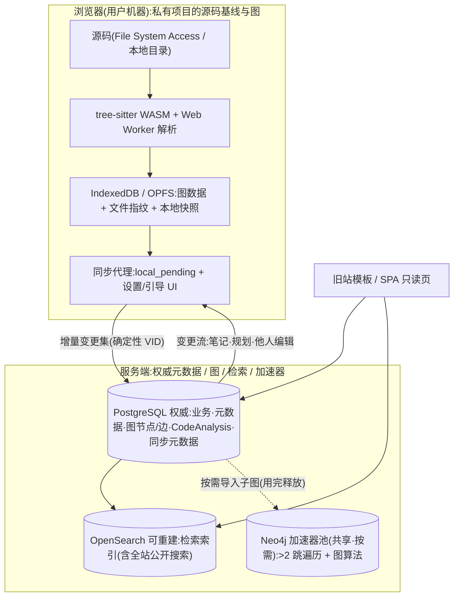

# 后端解析链路设计(v3.43 · 评审稿 v28 · 三存储 + 加速器)

> **文件名说明与两条版本线**(P2-13 / P2-6):文件名沿用 `backend-design.md`(v1 起未改名,避免打断既有引用)。
> **两条版本线并行,必须分清**:`v3.x` = **文档内容版本**(每次修订递增);`评审稿 vNN` = **评审轮次**(与附录 E 的 `ENN` **一一对应**)。
> **约定**:附录标题**只跟评审轮次**(如"随主文 v12");正文标题**同时给出两条线**;引用时优先用**评审轮次**(与评审意见对齐)。
> **本文档用途**:提交评审的完整设计方案(现状 → 目标 → 落位 → 同步 → 节奏 → 风险 → 验收)。
> 文档体系:`backend-decisions.md`(决策 B<n>)、`backend-parse-flow-current.md`(现状流程与数据结构)、
> `backend-redesign-notes.md`(实测环境与缺陷)、`frontend-contract.md`(HTTP 契约)。
>
> **七份附录**:
> **附录 A** `backend-authority-matrix.md`(权威矩阵 + outbox 状态机;★ v28:**写者租约、文件级版本向量已删除**)、
> **附录 B** `backend-tenancy-security.md`(权限强制注入规范 + 路径安全 + 客户端数据校验净化)、
> **附录 C** `backend-ecosystem-refs.md`(生态对标与引用核实 + 浏览器解析能力分档 + 阈值依据)、
> **附录 D** `backend-contract-detail.md`(**数据契约细则:P0 实施门槛** —— VID 物理编码与哈希选型、SQL DDL、
> `CodeAnalysis` 唯一写者;★ v28:**`file_rev` 发号与写权锁语义已删除**)。**术语冲突时以附录 D 为唯一口径。**
> **附录 E** `backend-implementation-gates.md`(**实施门槛清单** —— P0 12 项 + P1 16 项 + 跨领域 3 项 + **v5 处置 4+10+7 项**的逐条状态与收口条件)、
> **附录 F** `backend-observability-dr.md`(**可观测、容灾与测试** —— 监控阈值/告警通道/升级与静默、备份 RPO·RTO 与恢复时 outbox 处置、测试策略与 CI 硬门槛)、
> **附录 G** `backend-data-lifecycle.md`(**数据导出与删除/GDPR** —— 数据分类处置、删除执行顺序与验收)。
>
> **概念一致性范围(P2-1:原叫"检查范围",已改名以免与"F3 脚本扫描范围"混淆;P2-2 / P2-4)**:上表每条都必须在**主文相关章节 + 附录 A + 附录 D + 附录 F** 同时成立;其中 **schema 类条目**(PG 字段、`lifecycle`、PG 表/列;★ 本轮删 `vid_op_rev`)要求 **六处一致**:**§3.3(浏览器本地模型)+ §4.1(PG 表清单)+ §4.2(PG schema)+ D1.2 + D1.3 + D1.5.3**。历史处置表(E1–E5)按**归档**处理,**不作为权威口径**。
>
> **写入纪律**:①先登记 `backend-decisions.md` → 再更新本文档 → 最后才动代码;
> ②**文档与代码必须同版本同步(M7)**:代码改动若触及**契约/字段/阈值/算法**,必须在**同一提交**里更新对应文档,并在 `backend-decisions.md` 追加"文档-代码同步"条目;
> ③文档头部版本号(`v3.x`)随每次评审稿修订递增,且与决策编号**一一对应可追溯**。
> **本稿状态**:设计评审稿 v3(未实施);文中所有"现状"结论均来自实测,不用推测。

---

## 0.0 术语与命名（唯一权威 · 先读）

> **为什么放在最前**：本方案最大的理解成本不是机制，而是**同一概念有多种写法**（`Project.key` / `project_key` / `<key>` / `project_id`）。本节收敛为**一条规则**：**同一物在任何层都叫同一个名字**（模型字段 / DB 列 / JSON 字段 / URL 参数 / 客户端变量**逐字相同**）。附录 A–G、模块化文档、前端契约**只引用不复制**。

| 术语 | 类型 | 示例 | 用途（唯一口径） | **禁用写法** |
|---|---|---|---|---|
| **`project_ref`** | 字符串（文本编码） | `proj_4f7a9c2e8b1d4f6a9c2e8b1d4f6a9c2e` | **项目唯一身份**：URL / 请求体 / 响应体 / 本地存储 / 审计 / 分片 / 目录名 / PG PK 与 FK / PG 属性 / 检索 filter / **VID 公式输入** | `project_id`、`project_key`、`Project.key`、裸 `key`、`project_num`、`vid_seed` |
| **`user_id`** | 整数 | `123` | **用户唯一身份** = `auth_user.id`：审计 / 写权令牌 / 同步状态 / 分享绑定 / 路径隔离 | 把 `username` 当标识 |
| **`owner_user_id`** | 整数 | `123` | **项目归属**（FK → `auth_user.id`）；**不编入 `project_ref`** | `owner`（类型不明的写法） |
| **`uid`** | 字符串 | `src/a.c:main` | 节点在**项目内**唯一身份 | — |
| **`vid`** | 字符串（32 位小写 hex） | `0f3c…` | 节点在**图内**唯一身份 = `sha256_16(project_ref ‖ "\0" ‖ uid)` | `vid_seed` |

**编码规则（一个值、两种编码、一条规则）**：`project_ref` 的值 = **128 bit**；**文本编码 = `proj_` + 32 位小写 hex**（**唯一对外表示**）；**PG 存储编码 = `uuid`（16 B）**。二者一一对应，**不得另起名字**（与既有的 `uid_hash_128 BYTEA(16)` ↔ `vid` 32 hex 同型）。

**生成与唯一性**：`secrets.token_hex(16)`（密码学安全随机，**禁止**时间戳 / 自增 / 用户名等可枚举素材）；唯一性**以 DB `UNIQUE` 为权威**，`create` 时捕获 `IntegrityError` 重试（上限 **5** 次 → `503` + 告警）；**生成函数唯一**。

**不可变**：一旦创建**永不修改**；不提供任何"改 `project_ref`"接口（用户想改名走 `name`）。

**形态与边界**：严格 `^proj_[0-9a-f]{32}$`（**固定 37 字符、小写**）；路由转换器与视图层**直接严格校验**（无存量数据 → 不做宽放行）；**不参与授权判定 / 不得反推归属 / 不得作为授权凭证**。

**历史改名（仅此一处登记）**：`device_id → writer_token`；`project_id`（请求体字段名）→ `project_ref`；`Project.key → project_ref`。检索旧名前**先看本节**。

## 0. 评审摘要(先行结论)

| 项 | 结论 |
|---|---|
| **核心方向** | 把**解析与图存储前移到浏览器**(参照 GitNexus),服务端只做"权威元数据 + 协作 + 检索";目标是把 CPU、内存、带宽三样压力从服务器挪到用户机器 |
| **技术栈** | 浏览器(IndexedDB/OPFS + tree-sitter WASM) + PostgreSQL(权威业务) + PG(权威图) + OpenSearch(可重建检索索引);**LadybugDB WASM 列为浏览器图存储候选实现**(附录 C1) |
| **落地节奏** | **测试期**:浏览器优先 + **三存储 + 加速器全部部署**(PostgreSQL + PG + OpenSearch + Redis,**无"单库过渡"阶段**);**扩展期**:按规模调分片/副本与索引策略 |
| **数据归属(权威分层)** | 单说"图权威在哪"会自相矛盾,已按**四层**定稿:**存储/读权威** —— 服务端图在 PG(**仅 `hosted` 项目**)、本地图在浏览器;**生成权威** —— 由 **项目位置（`local`/`hosted`）** + **写者租约**决定;**冲突裁决权** —— 私有=租约持有者、协作/公开=服务端。完整矩阵见**附录 A2** |
| **连接机制** | 三条线:**128 位确定性 VID** + **写者租约**(单写者保证)+ **检索索引同步(`search_outbox`)** 发件箱**(双向、幂等、可离线、**分目标状态机**) |
| **兼容性** | **对外 HTTP 契约不变** → 旧站模板零改动;**前端需大改**(本地解析与同步 UI),此前"暂不动前端"的约束已被本方向取代 |
| **最大风险** | 解析器要从 Python **重写为 TS/WASM**(工作量约占一半);浏览器内存上限决定"大项目仍需服务端解析";**浏览器侧只能做语法级,C/C++ 语义级必须留在服务端**(§3.1) |
| **待评审决策** | 主文 §11 列出 **15 项待评审决策** —— 这 **15 项自 v6 之后未再新增**(v7–v16 均为对已决策的细化/修补,P2-5:故"决策数量一直不变"是**预期**而非遗漏)+ **附录 G** 的细则(A6 / B8 / C6 的裁定值已迁入正文);**处置记录与收口状态**见**附录 E 顶部的「当前门槛速查」**(内含**最新两轮**,无需在本行硬编码轮次 —— P2-5:避免"每轮都要改主文") |

---

## 1. 背景与问题(实测证据)

### 1.1 实测环境

| 项 | 实测值 |
|---|---|
| CPU / 内存 | ★ 已脱敏（`B158`）—— ★ 按实测能力设定并发 |
| 内存实测补充(评审期间复测) | `total 7894MB`、`swap 4095MB`(曾用 973MB,压到换页);常驻大户是 **IDE 自身**:extension host ~607MB、fileWatcher 70MB、markdown LSP 71MB;另有遗留 `npm run dev` + 2×`vite` ≈250MB(已停,见决策 B29) |
| 磁盘 | `/` = 本地 ext4(满足 `os.replace` 同目录 rename 原子性) |
| 关键设置 | `job_max_per_user=1`、`job_max_queued_global=200`、`job_child_memory_mb=1024`(已由 2048 校准)、`job_default_timeout_s=1800`、`SHARD_SPACE=64`(硬编码) |
| 单作业基线 | 22 文件 C 工程:上传 0.12s / 解压 0.31s / 队列 1.55s / 解析 1.53s / **总计 3.51s**;子进程峰值 **71MB**、CPU **1.0s**;产出 267 节点 / 262 边 |

### 1.2 现状链路(两段,不是一段)

| 阶段 | 执行位置 | 约束 |
|---|---|---|
| 上传落盘 + **解压** + compile_commands 提取 + clangd 注入 | **web 进程的后台线程** | **无并发上限、无 RLIMIT、不受 worker 数控制** |
| **解析**(tree-sitter / ast → 图数据) | worker 子进程 | worker 数、RLIMIT、租约、`job_max_per_user=1` |

详尽流程见 `backend-parse-flow-current.md`(9 个阶段、2 个状态机、10 张表、磁盘布局)。

### 1.3 已修缺陷(3 个,均来自真实运行)

| 编号 | 现象 | 根因 |
|---|---|---|
| B3 | worker `active` 却永远领不到作业 | 子进程 `connections.close_all()` 把明文 `COM_QUIT` 写进**从父进程继承的同一个 TLS socket** → 父进程此后所有查询 `InterfaceError(0,'')` |
| B4 | 上传端点 100% 500 | `check_owner(..., builtin_status=403)` 参数已随 builtin 退役删除 → `TypeError` |
| B5 | `cleanup:backups` 作业崩溃 | `for pid, in ...values_list(flat=True)` 对 int 解包 |

### 1.4 待查缺陷(7 项)

| 编号 | 问题 | 影响 |
|---|---|---|
| B7 | **投递被拒 = 硬失败**(项目直接置 `error`「系统繁忙」),而非排队 | 用户侧表现为"手快点两次就变 error" |
| B8 | **web 仍在读写源码**(解压线程) | 集群硬阻塞;违反设计 §21.6「web 无状态」 |
| B9 | 缺 `fs_backend` 启动自检 | 挂错 FS 时静默写坏 |
| B10 | `SHARD_SPACE` 硬编码 64、`job_shard_space`/`job_worker_count` 是死配置 | 并发上界不可配 |
| B11 | SIGTERM 打断作业(设计期望"跑完再退") | 重启 worker 把用户项目打成 error |
| B13 | 诊断键 `emit_error/clamped_limits/unresolved/by_confidence` 恒 0 | 「限制全可见」名不副实 |
| B14 | parse 的 `dedup_key` 按项目(同项目同时只能一个作业) | 与 B7 叠加放大失败面 |

---

## 2. 目标架构

### 2.1 总览



### 2.2 职责边界

| 组件 | 角色 | 权威范围 |
|---|---|---|
| **浏览器** | 私有项目的解析执行者与本地图持有者 | `local`(未发布):存储权威 + 读权威(**服务端无记录**);`hosted`:本地仍是**生成权威**,**服务端托管公开内容**;多端/协作:仅为租约持有者时承担**生成权威** |
| [模块: infra] **PostgreSQL** | **唯一权威存储** | 用户/权限/配额、`Project` 元数据、`Job`/`WorkerNode`、**图节点/边(`graph_node`/`graph_edge`)**、`CodeAnalysis`、笔记、规划 `spec`、审计、`AppSetting`、同步元数据、**检索同步队列(`search_outbox`)**（**只含 `hosted` 项目**） |
| [模块: graph] **图(PG 内)** | **图的存储权威与读权威** | 图节点/边**与元数据同库**(`graph_node`/`graph_edge`)。⚠ **它不是"生成权威"** —— 数据来自租约持有客户端或服务端解析管线(附录 A1)。**1–2 跳邻域查询直接走 PG**;客户端本地图优先(零网络) |
| [模块: platform] **平台定位(服务端)** | **以「读懂陌生开源项目」为核心目标的代码图谱学习平台**(★ v28 追加:**兼「代码解释的坐标系」—— 生态定位 = 整合者,不是竞争者**) | **主职 = 让任何人从零读懂一个陌生代码库** —— 图谱提供**导航**、节点解释提供**说明**、**阅读路径**提供**顺序**(见 **§2.3**);`hosted` 发布用于分享与协作。★ **生态定位(§2.3.14)**:**代码的家在 GitHub、内容的家在 B 站 / CSDN / 掘金 —— 本平台只提供「锚定(坐标系)」能力**,与其**互利共赢**,不做内容竞争:**内容默认跳转、主动给对方导流**、**署名不可剥夺**、**不复制正文**、**不站内截流**、**不爬虫不缓存**。⚠ **一句话**:「**我抢不过大平台,硬抢会被封;我要的是互利共赢**」。**只托管「显式公开」的内容**(源码 / 图谱 / markdown 笔记 / 元数据与统计,**逐项由用户勾选**),且**必须通过许可核验**(§6.0:**自动核验为主、人工只兜不确定**)。对 `local` 项目**零记录**;⚠ **私有内容(含公司闭源代码)不在服务端托管范围** —— 只在浏览器会话内浏览,长期学习用**桌面客户端**(§3.4)。与 GitHub 的关系是**互补而非替代**:GitHub 面向「改代码的人」(协作 / 评审),本平台面向「**读懂代码的人**」|
| [模块: search] **OpenSearch** | 检索(含**全站公开搜索**与相关度排序;**只索引 `hosted` 项目**) | `code_node` 索引(**可重建、非权威**、**最终一致**);**不承担隔离职责**(附录 B4) |
| [模块: ratelimit] **Redis** | 共享易失状态(**非权威**) | 限流计数、`paused` 门禁标志、队列中介/锁、**加速器任务队列 + 热点邻域缓存**;**可随时重建** |
| [模块: accelerator] **Neo4j Community(共享池)** | **按需图计算加速器**(>2 跳遍历 / 图算法) | **非权威、可随时重建**;**申请 → 排队 → 单项目独占 → 用完释放**;实例池可横向加机器(§4.5) |

> **口径收敛说明(v1 的硬伤)**:v1 在 §0 写"图权威在 PG"、§2.2 写"私有项目是副本"、§5.7 写"私有小项目图权威在浏览器",三句同时成立会在多端场景打架。
> 现按**生成/存储/读/裁决**四层拆分(附录 A),三处表述同时成立且互不冲突。
> **三存储 + 加速器(先读)**:目标架构 = **PostgreSQL(唯一权威;含图节点/边)+ OpenSearch(检索,可重建、最终一致)+ Redis(易失共享状态,非权威)**;**另配 Neo4j Community 共享加速器池(按需、非权威、用完释放)**,仅承担 **>2 跳遍历与图算法**;**一期即部署,不存在"二期才接"的阶段划分**;现状 **MySQL** 仅测试数据,**不迁移、直接切换**。

### 2.3 读懂体验:解释层与阅读路径（v28 新增,**本平台的核心**)

> **定位**:平台相对 GitHub / CSDN 的差异**不在「画得出图」**,而在**「解释钉在代码上」**。GitHub 有源码没解释,CSDN 有解释没源码 —— 本节把两者绑成一个东西:**代码的解释层**(annotation layer)。

#### 2.3.1 L0 锚定(地基)

> ★ **前提(v28 定稿):源码与图不可变**(§2.3.12)—— 因此**锚是永久稳定的**,不需要「重定位」机制。这是整套解释层能站住的地基。

| 锚类型 | 形态 | 稳定性 | 用途 |
|---|---|---|---|
| **符号锚** | `uid`(`file_path:line` + kind,**已有**) | ★ **永久稳定** | **主力**:解释一个函数 / 变量 |
| **行区间锚** | `{path, line_start, line_end}` | ★ **永久稳定** | 解释宏、结构体字段块 |
| **提交锚** | `{repo, commit}` | ★ **永久稳定** | 解释库 / 阅读路径的**版本基准** |

**硬约束 ①:锚是「稳定引用」,不是「可重定位的指针」。**

- **源码快照不可变** → `uid` 与行号**永不漂移** → **不存在「解释可能过时」**;
- 因此**不引入** `relocated` / `needs_review` 这类重定位机制(v28 草案已删除):**没有漂移,就没有搬迁**;
- **跨版本对照是另一件事**(不是「搬迁」):`commit A` 与 `commit B` 的图**各是各的**,解释仍锚在 A 上;需要时提供**对照视图**(§2.3.13),明确告诉你「你读的版本与解释的版本不同」—— **不猜、不搬**。

> **为什么这反而比 CSDN 强**:CSDN 的文章**不会告诉你写的是哪个版本**;本平台的解释**锚定在不可变的 commit 上**,所以**永远与代码一致**。

**硬约束 ②:解释正文禁止内嵌大段源码,只允许存锚点。** 渲染时从**锚定版本**读取代码并按行区间显示。

- **法律**:引用而非复制(显著降低侵权风险);
- **学习**:代码永远与版本一致,**不会出现「文章里的代码已经变了」**;
- **实现**:正文只存锚点 + 说明文字,代码由读路径按锚渲染。

#### 2.3.2 L1 双向绑定(CSDN 是单向的,这里做成双向)

| 方向 | 交互 | 依赖 |
|---|---|---|
| **代码 → 解释** | 图 / 代码上点一行 → 侧栏显示「这里 N 条解释 / M 个提问」 | 反查索引 `anchor → [解释, 提问, 路径步骤]` |
| **解释 → 代码** | 解释正文里的引用(`` `uid` `` 或 `` `src/a.c:42` ``)**可点击跳转** | 渲染层锚点解析 |

> **反查索引必须建**:它是「解释密度」(§2.3.4)、「该节点是否已有人解释」与「提问悬挂在代码上」的共同基础。

#### 2.3.3 L2 阅读路径(教学顺序;**第一差异点**)

> **为什么不是自动生成**:自动工具给不出**教学顺序**。读内核的正确顺序是**时间顺序**(上电 → 保护模式 → 分页 → `main` → 子系统初始化),而 `CALLS` 的拓扑序给不出它。因此**人策展为主,机器只出初稿**。

**数据模型**

```text
ReadingPath {
  id, project_ref, snapshot_ref,             ← ★ 锚定的**不可变快照**(§2.3.12);无需"健康度"
  title, intro, target_reader,               ← 「给谁看」:零基础 / 有语言基础 / 熟悉该系统
  prerequisites: [ConceptRef],               ← 前置知识(GDT / 分页 / 中断 …)
  steps: [PathStep],
  author, forked_from, license               ← 可 fork / 可署名 / 许可随内容
}
PathStep {
  order,
  anchor,                                    ← 锚(符号锚为主)
  title,
  body_md,                                   ← 讲什么(不含大段源码,见硬约束 ②)
  why_now,                                   ← ★★ 为什么现在读它(必填)
  what_to_notice: [str],                     ← 读的时候注意什么(≤3 条)
  check: { question, answer }?,              ← 自检题(选填,UI 强引导)
  next: [step_id]?                           ← 可选分叉
}
```

**`why_now` 必填、`check` 选填的理由**:`why_now` 是「导览」与「文档」的分界线,缺了它就只是又一个索引;而 **`check` 强制必填会抬高创作门槛 → 内容变少 → 学习体验反而变差**,故只做 UI 强引导。

**示例(Linux 0.11 的时序优先路径)**

| # | 锚 | why_now | 前置 |
|---|---|---|---|
| 1 | `boot/bootsect.s:_start` | 上电后第一条指令。**先理解「只有 512 字节能做什么」**,后面所有设计都是被这个逼出来的 | 实模式 |
| 2 | `boot/setup.s` | 从实模式进保护模式。**这里是「为什么要有 GDT」的第一个答案** | GDT |
| 3 | `boot/head.s` | 开启分页 → 建立第一个页表。**看懂这里,后面 `fork` 的写时复制才有根** | 分页 |
| 4 | `init/main.c:main` | 终于进 C。**这里是全书的目录**(`main` 里调用的顺序 = 子系统初始化顺序) | — |
| 5 | `kernel/sched.c:schedule` | 第一个进程是怎么起来的 | TSS / 上下文 |

**生成方式(三条并存,解决「谁来写」)**

| # | 来源 | 成本 | 作用 |
|---|---|---|---|
| 1 | **自动出初稿**:从 `entry_points` + `processes` 拓扑序生成步骤骨架,`why_now` 留空待填 | 低 | 用户拿到的是半成品,比白纸好写十倍 |
| 2 | **人工策展** | 高 | 高质量路径,可 fork / 协作 / 署名 |
| 3 | **从笔记聚合**:已有 `NodeNote` **一键提升为路径步骤** | 极低 | **让写过的笔记自动变资产**(冷启动关键) |

#### 2.3.4 L3 众包与竞争(借鉴 CSDN 的生态,补上它缺的锚定)

| CSDN 做到了 | 本平台的版本 | 额外优势 |
|---|---|---|
| 任何人都能发文 | **任何人都能针对一个锚写解释**(不要求写整篇) | 门槛更低:**一句话也能提交** |
| 多篇文章讲同一件事 | 一段代码下**允许多份解释并存**(不同深度 / 语言 / 作者) | 可对比、可投票、可采纳 |
| 评论区 | **锚定提问 + 回答**(问题钉在具体代码行上) | 提问不再脱离上下文 |
| 阅读量 / 点赞 | 赞同 / **被路径采纳** / 新鲜度 三重排序 | **「被采纳」比「点赞」更能筛出好内容** |
| 标签分类 | 难度 + 前置知识 + 语言 | 可精准过滤 |

> **答案可以「沉淀」为正式解释**:高赞回答 → 一键提升为该锚点的解释 → 计贡献者署名。这是把「提问社区」转化为「知识库」的通道。

#### 2.3.5 L4 解释密度热力图(CSDN 隐含存在,这里变成产品)

- **热力图**:一个函数 / 一行被多少条解释、提问、路径步骤引用 → **深色 = 公认难点**;
- **冷点** = 没人解释过 → 既是「待认领任务」,也是「这里可能不重要 / 没人读过」的线索;
- **用途**:打开陌生项目,先看**哪里最红**就知道该重点读哪里。**GitHub 与 DeepWiki 都没有这个信号**。

#### 2.3.6 L5 难度分层(对 CSDN 最大使用痛点的正面攻击)

- 每条解释 / 每条路径标 `target_reader`(零基础 / 有语言基础 / 熟悉该系统);
- 读者声明自己的水平 → 默认只显示匹配项;
- 路径的 `prerequisites` 渲染为「**读这里之前,先看这 2 个概念**」的可点链接 —— 对内核类项目是刚需。

#### 2.3.7 L6 进度与复习(长期学习行为)

| 功能 | 说明 |
|---|---|
| 已读标记 | 路径步骤 / 节点级「已读」 |
| 断点续读 | 打开即回到上次那一步(「继续读第 7/23 步」) |
| 稍后读 | 把「看不懂、先跳过」的锚存成清单 |
| 自检统计 | 走完一条路径:X 步自检答对 Y 步 |
| 间隔复习(可选) | 只对 `check` 题做 |

> ⚠ **只对公开项目可用** —— 私有项目是会话态(§3.3),关掉即丢,写进度会丢。

#### 2.3.8 L7 与 AI 的分工(必须写死,否则被替代)

| 环节 | AI 做 | 人做 |
|---|---|---|
| 初稿 | ✅ 生成「这段代码大概在做什么」 | — |
| 确认 | ❌ | ✅ 点「确认 / 纠正」 |
| 标注 | `source=ai_draft` + `confidence` | `source=human` / `human_reviewed` |

- **`source` 必须在 UI 可见**(复用前端契约 §19.4 的「来源与置信度」纪律);
- ⚠ **法律护栏**:AI 输出中**原文代码片段 ≤ 20 行**,超限只给锚点链接 —— 避免 AI 成为代码复制分发器;
- 原则:**AI 负责「有没有」,人负责「对不对」**。

**★ 本轮补：AI 生成内容的标识义务（现行法规，不因内测豁免）**

| 项 | 规定 |
|---|---|
| **法规依据** | 《生成式人工智能服务管理暂行办法》（2023-08-15 施行）+ ★ **《人工智能生成合成内容标识办法》（2025-09-01 施行）** |
| **服务定性（必须先定）** | ★ 本平台**不是「面向公众的 AI 服务」**，而是「**用户主动触发的草稿辅助**」—— **不主动生成、不面向公众独立提供 AI 服务**；⚠ **该定性需外部法务确认** |
| **显式标识（强制）** | ★ UI 上**必须出现「AI 生成」字样**（不能只有内部字段 `source=ai_draft`）—— 现有 §2.3.8 只要求「`source` 可见」，**本轮加严为"必须有中文可见标识"** |
| **隐式标识（强制）** | ★ `source = ai_draft` 字段**必须保留在**：①`.webapkg` 导出包 ②**embed 响应** ③**开放 API 响应** —— 使**离开本平台后仍可追溯**（`ai_draft` 内容不得在导出 / 嵌入时被抹掉） |
| **成本说明** | ⚠ 这三条**成本极低**（UI 文案 + 字段保留），**没有理由推迟到公开测试后** |

#### 2.3.9 分发:可嵌入 + 开放格式 + 开放 API(战略目标)

| 能力 | 说明 |
|---|---|
| **可嵌入(embed)** | 解释 / 阅读路径可嵌入第三方页面;**强制显示 license + 作者 + 来源仓库**(分发必须带许可信息) |
| **开放格式** | 锚点 + 解释 + 路径的格式公开,允许第三方实现(复用 `.webapkg` 的既有导出口径) |
| **开放 API** | 只读的解释 / 路径可被 IDE 与代码托管集成 |

> **战略含义**:从「一个网站」变成「**一层可被集成的能力**」。与 GitHub **互补而非替代** —— GitHub 是代码的**家**(可写),本平台是读懂代码的**书房**(只读、可引用、锚定 commit)。

#### 2.3.10 UGC 落点与合规边界

> ★ **本轮重写** —— 原文「UGC **只对公开项目**开放 ⇒ 法律风险被**结构性消掉**」已被「`local` 项目**也可写 UGC**」（H5）推翻；⚠ **但法律逻辑其实更强了**，只是要换个说法。

**新的唯一口径**：**内容可以产生在任何地方，但只有合规处的才会被平台传播。**

| 落点 | 用户可写 | 平台是否传播 | 平台的角色 |
|---|---|---|---|
| ★ **`local`（私有）项目的 UGC** | ✅ **可写**（H5） | ❌ **永不传播** —— 本地持久化 · 写路径**零网络** · **永不上行** | ★ **平台不知情** ⇒ **不构成「信息存储空间提供者」⇒ 无分发者责任** —— **私有笔记在本平台这里等于不存在** |
| **`hosted`（公开）项目的 UGC** | ✅ 任何登录用户（§2.3.11 通道③） | ✅ 传播 | **存储空间提供者** ⇒ 适用**避风港**（M9）+ **通知-删除 SLA 24h** |
| **外部文章导入** | 仅允许导入**本人**文章 | — | 他人文章只做「摘要 + 原文链接」，**不复制全文**（本期不做他人导入） |

> ★ **为什么这比原来更强**：旧表述把内容**限死在**合规处（**限制用户**）；新表述是**平台只对合规处的内容承担责任**（**不限制用户，但划清责任**）。两者都优于「为了合规而禁止用户写作」。

#### 2.3.11 写入通道分层(权限 × 并发,两轴分离)

> ★ **v28 定稿(图不可变)**:源码与图**用户永不可写** → **写者租约 / fencing / 版本向量 / 冲突合并 / `diverged` 全部删除**;唯一的图写入者是**服务端解析作业**(每个快照只写一次),而它的串行由**现有 `Job.dedup_key(KIND_PARSE, "proj:<ref>")`** 天然保证 —— **一个 `dedup_key` 替代了整套 `ProjectWriterLease`**(见 §5.3 / §2.3.12)。
>
> **两轴不得合并**:**「谁能写」是权限轴**,**「同时只有谁能写」是并发轴**;只有"并发是常态"的通道才需要后者。

**判据:数据性质决定并发模型**

| | **图快照 / 源码** | **图修补**(唯一例外) | **UGC**(解释 / 提问 / 笔记 / 阅读路径) |
|---|---|---|---|
| 数据性质 | **内容寻址的不可变快照** | 低频、小范围可信 | **追加型**,条目粒度 |
| 冲突后果 | **不存在**(只写一次) | ≈ 0(几个人一年改十几次) | 同一条被两人同时改(刷新即恢复) |
| 正确机制 | **`Job.dedup_key`**(服务端串行) | ★ **LWW + 全量审计** | **条目级 `rev` CAS** |
| 误用代价 | 加租约 = **为不存在的前提付保费** | 加租约 = 同上 | 加项目级租约 → **别人改图时,我就不能写解释** |

> ★ **低保频通道原则(v28 新增,可推广)**:并发控制的**成本是固定的**(租约 / CAS / 合并 / 状态机),**收益却正比于并发频率**。当频率低到「**并发概率 ≈ 0**」且写入者是小范围可信群体时,**LWW + 全量审计**严格优于租约 / CAS / 合并。

**四个通道(谁能写)**

| 通道 | 谁可写 | 并发控制 | 冲突返回 |
|---|---|---|---|
| ① **图快照生成**(首次解析 / 重解析) | **服务端解析作业**(**唯一写者,每快照只写一次**) | `Job.dedup_key`(现有) | — |
| ② **图修补**(增删节点 / 边) | **项目维护者**(`can_edit` = owner + `share_user_ids`,**可多人**);另:**任何登录用户可提「勘误建议」→ 维护者采纳**(§2.3.12) | ★ **无** —— **LWW + 全量审计** | 无 |
| ③ **解释 / 提问 / 回答 / 笔记** | **任何登录用户**(且 `can_view(ctx, project_ref)` 为真) | **条目级 `rev` CAS** | `409 stale_rev` |
| ④ **阅读路径** | **任何登录用户可新建 + 可 fork**;**编辑仅限本人创建的** | `rev` CAS + `owner_user_id` | 同上 |

> ★ **硬约束(可验收)**:通道 ②③④ **一律无写者租约、无 `lease_epoch`、无 fencing** —— 这套机制**已整体删除**(§5.3 / 附录 A3 / A4 / D4 已删)。文档、代码、前端三处**不得再出现** `lease_epoch` / `writer_token` / `stale_writer` / `stale_baseline` / `diverged`;出现即**按缺陷处理**。

**删除 / 修补权限矩阵(通道 ②③④)**

| 角色 | 权限 |
|---|---|
| **内容作者本人** | ✅ **可删自己的**解释 / 提问 / 阅读路径 —— ⚠ **必需**:写错改不掉则**无人敢写**(与「让好解释被写出来」的第一优先级直接冲突) |
| **项目维护者**(`can_edit` = owner + `share_user_ids`,**可多人**) | ✅ **可增删图节点 / 边**(通道 ②,LWW + 审计,§2.3.12);✅ 可删该项目下**任何人**的解释 / 阅读路径;✅ **采纳勘误建议** |
| **网站管理员**(`is_staff`) | ✅ 可删 / 修**任何**项目下的;**可调整维护者名单** |
| 其他任何用户 | ❌ `403`(但可**提交勘误建议**,§2.3.12) |

- **删除一律软删除 + 记 `AuditLog`**(操作者 / 目标 / 原因 / 时间)+ **可申诉**;
- **采纳 / 下架 / 移出**:仅**项目维护者 / 网站管理员**(§2.3.4 的「答案沉淀为解释」通道;**勘误建议的采纳同一条通道**);
- ⚠ **不得原地编辑他人的解释** —— 改为**并列新增**(§2.3.4「多份并存」的设计本意)或走「提议修订」。理由:改动他人正文会破坏**署名与可追责**,而**署名与可追责正是本平台相对 AI 生成内容的立身之本**(§2.3.8)。

**反滥用三件套(「任何人可写」的前置条件,缺一即不可上线)**

| # | 措施 | 复用现有机制 |
|---|---|---|
| 1 | **速率限制**:每用户每 N 秒 M 条 + **每锚点每天上限** | Redis 限流(§8.1)+ `AccountLock` |
| 2 | **举报入口 + 软删除 + 审计 + 重复侵权者封禁** | `POST /api/report/`(§20.3)+ `AuditLog` |
| 3 | **游客只读**:未登录**仅可读**,写一律 `401` | 现有游客只读口径(§6.1) |

> 「新账号写入进待审队列」这类**信誉机制本期不做** —— 会抬高门槛导致内容变少,与「降低创作门槛 = 提高沉淀量」的第一优先级相悖;**留作后手**(与 §6.0(a1) 的 C 车道同级思路)。

#### 2.3.12 L8 图不可变与维护者修补(★ 底层前提,一切简化的来源)

> **一句话**:**源码与图是「不可变快照」** —— 用户**永不可写**;**唯一例外是维护者的手工修补**(概率极低,故**零并发控制**)。
>
> ★ **「不可变」的粒度（本轮补写，防实施者各自理解）**
>
> | 层 | 载体 | 是否可变 | 说明 |
> |---|---|---|---|
> | **解析产物级** | `(repo, commit, parser_v)` ⇒ `parse_hash` | ❌ **永不变** | 同输入 ⇒ 同产物；`parse_hash` 锁定它（**不含修补**） |
> | **图级** | `project_ref` 的图 + `graph_rev` | ⚠ **仅维护者可变** | 修补 ⇒ `graph_rev + 1`（**LWW + 全量审计**） |
> | **项目级** | `project_ref` 的元数据 / UGC | ✅ 可变 | 名称 / 简介 = 维护者改；UGC = 通道③④（条目级 `rev` CAS） |

**为什么图必须不可变(四条,按重要性排序)**

| # | 理由 |
|---|---|
| **1** | **锚定的前提**:锚稳定 ⟺ 源码不变(§2.3.1)。图可变则锚永远在漂 → **解释层的信任崩塌** |
| **2** | **定位的必然**:「读懂」的对象是**一份确定的历史快照**,不是流动的代码 —— 你是在**读书**,不是在**写书** |
| **3** | **并发问题结构性消失**:图 = 服务端唯一写者 + 每快照只写一次 → **租约 / fencing / 版本向量 / 冲突合并 / `diverged` 全部不需要** |
| **4** | **图成为纯函数结果**:`(repo, commit, parser_v) → 图`,**可重算 ⇒ 任何副本都可丢弃**(强化 §5.2「确定性 VID 天然支持离线」) |

**三个写者身份(边界写死)**

| 谁 | 能否写图 | 说明 |
|---|---|---|
| **普通用户** | ❌ **永不可写** | 源码 / 图 / 节点 / 边**一律只读**(唯一例外见下) |
| **项目维护者** | ⚠ **仅"修补"**(增删节点 / 边) | 通道 ②(§2.3.11);**LWW + 全量审计** |
| **服务端解析作业** | ✅ **唯一的快照写者** | 每个 `(repo, commit, parser_v)` **只写一次**;串行靠 `Job.dedup_key` |

**手工修补(通道 ②)四条规则**

| # | 规则 | 理由 |
|---|---|---|
| 1 | **直接改图**,不做「叠加层」 | 下游(阅读路径 / 锚 / 热力图)都看**同一张图**,不必每次渲染都叠一次 |
| 2 | 节点 / 边带 **`origin = parsed \| manual`**(复用现有 `origin` 字段),UI 上人工项**有视觉标记** | 保住 §19.4「**来源与置信度必须标注**」纪律 —— 看得见「哪些是机器给的、哪些是人修的」 |
| 3 | ★ **零并发控制**:LWW,**无 CAS、无租约、无合并** | 低保频通道原则(§2.3.11):并发概率 ≈ 0 |
| 4 | ★ **但必须有全量审计**:谁 / 何时 / 加了删了什么 / 为什么 → `AuditLog` | ⚠ **「用户全权负责」的技术前提就是「可追溯」** —— 没有审计,「全权负责」就变成「没人负责」 |

**勘误建议(第二条入口,零新增机制)**

图修补有**两种强度**,对应两种身份:

| 强度 | 谁 | 机制 |
|---|---|---|
| **轻 · 建议** | **任何登录用户** | 提「勘误建议」(`Erratum`):`{target: uid 或 (from_uid, to_uid, type), 动作: add_edge \| remove_edge \| fix_signature, reason}` → **复用 UGC 通道**(条目级 `rev` CAS) |
| **重 · 直接改** | **项目维护者** | 直接增删节点 / 边(LWW + 审计) |

> **为什么必须留「轻」这条**:①解决**冷启动**(还没有维护者时,修正也能积累);②避免公共快照的修补权变成「**谁先导入谁占位**」(§2.3.13);③与 §2.3.4「答案可以沉淀为解释」**完全同构** —— **勘误建议可以沉淀为图修补**。

**删除节点不删解释(零新增机制)**

锚是 `uid` **字符串**;图里查不到该 `uid` → 渲染为「**该节点已被维护者移除**」。**不需要** `orphaned` 状态机、不需要迁移、**不删除任何人的内容**。

#### 2.3.13 L9 快照共享(同一份源码 → 一张图)

> **规则**:★ **唯一键 = `(repo, commit, parser_v)`**（本轮修正）—— 第一个人导入后,后续想读**同一解析产物**的人**复用同一张图**,不重复解析。
>
> ⚠ **为什么必须带 `parser_v`**：`parse_hash` 的输入含 `parser_v`,**解析器升级会算出不同哈希** ⇒ 若唯一键只写 `(repo, commit)`,则"同一 commit 却有多个快照"会**打破唯一性假设**。
> ⇒ 正确表述：**同一 `(repo, commit)` 可以有多个 `parser_v` 的快照**;**默认展示 `parser_v` 最新的那份**,**旧快照保留**（锚在旧快照上的解释**仍可读**）。

| 收益 | 说明 |
|---|---|
| **沉淀** | **1000 人读 Linux 0.11 = 1 张图 + 1000 份解释** —— 解释累积在**同一棵树**上 |
| **热力图才有意义** | §2.3.5 的「解释密度」若人各一张图,永远是孤岛;共享后它统计的是**全社区的注意力** |
| **存储 / 算力** | 同一 commit 不重复解析 |
| **锚的坐标系统一** | 所有人**从同一个快照出发** → 解释可互相引用、可对比 |

**边界(四条,必须写死)**

| # | 规定 |
|---|---|
| 1 | **仅公开项目共享** —— `local`(私有)项目**零上行**,不存在共享(H1) |
| 2 | **个人数据仍私有**:个人笔记 / 阅读进度挂在 **`(user, snapshot)`** 上,**不进共享区** |
| 3 | ⚠ **维护者来自「被授权」,不来自「先导入」** —— 防止「**导入即抢注**」:首个导入者只是**初始维护者**,平台管理员可调整名单(复用 `is_staff`);且**任何人可提勘误建议**(§2.3.12)作为兜底 |
| 4 | ★ **谁能建立快照（本轮新增，呼应 H6 / §6.0(a1)）** —— 建立者**必须**是 **① owner（Gate 0 归属验证通过）** 或 **② 命中 L1 宽松白名单 ∩ `AppSetting.third_party_publish = true`**（★ **默认 `false`**）；**两类都不满足 ⇒ 不建立**（唯一例外 = 管理员特批）。⚠ **建立者 ≠ 原作者时必须显著标注**「**由 @X 建立 · 源代码著作权归原作者**」，且**原作者可一键认领**（§2.3.14）⇒ 认领后转 owner 身份 |

**跨版本对照(替代原「锚重定位」)**

仓库更新后:

- ✅ **旧解释完全不受影响** —— 它们锚在 `abc123`,**永久有效**(代码确实不同了,**这是正确行为**);
- 想读新版本 → 导入新 commit → **新快照**(新 `project_ref`);
- 需要时提供**对照视图**:「`abc123` → `def456`:12 个函数变了,**3 篇解释不适用于新版本**」;
- ⚠ **不把解释「搬」到新版本** —— 搬可能搬错;**明确告知版本差异**比「猜测搬迁」更诚实、更有用。

#### 2.3.14 L10 媒体锚定与外部整合(★ 生态定位:做「坐标系」,不做「内容平台」)

> **一句话**:**内容在别处(B 站 / CSDN / 掘金 / GitHub),坐标在你这里。** 本平台**不生产内容、不托管视频、不抢流量** —— 只提供**锚定能力**,让别人的内容**精确指向代码**。
>
> **用户原话(定位来源)**:「**我不是要和这些大平台抢流量,我抢不过的,硬抢会被封。我要的是互利共赢**。」

**生态位与先例**

| | 谁 | 角色 |
|---|---|---|
| 代码 | **GitHub 等** | 代码的**家**(权威、可写) |
| 内容 | **B 站 / CSDN / 掘金** | 内容的**家**(生产、口碑) |
| **坐标** | **本平台** | **把两者焊在一起的坐标系** |

> **先例佐证**:「整合者」是**被验证过的生态位** —— **Genius**(只做歌词逐行注释,不生产音乐)· **IMDb**(只索引电影,不拍电影)。

**三种外部来源 → 三种卡片形态**

| 来源 | 卡片形态 | 关键点 |
|---|---|---|
| **B 站 / YouTube** | 封面 + 标题 + **时长 + `▶ 03:21`** + 来源署名 | **秒级跳转**(`?t=` / `?start=`) |
| **CSDN / 掘金等技术博客** | 标题 + **作者自写一句话** + 作者 + 链接 | ⚠ **不复制正文 / 原文摘要** |
| **原创图 / 示意图** | 图 + 说明 | ★ **一期只支持「外部链接」** —— 作者把自制图放在**自己的仓库**(GitHub 等)⇒ 既**零托管**又**归属可验证**(见下方 **M10**) |

**时间轴锚定(Timeline Anchor)—— 媒体与代码的坐标系**

- 存 **`{provider, external_id, t_start, t_end}`**,**不存视频副本**;
- **`t_start` / `t_end` 是「跳转」的必要字段**(`?t=201` / `?start=201` 精确到秒),**不是"为内嵌预留"**;
- **双向跳转(设计目标;一期只做「代码 → 媒体」方向)**:
  - **代码 → 媒体**:点某段代码 → 跳到视频**精确到秒**的那一刻;
  - **媒体 → 代码**(需站内播放,一期不开放):播放时**代码视图自动滚动高亮** —— ⚠ 此能力**只有本平台有**(B 站 / YouTube 不知道自己在讲哪段代码)。

**硬约束 M1–M10(全部写死;违反即按缺陷处理)**

| # | 约束 | 理由 |
|---|---|---|
| **M1** | ⚠ **默认「跳转」,不做站内截流** | **互利共赢的技术前提** —— 给对方带去播放量 / 阅读量;内嵌会减少对方流量 → **招致封锁**(而"抢流量"本就抢不过)。**且法律更优**:普通跳转链接的定性风险最低 |
| **M2** | **署名不可剥夺**:`source_platform` + `author` + `source_url` **三字段必填且必须可见可点**,前端**不得隐藏、不得折叠** | 法律(**署名权**)+ 共赢(**对方的回报**) |
| **M3** | **不复制正文**:文章类**只放「作者自写的一句话」**;解释正文引用他人文字**超规定字数即拒绝** | 版权底线(与 §2.3.1 硬约束② 同源) |
| **M4** | **`embed_allowed` 的开启前提 = 三方同时成立**:① 对方平台 ToS 明确允许 ② **内容作者本人确认** ③ 许可允许再分发 —— **缺一即强制跳转** | ★ 修正原设计(原为"提交者勾选" —— ⚠ **提交者常常不是作者,无权决定**) |
| **M5** | ★ **外部内容失效不损内容**:`state=dead` → 显示「原内容已失效」,**解释正文与代码锚点照常可用** | 内容**不得依赖你控制不了的外部资源** |
| **M6** | **署名 ≠ 授权**(重要澄清):署名只解决**人身权**(署名权),**不解决财产权**(复制权 / 信息网络传播权) | ⚠ 防止"标了来源就以为没事" |
| **M7** | **合理引用边界**(《著作权法》第 24 条「适当引用」):呈现必须落在「**介绍 / 评论 / 说明**」范围内;只给「标题 + 链接 + 自写一句话」;**不得替代原内容的访问** | 合规核心条款 |
| **M8** | **不爬虫、不缓存对方内容、支持按 provider 一键屏蔽**(配置项) | 防被封 + 防侵权 |
| **M9** | **避风港五条**(《信息网络传播权保护条例》):①标明内容托管于第三方 ②**不改变**对方作品(**不得加水印 / 不得二次包装**) ③不知道也不应知侵权 ④⚠ **不从中直接获得经济利益**(→ **外部引用卡片周边不得做广告变现**) ⑤**接到通知即删(SLA 24h)** | 平台免责基础 |

**封面图(★ v28 定稿:系统生成,零上传)**

> ⚠ **不采用「作者自制封面」** —— 原因:★ **「禁止源码截图」是一条不可执行的规则**(无法检测用户上传的图是否含他人作品 / 他人照片),**等于纸面防线**;**「栽在这里太亏了」** ⇒ **唯一可靠的解法是「零上传」**(用户裁定)。

| 方案 | 结论 |
|---|---|
| ★ **系统生成封面(默认)** | ✅ **定稿** —— 由 **`anchor` 哈希派生确定性抽象图形**(渐变 + 几何纹理)+ **类型图标**(`▶` / `📄` / `◇`)+ **时长**(video)+ **来源文字名**;**程序生成、无原作** ⇒ **无版权 / 无商标风险**;确定性 ⇒ **同一锚点永远同一张图**(可缓存、视觉一致、无需审核) |
| ★ **来源标识只用文字名** | ⚠ **不使用对方官方 logo 图片**(**商标边界**)—— 只用**文字平台名**(如「B 站」)或**自绘通用图标** |
| **无图占位卡** | ✅ 降级兜底(与系统生成同构,**无素材**) |
| ~~作者自制封面~~ | ❌ **不做**(见上:**规则不可执行**) |
| ~~自动抓取对方封面~~ | ❌ **不做**(盗链 + 违反 ToS + 防盗链随时失效) |
| ~~作者贴图链接~~ | ❌ **一期不做**(外部素材仍需失效处理与版权判断;需要示意图时走 `diagram` 的**仓库内图片**) |

**★ M10(新增硬约束):一期平台不托管任何用户上传的媒体文件**

> **视频 / 图片 / 音频一律只存指针,不存文件。**

| 媒体 | 一期形态 |
|---|---|
| 视频 | **外部链接**(`provider` + `external_id` + 时间戳) |
| 文章 | **外部链接** + 作者自写一句话 |
| 示意图 | **外部链接**(⚠ 建议放**作者自己的仓库** ⇒ 归属可验证) |
| **封面** | **系统生成**(零素材) |

**收益(一次拿到四条)**:①**零版权风险**(**无上传即无侵权**) ②**零存储 / 零 CDN / 零转码** ③**无需图片审核**(没有图片) ④**与 M8「不缓存对方内容」哲学一致** —— 平台始终只是「**指针索引**」,**不是「内容托管方」**。

**回流标识(★ 共赢从口号变成「可验证事实」)**

- 跳转 URL 带**来源标识**(如 `?from=<本站域名>`);
- ⚠ **必须匿名**:不得携带任何**用户标识**(PIPL / GDPR);读者来源分析**只在本平台后台做聚合**;
- **对方能在自己的后台看到「流量来自本平台」** —— **没有这一步,对方无法知道你给它导流**,共赢就不成立。

**反向整合(闭环 —— 这才是「整合」的真正含义)**

| 平台 | 他们**结构上做不到**的 | 本平台提供 |
|---|---|---|
| **CSDN / 掘金** | 文章里的代码**不能点、不能跳、且会过时** | **锚点卡片 embed**(永远指向不可变 commit) |
| **B 站 UP 主** | 观众看完视频**不知道代码在哪** | **带时间戳的代码锚点**(「3:21 讲的就是这个函数」) |
| **GitHub 仓库** | README 讲不清**阅读顺序** | **阅读路径 embed** |

> ★ **闭环**:他们的内容 → **本平台锚定** → 读者跳去他们那儿(**给流量**)→ 他们把**锚点卡片嵌回**文章 / README(**本平台的能力增强他们的内容**)→ 他们的读者来到本平台。**内容与流量双向流动,谁都不被取代。**

**创作者认领与回报(★ 共赢的发动机)**

| 机制 | 说明 |
|---|---|
| **认领** | 创作者注册后凭**来源账号验证**认领署名为自己的 `MediaRef` → 署名可信 + 获得编辑权 |
| **回报面板** | 「你的内容被锚定到 **N 个代码位置**、被 **M 人**看到、带来 **K 次跳转**」 |
| **主动通知**(可选,**需作者同意**) | 去 B 站 / CSDN 告知「你的视频被锚定到 Linux 0.11 第 3 步了」← **最便宜的拉新** |
| **账号绑定** | 绑定 B 站 / YouTube / GitHub → 显示「**已认证创作者**」;未绑定时**必须显示**「**署名由提交者填写,平台未做核实**」(← **避风港关键:平台不"明知"**) |

**★ 第三方身份与归属验证(用户裁定:「用第三方登录验证仓库里的作品确实是他的」)**

> **这是权利核验的最强手段** —— 把「权利人声明」(纸面)升级为「**可验证的归属事实**」。**落点 = §6.0(a1) 的 Gate 0**。

**三层验证**

| 层 | 验证内容 | 手段 |
|---|---|---|
| **① 身份** | 「你真的是 GitHub 账号 `@alice`」 | OAuth 登录 |
| **② 归属** | 「`github.com/alice/foo` **确实在 alice 名下**」 | `GET /repos/alice/foo` → `owner.login == oauth.login` |
| **③ 关系** | 「这是原创还是 **fork**」 | `repo.fork` / `repo.parent` |

**分级:各平台能验证到什么**

| 来源 | 能验证 | 可否用于放行 |
|---|---|---|
| **GitHub / GitLab / Gitee** | ✅ **强**:身份 + 仓库归属 + fork 关系 | ✅ **可作为 Gate 0 前提**(§6.0(a1)) |
| **B 站** | ⚠ **中**:只能证明「**你是发布者**」 | ❌ **不能** —— 转载视频的 UP 主**不是版权人**;仅用于**署名认证** |
| **CSDN / 掘金** | ⚠ **弱**(OAuth 不普及) | ❌ 只做跳转卡,不做归属验证 |

**四项边界(写死,防过度期待)**

| # | 边界 |
|---|---|
| 1 | ⚠ **归属验证 ≠ 版权验证**:`repo.owner == 你` 证明「**仓库归你**」,**不等于**「**你拥有著作权**」(仍可能「把别人的代码放进自己 repo」「公司代码借个人账号发布」) |
| 2 | ⚠ **不改变 H1**:验证归属**不解锁**私有内容上行 —— **H1 是为「隐私」设的,不是为「版权」** |
| 3 | ⚠ **不改变红旗标准**:验证只抬高"明知"门槛,**明显侵权仍不能免责** |
| 4 | ⚠ **平台无法「防止」侵权** —— 这是**行业通例**(GitHub 亦然);兜底 = **通知-删除 + 重复侵权者终止 + 内容指纹黑名单** |

**★ 不阻塞创作(关键平衡)**

| 动作 | 需要验证吗 |
|---|---|
| 读(浏览 / 走路径) | ❌ 不需要(游客只读) |
| **写解释 / 提问 / 写阅读路径** | ❌ **不需要**(默认署名「**未核实**」) |
| ⚠ **发布源码 / 图谱** | ✅ **必须**(Gate 0) |
| **认领已有媒体署名** | ✅ **必须**(否则谁都能认领) |

**★ 跨平台身份打通(意外收获,直接服务「坐标系」定位)**

| 能力 | 说明 |
|---|---|
| **一个创作者绑定多个平台** | GitHub `@alice` + B 站 `@某某` + CSDN → **聚合成一个 `CreatorIdentity`** |
| **创作者主页** | 在该身份下聚合并展示他的**全部内容**(repo / 视频 / 文章)+ **回报面板** |
| ★ **跨平台作者认证** | 「这两个 GitHub repo 和这个 B 站视频是**同一个人**」—— **这正是"坐标系"该做的事**,也是**创作者愿意来认领的最强理由** |

**最小权限(隐私合规)**

| 平台 | 建议 | 说明 |
|---|---|---|
| **GitHub** | 优选 **GitHub App(细粒度权限)**;退一步 OAuth + **`read:user`** | ⚠ **不申请 `repo` 全权** —— 那会读到用户的私有仓库列表 |
| **B 站** | 开放平台最小 scope | 仅用于署名认证 |
| **CSDN / 掘金** | — | 一期不做 |

> ⚠ **关键**:验证**公开仓库**的归属,**用公开 API 就够**(OAuth 只需证明"你是这个账号")—— **不需要任何读私有内容的权限**。

**授权分级(`license_status`)**

```
MediaRef.license_status ∈ { cited（默认·仅合理引用） / authorized（作者已授权） / licensed（已签许可） }
```

| 级别 | 能做什么 | 谁决定 |
|---|---|---|
| `cited`(**默认**) | **只跳转** + 署名 | 提交者 |
| `authorized` | 可 embed、可显示更多上下文、可缓存元数据 | **作者本人**(认领或授权) |
| `licensed` | 可正式合作(平台间协议) | 双方 |

**★ 一期只做「跳转卡」:内嵌播放「设计留位、实现不留」**

> ⚠ **先澄清一个常见误解**:**iframe 内嵌的流量不经过本平台服务器**(视频流由对方 CDN 出),**带宽几乎为零**;真正会爆带宽的是**自托管 mp4**(已定不做)。**因此"一期不开放内嵌"的理由不是带宽,而是法律与共赢**(M1 / M4 / M9)。

| 层 | 一期怎么做 | 理由 |
|---|---|---|
| **数据字段** | ✅ **现在写全**:`embed_allowed`(默认 `false`)、`license_status`、`t_start` / `t_end` | 字段是「事实描述」,不是"预留分支";将来开启**不需改表 / 迁移** |
| **契约位点** | ✅ **现在定**:`embed_allowed` **存在但恒为 `false`** | 前端**不需要改代码**,将来开启只是后端开始返回 `true` |
| **渲染实现** | ❌ **一期不实现**播放器组件、**不写 embed 渲染分支** | 遵循 B90「**不预留未采用的替换分支**」,避免死代码 |
| **UI 入口** | ❌ **一期完全不出现"站内播放"字样** | 避免期待落空 |

**三级门(写进设计;一期不实现分支)**

```
AppSetting.media_embed_enabled   = false     // 全局总闸(一期锁定 false)
AppSetting.media_embed_providers = []        // 允许内嵌的 provider 白名单(一期为空)
MediaRef.embed_allowed           = false     // 单条(一期恒 false)
MediaRef.license_status          = "cited"   // cited | authorized | licensed

embed 渲染 ⟺ 总闸 true ∧ provider ∈ 白名单 ∧ license_status = "authorized" ∧ embed_allowed = true
          ── 任一不成立 → 一律渲染「跳转卡」
```

**开启 embed 的四个前置条件(缺一不得开启)**

| # | 前置 | 为什么 |
|---|---|---|
| ① | **法律复核**(加框链接 / 深层链接的定性风险) | 风险最高处 |
| ② | **provider 逐一核对 ToS** | 白名单不能想当然 |
| ③ | **建立 `authorized` 授权流程** | 决定权必须回到作者 |
| ④ | **Cookie / 隐私同意机制** | 第三方播放器带追踪器(PIPL / GDPR) |

**失效处理与检查**

| 情况 | 行为 |
|---|---|
| 视频 / 文章被删 | `state = dead` → 卡片显示「**原内容已失效**」,**解释正文不损** |
| 视频被重新剪辑 | ⚠ **时间戳可能失准** → 显示「**该时间点可能已失准,请确认**」 |
| 定期检查 | 服务端**低频 HEAD 检查**(如 30 天一次)→ 更新 `state` |
| 读者报告 | 卡片「**报告失效**」入口(复用 `/api/report/`) |

**★ 版权与署名前置:三处卡口(用户要求:创建时就加要求,写解释时也加)**

| # | 时机 | 要求 |
|---|---|---|
| **①** | **创建项目时** | **创建向导必须显示一次「版权与署名须知」**:①**只导入你有权使用的代码** ②**引用他人内容必须署名** ③**发布前必须通过许可核验**(§6.0 Gate 1/2)。⚠ **不阻塞本地使用**;**须知随 `.webapkg` 一并携带**(本地留痕) |
| **②** | **写解释 / 挂媒体时** | **引用外部内容(video / article / diagram)→ 署名三字段必填**(缺一即 `400`);正文引用他人文字**超规定字数即拒绝**;AI 草稿必须标 `source=ai_draft`(§2.3.8);**引用块必须结构化**(`>` 引用 + 来源链接),**不得裸文本** |
| **③** | **发布时** | **权利人声明 + 许可核验**(§6.0 Gate 1/2,**已定**) |

> ★ **为什么「创建时」是教育、「发布时」才是硬闸门**:`local` 项目**服务端零记录**(§6.0)⇒ 创建时**没有可分发的对象**,硬校验既无对象也无依据;但**提前一次告知**能避免用户走完整套流程才发现不能用。

**举报范围扩展**

- `/api/report/` 的受理范围**必须包含**:①侵权 ②**署名错误 / 冒名** ③**外部内容已失效**(→ 转 `state=dead`);
- 处理走同一状态机 `public → taken_down`,**SLA 24h**。

**外部文档义务(三份,缺一即合规不完整)**

| # | 文档 | 必须写明 |
|---|---|---|
| 1 | **用户协议** | 本平台是「**链接索引与锚定服务**」,**不托管第三方内容**;用户提交即承诺**其有权署名**;侵权通知通道 |
| 2 | **隐私政策** | 回流标识为**匿名**;**不向第三方传递用户身份** |
| 3 | **通知—删除 SOP** | **SLA 24h** + **公开可查的著作权人联系渠道** + 重复侵权者终止(已有) |

> ★ **三份文档的唯一落点与验收（本轮收口，去重）**：⚠ 本节与 **§6.0(a5)** 曾**各写一遍**（重复表述）—— **以本节为唯一口径**，§6.0(a5) 只引用不重述。
> **落点**：三份文档为**产品交付物**（不是代码资产），必须在**公开测试前**具备；**每份文档在仓库内有唯一文件**，`用户协议 / 隐私政策 / 通知-删除 SOP` 的**版本号**须与本次发布一致。
> **验收（可执行）**：①三份文档**均存在**且**可公开访问**（不需要登录）②**著作权人联系渠道**在文档与页脚**均可查** ③**SLA 24h** 写入 SOP 并有**可执行的处置步骤** ④每次修订记 `AuditLog`。

**★ 本轮补 A：`.webapkg` 离线自传的法律边界（必须写进用户协议）**

| 项 | 规定 |
|---|---|
| **性质** | `.webapkg` 是**用户自行导出的本地文件**，**平台不参与、不托管、不知情** —— 它**不是平台的分发通道** |
| ★ **责任归属** | **导出包的内容与后续传播，由用户自行负责**；平台**不因用户之间传递该文件而承担分发者责任** |
| **用户协议必须写明** | ①导出包**可能包含你本地的私有笔记与图** ②**你不得将其传播到公开渠道**（若其中含他人代码 / 内容）③**平台无法知晓、也无法代为删除本地文件** |
| **内测期** | ⚠ 邀请制下，**参与者之间的文件传递同样适用本条款** |

**★ 本轮补 B：缓存边界（澄清 M8「不缓存对方内容」）**

| 缓存对象 | 是否允许 |
|---|---|
| **平台自己生成的内容**（系统生成封面 · 图快照 · 解释正文的 CDN 缓存） | ✅ **允许**（不涉及第三方内容） |
| ⚠ **第三方内容**（B 站 / YouTube 的视频、封面图、文章正文） | ❌ **一律不缓存** —— 只存**用户提交的链接**（M8）；**不做服务端拉取、不做缩略图抓取** |

**★ 本轮补 C：下架后被举报者的权利（防滥用举报 —— 直接影响「任何人可写」的生态）**

| 项 | 规定 |
|---|---|
| **知情权** | 项目被 `taken_down` 时，**必须通知项目维护者**（含**理由摘要** + **依据的举报类型**），**不得静默下架** |
| **申诉时限** | 维护者可**在 N 天内申诉**（起步 **7 天**，可配）；期间内容**保持不可见**（保守），**但数据不删** |
| **申诉结果** | 申诉成立 ⇒ 恢复 `public` + 记 `AuditLog`；不成立 ⇒ 保持 `taken_down` + **给出可读理由** |
| ★ **恶意举报反制** | **同一账号**在窗口内**举报多数不成立** ⇒ **降低其举报权重 / 限制举报频率**；**重复恶意举报 ⇒ 封禁**；⚠ **举报人与被举报人的身份互不可见** |

#### 2.3.15 L11 发现层与创作者激励(借鉴短视频的「分发效率」,不借鉴其「消费方式」)

> **一句话**:借**分发**,不借**无限流**。**钩子负责拉人进来,路径负责把人留下来。**

**为什么可以借(零件已具备 80%)**

| 短视频平台 | 本平台对应物 | 状态 |
|---|---|---|
| UP 主 / 创作者 | 解释作者(**可署名**、可 fork 路径) | ✅ 已有(§2.3.3 / §2.3.4) |
| 一条视频 | 一个锚点上的解释 | ✅ 已有(§2.3.1) |
| **前 3 秒的钩子** | **`why_now`**(**已定为必填**) | ✅ 已有(§2.3.3) |
| 弹幕 / 评论 | **锚定提问 + 回答** | ✅ 已有(§2.3.2) |
| 合集 / 播放列表 | **阅读路径**(可 fork、可署名) | ✅ 已有(§2.3.3) |
| 点赞 / 投币 | 赞同 / **被路径采纳** | ✅ 已有(§2.3.4) |
| **完播率** | **`ReadProgress`**(步骤完成率 / `read_uids`) | ✅ 已有(§2.3.7) |
| 热门 / 趋势 | **解释密度热力图** | ⚠ 有数据,未产品化(§2.3.5) |
| **推荐流 / 发现页** | — | ❌ **缺(本节新增)** |
| **关注 / 追更** | — | ❌ **缺(本节新增)** |
| **创作者激励** | — | ❌ **缺(本节新增)** |

**⚠ 借 / 不借(硬边界)**

| 借 ✅ | 不借 ❌ | 理由 |
|---|---|---|
| **卡片流(有边界)** | **无限下滑** | 读代码需要**深度专注**;无限流训练的是"划走" |
| **单条即入口** | **脱离上下文的碎片** | 刷完 100 个函数 = 什么都没读懂 |
| **按「完成率 + 被采纳」排序** | **按停留时长排序** | ⚠ **时长会被"看不懂卡住"污染** —— 在代码场景里是**负向**信号 |
| **关注作者 / 追更** | 自动播放连播 | — |
| **分享卡片** | 只给钩子不给深度 | 卡片**必须能一键跳进完整路径** |

**`CodeCard`(发现层的最小单元;★ 聚合视图,不新增内容实体)**

```
CodeCard {
  anchor,                                  ← 不可变锚(§2.3.1)
  hook,                                    ← = why_now(必填)
  body_md,                                 ← 解释正文(禁内嵌大段源码)
  code_preview,                            ← 渲染时从锚定 commit 读取(不存副本)
  media_refs[],                            ← 关联的外部媒体(§2.3.14)
  author, source,                          ← 署名 + 来源 / 置信度(§19.4)
  path_ref,                                ← ★ 必填:属于哪条路径的第几步
  stats { adopted, upvotes, questions, reads }
}
```

> ★ **硬约束**:★ **每张卡片必须回链路径**(`path_ref` **必填**)—— **不得出现「无归属的卡片」**(防碎片化焦虑)。

**「一条解释」就是「一条短视频」—— 这是 B103 的直接产物**

| 为什么成立 | 依据 |
|---|---|
| **锚定不可变 commit** ⇒ 一条解释**可脱离项目页独立传播而不失真** | §2.3.12 |
| **`why_now` 已必填** ⇒ 它本来就是**钩子** | §2.3.3 |
| **快照共享** ⇒ 一条解释**天然有唯一坐标**,不重复、不歧义 | §2.3.13 |

**推荐信号(★ 大部分现成)**

| 短视频信号 | 本平台信号 | 来源 |
|---|---|---|
| 完播率 | **路径步骤完成率 / `read_uids`** | `ReadProgress` |
| 点赞 | **被路径采纳 > 赞同** | `Annotation.adopted` / `upvotes` |
| 评论热度 | **锚点上的提问数** | `Annotation.kind=question` |
| 内容难度 | **解释密度** | §2.3.5 |
| 完读深度 | `depth`(零基础 / 有基础 / 熟悉) | §2.3.6 |
| 转发 | embed 引用次数 | §2.3.9 |

**★ 本平台独有:「看不懂」是正向信号**

> 短视频里"用户流失"是坏事;**在代码学习里,一个人提问 = 他真的在读**。

```
卡片分数 = 路径完成率 × w1
         + 被采纳次数 × w2        ← ★ 主信号(比点赞硬)
         + 引用该锚的路径数 × w3
         + 提问数 × w4            ← ★ 困惑度 = 价值信号
         - 停留时长异常            ← ⚠ 反向:卡住 ≠ 吸引
```

> ★ **硬约束**:**推荐排序主信号 = 「被路径采纳 + 完成率」**;**明确不使用停留时长作为正向信号**(防"标题党化"与"无限流化")。

**★ 冷启动不依赖协同过滤**:用**几何 / 内容信号**即可(`is_entry` 入口点、调用深度、被引用次数、结构复杂度)—— **全是 §2.3 已有的分析产物**。

**落地分档**

| 档 | 功能 | 依赖 |
|---|---|---|
| **A** | **发现页 `/discover`**(**有边界**的卡片流,非无限流);**卡片分享**(⚠ **必须带 `license` / 作者 / 来源仓库**,§2.3.9);**关注作者 / 项目**;「**继续读**」常驻入口(进度环);**首页改造**(搜索框 → **精选路径 + 卡片流**) | `CodeCard` 聚合 + `Follow` 表 + `ReadProgress` |
| **B** | 个性化推荐(按 `depth` + 已读 + 热力图);**创作者面板**(被采纳数 / 读者数 / 提问数);**学习连续天数 / 里程碑**(⚠ **不做排行榜**,防刷量);「**30 秒读懂一个函数**」模板(钩子 + 3 个要点 + 一个自检题) | — |
| **C** | **embed 小组件**(嵌进博客 / README / CSDN ← 最便宜的拉新);开放 API / 开放格式;客户端离线学习包 | §2.3.9 / §2.3.14 |

**⚠ 两个必须防的坑**

| 坑 | 后果 | 防线 |
|---|---|---|
| **标题党化** | 解释质量下降 | ★ 排序主信号用「**被路径采纳**」而非「点赞 / 播放量」 |
| **碎片化焦虑** | 刷了 100 张卡仍"什么都没学会" → 流失 | ★ **每张卡片 `path_ref` 必填** + 「进入完整路径」按钮 |

**战略判断(与 §2.3.14 同源)**

> 短视频的逻辑:**内容 = 一次性消耗品 → 必须不断生产新内容**(护城河 = 推荐算法)。
> 本平台的逻辑:**解释锚定在不可变 commit → 永不腐烂(B103)**(护城河 = **推荐算法 + 永不腐烂的内容资产**)。
> ⇒ 本平台能做出短视频**做不出**的东西:**「可以刷,但刷进去的东西会留在原地等你回来」**。

---

## 3. 客户端侧(本地优先):本地解析与存储

#### 3.0 浏览器基线能力集（硬底线）

> **底线**：浏览器端**只依赖全主流可用的能力**；Chromium 独有的一律作为「**渐进增强**」，**不得出现在必需路径**上。
> **支持矩阵**：Chrome / Edge **≥ 80** · Safari **≥ 16.4** · Firefox **≥ 113**（Baseline 2023 起）。

| 能力 | 基线选型（全主流） | 降级链 |
|---|---|---|
| **选包** | `<input type="file">` / `<input webkitdirectory>` / **拖放**（`webkitGetAsEntry`） | 目录选择不可用 → 提示打成 `.zip` / `.tar.gz` |
| **解压** | `DecompressionStream` + 纯 JS 解析 tar / zip 中央目录（**Worker 内流式**） | 老浏览器 → **纯 JS inflate（fflate）回退** |
| **落盘** | **会话级临时工作区**（**内存优先**；大项目可临时用 OPFS，**关闭 / 刷新即弃**） | 内存不足 → 提示「导出 `.webapkg`」或「由服务器解析」 |
| **解析 / 图 / 搜索 / 导出** | tree-sitter WASM + Web Worker / Canvas·WebGL / IndexedDB 本地索引 / `<a download>` | 内存不足 → 「仅统计 + 局部图」降级 |

**Chromium 渐进增强（可用则更好，不可用功能不缺）**

| 能力 | 增强点 | 降级 |
|---|---|---|
| `showDirectoryPicker`（FSA） | **在系统文件管理器里直接看到 `src/`**、免复制直读、增量 | 不可用 / 授权被拒 / 续权失败 → **静默降级 OPFS 工作区** |
| `showSaveFilePicker` | 保存 / 导出体验更好 | `<a download>` |

> **桌面客户端（以后）**：基线能力的**超集**（真·本地目录 / 原生解析器 / 更大内存 / 后台任务）；**服务端契约只依赖基线** → 超集客户端复用同一契约，不加协议分支。
> **FSA 使用约束**：需 **HTTPS（安全上下文）+ 用户手势**触发；目录句柄可持久化但**可能需重新授权** —— 一律按「特性检测 + 失败降级」处理。
>
> **多客户端一致性锚点（契约边界）**：跨客户端（浏览器 / 桌面 / 服务端管线）**必须逐位一致**的只有三样 —— **`parser_v`**（解析器版本）、**`uid_rule_v`**（uid 生成规则版本）、**VID 算法固定 `sha256_16`**（含固定测试向量）；其余（存储介质、解析实现、UI 框架）**均属客户端实现细节，服务端契约不依赖**。

### 3.1 解析器

| 项 | 方案 |
|---|---|
| 语法层 | `web-tree-sitter` + 各语言 `.wasm` 语法包(C / Python 一期,C++ 仅高置信子集),与现有 Python 侧同源(tree-sitter),规则可复用 |
| 执行位置 | **Worker 池**(池大小 / chunk 字节预算 / 两层分发 / 懒创建 / 熔断隔离 / Worker 级内存上限 —— **完整规范见 §3.1.2**,v18 新增),主线程只做 UI |
| 增量 | 以 `(file_path, sha1)` 指纹比对,只解析变化文件(与现有 `incr.py` 思路一致) |
| 产出 | 与现有 `CodeNode` / `CodeEdge` **schema 同构、内容分级**(P2-14):字段名/类型一致(uid / kind / name / qname / file_path / line / signature / 边类型 / confidence / resolution / site_count),但**精度分级** —— 浏览器侧为语法级(`resolution=syntactic`),服务端为语义级 |
| 语言支持 | **一期:C + 汇编**(语法级;**汇编只做「标签级」** —— 符号 / `call` / `jmp` 目标,不追求完整汇编调用图);**Python 紧随其后**;C++ 仅**语法级高置信子集**;Go/Java 等按语法包增量接。⚠ **汇编必做**:内核类项目的真实入口是汇编引导链(`bootsect.s → setup.s → head.s`),缺它则「**阅读路径的起点断裂**」(§2.3)。内联 `asm()` **不解析**,但保留为**可挂说明的锚点** |
| 降级 | 语法包缺失、能力不足(语义级需求)或项目超阈值 → 走服务端解析(现有链路)，**但仅限已公开(`hosted`)项目**；**私有项目不得降级到服务端**（§6.0 H4）—— 只在浏览器内降级为「仅统计 + 局部图」 |

### 3.1.1 能力分档(评审后修正,v1 过于乐观)

`web-tree-sitter` **只能做语法层**。C/C++ 的精确调用图依赖重载决议、模板实例化、虚函数动态派发、宏展开与跨编译单元/系统头信息 —— 这些需要 `compile_commands` + clangd,浏览器内基本不可得。

| 能力 | 浏览器(语法级) | 服务端(语义级) |
|---|---|---|
| 定义/引用/类/函数/变量、include/import/继承(语法可见) | ✅ | ✅ |
| 语法级调用关系(同文件/同名匹配) | ✅ 启发式 | ✅ 精确 |
| 精确调用图、宏展开、跨编译单元、系统头 | ❌ | ✅ 依赖 clangd |
| 标注 | `resolution=syntactic`、`confidence` **0.6–0.8** | `resolution=qualified/semantic`、`confidence` **1.0** |

推论(已写入附录 C2):

1. 浏览器图 = 语法级 + 启发式,**允许不精确**;服务端图 = 语义级 + 精确
2. **契约测试收窄**:只比 `uid` 集合 + 边类型计数 + 关键入口点集合,**不比 `confidence`、不比边逐条一致**(否则双端永远无法对齐)
3. 前端必须**标注图的来源与置信度档**(`本地/语法级` vs `服务端/语义级`),避免用户误信

> **工作量提示**:现有 `projects/parsing/*` 是 Python 实现(tree-sitter Python 绑定 + Python `ast`),
> 浏览器侧需 **TS 重写**;这是本方案最大的一块工作量(建议单独立项、按语言分批交付)。
> **供应链约束(附录 C7/M12)**:语法包(tree-sitter WASM)**必须锁定版本 + 校验 sha256**(不走 CDN 直连);**语法包升级 = 解析行为变更**,必须走 §9 的"uid 规则版本化 + 全量重传 + 旧 VID 墓碑"流程。

### 3.1.2 Worker 池与解析缓存(v18 新增;优先级 P0 / P1 / P3)

⚠ **确定性前提(先读)**:本节所有缓存机制**只缓存解析产物(AST + 符号提取结果)**,**绝不缓存 VID**;VID 每次由 `uid` **现算**(算法**固定 `sha256_16`**、不可变 —— v27 已删除"`hash_algo` 可迁移 / 迁移后全量重算")。缓存 key = **`parser_v` + `file_sha256`**(v27:文件级,不再含 `hash_algo` / `uid_rule_v` / `chunk_hash`),任一变化即失效(与"解析器升级触发全量重传"同源)。

**① Worker 池(P0)**

| 项 | 规范 |
|---|---|
| 池大小 | **`min(8, max(1, cores - 1))`**(核数取 `navigator.hardwareConcurrency`),**起步值,可配**;上限不超过 16 |
| 两层分发 | 主线程按 **chunk 顺序**处理(控内存)→ chunk 内拆 **sub-batch** 并行分发;按 **chunk** 而非"按文件"分发,避免大文件拖慢单 Worker |
| chunk 切分 | **按字节预算**(起步 **20MB**),**不按文件数** |
| 池懒创建 | **仅首次 cache miss 时创建**;温缓存全命中时**不加载 Worker 脚本与 tree-sitter WASM / 原生绑定** |
| 熔断恢复 | 慢 Worker 可重试或拆分;**失败重试一次 → 仍失败则隔离该文件并记审计**;隔离后重新拉起 Worker 槽位 |
| **Worker 级内存上限(P1)** | 每 Worker 起步 **512MB**:超限**中止当前文件解析 + 记审计**(**不整体降级到服务端**);与项目级阈值(文件数 / 字节 / 节点数)**两级并存** |
| **池预热(P3)** | worker 启动自检新增"**解析池预热**"(预加载语法包与 WASM);**预热时执行既有 WASM 哈希校验**,与供应链安全要求一致 |

**② 内容寻址解析缓存 `parse_cache`(P0)**

- **落位**:IndexedDB **独立 store `parse_cache`**(见 §3.3 数据模型;大项目再评估迁 OPFS)
- **key** = **`user_id` + `project_ref` 命名空间**(v19 P0-10) + `parser_v` + **`file_sha256`**(**v27:文件级 AST 缓存** —— 不再有 `hash_algo` / `chunk_hash` / `uid_rule_v`,三者已删除或固定) 
- **value** = Worker 原始解析结果(AST + 符号提取),**不含 VID**
- **读取顺序**:`parse_cache` **命中 → 直接重放结果、跳过 Worker 分发**;未命中 → 提交 Worker 池 → 回填缓存
- **事务边界**:缓存写入可在 **IndexedDB 事务之外**完成(不违反 §3.3 的单事务硬约束)
- 🔴 **禁止**:把 VID、`lifecycle` 判定结果或任何**依赖算法的派生值**写进缓存 —— 否则算法迁移后会出现"新旧 VID 混用"
- **"是否引入引用计数 / GC"的决策判据(v20 P1-14 定稿;⚠ v25 P0-12 修正)**:
  - **定稿 = 默认不做,且【删除"跨项目命中率"判据】**:key 含 `project_ref` → **"随项目删除联删"语义天然成立**(与附录 G 一致),实现最简单、没有悬挂对象;
  - ⚠ **v25 P0-12(删除一条自相矛盾的判据)**:v20/v21 把"**同一 chunk 跨项目命中率 ≥ 30%**"作为评估 GC 的**第一条判据**,但 v19 P0-10 已把 `project_ref` **写进 key** → **不同项目的 chunk 必然不同 key** → 该命中率**恒为 0**,判据**永远不可能成立** → **删除该判据**;§3.3 与 **附录 F1** 同步移除该埋点指标;
  - **仅当同时满足两条**才评估 GC:①该用户 `parse_cache` 占用**接近配额(≥ 80%)**且已成为主要占用方 ②**可执行判据(v26 P2-30 修正)**:⚠ 原写"**保留多份历史 chunk 版本**带来的空间收益可量化" **不可执行** —— key 是 **chunk 内容哈希**,多个版本 = **多个互不相关的 key**,**没有"版本先后"关系**,无从识别"哪些是历史版本"。**改为二选一**(以实测为准):ⓐ统计"**同一 `(user_id, project_ref, path)` 下保留的 key 数 > N(起步 N = 5)**"的行占比;ⓑ在 `parse_cache` 记录 **`last_used_at`** 并**按 LRU 清理**;
  - **禁止为"可能存在的复用"提前引入 GC** —— 它会把"随项目删除联删"改写成"引用归零才删",**直接冲击附录 G 的删除语义**与"删账号清命名空间"的验收。
  - **埋点落位(v21 P1-10 定稿:v25 P0-12 改口径)**:①**上线时机** = **阶段 1 · 测试期起**(与本地图缓存同期,不等到阶段 2)②**责任人** = **前端作者**③**观测面板** = **附录 F1 的「`parse_cache` 本地命中率」指标**(v25 P0-12:原「跨项目命中率」**已删除**)④**口径** = `命中 chunk 数 / 全部 chunk 请求数`,**按项目 + 按周聚合(不跨项目)**;⑤**判据复核周期**:每阶段结束复核一次,**未达标则继续默认不做 GC**。
  - **隐私边界(v22 P1-7 定稿:v21 只关心命中率判据,没讨论隐私)**:"**跨项目命中**"**仅指同一 `user_id` 内的跨项目**(同一用户的多个项目)**绝不跨用户**;**埋点只上报聚合数值**(命中率 / chunk 数),**不上报 chunk 内容、文件路径、项目标识**;**本地缓存按 `user_id + project_ref` 命名空间**(§3.3 已有),**删除 / 登出按附录 G 联动清理**;⚠ 若将来要放宽到跨用户复用 → **必须重做隐私评估并走评审**,不得由实现自行选择。

**③ 与"文件级跳过"的关系**:现有 `(file_path, sha1)` 指纹比对**保留**(粗粒度、零成本);`parse_cache` 是**其之上叠加的细粒度层**,解决"改了 1 个文件、仍要重新解析该文件全部 AST"的问题。

### 3.2 存储

| 存储 | 内容 | 说明 |
|---|---|---|
| **IndexedDB** | 图数据(节点/边)、文件指纹、笔记草稿、`local_pending`、最近 N 个 epoch 的本地快照 | 主体;**直接用 IndexedDB**(v27:删 `storage_port` 抽象层,不预留未采用的替换分支);**核心写路径必须单事务** |
| **OPFS**（**仅会话级临时**） | 大项目的**临时**工作区：**不承诺持久化、不调用 `persist()`**，会话结束即失效 | 浏览器内部实现细节 |
| **FSA**（**渐进增强**，非前提） | 「直接打开我的项目文件夹」（**只读 / 会话内**）；不可用或授权被拒 → **静默降级到会话内存** | 仅 Chromium |

### 3.3 本地数据模型(浏览器 · **会话态**)

> **⚠ 持久化范围（★ 本轮收窄 B97）**：
> - **`local`（私有）项目：允许浏览器持久化** —— 图 + **用户创作的 UGC（解释 / 提问 / 阅读路径）** 落 **IndexedDB / OPFS**，**关闭浏览器不丢**。
>   ⚠ **理由**：B97「不持久化」的本意是**避免「本地副本 vs 服务端权威」的一致性问题**；而 `local` 项目**不存在服务端副本**（数据只有一份，在本地）⇒ **持久化不引入任何一致性问题**。
> - **`hosted`（公开）项目：不承诺本地持久化** —— 数据权威在服务端，本地仅为会话态缓存。
> - **源码仍为会话态**（内存优先；大项目可临时用 OPFS），**关闭即弃** —— 长期保存靠**导出 `.webapkg`** 或**桌面客户端**（§3.4）。
> - ★ **硬约束**：`local` 项目的本地内容**永不触发任何上行**（连「是否已公开」的探测都不做）—— H1 / H5 的必然要求，**可验收**。

> ⚠ **v19 收口(P0-9 / P0-10):本地 store 必须按 `user_id + project_ref` 命名空间隔离**
>
> - **命名空间**:下列所有 store(含 **`parse_cache`**)的 key **必须带 `user_id` + `project_ref` 前缀**。现状按 **origin** 存储 → **多用户共用浏览器时,B 可读到 A 的项目数据**(越读)。
> - **登出 / 切换账号**:**强制清理或锁定**该用户命名空间(**不得只隐藏 UI**)。
> - **删账号 / 删项目**:客户端**必须清理对应命名空间**(与附录 G1 联动),`parse_cache` 亦在其列。
> - **`parse_cache` 的 key 加 `project_ref`**(P0-10):使"**随项目删除联删**"语义成立;代价是**放弃跨项目复用**。备选(引用计数 / GC,删除项目只减引用)若评审否决本方案则改用。

> **v28 定位（★ 本轮修正）**：分工写死：
> - **私有项目（`local`，含公司闭源代码）= 本地优先的完整学习体验**：**源码会话态**（关掉即弃）；**图 + UGC（解释 / 提问 / 阅读路径）允许持久化在本地**（H5）—— ★ **可自由创作，只是永不上行**。
> - **公开项目（`hosted`）= 社区共享的学习体验**：解释 / 阅读路径 / 提问 / 进度**走服务端持久化**，**任何人可读、可写**（§2.3.11 通道③）。
> - **就地引导（三选一，不弹窗劝退）**：文案统一为「① 学习**公开项目**（有人写好的解释与阅读路径）② 导出 `.webapkg` ③ 等待桌面客户端」—— ⚠ **私有项目同样可以自己写解释**（本地保存），引导**不得**说「私有项目不能创作」。
> - ⚠ **服务端能力对私有项目全部封闭**：服务端解析 / 语义级 / 深分析加速器（>2 跳）/ 服务端检索 **一律不可用**（§6.0）；**唯一例外是 UGC 的本地落盘**（不经服务端）。

```
local_project   { project_ref, src_root_ref, hosted, visibility,
                  snapshot{ repo, commit, parser_v, parse_hash },      ← ★ 快照标识(幂等唯一依据,§5.3)
                  files[{ path, sha1 }] }                              ← 仅完整性清单;**无版本协商字段**
local_node      { vid(32 位小写 hex,附录 D1), uid, kind, name, qname, file_path, line,
                  signature, is_entry, is_dead, cluster, project_ref, graph_rev,
                  lifecycle('active'|'hidden'|'deleted') }      ← P1-3:v7 起此处是 `deleted: bool`,与 D1.3 的 lifecycle 枚举不一致;**迁移期必须保留旧值**(P0-6:手动 `hidden` 不是解析产物,重传时要显式上送,否则"隐藏的节点会全部复现")
local_edge      { vid_from, vid_to, type, confidence, resolution, site_count,
                  level, origin, project_ref, graph_rev,
                  lifecycle('active'|'deleted') }                ← 边同样用 lifecycle(v10 加的边墓碑字段,此处漏同步)
local_annotation { project_ref, anchor_id, kind('annotation'|'question'|'answer'),
                   body_md, author_user_id, source, created_at, updated_at, rev }
                   ← ★ 本轮新增:**私有项目的本地解释 / 提问**(H5;仅本地,永不上行)
local_path      { project_ref, path_id, base_snapshot_ref, title, intro,
                   target_reader, steps[], author_user_id, rev }
                   ← ★ 本轮新增:**私有项目的本地阅读路径**(H5;仅本地)
local_snapshot  { project_ref, blob_ref, created_at }              ← 会话态导出点(§6.2)
                  ↑ ★ v28 删除两张表:**~~local_pending~~**(无"待上传队列"—— 图不可变)、**~~local_conflict~~**(无冲突,§5.6)
parse_cache     { **user_id, project_ref**(v19 命名空间), key, file_sha256, parser_v, payload, created_at, hit_count }
                  payload(AST + 符号提取结果,**不含 VID**), created_at, hit_count }   ← v18:内容寻址解析缓存(§3.1.2)
                  ↑ 命中即重放、**不启动 Worker**;写入可在 `tx` 之外;**必须随项目删除联删**(附录 G,v18 补)
```

### 3.4 桌面客户端(以后):私有内容学习的唯一正解

> **定位**：客户端 = **基线能力的超集**（真·本地目录 / 原生解析器 / 更大内存 / 后台任务）；**服务端契约只依赖浏览器基线** → 客户端复用同一契约，**不加协议分支**（§3.0）。
>
> **为什么必须有它**：**浏览器不做持久化**（B97）+ **私有源码永不上行**（§6.0）两条合在一起 → 私有项目的**长期学习**在浏览器内**不可能成立**（关掉页面即丢）。客户端是唯一解。
>
> **低成本验证**：设**客户端等待名单**（留邮箱即可）—— 用真实需求数据决定排期，而不是拍脑袋；它同时是私有项目用户的**出口**（不是劝退）。

---

## 4. 数据落位(字段级)

### 4.1 PostgreSQL(权威)

| 表 | 关键字段 | 备注 |
|---|---|---|
| `auth_user` / `UserProfile` | `storage_quota_mb`、`used_bytes`、`used_db_bytes` | 配额原子扣减 |
| [模块: project] **`Project`** | **`project_ref` 规范见 §0.0 / §4.4**;**`project_ref/name/icon/category/desc/is_public/owner_user_id`**、`source_path`、`parse_status/progress/error`(**v27 权威澄清:解析进度/状态的唯一权威 = `Job`**;本字段仅**展示缓存**,由作业事件回写、可丢失可重建)、`parse_epoch`、`parse_lang/parse_langs/parse_langs_v`、`graph_rev`、**`next_graph_rev`**(**v27 P0-14:`graph_rev` 发号器(每项目)** —— `UPDATE project SET graph_rev = next_graph_rev, next_graph_rev = next_graph_rev + 1 WHERE project_ref = $ref RETURNING next_graph_rev`;**放弃全局序列**,上传频率不高、**锁一行可接受**)、`active_job`、`parse_limits`、`parse_exclude_*`、**`visibility`**、**`graph_sync_status`**(**v27 收敛为 3 态:`ok \| degraded \| deleting`**) 、**`uid_rule_v`**(uid 生成规则版本,§9) | **v27 减法**:①**删  / ** —— 算法**固定 `sha256_16`、禁止迁移**;**换算法 = 新建项目 / 新图空间 + 旧项目只读导出后重建**;②★ **v28:删 `active_fence` 与整套 fencing** —— 图不可变 ⇒ **无写者租约、无 `lease_epoch`**(§2.3.12);③`paused` **降为运维标志**(不进项目状态机)、`pending_repair` → **outbox `dead` + 卡片提示**、`inconsistent` → **作业失败 + 告警**、`migrating` **随迁移链删除**。锁与 fencing 依赖行级事务;**不设 `graph_sync_epoch`**(版本口径只有 `graph_rev` 与 `parse_epoch`) |
| [模块: infra·作业注册中心] **`Job` / `WorkerNode`** | `kind/state/dedup_key/fence/lease_until/shard/payload`、`attempts/timeout_s` | 队列、租约、幂等 |
| [模块: parse] **`CodeAnalysis`** | `stats`、`lang_breakdown`、`diagnostics`、`entry_points`、`processes`、`clusters` | **前端读的就是它**(JSONB) |
| ~~`SearchIndex`~~ | — | **v27 删除**:检索**统一走 OpenSearch**(单一实现路径,不再保留 PG BM25 兜底) |
| `NodeNote` / 孤儿笔记 | `uid`、`meta`、`content`、**`based_on{repo, commit, rev}`(v28 新增)** | 协作数据;**`based_on` = 「笔记过期提醒」的唯一依据**(§2.3.1);无它则无法判断笔记写于哪个代码版本 |
| 规划层 | `spec`、`planned_sig`、`baseline_sig`、`actual_sig`、`sig_match`、转正记录 | 协作数据 |
| ~~`GraphDeletion` / `GraphBackup`~~ | — | **v27 删除**:墓碑由**软删除墓碑**(PG `lifecycle=deleted` + ``graph_node`.deleted`)承载;快照兜底统一为 **`export.build_snapshot`**(见 §G2) |
| [模块: audit] `AuditLog` / [模块: infra·配置中心] `AppSetting` | — | 审计与设置 |
| [模块: project] **`CodeAnchor`**(新,**v28**) | **主键 = `anchor_id`**;`project_ref`、`kind`(`symbol` \| `line_range`)、`uid`?(**仅 `kind=symbol` 有值;`line_range` 为 `NULL`**)、`path`、`line_start`、`line_end`、`commit`;**无 `state` 字段** | **解释层的锚**(§2.3.1);★ **反查索引一律按 `anchor_id`**(不按 `uid`)—— 这样 `line_range` 类锚**同样可被反查 / 计入热力图**(§2.3.5);图不可变 ⇒ 锚永久稳定,不需要 `relocated` / `needs_review`(§2.3.12) |
| [模块: project] **`Annotation`**(新,**v28**) | `anchor_id`、`kind`(`annotation` \| `question` \| `answer`)、`author_user_id`、`body_md`、`source`(`ai_draft` \| `human` \| `human_reviewed`)、`depth`、`upvotes`、`adopted`、`rev` | 解释 / 提问 / 回答**共用一张表**;**正文禁止内嵌大段源码**(§2.3.1 硬约束 ②);**只对公开项目开放** |
| [模块: project] **`ReadingPath` / `PathStep`**(新,**v28**) | `base_commit`(**= 不可变快照的 commit**)、`target_reader`、`prerequisites`、`author_user_id`、`forked_from`、`order`、`anchor_id`、`body_md`、**`why_now`(必填)**、`check`?;**⚠ 无 `health` 字段** | **阅读路径 = 一等实体**(§2.3.3);`why_now` 必填、`check` 选填;★ **图不可变 ⇒ 无「路径健康度」**(§2.3.12);**只对公开项目开放** |
| [模块: project] **`ReadProgress`**(新,**v28**) | **主键 `(project_ref, user_id)`**、`path_id`、`step`、`read_uids`、`updated_at` | **长期学习状态**(§2.3.7);只对公开项目;**不含源码 / `file_path`** |
| [模块: project] **`MediaRef`**(新,**v28**) | `anchor_id`、`kind`(`video` \| `article` \| `diagram`)、`provider`、`external_id`、`url`、`t_start` / `t_end`(仅 `video`)、`title`、**`note`**(作者自写一句话)、`embed_allowed`(**恒 `false`**,§2.3.14)、`license_status`(`cited` \| `authorized` \| `licensed`)、`state`(`ok` \| `dead`)、**`source_platform` / `author` / `source_url`(署名三字段,★ 非空)**、`claimer_user_id`?、`author_user_id`、`rev`;**⚠ 无 `cover` 字段** | **媒体锚定与外部整合**(§2.3.14);★ **署名三字段非空**(M2);**默认跳转、不站内截流**(M1);**外部失效不损内容**(M5);**★ 一期零托管所有用户上传媒体**(M10);**封面不落库** —— 由前端按 `anchor` 哈希**确定性生成**(M10);写权同 §2.3.11 通道③(任何登录用户,条目级 `rev` CAS);**创作者可认领**(§2.3.14) |
| [模块: project] **`Follow`**(新,**v28**) | **主键 `(follower_user_id, target_kind, target_id)`**;`target_kind ∈ {user, project, path}`、`created_at` | **关注 / 追更**(§2.3.15);用于发现层推送新解释;只对公开项目 / 用户 |
| [模块: platform] **`Report`**(扩展,**v28**) | 现有 `POST /api/report/`;**`reason` 枚举扩展为** `infringement` \| **`misattribution`(署名错误 / 冒名)** \| **`dead_media`(外部内容失效)**`;`sla_until` | **举报范围扩展**(§2.3.14);**M9 避风港义务**:接到通知即删,**SLA 24h** |
| [模块: auth] **`CreatorIdentity`**(新,**v28**) | **主键 `(user_id, provider, provider_account_id)`**;`provider ∈ {github, gitlab, gitee, bilibili, csdn, juejin}`、`provider_login`、`verified_at`、`scopes`(**仅存授权范围,不存令牌**) | **第三方身份与归属验证**(§2.3.14 / §6.0(a1) **Gate 0**):OAuth 绑定 + 归属校验(`repo.owner.login == provider_login`);**最小权限**(⚠ 不申请读私有仓库);**一个用户可绑多平台 → 跨平台身份打通 → 创作者主页**;⚠ **只证明「账号归属」,不证明「著作权」** |
| [模块: platform] **`Blocklist`**(新,**v28**) | `kind`(`content_fingerprint` \| `provider` \| `account`)、`value`、`reason`、`added_by`、`added_at` | **内容指纹黑名单**(防「换名重传」,§6.0(a1));`provider` 类 = 一键屏蔽某来源平台(§2.3.14 M8);⚠ 命中即拒绝并记审计 |
| [模块: audit] **`PublishReview`**(新,**v28**) | `project_ref`、`state`(`pending_review` \| `approved` \| `rejected` \| `taken_down`)、`license_spdx`、`declared_by`、`reviewed_by`、`reason` | **发布许可审批**(§6.0(a1));与 `Job(kind=publish_review)` + `AuditLog` 配套 |

| [模块: graph] **`graph_node`**(权威图·节点) | `project_ref`、`uid`、`vid`(**两端一致的内容指纹**)、`kind/name/qname/file_path/line/signature`、`is_entry/is_dead/cluster`、`lifecycle`、`graph_rev`;**主键 `(project_ref, uid)`**;★ **本轮删 `vid_op_rev`** | **图的唯一权威**(与元数据同库同事务);1–2 跳邻域查询的物理基础;图不可变 ⇒ **每 `(project_ref, uid)` 只写一次**,`vid_op_rev` 的「乱序防护」**失去防护对象**(§5.3) |
| [模块: graph] **`graph_edge`**(权威图·边) | `project_ref`、`from_uid`、`to_uid`、`type`(12 种)、`confidence/resolution/site_count/level/origin/dangling`、`lifecycle`、`graph_rev`;**主键 `(project_ref, from_uid, to_uid, type, origin)`** | 出/入边各一索引;★ **主键含 `origin`** —— 人工修补边(`manual`)必须能与解析边(`parsed`)**共存**(§2.3.12);★ **本轮删 `vid_op_rev`** |
| [模块: search] **`search_outbox`**(新) | `uid`、`op`、`graph_rev`、`payload`、**`state`(3 态:`pending \| done \| dead`)**、`attempts`、`last_error`、`next_retry_at`、`created_at`;**唯一约束 = `UNIQUE(project_ref, uid)`** | **检索索引同步队列**(**单目标**;成功即删行;`dead` 不阻塞水位);图落 PG 后**不再有图消费者**;★ **v28 统一口径**(唯一权威):原 D5.1 的 `UNIQUE(project_ref, graph_rev, vid, target)` **作废** —— 单目标后无 `target`,且图不可变 ⇒ 同一 `(project_ref, uid)` 只入队一次,**不需要 `graph_rev` 参与去重** |
| **`edge_type_count`** | `project_ref`、`type`、`n` | `by_type` 计数(边不入 ES) |
| [模块: accelerator] **`accelerator_node`**(新) | `node_id`、`base_url`、`status(up\|down\|draining)`、`max_memory_mb`、`mem_used_mb`、`max_concurrency`、`queue_depth`、`heartbeat_at` | 加速器池成员注册表(**端点为唯一抽象**,企业版集群也只是 1 条记录) |
| [模块: accelerator] **`accelerator_assignment`**(新) | **主键 `project_ref`**、`node_id`、`loaded_graph_rev`、`loaded_at`、`last_used_at`、`bytes_estimate` | **项目亲和**:哪个项目已载在哪个实例(决定复用还是重导) |
| [模块: accelerator] **`graph_analysis_result`**(新) | `project_ref`、`graph_rev`、`kind`、`args_hash`、`result`、`created_at`;**主键 `(project_ref, graph_rev, kind, args_hash)`** | 深分析**结果缓存**(同参数复用 → 释放实例也不丢结果) |
| [模块: accelerator] **`accelerator_grant`**(新,**管理员授权**) | **主键 `user_id`**(FK → `auth_user.id`)、`granted_by`(管理员 `user_id`)、`granted_at`、`expires_at`(可空 = 长期)、`max_runs_per_day`、`max_subgraph_nodes`、`note`;**吊销** = 删除行或置 `revoked_at` | **默认无授权、无权限不得使用加速器**;未授权 → `403 graph_analysis_not_authorized`(**不进队列、不占实例、不导入子图**);授权/吊销**必须记审计** |

| **⚠ v28 删除:整套"同步状态 / 写权"表全部移除** | `ProjectSyncState`(客户端同步视角)、`ProjectWriterLease`(写者租约)、`DeviceSession`(`writer_token` 签发台账)**随「图不可变」(§2.3.12)一并删除** —— 图不可变 ⇒ **无写者、无租约、无 fencing、无客户端同步水位**。**登录会话本身不受影响**(会话态由既有 session 机制承载,与 `writer_token` 无关) | — | — |
| **⚠ v27 减法:本清单只列"当前架构"** —— `PageSequence` / `PageAssignment`(多标签页 `page_seq` 仲裁)、`ProjectDeletion`(删除墓碑,改用 `Job`)、`graph_rev_seq`(改用 `Project.next_graph_rev`)、`AuthRateCounter`(限流 DB 兜底)、`AuditSecurityDetail`(审计高保真通道)、`graph_migration_log`(哈希迁移审计)**均已移除或后置**,逐条理由见 **附录 E27** | — | — |
| **⚠ v27 删除进度载体** | **删除进度 = `Job`(`kind=project_delete` + `payload.step`)**,不再有 `ProjectDeletion` 表;**该作业行不随项目删除**(删除流程必须把"自身"排除在"按项目删除"之外 → 与 §G3 同型悖论) |
#### 4.1.1 配置项清单(含**归属**:`AppSetting` / 按项目;v22 P1-4 新增,原名"`AppSetting` 配置项清单" —— **v24 P1-5 改名**,因内容已含非 `AppSetting` 项)

> **为什么要有这张表**:v21 及之前,`AppSetting` 的配置项**散落在 A / D / F / 主文 §8 各处**,运维与实施看不到全貌,容易"改了这里忘了那里"。**本表是配置项的唯一起点**;每项在正文的权威定义仍在其所属章节(本表只索引,**不复制**)。

| 配置项 | **归属(v23 P1-7 新增)** | 用途 | 起步值 / 取值 | 权威章节 |
|---|---|---|---|---|
| `job_shard_space` | `AppSetting` | 分片空间 | **256** | 主文 §8 |
| `job_max_per_user` | `AppSetting` | 单用户并发作业 | 现状 **1** | 主文 §8 |
| `extract_max_mb` | `AppSetting` | 解压上限 | ≤ 1024 | §5.4 / 上传链路 |
| `search_outbox_max_attempts` | `AppSetting` | 检索索引同步重试上限(超限进 `dead`) | 见附录 A5.1 | 附录 A5.1 |
| ~~`when_guard_semantics`~~ | — | **v27 删除**:定死「**不使用 `WHEN`**」(统一 `FETCH` 比较 + 每 VID FIFO);无需探测语义、无需启动自检 | — | — |
| ~~`hash_algo`~~ | — | **v27 删除**:算法固定 `sha256_16`、不可变 → 不再是"改一个值就改变行为"的配置项,**移出本表** |
| ~~`uid_rule_v`~~ | — | **v27 删除**:uid 生成规则版本**固定**,不再作为配置项,也不进 `parse_cache` key |
| **`parser_v`** | `AppSetting` | 解析器版本(**`parse_cache` key 组件**) | 见 §3.1.2 | 主文 §3.1.2 + §9(v23 P1-8) |
| 登录三桶限流(失败 / 成功 / 总量) | `AppSetting` | 认证链路限流阈值 | 见 §8.1 | 主文 §8.1 |
| `anon_rule_v` | `AppSetting` | 归档匿名化规则版本 | **2**(= 16 hex;`1` = 8 hex,已废止) | 附录 B10(v22 P1-1/P1-2) |
| **`trusted_proxy_cidrs`** | `AppSetting` | **可信反向代理 / 网关的 CIDR 列表**(`ip` 解析用) | **空**(默认空 = **一律用 `REMOTE_ADDR`**;配置后才解析 `X-Forwarded-For` 的**最后一个非可信地址**) | 主文 **§8.2** |

> **归属列的含义(v23 P1-7)**:本表**只收"配置项"**(即"改一个值就能改变行为"的项),并用**归属列**标明它的**真实落位** —— `AppSetting` = 真存在 `AppSetting` 表里;**`Project`(按项目一行)** = 存在 `Project` 行上,**不在 `AppSetting`**。⚠ **v22 曾把"按项目"的项列在本表却未标注归属**,实施者会去 `AppSetting` 表里找 → **找不到**,F3 7.2 的"配置项 ↔ 本表"交叉断言也会**误报**。
>
> **进度口径(v27 权威澄清)**:解析进度 / 状态的**唯一权威 = `Job`**(作业记录);`Project.parse_status / parse_progress / parse_error` 仅作**展示缓存**(由作业事件回写、可丢失可重建);两者不一致时**以 `Job` 为准** —— 前端卡片可读缓存,**详情 / 轮询以 `Job` 为准**。

> **维护规则(v23 修订)**:新增任何 `AppSetting` 项时,**必须在正文定义处与本表同时登记**(与"新增字段必须登记 §4.1"同源);**归属非 `AppSetting` 的项**(如 `parse_limits` / `parse_exclude_*` 等**按项目**的项)**只登记归属、不建 `AppSetting` 行**。CI 的 F3「**7.2**」集**已扩展两条断言**(v23 P0-2):①"配置项 ↔ 本表"交叉登记;②**扫描范围已含 §4.1.1 与 §8.2**(见附录 F3 7.2 —— v22 只声明"可扩展"却没写进范围,属于**声明了却抓不到**)。
>
> **相关指针**:①**术语与命名 / 历史改名**见 **§0.0**(唯一权威;检索旧名前先看它);②**`project_ref` 规范**见 **§4.4**;③**表清单 → §4.1**、**请求体字段 → §5.4 + 附录 D7.1**、**端点 → 附录 B3**、**新增存储的删除口径 → 附录 G1.1**。


#### 4.1.2 假设 A 定义(v25 新增;**v28 整体移除**)

> ★ **v28:假设 A 已整体删除(空集)** —— 原「A-1 写权令牌安全底线」的前提是「**客户端持写权对图写入**」;「**图不可变**」(§2.3.12)之后**不存在客户端图写入** ⇒ `writer_token` / `DeviceSession` / `ProjectWriterLease` **全部移除**,假设 A 无剩余项。
>
> **被删的只是「写权身份」,「登录身份」不受影响** —— 认证 / 会话 / `can_view` / `can_edit` 仍走既有机制,与 `writer_token` 无关。

**多标签页(原 A-2)**:**随租约一并删除** —— 无租约 ⇒ **不存在"谁接管"**;**同一账号多标签页可同时正常使用**(写 UGC 走条目级 `rev` CAS;图仅维护者修补,且为 LWW,§2.3.12)。

### 4.2 图节点/边(PG 权威)

| 对象 | 内容 |
|---|---|
| **表 `graph_node`** | `project_ref`、`uid`、`vid`(**两端一致的内容指纹** = `sha256_16(project_ref ‖ "\0" ‖ uid)`)、`kind`、`name`、`qname`、`file_path`、`line`、`signature(≤512)`、`is_entry`、`is_dead`、`cluster`、`lifecycle('active' \| 'hidden' \| 'deleted')`、`graph_rev`;**主键 `(project_ref, uid)`**（★ 删 `vid_op_rev`） |
| **表 `graph_edge`** | `project_ref`、`from_uid`、`to_uid`、`type`、`confidence`、`resolution`、`site_count`、`level`、`origin`、`dangling`、`lifecycle('active' \| 'deleted')`、`graph_rev`;**主键 `(project_ref, from_uid, to_uid, type, origin)`**（★ 删 `vid_op_rev`、补 `origin`） |
| **边类型**(12 种) | `CALLS` / `IMPORTS` / `EXTENDS` / `IMPLEMENTS` / `OVERRIDES` / `READS` / `WRITES` / `USES_TYPE` / `INSTANTIATES` / `DEFINES` / `MEMBER_OF` / `SAME_AS` |
| **索引(隔离与查询的物理基础)** | 出边 `(project_ref, from_uid, type)`、入边 `(project_ref, to_uid, type)`、`(project_ref, kind) WHERE lifecycle='active'` |
| **写入（★ 本轮重写）** | `INSERT … ON CONFLICT (project_ref, uid) DO NOTHING` —— 图不可变 ⇒ **已存在即忽略**（幂等由 `parse_hash` 在更上层保证，§5.3）。⚠ **原 `WHERE vid_op_rev < EXCLUDED.vid_op_rev` 已删除**：图不可变后该条件**永不为真**，且 `vid_op_rev` 列已移除 |
| **查询分层** | **1–2 跳**:索引 + 递归 CTE(附录 D1.4),**服务端夹取跳数 / 行数**;**>2 跳与图算法**:走加速器池(§4.5) |
| **组织方式** | 单表 + `project_ref` 为分区键(不做"每项目一库/表");**`vid` 不再是跨库主键**,只作两端一致的内容指纹(客户端本地图 + 增量 diff 用) |
| **不落图表的字段** | `params`、`metrics`、`extra`(重载)、`spec`(规划)、`doc`、笔记正文、`sites` 明细 —— 仍在 PG 业务表,**同库同事务** |

**为什么不再需要"跨库一致性"机制**:图与元数据同库 → ①**无发件箱**(读写同事务,写完即可见)②**无图水位**(无消费进度)③**无 `FETCH`/`WHEN` 守卫**(行版本比较即可)④恢复 = **PG PITR 一套**(附录 F2)。

### 4.3 OpenSearch(可重建检索索引)

| 项 | 决定 |
|---|---|
| 索引 | **单一全局 `code_node`**,字段 `project_ref` + `routing=project_ref`(避免分片爆炸) |
| 分片 | 测试期 **1 主分片 / 0 副本**;规模上来再调 3 |
| 模糊匹配 | 主用 **`wildcard` 字段类型**(索引膨胀远小于 ngram);精确/聚合用 `keyword`;ngram 仅作退路(`min_gram=3,max_gram=8`)。⚠ **`wildcard` 是逐字符扫描,构造 `*a*b*c*…` 即可单查询拖垮集群**(单全局索引 → 影响所有租户)→ 必须配下行防护 |
| **检索滥用防护(必做,S-P0-6)** | ①`q` 长度 **≤128 字符** ②通配符 `*`/`?` **≤3 个** ③查询**超时 500ms**,超时返回空 + 记指标 ④**按用户限流**(建议 10 QPS)⑤**熔断**:同类查询失败率超阈 → 降级为 `keyword` 精确匹配 ⑥评估以 `ngram + match_phrase` 替代 `wildcard`(成本有固定上限) |
| 刷新 | `refresh_interval=5s`(或批量导入后手动 refresh) |
| `_source` | 保留,但只写过滤与展示必需字段 |
| 不入 | **边**(`by_type` 计数走 PG 计数器表) |

---

### 4.4 `project_ref` 规范(**唯一权威**;本项为用户追加,非评审轮次产生)

> **为什么单独成节**:`project_ref` 是**项目对外的唯一身份**,却只在 §4.1 的 `Project` 行里出现过一次;它的生成、唯一性、不可变性、字符集、**严格形态校验**、审计与「不得作为授权凭证」的边界,此前**只存在于代码**。本节把它们收敛为**唯一权威** —— 附录 A/B/D 与 `frontend-contract.md` **只引用不复制**(本项目的高频缺陷正是「两处各写一份导致漂移」)。
> **三线并列(不得混读)**:**4.4.2 = 现状实测(已实现)** / **4.4.3 = 目标规范(未实现)** / **4.4.5 = 待评审裁决**。

#### 4.4.1 三者分工:谁是身份、谁是路径、谁是标签

> 直接回答一个反复出现的疑问:**项目名由用户自取、可能重名,那怎么区分不同项目?** 答案是**分工** —— 名字**不负责**区分。

| 问题 | 由谁回答 | 依据(可核对) |
|---|---|---|
| **项目是谁**(唯一身份) | **`project_ref`** —— `unique=True` | `projects/models.py:7`;`models.py:8` 的 `name` **无唯一约束** → 同名项目**只有 key 可区分** |
| **数据在哪**(路径权威) | **`Project.source_path`** —— 创建时绑定并存库 | 读写处处用它:`projects/jobs/ops.py:33,37,153`、`parser_service.py:52,61,76,107,154,157`、`upload_service.py:176,185,253-268`;**全仓库没有任何"按目录名反查项目"的代码** |
| **人看到的标签** | **工作区目录名** —— 目标规则 `<项目名>_<project_ref 后 8 位>`(见 4.4.3) | 可读 **+ 可反查唯一项目** |

**两条不变量(硬)**

1. **改 `name` → `project_ref` 不变**;目录名**跟随重命名**(目标行为,见 4.4.3 改名联动)。
2. **改 `project_ref` → 默认禁止**(见 4.4.3 不可变);`source_path` 技术上可回写,但目录名由 `project_ref` 派生 → 代价更大。

**两条边界(易被误用,先写死)**

- **`project_ref` 是图数据的身份来源**:VID = `sha256_16(project_ref + "\0" + uid)`(附录 D1)→ **`project_ref` 不可变 ⇒ 图数据稳定**;
- **`project_ref` 不参与授权判定**:所有访问走 `permission_service` 的 `can_view` / `can_edit` / `view_err` / `edit_err`(协作靠 `share_user_ids`(**用户名 JSON**,`models.py:22`)与 `share_token` 的 `hmac.compare_digest`,`permission_service.py:38-51`)—— 硬约束见 4.4.3。

#### 4.4.2 改造前现状（**仅作实施对照**;代码里字段名现为 `key`）

> ⚠ **本节记录改造前的代码事实**（`key` 字段名、`proj_<用户名>_<8hex>` 旧形态、`uuid4` 判重等），仅作**实施对照**；**目标规范见 §4.4.3**，新代码一律按 **§0.0** 命名。

**(a) 生成与唯一**

| 项 | 现状 | 依据 |
|---|---|---|
| 格式 | `proj_<用户名消毒后≤20字符>_<uuid4().hex[:8]>` —— **用户名被嵌进 key**;用户名段 `re.sub(r'[^a-zA-Z0-9_\-]', '_', username)`,空用户名 → `guest` | `projects/services/project_service.py:66-74` |
| **随机部分熵** | **8 hex = 32 bit** | 同上 |
| 判重 | `Project.objects.filter(key=key).exists()`(**SELECT-then-INSERT,有竞态窗口**)+ 循环重试 **20 次**,失败 → `500 "标识生成失败,请重试"` | `project_service.py:66-74`、`:115-117` |
| 权威唯一性 | 模型层 `unique=True`(**DB 约束才是最终权威**) | `projects/models.py:7` |
| 用户可否自定义 | **不可**(`create_project` 不接受 body 里的 key) | `project_service.py:103-126` |
| **重复实现** | **copy 分支另有一份同款生成**(`proj_<用户名>_<8hex>` + 重试 20 次) | `projects/services/parser_service.py:96-102` |

**(b) 字符集与长度(实测存量)**

- 库内 **9 个项目,9/9 全部符合** `proj_<user>_<8hex>` 形态,**历史遗留形态(`myproj` 这类)= 0 条**(注意:`models.py:7` 的注释里假设存在该形态)。
- 字符集实测**全部落在 `[A-Za-z0-9_-]`**;**含大写 = 0 条**;长度分布 `{32:2, 34:1, 19:5, 16:1}`(由用户名段长度决定)。

**(c) 不可变(事实上成立,但无文档规定、无 DB 约束)**

- `update_project` 只处理 `name` / `icon` / `category` / `desc` / `is_public`,**从不改 `key`**(`project_service.py:152-195`)。

**(d) 审计(已有)**

| 动作 | 审计 | 依据 |
|---|---|---|
| 新建 | `action="create_project"`, `target=proj.key` | `project_service.py:142-148` |
| 编辑(含改名) | `action="update_project"`, `target=proj.key` | `project_service.py:191` |
| 复制 | `action="project_copy"`, `target=源 key`, `detail=新 key` | `views/projects.py:78-84` |
| 删除 | `action="delete_project"`, `target=key` | `project_service.py:236` |

**(e) 路径体系:磁盘上三套规则并存(本次发现的真实不一致)**

| 路径角色 | 规则 | 依据 | 性质 |
|---|---|---|---|
| 工作区目录(**新建 / 上传**) | **按项目名**(`_project_dirname`;同名用 `_2/_3` 序号) | `project_service.py:77-90`(注释:**"以项目名称为基础,与 key 彻底解耦(2026-08-23)"**)、调用点 `:135`、`upload_service.py:258-266` | 已实现 |
| 工作区目录(**复制**) | **按 project_ref**(`<user_dir>/<project_ref>`) | `parser_service.py:104` | ⚠ **未跟随解耦改造,规则不一致**(见 4.4.5) |
| 旧平铺源码目录 | `<UPLOAD_ROOT>/<project_ref>`(**仅兜底**) | `project_service.py:228`;删除时兼容清理 `:206-209` | 存量兼容 |
| `.lspdb` 编译数据库 | `.lspdb/<uid>_<username>/<project_ref>/` | `core/common.py:132-140` | **机器命名空间,按 project_ref(保留)** |
| 编译产物 | `UPLOAD_ROOT/build/<uid>_<username>/` | `core/common.py:100-105` | 按用户,**与项目无关** |
| 用户工作区根 | `UPLOAD_ROOT/users/<uid>_<username>/` | `core/common.py` `_user_dir` | — |

**(f) 现状的四个已知弱点(4.4.3 逐条给目标)**

1. **key 嵌用户名** → 用户名随 URL / 审计 / 书签 / 日志扩散,且格式**暗示归属**(与"不得反推归属"冲突);
2. **随机段仅 32 bit** → **不是漏洞**(授权不读 key),但它是"key 像秘密"的错觉来源,也不利于字符集与形态约束;
3. **`source_path` 可能指向子目录** → `upload_service.py:183-185` 的 `_probe_src_dir`(`:61-81`)在"根目录无源码、且只有一个含源码的子目录"时返回**该子目录** → 任何"拿 `source_path` 当项目目录"的写法**都不成立**(4.4.3 的改名联动必须**向上回溯**);
4. **改名不重命名目录** → 全仓库无项目目录 `os.rename`(仅 `backup_tasks.py:106`、`codetools/views/files.py:253` 的**文件级**改名)→ 目录名会与项目名脱节;且现状 `_2/_3` 序号**不稳定、不可反查**。

**(g) `project_ref` 的依赖清单(不可变性的理由,4.4.3 引用)**

| 档 | 依赖点 | 依据 |
|---|---|---|
| **强**(改 project_ref 即断) | URL 路径(20+ 条 `<str:project_ref>`)、审计 `target` 历史、在途作业幂等键 `dedup_key(project_ref)`、分片 `shard_of(project_ref)`、`.lspdb` 缓存目录、旧平铺兜底路径、**工作区目录名(规则 B 由 key 派生)** | `projects/urls.py`、`models_job.py:176`、`jobs/__init__.py:48,100`、`ops.py:53`、`parser_service.py:43` |
| **弱**(可重建) | `.lspdb` 缓存内容、派生结果种子(`project_ref` 哈希) | `backend-design.md:588`、`backend-contract-detail.md:588` |
| **不受影响** | **图数据(VID / PG行)** —— VID 用数字 `project_ref` | `backend-contract-detail.md:29-30` |

#### 4.4.3 目标规范(**本次定稿**;代码改动清单见 4.4.6)

**(a) 生成**

| 项 | 目标 | 理由 |
|---|---|---|
| 格式 | **`proj_` + `secrets.token_hex(16)`** = **37 字符**(`proj_` 5 + 32 hex) | **不嵌用户名** → 不泄露、不暗示归属 |
| **熵** | **≥ 128 bit**(随机部分 16 字节) | 一次做到位,避免将来再改 |
| 随机来源 | **密码学安全随机**(`secrets`);**禁止**时间戳 / 自增 / 用户名等可枚举素材 | — |
| 形态校验 | 严格正则 **`^proj_[0-9a-f]{32}$`**(**小写 hex**) | 禁变长 / 大写歧义 |
| 唯一性 | **以 DB `unique` 为权威**:`create` 时**捕获 `IntegrityError` 重试**(而非只做 SELECT 预检) | 消除 `project_service.py:66-74` 的**竞态窗口** |
| 单一实现 | **统一走一个生成函数**,删除 `parser_service.py:96-102` 的重复实现 | 消除"两处生成规则漂移" |
| 用户自选 | **继续禁止** | 见 4.4.1 身份职责 |

**(b) 字符集与判重(目标)**

- **允许字符集** = `proj_` 前缀固定 + `[0-9a-f]{32}` → **只允许小写**;
- **禁用保留词**(将来若放开前缀):`new`、`api`、`static`、`app`、`admin`、`project`、`docs`、`default`、`null`(避免与路由 / 静态资源 / 占位符混淆);
- **判重一律大小写不敏感**(实测无大写,成本为零);
- **长度与形态(定长,无例外)**:**固定 37 字符**(`proj_` 5 + 32 hex 小写)→ **DB 列 `uuid`(16 B)**;应用层与 DB 层**不再存在"宽放行 vs 列约束"冲突**(无存量数据);
- **URL 层与视图层(直接严格)**:路由转换器 = `^proj_[0-9a-f]{32}$`;**形态不符 → 404**(与"项目不存在 / 无权"同码,不再单列"形态错误");
- **导入 / 外部同步入口**:若将来出现(`.webapkg` 导入等),**必须由生成器分配新 `project_ref`**、不接受外部提供 → 入口上不存在"以既有 ref 建项目"的路径。

**(c) 不可变(硬)+ 代价清单**

- **规则**:`project_ref` 一旦创建**永不修改**;**不提供任何"改 project_ref"的接口**(用户想改名走 `name`,见 4.4.1)。
- **代价清单**(依据 4.4.2(g)):**强依赖** = URL / 书签、审计 `target` 历史、在途作业幂等键、分片位置、`.lspdb` 目录、旧兜底路径、**工作区目录名**;**弱依赖** = 缓存内容、派生种子(**可重算**);**图数据不受影响**(VID 用数字 `project_ref`)。
- ⚠ **与"路径解耦"不冲突(本条的要点)**:`project_ref` **不是**路径权威(`source_path` 才是);工作区目录名带 project_ref 指纹属**标签层**派生 → 因此"**project_ref 不可变**"与"**目录名随 `name` 变**"可并存 —— 目录名里那段 project_ref 指纹**恒定不变**,变的只是名字段。

**(d) 路径体系(规则 B,目标)**

| # | 规则 | 说明 |
|---|---|---|
| 1 | **工作区目录名 = `<清洗后项目名>_<project_ref 后 8 位>`**(恒定带后缀) | **永不冲突**(project_ref 唯一)+ **可反查唯一项目**;替代现状 `_2/_3` 序号 |
| 2 | **长度**:项目名段 ≤ **60** + `_` + **8** = ≤ **69 字符**;中文按 UTF-8 3 字节 ≈ **≤189 字节** < 255 上限 | 与 `_project_dirname` 现有 `[:60]` 截断一致 |
| 3 | **冲突兜底**:理论上不会发生;若 `<名>_<project_ref 后 8 位>` 已存在且**不属于本项目** → 依次用 key 后 **16**、**32** 位;仍不行 → **报 500 并记审计** | 防御性 |
| 4 | **`.lspdb/<uid>_<username>/<project_ref>/` 继续按 project_ref,不改** | 机器命名空间按 project_ref 唯一是正确设计(**撤回此前"去 project_ref 段"的表述**) |
| 5 | **旧平铺 `<UPLOAD_ROOT>/<project_ref>`** 只作存量只读兜底,新项目**不再产生** | `source_path` 已绑定的优先用 |
| 6 | **存量目录不批量改名**:既有项目保持原目录名(`<名>` / `<名>_2`),只有**新建**与**改名**落到规则 B | 零风险,不搞一次性迁移 |
| 7 | **总不变量**:`project_ref` 与任何路径**不得互为推导依据** —— 路径一律经由 `source_path` 解析;目录名里的 project_ref 指纹仅供**人看与反查** | 与 4.4.1 一致 |

**(e) 改名联动(目标)**

1. **定位**:从 `source_path` **向上回溯**到 `<user_root>` 的**直接子目录**(即项目目录)—— ⚠ **不得直接把 `source_path` 当项目目录**(它可能是 `_probe_src_dir` 探测出的子目录,见 4.4.2(f)-3);
2. **校验**:对回溯结果与 `user_root` 分别 `realpath`,做**包含性断言**(沿用 `upload_service.py:260-268` 的写法);
3. **重命名**:`os.rename(<旧项目目录>, <user_root>/<新名>_<key8>)`;
4. **回写**:`source_path` **等于**项目目录 → 指向新目录;是其**子目录** → **整体替换前缀**;
5. **失败不阻断**:改名仍然成功;只记**日志 + 审计**(`source_path` 仍权威,功能不受影响);
6. **审计**:无论 rename 成功或失败,**必须记录旧目录名 → 新目录名**。

**(f) 「不得作为授权凭证」硬约束(零成本 —— 当前已满足,写死防未来)**

1. **`project_ref` 是公开标识**:**禁止**用它替代 `view_err` / `edit_err` 做任何权限判定;禁止写"知道 key 才能访问"这类逻辑;
2. **禁止**把 `project_ref` 用作签名密钥、加密盐、分享口令或任何凭据;分享一律走 `share_token`(`hmac.compare_digest`);
3. **禁止**从 `project_ref` 反推归属(不得因 `proj_<某用户名>_…` 就认定"这是某人的项目");**新格式已不嵌用户名**;
4. **越权统一 404**(与附录 B4 一致);
5. `project_ref` **出现在 URL / 日志 / 审计里不算泄露**(它是标识)。

**(g) 审计(目标增量)**

| 动作 | 要求 |
|---|---|
| 新建 / 编辑 / 复制 / 删除 | 已有(见 4.4.2(d)),继续 |
| **改名联动**(目录 rename) | **新增**:记 `old_dirname → new_dirname` + 成功 / 失败 |
| 回收 / 回填(**若发生**) | **必须审计**:记 `project_ref` + 依据(**不提供改名**,见 §4.4.5 #3) |
| 脱敏 | **`project_ref` 本身不脱敏**(公开标识);但**审计记录的访问必须受限**(附录 B10) |


**(h) 归属与列表索引（PG：**不会**为外键自动建索引，必须显式建）**

```sql
CREATE INDEX idx_project_owner_active                      -- 「我的项目」列表
  ON project (owner_user_id, updated_at DESC)
  WHERE lifecycle = 'active';                              -- 部分索引:不含已删项目
CREATE INDEX idx_project_public_active                     -- 游客的公开项目列表
  ON project (updated_at DESC)
  WHERE is_public AND lifecycle = 'active';
-- 分页统一用游标 (updated_at, project_ref),禁止深分页 offset(与 §18 一致)
-- 展示用聚合(非权威、可对账修正):UserProfile.project_count
-- 大数据量后手:project / `graph_node` 按 owner_user_id HASH 分区(删除可降为 DROP PARTITION)
```

#### 4.4.4 `project_ref` 禁止回收复用


- **禁止**把已删除项目的 `project_ref` 分配给新项目;**生成端必须查删除作业记录**;
- **理由**:①审计 / 日志里的历史 `project_ref` 会指向**错误对象** ②外部书签 / 分享链接会**突然指向别人的新项目** ③派生种子复用会导致"同一 key 不同图"的**可复现性污染**;
- **落地(v27:不新增表)**:复用 **`Job`**(`kind=project_delete`,记录内保留 `target_key` + `finished_at`),**不引入 `ProjectKeyTombstone` 表**;生成端分配 `project_ref` 前查 `Job(kind=project_delete, target_key=<新 key>)`(**索引 `(kind, target_key)`**),命中即**换新 `project_ref`**;
- **保留期**:对齐附录 G(审计保留 **2 年**)→ 该类 `Job` **保留 ≥ 2 年**、**不随项目删除清理**(它记录的正是"这个 key 曾被用过");
- **注**:新格式 128 bit 后撞上概率 ≈ 0 → 本条属**规则完备性**,优先级 **P2**。

---

#### 4.4.5 待评审裁决(每条 = 建议 + 理由 / 代价 + 待确认)

| # | 议题 | **建议** | 理由 / 代价 |
|---|---|---|---|
| 1 | 熵 **32 → 128 bit**、**去用户名** | **已裁定(方案 Z)**:`project_ref` = `secrets.token_hex(16)`(**128 bit**)、**不嵌用户名**;**无存量 → 无迁移** | 生成与形态见 **§0.0**(唯一权威);形态固定 `^proj_[0-9a-f]{32}$` |
| 2 | 是否**禁大写**? | **已裁定:是**(仅小写 hex) | 形态固定、无存量 → 零歧义 |
| 3 | 是否引入**别名表**? | **已裁定:不做** | ①`project_ref` **不可变** ②**无存量 `project_ref`** ③别名表会给**每个请求永久加一层解析** |
| 4 | 回收禁令**保留期与落点** | **已裁定(v27):≥ 2 年**(对齐附录 G)+ **复用 `Job`(`kind=project_delete`)**(**不新增墓碑表**) | ①`AuditLog` 归档后会丢、且**业务判定不应依赖审计层**;②`Job` 已有 `target_key` + 保留调度 → **零新表** |
| 5 | 长度上限? | **已裁定:定长 37**(`proj_` 5 + 32 hex) | DB 列 `uuid`(**16 B**);**不存在"宽放行 vs 列约束"冲突**(无存量) |
| 6 | **copy 分支目录命名**统一? | **统一到规则 B**(`_project_dirname`) | `parser_service.py:104` 现按 project_ref,与 `:135` / `upload_service.py:266` 不一致 |
| 7 | **存量目录是否改名**? | **不改** | `source_path` 已绑定优先用;批量改名有中断风险、零收益 |
| 8 | 悬空字段 `uid_name` | **已裁定:删除** | 全仓库 **0 命中**;`local_project` 新字段表已移除(§3.3 / 前端 §19) |
| 9 | `share_user_ids` 存**用户名** | **已裁定:改 `share_user_ids`(`user_id` 列表)** | 用户名**可变** → 改名断链;归属统一走 `owner_user_id` / `user_id`(见 §0.0) |

---

#### 4.4.6 下一轮代码改动清单(**本轮只登记,不实施**)

> **v27 方案 Z 追加项**（无存量 → 全部一次到位）：①模型列 `Project.key` → **`Project.project_ref`**（含全仓库引用与审计 `target`）；②路由转换器 → `^proj_[0-9a-f]{32}$`；③**删除"数字主键参与 VID"的全部代码路径**；④按 §4.4.3(f) 新增**归属 / 公开列表索引**；⑤`share_users` → **`share_user_ids`**（用户名 → `user_id` 一次性映射）；⑥客户端单一函数 `computeVid(projectRef, uid)`。

| # | 改动 | 位置 | 规模 |
|---|---|---|---|
| 1 | 新生成规则(去用户名 + 128 bit + `IntegrityError` 重试) | `projects/services/project_service.py:66-74` | 1 函数 |
| 2 | 删除重复的生成实现,统一调用 | `projects/services/parser_service.py:96-102` | 删 1 段 |
| 3 | `_project_dirname` 改为**规则 B**(名 + project_ref 后 8 位,含冲突兜底) | `project_service.py:77-90` | 1 函数 |
| 4 | copy 分支改用 `_project_dirname` | `parser_service.py:104` | **1 行级** |
| 5 | `update_project` 加**改名联动**(回溯定位 → rename → 回写 `source_path` → 失败不阻断 + 审计) | `project_service.py:152-195` | 1 段 |
| 6 | **形态校验** | **路由转换器直接严格**:`^proj_[0-9a-f]{32}$`(**固定 37**);**形态不符 → 404**(与"不存在 / 无权"同码);**导入入口必须由生成器分配新 `project_ref`**(不接受外部提供) | `projects/urls.py`(实测 **33 条**)、视图层(`_proj()` 等) | **已裁定(v27 方案 Z)** |
| 7 | `.lspdb` 目录 | **不改** | — |

> **顺序建议**:1 → 4 → 3 → 5 → 2 → 6。其中 **1 / 3 / 4 / 5 是同一批**(都与生成与目录相关),建议一次做完并跑回归。

---

#### 4.4.7 引用关系

| 方向 | 对象 | 说明 |
|---|---|---|
| 本节引用 | `frontend-contract.md` | `project_ref` 是前端 URL 参数(前端统一 `encodeURIComponent`) |
| 本节引用 | `backend-decisions.md` **B64** | 本节的决策登记(唯一权威副本) |
| 本节引用 | `frontend-decisions.md` **D67** | 前端可见面登记 |
| 被引用 | 主文 §4.1 的 `Project` 行 | 指针:"`project_ref` 规范见 §0.0 / §4.4" |
| 被引用 | 附录 B(逐接口注入清单附近) | 指针:"含'不得作为授权凭证'硬约束,见主文 §4.4" |
| 被引用 | `frontend-contract.md` §2 | 1 行指针 |

---

### 4.5 加速器池(Neo4j Community · 共享按需)

> **定位**:加速器**只做"PG 不擅长"的事** —— **>2 跳遍历**与**图算法**(环检测 / 度统计 / 将来的 Louvain / PageRank / 最短路)。**1–2 跳不占用它**(走 PG 或客户端本地图)。**非权威、可随时重建**:丢了从 PG 重灌。

**(a0) 鉴权前置(管理员授权制;用户裁定 —— 不是自动开通)**

- **默认无权限**:**加速器只对"被管理员开通"的用户开放**;未开通者**不得使用图数据库**(不可自动申请开通)。
- **判定位置**:**服务端 `accelerator.request_analysis()` 的第一步** —— `require_grant(ctx.user_id)`:
  - 无授权 / 已过期 / 已吊销 → **`403 graph_analysis_not_authorized`**,且**不进队列、不占实例、不导入子图**;
  - 有授权但超配额 → `accelerator_quota_exceeded`(见下)。
- **授权维度**:**用户维度**(`user_id`);`owner_user_id` 被授权 ⇒ 其项目可用深分析。**默认不做项目级细粒度**。
- **授权内容**:`granted_by` / `granted_at` / `expires_at`(可空 = 长期) / **可选配额**(`max_runs_per_day`、`max_subgraph_nodes`) / `note`。
- **管理入口(管理员专属,走既有 admin 权限)**:开通 / 回收 / 查看状态 ——
  `POST /api/admin/accelerator/grants/`(开通) · `DELETE /api/admin/accelerator/grants/<user_id>/`(回收) ·
  `GET /api/admin/accelerator/status/`(队列长度 / 实例负载 / 今日用量 / 当前占用项目)。
- **回收与过期语义**:①**正在跑**的任务**允许跑完**(不打断);②**已排队未开始**的任务**取消并通知**;
  ③此后新请求一律 `403`;④`expires_at` 到期**在判定时即失效**(不需要定时任务)。
- **审计(必做)**:`accelerator.grant` / `accelerator.revoke` / `accelerator.request` / **`accelerator.denied`**(未授权尝试) / 用量计数(次数、子图规模、时长)。
- **安全**:`user_id` **取自信任会话**(`ctx`),**不得由前端传入**;上送的任何 `user_id` **一律忽略并记审计**(与附录 B2 同口径)。
- ⚠ **私有项目一律不可申请(v28 硬约束)**:私有(`local`)项目**图数据不上行** → 加速器**永久不可用**,**授权也不解锁**;判定放在 `require_grant` **之前**,返回 `403 project_private_not_supported`(§6.0 H4)。
- **不受影响**:1–2 跳邻域展示与本地图**完全不受授权影响**(走 PG / IndexedDB,不碰加速器)。

**(a) 生命周期(单实例同一时刻只装一个项目)**

```
Empty ──申请命中(从 PG 导入)──▶ Loading ──▶ Serving ──┬──空闲超时 / 硬上限 / 主动释放──▶ Draining ──清子图──▶ Empty
                                                      └──心跳续期(查询/算法)
```

**(b) 释放规则(4 条,服务端全部兜底)**

| # | 规则 | 触发 | 默认 |
|---|---|---|---|
| 1 | **主动释放** | 前端"关闭项目页 / 切换项目 / 登出 / 结束分析" → `POST …/graph-analysis/release` | — |
| 2 | **心跳超时** | 前端 **60s** 心跳;3 个周期无心跳视为断连 | 180s |
| 3 | **空闲释放** | `last_used_at` 起无任何请求 | **15 min** |
| 4 | **硬上限** | 单次占用总时长 | **60 min**(到期回执 `analysis_session_expired`,提示"结果已缓存,可直接重发") |

**独占 + 不抢占**:A 在用时不踢 A;新申请落到**池内其它空闲实例**;池满 → **排队**(返回 `queue_position` / `est_wait_s`)。

**(c) 调度规则(5 条,写死)**

1. **项目亲和优先**:`accelerator_assignment` 命中且 `loaded_graph_rev` 与当前一致 → **零导入直接派发**;
2. 亲和命中但版本旧 → **重导**(分析必须同版本);
3. 未命中 → 选 `status=up`、`mem_used < 水位`、`queue_depth` 最小者(**分片键 = `project_ref`**,一个项目只落一个实例);
4. 达内存水位 → 先驱逐(`Draining`)再接受新任务;
5. 心跳超时 → 标 `down`、其 assignment 失效、任务**重排到其他实例**(幂等,权威在 PG)。

**(d) 资源治理(硬约束)**

| 项 | 默认 |
|---|---|
| 池规模 `N` | **3**(深度分析是少数请求,池小即够) |
| **访问控制** | **管理员授权制**(§4.5(a0));未授权 → `403`,**不进队列** |
| 单实例并发 | **1**(Community 写串行) |
| 子图上限 | **20 万节点 / 100 万边**(超限拒绝 + 可读错误,或按参数采样) |
| 任务超时 | **120 s** |
| 内存水位 | 达阈值停止接单(先驱逐);仍超 → `graph_analysis_capacity` |

**(e) 隔离**:社区版**无多数据库** → **单图空间 + `project_ref` 属性**,每次查询**强制 `project_ref` 过滤**(与 PG 同口径)。

**(f) 为企业版平滑演进(三条抽象防线)**:换引擎 / 换拓扑时**上层零改动** ——

| 变化 | 只改这里 |
|---|---|
| `N × Community` → `1 × Enterprise 因果集群` | **注册表**:`accelerator_node` 写 1 条(集群 Bolt 前端)+ 集群容量 |
| 属性隔离 → 企业版 **per-database** 隔离 | **只改两个函数**:`ensure_isolation(project_ref)` / `evict(project_ref)` |
| 加只读副本 / GDS 分布式 | `accelerator_assignment` 一对多 + 算法调用 |

→ 写死三条抽象:**① node = 一个 Bolt 端点(不认拓扑)② 隔离与驱逐封装两函数 ③ 结果一律落 PG**。

**(g) 队列与体验**:任务 `Job(kind=graph_analysis)`;**幂等键 `(project_ref, graph_rev, kind, args_hash)`** → 同图版本同参数**复用结果**;排队可见(`queue_position` / `est_wait_s`);**结果落 `graph_analysis_result`** → **释放实例不等于丢结果**。

## 5. 同步设计(客户端 ↔ PG;检索索引最终一致)

### 5.1 三条原则

1. **能本地算的不上服务器**(解析、遍历、聚合尽量在浏览器)
2. **能传增量的不传全量**(按 `(file_path, sha1)` 只传变化部分)
3. **能缓存的不重复拉**(按版本命中本地缓存,零网络)

### 5.2 确定性 VID(方案地基)

```
vid128 = HASH( project_ref + "\0" + uid, out_len=16 )               // HASH 固定 = sha256_16
vid    = hex(vid128)                                               // 物理编码:32 位小写 hex
```
> **`HASH` 的取值(v27)**:**固定 `sha256_16`(16 字节 → 小写 hex 32 字符)** —— 算法**不可变**;原 `Project.hash_algo`、`{sha256_16, blake3}` 选择、能力检测、迁移链**全部移除**
> ⚠ **算法口径(v27)**:全篇**固定 `sha256_16`、不可变、无备选**;历史轮次曾出现"写死 `BLAKE3`"与"默认 `sha256_16`"并存的口径冲突,已随算法固定一并消除。现统一为**固定公式 + 全库固定算法 `sha256_16`**(唯一口径见**附录 D1.5**)。
> **v3 的 `xxhash128` 已弃用**(不抗碰撞/不抗原像,而 VID 是客户端可构造的跨库主键);**运行时降级也已取消**:算法**全库固定、不可变**,缺实现时**拒绝写入而非换算法**。
> **物理编码与 DDL 见附录 D1**(定稿):PG 侧 `graph_node.vid char(32)`(定长小写 hex),**列类型建表时定死**(改类型 = 全表重写 + 索引重建);**只存 `vid`,不另存 `uid_hash_128`**(需要时用 `decode(vid,'hex')`);**不存在"两个 int64 组合"方案**(主键必须是单值)。
- 浏览器与服务端**各自算出同一个 128 位值**,因此本地解析完可**直接批量写服务端**,无需先申请/回传映射表,天然支持离线
- **碰撞(已修正)**:PG **全库 `vid` 唯一**,碰撞概率按**全库累计**而非按项目 —— 64 位在亿级节点就到 `1e-4` 量级、十亿级到百分位,**不可接受**。故一期直接用 128 位
- **碰撞检测的确切语义(P1-7:v4 的"全局碰撞检测"表述含糊)**:VID 已含 `project_ref` → **跨项目不可能碰撞**;所谓"全局"指**检测范围覆盖全库**,不是"跨项目会撞" ——
  - ① **VID 唯一性检查(全库)**:写入前 `SELECT 1 FROM `graph_node` WHERE vid = $new_vid`。作用是**兜住哈希实现 bug / 三端实现不一致**(`sha256_16` = 128 bit,碰撞概率 2⁻¹²⁸,可忽略)
  - ② **同项目同 uid 重复注册**:由 `UNIQUE(project_ref, uid_hash_128)` 阻止(正常路径)
  - ③ **跨项目同 uid**:**允许**(VID 不同),仅**记录归档**便于审计 —— 不是冲突
  - ④ **算法一致性**:用固定 `sha256_16` 重算校验(附录 D1.5);不匹配即拒绝 —— 这才是"防跨算法误判"的真手段
- 因此**"重映射表"不需要常规化**:仅在①命中(疑似实现 bug)时人工介入,记审计并评估是否全量重灌
- ``graph_node`` 仅在"需要 uid↔vid 反查 / 审计 / 上述异常处置"时使用,不是同步必经路径

### 5.3 快照标识与幂等(★ v28 重写:租约与版本向量**整体删除**)

> ★ **v28 定稿**:「**图不可变**」(§2.3.12)之后,**图只有「首次写入」这一种情形** —— 因此:
> **写者租约(`ProjectWriterLease`)· fencing(`lease_epoch`)· 文件级版本向量 · 四情形冲突判定 · `base_graph_rev` CAS 全部删除**(原附录 A3 / A4 / D2 / D4 一并删除)。

**留下来的只有两件事**

| 机制 | 作用 | 实现(全部复用现有能力) |
|---|---|---|
| **服务端串行** | 同一项目的解析 / 重解析**同时只能有一个** | ★ **现有 `Job.dedup_key(KIND_PARSE, "proj:<ref>")`** —— **一个 `dedup_key` 替代整套租约** |
| **幂等(防重复写入)** | 同一份**解析产物**重复提交**不产生第二份图** | ★ **`parse_hash`**（**原名 `snapshot_hash`，现已作废**）= **`H(repo ‖ commit ‖ parser_v ‖ 规范化解析产物)`**；已存在 → **直接返回既有 `project_ref`**，不重复解析 / 写入（§2.3.13）。⚠ **`parse_hash` 只标识「解析产物」，不含维护者修补** —— 图的「当前版本」由 **`graph_rev`** 表达（修补也 `+1`），**两者不得混用** |

> **为什么「内容哈希」就够了**:不可变 + 内容寻址 ⇒ 「同一份内容 = 同一个哈希」⇒ **重放天然幂等** —— 且哈希**两端各自可算**,完全符合 §5.1 第 1 条原则(「能本地算的不上服务器」)。

**保留不变的语义**

- `parse_epoch` 仍是**本地解析轮次**(每次重解析 `+1`,**纯客户端概念**);
- `graph_rev` **降级为「快照内的写入序号」** —— 不再是「并发协商的版本号」;**图不可变 ⇒ 永不出现「两个数字比大小」**。

> ⚠ **已删除术语(文档 / 代码 / 前端三处不得再出现)**:`ProjectWriterLease` · `lease_epoch` · `writer_token` · `DeviceSession` · `ProjectSyncState` · `file_rev` · `base_graph_rev` · `base_file_rev` · `stale_writer` · `stale_baseline` · `no_write_lease` · `diverged` · `relocated` · `needs_review` —— 出现即**按缺陷处理**(§2.3.11 硬约束)。

### 5.4 图快照提交(带宽关键)

> **权威源 = 本节**:请求体契约的**唯一权威**在此;附录 **D7.1** 只是 **F3 脚本的提取清单**(引用不复制)。两者不一致时**以本节为准**,并按"文档缺陷"登记。
>
> ★ **v28 变更**:**协商字段全部删除**(`base_graph_rev` / `writer_token` / `lease_epoch` / `files[].base_file_rev` / `files[].state`)—— **这是「提交一份图快照」,不是「合并两端的变更」**(§2.3.12 / §5.3)。

```jsonc
POST /api/projects/<project_ref>/graph/sync/   // 路由转换器严格：^proj_[0-9a-f]{32}$（固定 37，见 §0.0）
{
  "project_ref": "proj_<32位小写hex>",      // 取值 = Project.project_ref；**VID 公式的唯一输入**（见下行）
  "snapshot": {                           // ★ v28 新增：快照标识（幂等的唯一依据）
    "repo": "https://github.com/x/y",
    "commit": "abc123…",
    "parser_v": "ts-parser-1.4.0",        // 图 = (repo, commit, parser_v) 的纯函数结果
    "parse_hash": "…"                     // = H(repo ‖ commit ‖ parser_v ‖ 规范化解析产物)；已存在 → 直接返回既有 ref，不重复写入。⚠ 只标识解析产物，不含维护者修补
  },
  "files": [                              // 仅「完整性清单」（不再有版本协商语义）
    { "path": "src/a.c", "sha1": "…" },
    { "path": "src/b.c", "sha1": "…" }
  ],
  "upserts": {
    "nodes": [ { "uid": "...", "kind": "function", "name": "...", "qname": "...",
                 "file_path": "src/a.c", "line": 42, "signature": "...",
                 "is_entry": false, "is_dead": false, "cluster": "src",
                 "lifecycle": "active",         // ★ P0-1:常规期必填('active' | 'hidden';'deleted' 走软删除)
               } ],
    "edges": [ { "from_uid": "...", "to_uid": "...", "type": "CALLS",
                 "confidence": 0.7, "resolution": "syntactic",
                 "site_count": 3, "level": "symbol", "origin": "source",
                 "lifecycle": "active",         // ★ P0-1:常规期必填('active' | 'deleted')
               } ]
  },
  "deletes": {                    // 常规期:nodes = ["uid…"]
    "edges": [ { "from_uid": "…", "to_uid": "…", "type": "CALLS",
  },
  "analysis": { "stats": { "...": 0 }, "diagnostics": { "...": 0 },
                "entry_points": [], "processes": [], "clusters": [] }
}
```
- **字段口径**:客户端**一律传 `uid`,不传 VID**;VID 由两端各自按**附录 D1** 的编码算出(**`sha256_16(project_ref + "\0" + uid)`** → **32 位小写 hex**),两侧结果必须一致(**固定测试向量**锁定)
- **VID 输入唯一 = `project_ref`**(v27:不再有"数字主键"):同步入口用 `project_ref` 解析项目并**重算 VID**;客户端只持有 `project_ref` → **"用错值"在结构上不可能**(§0.0)。
- **`graph_rev` 的新语义(★ v28)**:**降级为「快照内的写入序号」** —— 图不可变 ⇒ **没有并发协商、没有「两个数字比大小」**;客户端**不再持有 `base_graph_rev`,也不再用它判冲突**(一致性由 §5.3 的 `parse_hash` **幂等**保证)。
  - **`indexed_graph_rev` 仍是检索索引的完成水位(活值)**:**「索引更新中」的 UI 口径不变**(对应 §17.6 的 `degraded` 态);队列空时它追平当前值,**不得当缓存值**;
  - ⚠ **已删除**:「全局序列 → 版本跳跃 → UI 必须解释跳跃」整段 —— 它服务的是「比大小」,而**比大小已不存在**(§5.3)。
- **`files[].path` 必须过路径安全校验**(NFKC/解码/控制字符/`..`/绝对路径→ `commonpath` 前缀断言 → 不跟随 symlink;**细则见附录 B3.1**)
- **`analysis` 的落位按模式**(`off`/`backup` → `CodeAnalysis`;公开/超大 → 忽略客户端值;**见附录 D3.4**),且必须过 **附录 B9** 的 Schema + 净化 + 大小上限
- **`lifecycle` 是请求体字段(P0-1)**:`upserts.nodes[].lifecycle` 与 `upserts.edges[].lifecycle` **常规期与迁移期都必须上送** —— 该字段**必须存在**于请求体:①服务端确实存它(D1.3 的 `CREATE TAG` / §4.2 的顶点属性)②客户端确实存它(§3.3 的 `local_node`)③**唯独契约层此前缺失** → **用户手动标记的 `hidden` 永远同步不到服务端**(常规同步与迁移重传都丢)。`deleted` 例外:它走**软删除路径**,不出现在 `upserts`
- **删除同样传 `uid`**:`deletes.nodes = [uid…]`、`deletes.edges = [{from_uid, to_uid, type}…]`;服务端算完 VID 后**按 VID 删**(不用 LOOKUP 属性)。**注意**:删除走**软删除**(附录 D5.2 步骤 4),**不是物理 `DELETE`**
- **边幂等键 = `(project_ref, vid_from, vid_to, type)`**(不是 `uid#uid#CALLS` 这类 URL 式字符串);节点幂等键 = `(project_ref, vid)`
- 版本:**服务端处理成功后 `Project.graph_rev + 1`**;口径统一为 `graph_rev`,**不另造 `graph_sync_epoch`**;**该 +1 必须与 outbox 行插入在同一 **PG 事务**内提交**(P1-3 + P1-8 明确边界:`graph_rev` 在 `Project` 行、`search_outbox` 也在 PG,**是同库事务,不涉及跨库**;否则会出现"版本已推进但变更未入队"的永久 lag)。**并发隔离要求(P1-9 / P1-6)**:ⓐ**首选:`graph_rev` 用 PG 序列分配**(`Project.next_graph_rev`(**每项目发号器**)),**不用锁行** —— ★ v28:图不可变 ⇒ **同项目不存在并发上传**(§2.3.12),原「多标签页 / 多设备并发上传导致锁竞争」的压力**已消失** ⓑ**备选**:`SELECT … FROM project WHERE id=$1 FOR UPDATE`。无论哪种,都必须避免两个并发上传读到**同一个 `graph_rev`** —— 否则产生"**同版本号的多条 outbox 行**"(虽不违反"同 VID 单行"约束,但版本号重复、`index_lag` 与重放语义变脏)
- **`graph_rev` 语义(★ v28 重写)**:`graph_rev` = **PG 侧图事务序号**(**快照内的写入序号**),**写入事务成功即 +1**,与 outbox 消费、PG/OpenSearch 是否 ack **无关**。★ **客户端不再持有 `base_graph_rev`、不再做 CAS**(图不可变 ⇒ 无并发协商;一致性由 §5.3 的 `parse_hash` **幂等**保证);下游落库滞后由 §5.5 的 **`index_lag`(版本差)** 表达,**绝不允许「outbox 每消费一步就 +1」**。
- 传输编码:CBOR + gzip;按 1 万节点/片分片提交,失败可重放
- ★ **v28:本条整体删除** —— 冲突四情形(原附录 A4)与 `file_rev` 发号(原附录 D2)**均已删除**;图不可变 ⇒ **无冲突**,一致性由 §5.3 的 `parse_hash` **幂等**保证

### 5.5 检索索引同步(`search_outbox`,最终一致)

```
浏览器 local_pending ──联网重放──▶ PG(图事务;写完即权威可读) ──▶ search_outbox ──▶ OpenSearch(bulk, _id=uid)
PG 变更流(笔记/规划/他人编辑,带 rev) ──▶ 浏览器合并进 IndexedDB
```
- **单目标、单消费者**:检索索引是**唯一的异步派生**(图落 PG 后**立即**是权威可读);**图不再有独立消费者** —— 原"双向 outbox / 分目标状态机 / 重放窗口"随之取消。
- **顺序与幂等**:单消费者**串行**;文档带 `graph_rev`,**只应用更新的版本**(跳过更旧者);按 `(project_ref, uid)` upsert。
- **状态机(3 态)**:`pending | done | dead`;**成功即删行**;`dead`(超 N 次,默认 8)**不阻塞任何后续**,也不计入 `index_lag`。
- **最终一致**:滞后 ≤ N 秒;前端提示"检索索引更新中"用 **`index_lag`(版本差,不用时间差)**。
- **删除**:软删除 → 同步删文档;删项目 → 按 `project_ref` 批量删文档(**不等待任何窗口**)。
- **漂移修复**:周期 **`reconcile`**(比对 PG 与 ES 的存在性 / `graph_rev`,差异回灌)+ `rebuild_index(project_ref)` 兜底。
- **原子性**:`graph_rev + 1` 与 `search_outbox` 行**必须同事务写入**(否则永久 `index_lag = 1`)。
- **索引可重建**:全丢可重灌,**不参与备份关键路径**(附录 F2)。

| 字段 | 语义 | 写入者 |
|---|---|---|
| `graph_rev` | PG 侧图的**逻辑**事务序号(客户端可见图版本) | 上传 / 编辑事务 |
| `indexed_graph_rev` | **连续完成的索引水位** = `min(未完成且非 dead 的行的 graph_rev) − 1`;队列空 = 当前 `graph_rev`(**不能取 max**) | outbox 消费 + 服务端计算 |
| **`index_lag`** | **`graph_rev − indexed_graph_rev`(版本差)** | 服务端计算 |
| `CodeAnalysisDerived.based_on_graph_rev` | 生成该派生结果时的图版本(前端据此判断可否合并) | 服务端写 Derived 时 |

> **`index_lag` 的唯一计算口径 = 本节此表**;其他附录引用一律指向此处。
> **两条配套规则**:①`dead` 行跳过水位时**必须记审计**;②上传事务**原子写** `graph_rev + 1` 与 outbox 行。

#### 5.5.1 派生指标异步预计算(v18 新增;优先级 P1)

**① 触发条件(v28 修订;唯一口径)**:**图事务提交即为追平** —— 图在 PG,**没有消费延迟** → 写库事务提交后**直接触发**派生计算作业;**检索索引(`search_outbox`)未 ack 不阻塞派生**。

> ⚠ **触发判定不再依赖任何 outbox 状态**(v28):v19–v27 的「图落库追平」判定已随图落 PG 失去意义;唯一例外是**同一 `graph_rev` 的批内合并**(避免一次批量变更打成 N 次重算)。
> ⚠ **检索索引滞后不影响派生**:派生只依赖**图(PG)**;`index_lag` 只用于前端「检索索引更新中」的提示。
> ⚠ **不在每次写入时触发** —— 按 `(project_ref, graph_rev)` 批内合并后触发一次。

**② 计算内容**(全部基于**已落库图**):**Leiden 聚类**(基于 `CALLS` 边)/ **Process 提取**(入口点执行流)/ **环检测** / **影响面预计算** → 写入 **`CodeAnalysisDerived`**。

**③ 幂等**:作业 `dedup_key = (project_ref, graph_rev, derived_kind)`;同一图版本重复触发**复用既有 `Job` 行**(不新建);`derived_kind` ∈ {`cluster`, `process`, `cycle`, `impact`}。

**④ 确定性(硬约束)**:Leiden / Process **必须使用确定性种子**(如 `project_ref` 的哈希或固定常量),保证**同一 `graph_rev` 可复现**;否则两次计算产出不同分区 → `CodeAnalysisDerived.based_on_graph_rev` 校验失败、前端反复看到"派生指标待更新"。

**⑤ 并发与互斥(★ v28)**:**无租约冲突**(租约已整体删除,§2.3.12)—— 派生作业**只读图 + 只写 `CodeAnalysisDerived`**,**不触碰 `CodeAnalysis`**(唯一写者见 D3.2);与解析作业的串行由 **`Job.dedup_key`** 承担(§5.3)。

**⑥ 失败与重试**:失败沿用 `Job` 既有重试策略(指数退避 + `attempts` 上限);**耗尽后不阻塞读路径** —— 前端继续拿到**上一版** `CodeAnalysisDerived` 并显示 `derived_stale: true`(见附录 D8.3)。

**⑦ 与"读路径零等待"的关系**:预计算把等待**从读路径移到写路径之后**;读路径**永不阻塞**(语义边界见 D8.3)。

### 5.6 冲突策略(★ v28:**图通道不存在冲突**)

> ★ **v28 整体重写**:「图不可变」(§2.3.12)之后,**图与源码通道不存在任何冲突** —— 没有并发写者、没有分叉、没有合并。原「四情形判定 / 自动合并 / 服务端裁决 / 冲突副本」**全部删除**(原附录 A4 一并删除)。

| 数据类 | 策略 |
|---|---|
| **图 / 源码** | ★ **无冲突** —— 每快照**只写一次**(`Job.dedup_key` 串行 + `parse_hash` 幂等,§5.3);重解析产出**新快照**,不是改旧图 |
| **图修补**(仅维护者) | ★ **LWW + 全量审计** —— **零并发控制**(低保频通道原则,§2.3.12) |
| **分析结果** | **按模式分档**,见 §5.6.1;**字段级归属与合并规则见附录 D6** |
| **解释 / 提问 / 笔记 / 阅读路径**(UGC) | **条目级 `rev` CAS**(不匹配 → `409 stale_rev`);**追加型**,不存在"整行覆盖";**不得原地编辑他人内容**(§2.3.11) |

#### 5.6.1 「源码永不上行」与「服务端重算」矛盾的修正(评审硬问题 2)

v1 这两句自相矛盾 —— 服务端没有源码就无法重算。修正为按模式分档:

| 场景 | `CodeAnalysis` 来源 | 服务端是否重算 |
|---|---|---|
| **`local`（私有）** | **浏览器算出**（会话态，**永不上行**） | —（服务端**根本没有这份数据**） |
| **`hosted`（公开）** | ★ **服务端解析管线产出** | ★ **永远重算** —— 源码由**服务端自己从 GitHub / Gitee 拉取**（H6），**所以一定持有源码** |

> ★ **本轮定稿：矛盾彻底消失** —— 原矛盾是「源码永不上行」vs「服务端没有源码怎么重算」。
> **解法 = 换掉「谁来提供源码」**：**用户从不上传源码**，服务端**自己去托管平台拉**（H6）⇒
> ①**源码永不上行**（H1）**完全成立** —— 用户的私有代码**从来没上来过**；
> ②**服务端永远有源码** ⇒ **永远可以重算** ⇒ **图可信、不可伪造**；
> ③**「客户端解析的 hosted」这条路径整体删除** —— 它正是「图可伪造 / 锚坐标系可被污染」的来源。

### 5.7 分级策略(必须)

| 项目类型 | 解析位置 | 权威 | 说明 |
|---|---|---|---|
| ★ **`local`（私有）** | **浏览器**（仅语法级；阈值：文件 ≤ **2000** 且 源码 ≤ **100MB** 且 节点+边 ≤ **5 万**） | **浏览器** | **会话态**、**永不上行**；超阈值 → 降级为「仅统计 + 局部图」，**不得降级到服务端**（§6.0 H4） |
| ★ **`hosted`（公开）** | ★ **服务端**（唯一） | **PG** | 源码由**服务端从 GitHub / Gitee 拉取**（H6）；**不存在任何"客户端产图"的路径** |
| ~~公开 / 协作项目 → 解析位置任意~~ | ★ **删除** | — | 原「权威 = 浏览器（服务端留副本）」**自相矛盾**且**已被 H6 取代**：`local` 与 `hosted` **之间不再有通向公开的通路** |

阈值依据:GitNexus Web 模式实测上限约 5000 文件(官方指南口径);评审建议初始收紧到 **2000 文件 / 100MB** —— **采纳收紧**。阈值做成 `AppSetting` 可配(与 B10 同思路),上线后按实测回写**附录 C3**。

**「需要语义级」由谁判定(X-2,产品决策,已定)**:

| 场景 | 判定方 | 行为 |
|---|---|---|
| 默认 | **系统** | **一律语法级**(不打扰用户);不自动猜测语义级需求 |
| 用户想要精确调用图 | **用户** | 项目页提供**「启用语义级解析」开关** —— ★ **本轮改定**：**不再需要「临时上传源码」**（原 X-1 例外**整体删除**），服务端**自己从托管平台拉源码**（H6）；⚠ **仅对 `hosted` 项目可用**（私有项目不可降级到服务端） |
| 公开 / 超大项目 | **服务端** | 服务端管线默认语义级 —— 源码由服务端**自己拉取**（H6），**不存在「已上传」** |
| 任何情况下 | **系统** | §5.7 的多维阈值只回答"能否在浏览器跑",**不回答"要不要语义级"** |

---

## 6. 用户同步权限与防丢失

### 6.0 本地优先与发布（publish / unpublish）（**v28 核心语义**）

> **一句话**：默认**服务端不知道任何项目存在**；只有用户**显式发布**的项目才上服务器。

**三条硬规则（不可协商）**

1. **零上行**：未发布（`local`）项目 —— 服务端**无 `Project` 行 / 无图 / 无索引 / 无审计 / 不占配额**；`GET /api/projects/<project_ref>/` → **404**（与「不存在」不可区分）。
2. **无存在性探测**：服务端**禁止**提供「某 `project_ref` 是否存在」的接口；错误上报 / 日志 / 埋点**不得携带** `project_ref` / `file_path` / `uid`。
3. **本地能力免登录**：解析 / 图 / 1–2 跳邻域 / 本地搜索 / 笔记 / 规划 / 导出导入 —— **不需要登录、不需要联网**；只有**发布 / 同步 / 分享**才需要登录。

| 动作 | 语义 |
|---|---|
| **创建项目** | 默认 `local`（**仅本地**）：只在客户端 OPFS 工作区建目录，**不调用任何服务端接口**；★ **创建向导必须显示一次「版权与署名须知」**（§2.3.14：①只导入你有权使用的代码 ②引用他人内容必须署名 ③发布前须过许可核验；**不阻塞本地使用**，**须知随 `.webapkg` 一并携带**） |
| **发布（publish）** | 用户显式动作 → 服务端**此时才知道**该项目：登记 `Project` 行（`project_ref` **复用本地 ref**；冲突 → 服务端拒绝、客户端重生成）、上传图与元数据、建立检索索引 |
| **取消发布（unpublish）** | 服务端**彻底删除**该项目全部数据（图 / 索引 / 元数据）；审计只留**匿名化 ref** → 服务端**再次不知道** |
| **选择不同步** | 与服务端**零交互**（不探测、不上报、不排队） |

**(a0) 为什么需要本小节**：平台一旦公开托管他人代码，就同时承担「**分发者**」的法律角色。因此发布**不是一次点击**，而是**权利人声明 + 自动核验 + 人工兜底**三道关（**正常路径自动放行，人工只处理存疑**，见 (a1)）。

**H1–H6 约束（★ 必须分两类读，否则会误判市场空间）**

> ★ **两类约束**（完整分级与放开条件见 **第 0 部分 S4 功能开关表**）：
> - **（甲）法律性硬约束 —— 不可放开**：侵权 / 隐私 / 未成年人 / 法定合规义务 —— **给多少钱都不放开**（放开即违法）。
> - **（乙）当前风险策略 —— 可按条件逐项放开**：为「**没有法务团队时把风险压到最低**」而主动收窄，**每一项都标注了放开条件**（通常 = 有法务支持 / 平台背书 / 人工审核能力）。
> ⚠ **误读的代价**：若把（乙）当成（甲），会**低估本平台的市场空间**（这正是接手方最容易犯的错）。

| # | 约束 | 类别 |
|---|---|---|
| **H1** | **私有源码及其派生数据永不上行** —— 源码 / 图 / `file_path` / `uid` 明文 / 笔记一律不上服务器（图含函数名与目录结构，**等价于源码**） | **（甲/乙）混合** —— 隐私义务（甲）**+** 风险策略（乙）；★ **放开条件 = 企业私有部署 / 用户明确同意**（见 S4.1 A6） |
| **H2** | **私有项目永不可公开** —— 可见性恒为「仅本人本地」；UI **不提供**公开开关 | **（甲/乙）混合** —— 隐私 + **用户预期**（承诺过不公开，不能反悔）；**大体不可放开** |
| **H3** | **公开闸门 = 白名单自动放行，其余一律拒绝**（★ 本轮收紧）—— **L1 宽松白名单**放行；**copyleft（L2）· source-available（L3）· 无许可证或仓库内混合许可（L4）一律拒绝**；人工**只处理「申诉」与「管理员特批」**（不再承担判许可证的职责）；`AppSetting.auto_publish_oss` 可整体收紧 | **（甲）法律性** —— ⚠ **不可放开**（放开须**逐个权利人授权**，不是平台能单方决定的，见 S4.2 B1/B2） |
| **H4** | **服务端能力对私有项目全部封闭**（可验收清单见 §6.0(a2)）—— ⚠ **唯一例外：本地 UGC 落盘**（H5，不经服务端） | **（乙）风险策略**；★ **放开条件 = 企业私有部署**（私有部署后服务端在企业内网，不再构成上行，见 S4.1 A6） |
| **H5** | **私有项目的学习内容（解释 / 提问 / 阅读路径）也只存本地、永不上行** —— ★ 本轮明确：私有项目**开放 UGC 创作入口**，产物**持久化在浏览器本地**（IndexedDB / OPFS）；**任何上行调用为 0**（可验收断言：私有项目下不存在 `publish` / `graph/sync` 调用） | **（甲/乙）混合** —— 隐私义务 + 风险策略；放开条件同 H1 |
| **H6** | ★ **公开项目只能由「服务端从托管平台拉取的源码」产生** —— 源码获取**仅限 GitHub / Gitee**；**用户上传的代码包（zip / 目录 / `.webapkg`）永不可公开**；**拉取前必须通过归属验证（owner）或命中 L1 白名单**；唯一例外 = **管理员特批**（测试 / 兜底用途 + 记审计 + 强制标注，见 (a1)） | ★ **（乙）风险策略** —— ⚠ **法律上并不必然**；**放开条件 = 有法务 + 人工审核人力**（见 S4.1 A2/A3）；⚠ **把它误当成（甲）会严重低估市场空间** |

**(a1) 发布许可门槛与审批状态机**

> ★ **v28 重写（本轮定稿）**：①**H6** —— 公开项目**只能来自托管平台**（GitHub / Gitee），用户上传的代码包**不可公开**（唯一例外 = 管理员特批）；②**Gate 0 归属验证 = 代为拉取的前置条件**（未通过 ⇒ 服务端不拉）；③★ **判据从「谁发起」改为「许可证级别」** —— 因为**风险取决于许可证，不取决于发起人**（owner 拉一个 GPL 项目，平台照样中招）；④★ **档 1 先上线、档 2 留开关**。

```text
★ H6：公开不是从 local 升级 —— 公开的唯一入口 = 给出 repo + commit
   │
   ▼
[前置] 来源平台 = GitHub / Gitee（★ 仅这两家）
   · ⚠ 用户上传的代码包（zip / 目录 / .webapkg）**不走本流程**（H6；除管理员特批）
   ▼
[Gate 0] 身份与归属验证（★ 必做；未通过 ⇒ **服务端不代为拉取**）
   · OAuth 绑定 GitHub / Gitee（最小权限；⚠ 不申请读私有仓库）
   · 归属校验：`repo.owner.login == oauth.login` → 成立 ⇒ 允许拉取（此时任意许可均可，他授权平台）
   · Fork 识别：`repo.fork == true` → 强制标注「Fork 自 <parent>」
   · 留痕：verify_provider / verify_account / verified_at → AuditLog
   ▼
[Gate 1] 权利人声明（★ 本轮加严：不得只是一个布尔值）
   · 声明文本必须有**实质内容**（用户协议条款级），至少包含：
     ① 我确认对内容拥有公开权或已获授权
     ② 我确认内容不侵犯他人著作权 / 商标权 / 专利权
     ③ 我理解**虚假声明由我承担全部责任**（含平台因此遭受的损失）
     ④ 我同意**平台在收到有效通知后下架**（SLA 24h），且**不得以此主张平台违约**
   · 勾选 `declare_rights = true` → 记 AuditLog（含**声明文本版本号**，便于日后举证）
   · ⚠ **只有布尔值而无条款文本 = 责任转移无效**（按缺陷处理）
   ▼
[Gate 2] 许可分级核验（全自动、秒级；★ 判据 = **许可证级别**，不是「谁发起」）
   ├─ L1 宽松白名单（MIT · Apache-2.0 · BSD-2/3 · ISC · 0BSD · Unlicense · CC0）
   │      ∧ 仓库级扫描（含 vendor/ · third_party/ · 子模块）无冲突
   │      ⇒ **放行**：服务端拉取源码 → 解析产图 → public
   │      ⚠ 「第三方发起」另受 `AppSetting.third_party_publish` 约束（★ 默认 false）
   ├─ L2 copyleft（GPL / AGPL / LGPL / MPL / EPL）                    ⇒ 拒绝
   ├─ L3 source-available / 非商业 / 仅学习阅读（BSL · Elastic · PolyForm · Commons Clause）
   │                                                                  ⇒ 拒绝
   └─ L4 无许可证 / 识别置信度低 / 仓库内混合许可                      ⇒ 拒绝
   ▼
放行 → 服务端拉取 + 解析 → public         拒绝 → rejected（可读原因 + 申诉入口）
```

**裁决口径**

| 项 | 规定 |
|---|---|
| ★ **L1 宽松白名单（唯一自动放行档）** | **MIT · Apache-2.0 · BSD-2-Clause · BSD-3-Clause · ISC · 0BSD · Unlicense · CC0** —— ★ **只列「无附加条件」的许可**；任何需要「同许可分发 / 非商业 / 仅学习阅读 / 专利报复」的许可**都不在白名单里** |
| ★ **为什么 copyleft 单独挡（L2）** | GPL / AGPL 要求**衍生作品以同许可分发** ⇒ 平台托管的「图」若被认定为衍生作品，可能触发**平台整体 GPL** 的义务（**AGPL** 更甚：网络服务也算分发）。⚠ **这不是「允许再分发就能过」** —— 它是**带附加条件**的许可。**平台不承担这个风险**（要放开需**单独法务意见**） |
| ★ **为什么 source-available 挡（L3）** | BSL / Elastic License / PolyForm / Commons Clause /「仅限学习阅读」等**明确禁止**平台这种公开托管；且**多数不是 SPDX 标准值** ⇒ 识别率低 ⇒ ⚠ **不放人工兜**（人工判错的代价由平台承担） |
| ★ **仓库级许可扫描（必做加强项）** | ⚠ **不能只看仓库根 `LICENSE`** —— 必须扫**每个文件头** + **`vendor/` / `third_party/` / 子模块**：真实项目**常见**「根 MIT + `vendor/` 内 GPL / 专有」。**扫描不一致 ⇒ 落入 L4 ⇒ 拒绝** |
| ★ **档 1 / 档 2（★ 用户裁定：先按档 1 上线）** | **档 1** = **只有 owner**（Gate 0 通过）可建立公开项目 —— 最保守、**第三方风险敞口为零**；**档 2** = **owner ∪ L1 白名单（任何人）**。★ **实现按档 2，由 `AppSetting.third_party_publish` 控制，默认 `false`（= 档 1 行为）** —— 一行开关切换，**风险敞口由运营节奏掌握** |
| ★ **为什么「只允许 owner」不足以降风险** | **风险取决于许可证，不取决于发起人**：owner 拉一个 **GPL** 项目 / 一个有**外部贡献者**的项目，平台照样中招。⇒ **真正降风险的是「按许可证分级」**；「谁能发起」只决定**责任归谁**（谁在声明权利） |
| ★ **管理员特批通道（测试 / 兜底）** | `is_staff` 可建立公开项目，**包括允许上传源码包**（**H6 的唯一例外**）。⚠ **用途 = 测试与运维兜底，对真实用户几乎不开放**；仍**必须**：①记 `AuditLog`（操作者 / 来源 / 原因）②项目页**强制标注「管理员特批」**③**不计入 L1 自动放行** |
| ★ **许可变更可检测（加强项）** | ①**发布时**记录 `license_spdx` + **依据哪次 commit 的 LICENSE**；②「项目级一次性凭证」的**失效条件明确包含「上游 `LICENSE` 变更」**；③**低频核对作业**重读上游 `LICENSE` 哈希，变化 ⇒ 自动回 `pending_review` / `rejected` 并通知 |
| ★ **留痕即避风港（加强项）** | 必须留痕：**核验时的 `license_spdx` / 依据 commit / 指纹扫描结果 / 审核人** → `AuditLog`。⚠ 避风港的核心**不是「零侵权」而是「可证明已尽合理注意义务」** |
| ★ **原作者认领（加强项）** | 第三方建立的公开项目**必须显著标注**「**由 @X 建立 · 源代码著作权归原作者**」；原作者**可一键认领**（§2.3.14）⇒ 认领后转 owner 身份 |
| ★ **核验对象 = 整个项目内容(v28 修正)** | ⚠ **许可核验不只针对「源码」** —— 图是源码的强派生(见 H1)⇒ **无许可证 / 来源不可核验时,「图谱」与「笔记」同样不得公开**。⚠ **「源码默认不勾」不等于没有泄露风险** |
| **默认策略** | **A 车道自动放行为常态**；**不做逐项目人工审核** —— 人工只处理 C 车道，预期占比 **≤5%** |
| **自动放行开关** | `AppSetting.auto_publish_oss`（**默认 `true`**）；滥用 / 纠纷期可置 `false` → 全部落到 C 车道（**一行开关**） |
| **审核粒度（体验关键）** | **项目级一次性凭证**：只核**首次公开**；同一项目**后续同步不再重复审核**（除非 `LICENSE` / 来源仓库 / **验证归属**变更） |
| **不阻塞学习** | 过闸期间用户**照常本地解析 / 阅读 / 写解释 / 走阅读路径**，只是对外不可见 |
| ★ **不阻塞创作(v28)** | ⚠ **Gate 0 只在「发布源码 / 图谱」与「认领署名」时要求** —— **写解释 / 提问 / 阅读路径不需要验证**(保护「降低创作门槛 = 提高沉淀量」的第一优先级) |
| **SLA 与可撤回** | C 车道给明确时限（默认 **24h**）、**队列位置可见**、申请**可撤回**、拒绝**可申诉**；超时升级提醒管理员 |
| **未识别到许可证（L4）** | ★ **一律拒绝**（无 LICENSE = 保留所有权利）；⚠ **不再转人工** —— 人工判「用户主张自有版权」实质**无法核实**，转人工等于把风险交给某个审核员 |
| **copyleft / source-available（L2 / L3）** | ★ **一律拒绝** |
| **已识别许可（L1）** | 公开时**必须同时发布 `LICENSE` 与版权头**；**被剥离 / 被改写 ⇒ 拒绝** |
| **举报 → 下架** | 复用同一状态机（`public → taken_down`）；**举报是替代「事前逐审」的主要安全网** |
| ★ **最小权限原则(v28)** | 优选 **GitHub App（细粒度权限）**；退一步 OAuth + `read:user`。⚠ **不申请读私有仓库的权限**（公开仓库归属用**公开 API** 即可核验） |
| ★ **B 站 OAuth 的边界(v28)** | ⚠ **只能证明「你是发布者」,不能证明「你是版权人」**（UP 主可能是**转载者**）⇒ **仅用于「署名认证」,不得用于放行** |
| **平台侧义务（替代法务团队）** | ①权利声明留痕（`AuditLog`）②**侵权举报入口 + 处理 SOP** ③**重复侵权者封禁** ④著作权人联系渠道 ⑤★ **内容指纹黑名单**(防「换名重传」,v28 新增) |
| ★ **人工的角色（★ 本轮收紧后）** | 人工**只处理「申诉」与「管理员特批」** —— ⚠ **不再承担「判许可证」的职责**（那是 L1 白名单的机器判据）。★ 若确需人工裁定授权，**必须逐项勾选留痕**（①许可证存在且未改写 ②版权头完整 ③来源可核验 ④权利人声明已勾选 ⑤非 fork 冒充原创），**审核人与结论记 `AuditLog`（责任到人）** |
| **落点** | **L1 放行 / L2–L4 拒绝**均由**服务端自动判定，不用 Job**；**仅「申诉」与「管理员特批」**用 `Job(kind=publish_review)` + `AuditLog`；管理员 = 现有 `is_staff`；通知 = 现有 `feedback.send_once` |

**⚠ 有效性边界(v28 明示,防过度期待)**

| 项 | 说明 |
|---|---|
| **归属验证 ≠ 版权验证** | `repo.owner == 你` 证明「**仓库归你**」,**不等于**「**你拥有著作权**」—— 仍存在「把别人的代码放进自己 repo」「公司代码借个人账号」等情形 |
| **平台无法「防止」侵权** | ⚠ **这是行业通例**(GitHub 亦然):法律期待的是「**合理注意义务 + 通知-删除 + 重复侵权者终止**」,**而非「零侵权」** |
| **兜底仍是事后处置** | **通知-删除(SLA 24h)+ 重复侵权者终止 + 内容指纹黑名单** |

**(a2) 私有项目封闭清单（H4 的可验收口径）**

| 能力 | 私有项目 | 替代 |
|---|---|---|
| 服务端解析 / 语义级 | ❌ | 浏览器语法级（C + 汇编标签级） |
| 深分析加速器（>2 跳图算法） | ❌ | 本地 1–2 跳 + 本地有限 BFS |
| 服务端检索 | ❌ | 本地 IndexedDB 索引 |
| 公开 / 分享 | ❌ | 导出 `.webapkg` 自传 |
| **UGC（解释 / 阅读路径 / 提问）** | ★ **允许，但仅本地**（H5） | **本地持久化**（IndexedDB / OPFS）；**永不上行**；对外分享通道 = **导出 `.webapkg`**（离线自传） |

> **验收断言**：私有项目下 `parse` / `graph/sync` / `search` / `graph-analysis` / `publish` 一律 `404` 或 `403`，且**服务端不存在任何 `Project` 行**。★ **本轮追加**：私有项目下**写解释 / 提问 / 阅读路径必须零网络请求**（本地落盘；抓包断言），**导出 `.webapkg` 不得触发上传**（H5）。

**(a3) 漏斗与引导（正向，不是负向）**：私有项目在浏览器是**本地优先**的浏览（§3.3）；引导必须**就地、正向** —— 差距本身即引导（公开项目有**他人的**解释 / 阅读路径 / 进度，私有项目**只有自己的**）。**不弹窗劝退**。

> ⚠ **文案硬约束（本轮新增，防误伤）**：**不得**出现「私有项目不能写解释」这类表述 —— 私有项目**可以**写（仅本地，H5）。正确表述是「**你写的解释只存在本机；想让大家看到，需要一个已公开的项目**」。

**(a4) UGC 写入与删除权限（权限轴 ≠ 并发轴；机制权威源 = §2.3.11）**

| 项 | 规定 |
|---|---|
| **谁能写解释 / 提问 / 笔记** | **任何登录用户**（且 `can_view` 为真）—— **不要求 `can_edit`、不要求写者租约** |
| **谁能写阅读路径** | **任何登录用户可新建 + 可 fork**；**编辑仅限本人创建的** |
| **谁能删** | **① 作者本人**（可删自己的 —— ⚠ **必需**，否则无人敢写）**② 项目 owner**（可删本项目下任何条）**③ 网站管理员 `is_staff`**（可删任何）；一律**软删除 + `AuditLog` + 可申诉** |
| **谁可采纳 / 下架** | 仅**项目 owner / 网站管理员**（§2.3.4 的「答案沉淀为解释」通道） |
| **并发控制** | **条目级 `rev` CAS**（`409 stale_rev`）—— ★ **UGC 不参与写者租约互斥** |
| **不得原地编辑他人内容** | 改为**并列新增**或「提议修订」（保全署名与可追责） |
| **反滥用前置（缺一不可上线）** | ① 速率限制（§8.1）② 举报 + 软删除 + 重复侵权者封禁 ③ **游客只读** |
| **与图通道的边界** ★ v28 | **写者租约已整体删除**(§2.3.12) —— 图**用户不可写**(仅维护者修补),故 **UGC 与图通道之间不存在任何共享锁**;任何「UGC 写入需租约 / 需写权限」的实现 → **按缺陷处理** |

**(a5) 外部内容整合义务(§2.3.14 的合规落点;★ 避风港基础)**

| 项 | 规定 |
|---|---|
| **平台定性(必须可见)** | UI / 用户协议 / 隐私政策**必须**写明:本平台是「**链接索引与锚定服务**」,**不托管第三方内容**,内容托管于第三方平台 |
| **默认跳转** | `embed_allowed` **恒为 `false`**(一期);跳转 URL **必须带匿名来源标识**(§2.3.14) |
| **署名三字段** | `source_platform` / `author` / `source_url` **非空且必须可见可点**;未认证创作者**必须显示**「**署名由提交者填写,平台未做核实**」 |
| **不改变作品** | **不得加水印、不得二次包装**对方内容(M9 第 ② 条) |
| **不直接获利(★ v28 加强)** | ⚠ **外部媒体卡片页保持「零商业化元素」**:不放广告、**不放会员 / 付费入口、不放推广位、不做导流分成** —— 不只"不做广告变现",而是**该页面整体与商业化隔离**(M9 第 ④ 条 —— 否则**丧失避风港**) |
| ★ **内容指纹黑名单(v28 新增)** | 对已判定侵权的项目记录**内容指纹**(文件级 `sha1` 集合 / 符号指纹)→ **同内容再上传即拒绝**(防「换名重传」) |
| **不爬不缓存** | 只存用户提交的链接;**不抓取、不缓存**对方内容;支持 `AppSetting.blocked_media_providers` **按 provider 一键屏蔽**(M8) |
| **通知即删** | 举报受理范围含**侵权 / 署名错误冒名 / 外部内容失效**;**SLA 24h**;重复侵权者终止 |
| **外部文档义务** | **用户协议 / 隐私政策 / 通知-删除 SOP** 三份**必须同步更新**(§2.3.14) |

**(a6) 分期合规路线（★ 本轮新增；对应既定策略：小范围内测 → 确认喜欢 → 拉赞助 → 再解决现阶段无法解决的法律问题）**

> **用户裁定**：**先只允许少数人测试** → 确认大家喜欢 → **去拉赞助** → 同时解决现在无法解决的法律问题（**现阶段请法务成本过高**）。
> ★ **本节的作用**：把这个策略**正式写进方案**，并把每阶段**必须做到的最小合规集**钉死 —— ⚠ **否则「内测」只是名义上的，法律上仍等同公开服务**。

| 阶段 | 入口条件 | ★ **必须做到（缺一不得进入下一阶段）** | 可推迟 |
|---|---|---|---|
| **① 内测期（现在）** | ★ **真邀请制**：有名额上限、**无公开注册入口**（⚠ 区别不在「有多少人来」，而在「**你是否对任何人开放**」） | ①★ **一页纸隐私告知**（收集什么 / 为什么 / 怎么删）②★ **侵权联系邮箱 + 24h 响应承诺** ③★ **AI 生成内容的显式 + 隐式标识**（《标识办法》**不因内测豁免**，见 §2.3.8）④**AI 服务定性为「用户主动触发的草稿辅助」** ⑤★ **随时可下架**（复用 `taken_down` 状态机）—— 已具备 ⑥**用户协议可先用「内测须知」替代** | 完整用户协议；未成年人监护人同意流程；数据出境申报 |
| **② 公开测试前** | 内测反馈为正面 | ①**用户协议 / 隐私政策 / 通知-删除 SOP 三份正式化**（**唯一落点见 §2.3.14**）②★ **未成年人条款**：协议写明「**仅限 14 周岁以上**」+ **不主动收集年龄** + **发现即删除通道**（复用 `/api/report/`）③★ **数据出境清单**（见下行）④**举报 → 下架的知情权 · 申诉时限 · 恶意举报反制**（§2.3.14）⑤`.webapkg` 法律边界条款（§2.3.14） | 商业化相关条款 |
| **③ 商业化前（拉赞助）** | 有真实用户量与正面口碑 | ①★ **赞助与避风港的关系评估**（见下行 **硬约束**）②★ **未成年人监护人同意流程**（若开放公开注册）③**跨境数据出境的合规路径**（若确需出境）④**服务终止时的用户数据处置条款** | — |

**★ 数据出境清单（内测期即须遵守的架构约束）**

| 数据 | 是否出境 | 说明 |
|---|---|---|
| 用户个人数据（邮箱 / 昵称 / UGC） | ★ **不出境** —— **默认存境内**（**架构约束，不是运营约束**） | — |
| **拉取公开源码**（H6） | ⚠ **不构成「个人信息出境」** —— 拉取的是**代码**，不是个人信息 | 但**必须在隐私政策里写明**这一点 |
| ★ **GitHub / Gitee OAuth 绑定** | ✅ **唯一确凿的出境点**（`provider_account_id` / `provider_login` ↔ `user_id`） | **必须单独声明**；`provider_login` **不落审计明文**（已入附录 B10 敏感清单） |
| 媒体卡片跳转（B 站 / YouTube） | ⚠ 用户**主动点击**才发生 | 需 Cookie / 隐私同意机制（§2.3.14） |

**★ 赞助与避风港（硬约束 —— 商业化前必须写进用户协议）**

> 依据：**M9 第④条**「**不从中直接获得经济利益**」（避风港要件）。⚠ **具体法律定性需外部法务确认**。

| 赞助形式 | 结论 |
|---|---|
| **平台整体赞助**（赞助方 logo 出现在首页 / 关于页 / 页脚，**不影响具体内容的呈现与排序**） | ✅ 允许 |
| ⚠ **内容级变现**（在某篇解释 / 某个项目旁挂赞助、**按内容分成**、**内容级定向投放**） | ❌ **禁止** —— **可能破坏「不获得直接经济利益」要件** |

> ★ **一句话硬约束**：**赞助的呈现不得与被索引 / 被托管的具体内容产生对价关系** —— **不得按内容投放、不得按内容分成、不得让赞助影响展示与排序**。

**★ 服务终止条款（商业化前必须有）**：平台若停止运营，必须**提前通知 + 给足导出窗口期（建议 ≥ 90 天）**，期间保持 `.webapkg` 导出与「可携带权」接口可用（附录 G2）；★ **不得静默关停**。

> ⚠ **本节所有涉及法律定性的条目（未成年人 / 出境 / AI 定性 / 赞助）均标注为「需外部法务确认」** —— 本方案给出的是**工程与行业惯例层面的设计**，**不构成法律意见**。

| 项 | 说明 |
|---|---|
| **源码** | ★ **本轮改注**：源码**不由用户上传**，而是**服务端从 GitHub / Gitee 按 `repo + commit` 拉取**（H6）。本项目**是否在页面展示源码**仍可由发布者选择（不展示 ⇒ 只公开图谱与笔记）|
| **图谱** | 节点/边(平台展示与检索的基础) |
| **markdown 笔记** | 笔记正文(与图谱一起分享) |
| **元数据与统计** | 项目名 / 描述 / 语言构成 / 统计(发布必带) |

**(c) 冲突:★ v28 不存在(整段重写)**

- ★ **图不可变**(§2.3.12)⇒ **没有「两端都改过」、没有分叉、没有 `diverged`** —— 原「`base_graph_rev` 检测分歧 + 弹窗三选(本地覆盖 / 服务端覆盖 / 暂不处理)」**全部删除**。
- **重解析 = 产出新快照**(不是改旧图)—— 旧快照与其上的解释**原样保留**,两者通过**版本对照视图**呈现(§2.3.13)。
- **UGC** 走**条目级 `rev` CAS**(§2.3.11)—— **不存在"整端覆盖"语义**。
- **审计**:图的每次写入(服务端解析 / 维护者修补)记 `AuditLog`(§2.3.12)。

**会话态 UX 义务（防丢数据，但不打扰）**：①**每次上传项目压缩包时提示一次**（**同一次上传只提示一次**，不叠加）—— 文案固定为「**浏览器不长期保存，关闭 / 刷新即丢失**。三条出路:**① 学习公开项目(有人写好的解释与阅读路径) ② 导出 `.webapkg` ③ 等待桌面客户端**」，用户点「继续」才进入解析；**不使用任何本地标记**（无需 `localStorage`，与「不持久化」一致）；②**常驻「导出 `.webapkg`」按钮**（不弹窗）；③**仅当存在未导出改动**且用户关闭页面时启用 `beforeunload` 确认（无改动不拦）；④**非模态**状态提示（上次导出时间 / 未导出改动数，状态栏或角标）—— **不做周期性弹窗**；⑤把**「发布到服务器」当作「保存」的心智模型**（⚠ **仅公开内容适用**；私有项目改为「等客户端」的心智模型）；⑥★ **v28:不再有「另需弹窗」的场景** —— `diverged` 冲突决策**已删除**(§17.8 已同步)。

### 6.1 控制项(按项目,**仅 `hosted` 项目可改**)

| 维度 | 选项 | 默认 | 代价(界面必须说清) |
|---|---|---|---|
| **项目位置** | **`local`（私有·**默认**：服务端完全不知道其存在） / `hosted`（**只能由「托管平台 repo + commit」经 §6.0(a1) 产生**，见 H6）** | **`local`** | `local` 失去多端 / 服务端检索 / 分享 / 深分析 / **社区曝光**；★ **但仍可本地写解释 / 提问 / 阅读路径**（H5，仅本地）；**长期学习需桌面客户端**（§3.4）；换设备需导出 `.webapkg` |
| **可见性（仅 hosted）** | `unlisted`(share token) / `collab` / **`public`（须过 §6.0(a1) 许可核验 —— 正常自动放行，仅存疑转人工）** / **`pending_review`**(待审) / **`taken_down`**(已下架) | `unlisted` | 决定谁能读；⚠ **私有（`local`）项目不在本表范围**（H2：永不可公开） |
| **发布内容（多选）** | 是否**展示源码** / 图谱 / **markdown 笔记** / 元数据与统计 | 元数据 + 图谱 | ★ **源码由服务端从托管平台拉取**（H6），「展示源码」**只是可见性开关**；仅对 `hosted` 项目适用 |
| **图修补**（仅维护者） | 允许 / 关闭 | 允许 | ★ 仅**维护者**(`can_edit`)可增删节点 / 边(**LWW + 全量审计**,§2.3.12);普通用户**永不写图** |

> ★ **v28 删除三个遗留维度**(它们的前提是「图会变 + 需要协商」,均已不成立):
> - ~~**方向**(上传 / 下载 / 双向)~~ —— 图不可变 ⇒ **没有"同步方向"**;
> - ~~**时机**(自动 / 手动)~~ —— **同步只在用户显式操作时发生**(提交快照 / 发布),**不存在后台静默同步**;
> - ~~**冲突处理**(手动三选)~~ —— **图通道不存在冲突**(§5.6);UGC 走条目级 `rev` CAS。

> **★ 源码的获取方式（本轮改定，呼应 H6）**：**用户从不上传源码** —— 服务端**按 `repo + commit` 自己去 GitHub / Gitee 拉取**。★ 这正是「源码永不上行」与「服务端可重算」**能同时成立**的原因：**拉的是平台，不是用户**。⚠ **私有项目源码永不上行，无任何例外**；**未发布（`local`）项目服务端零记录**。
>
> **私有项目封闭清单（v28 硬约束）**：私有（`local`）项目**不得**使用：服务端解析 / 语义级解析 / **深分析加速器（>2 跳）** / 服务端检索 / 发布 / 分享链接；**其源码、图、`file_path`、`uid` 明文、笔记一律不上行**（图是源码的强派生，等价于源码）。★ **但 `local` 项目允许本地创作 UGC 并持久化在浏览器**（H5）—— **「封闭」针对的是服务端能力，不是用户的创作自由**。长期学习走**桌面客户端**（§3.4）。可验收清单见 **§6.0(a2)**。
>
> **图写入权限(★ v28 重写)**:**未发布(`local`)项目不上传**;已发布项目的图由**服务端解析作业唯一写入**(每快照只写一次 —— `Job.dedup_key` 串行 + `parse_hash` 幂等,§5.3);**维护者可修补**(LWW + 审计,§2.3.12);**普通用户永不写图**。⚠ **已删除**:写者租约 / `409 no_write_lease` / 多端写权协商(附录 A 已删)。

### 6.2 防丢失三件套

1. **一键导出快照 `.webapkg`**:zip(图 CBOR/JSON + `CodeAnalysis` + 笔记 + 规划);**完整性与信任模型(X-3)** —— ①**逐文件 `sha256`** + `MANIFEST.json`(导出时间、项目 key、文件清单与各自校验和、包格式版本)②导入时**全量逐文件校验** + **schema 校验**(字段白名单/类型/大小上限,复用附录 B9 的净化)③**来源一律不信任**:导入视为不可信输入,校验通过后仍需**用户确认**才落库 ④拒绝清单缺失 / 校验和不符 / 含未知文件 / 格式版本不支持的包
2. **状态可见(★ v28 简化)**：徽章只保留**两态** —— 「**已发布**」(服务端有该快照) / 「**仅本地**」(会话态,关闭即失);⚠ **删除**「未上传变更数」与「最后同步时间」(图不可变 ⇒ **不存在"待上传变更"**)。
3. **会话态自检（不做快照、不做恢复对话框）**：**持久化已移除** → 不做多版本快照、不做启动完整性扫描 / 恢复对话框；会话内仅做**轻量结构自检**，异常时提示「**重新导入压缩包**」或「**改用服务器解析**」；长期保存一律靠 **导出 `.webapkg`** 或 **发布到服务器**
4. ~~**冲突副本管理(第四件)**~~ —— ★ **v28 删除**:冲突的前提(两副本分叉)已不存在(§5.6);且 `local_conflict` **在「浏览器不持久化」(B97)下无处可存**。

### 6.3 引导

| 时机 | 做法 |
|---|---|
| 首次进入项目 | **一次性**说明三种模式与后果 |
| **取消发布(unpublish)** / 删除服务端副本 | **红色二次确认** + 默认提供"先导出快照" |
| 长期未同步 | 卡片黄标提醒(如 7 天) |
| **无写者租约(多端)** | 视图打 **`stale` 徽章** + 显示"最后同步时间 / 与服务端 `graph_rev` 差距";**超过 7 天未同步 → 自动降级为"只读 + 强制提示重新拉取"**,不得静默展示过期图(P1-11) |
| 删除项目 | 区分「删本地 / 删服务端 / 都删」三个动作分别确认 |

---

## 7. 读路径映射(保证对外契约不变)

> **v27**:本节读路径不承诺 `cursor` / `derived_stale`(均后置);一期只保证 `limit` 强制夹取与既有响应结构不变。

| 接口 / 场景 | 数据来源 | 备注 |
|---|---|---|
| `GET /api/projects/`、项目 CRUD、`upload/`、`reparse/`、`copy/`、`progress/`、`jobs/`、`parse-config/` | **PG** | 契约与字段不变 |
| `graph/nodes/`(q 模糊 + 过滤 + 分页 + `total`) | **OpenSearch** | 需放开 `track_total_hits`,**但仅在已注入 `project_ref` 过滤的前提下**(否则泄露其他项目规模,附录 B4);无 OpenSearch 时降级 PG/精确过滤 |
| `graph/summary/` 的 `by_kind` / `by_lang` | **OpenSearch** terms agg | — |
| `graph/summary/` 的 `by_type` | **PG `edge_type_count`** | 边不入 ES |
| `graph/edges/`、一跳/多跳、影响面、环、聚类、执行流 | **PG** | 结果写回 **`CodeAnalysisDerived`**(A-P0-4 修正;**仅当"服务端解析管线为写者"时才写 `CodeAnalysis`**,见附录 D3.2/D3.4)。**v18**:边/跳数查询**必须支持 `limit` + `cursor`**(服务端**强制夹取上限**),一跳/多跳**默认返回子图摘要**(节点数/边数/类型分布)而非全部边 —— 契约见 **附录 D8** |
| 节点详情 / 笔记 / 规划 / `spec-schema`、`search/` | **PG**(搜索可切 OpenSearch) | 前端读 PG 结果,契约零改动 |
| **`analysis/`、`diagnostics/`** | **PG:`CodeAnalysis` + `CodeAnalysisDerived` 合并** | A-P0-4:服务端**读取时合并**,响应结构不变(契约零改动);两表写者互不覆盖(附录 D3)。**v18 补「派生就绪」语义**:`based_on_graph_rev == 当前 graph_rev` → **就绪**;否则响应带 **`derived_stale: true`**,前端显示"派生指标待更新"但**照常展示、读路径永不阻塞等待派生计算** —— 见 **D6.2 / D8** |
| **所有图/检索查询** | 经 **`graph_repo` 抽象层**统一出口 | **评审建议 10**:测试期底层是 PG、扩展期是 PG/OpenSearch,切换时业务代码零改动。**v18 归一**:统一为**唯一入口 `graph_query(req, ctx)`**(按 `req` 路由到 PG / OpenSearch / PG;**强制** `ctx.project_ref` + **DAO 出口断言**),前端与**未来智能体**共用同一代码路径 —— 见 **附录 D8** |
| **权限过滤** | **服务端强制注入**(不由前端传入) | **评审硬问题 4**:`project_ref` 由 `ctx` 注入,DAO 出口断言;细则见**附录 B** |
| **API 版本化(M5 + P0-10 量化)** | 契约冻结(下方不变式) | 对外 JSON **只增不改**(新增字段可选、旧字段语义不变);**破坏性变更必须新开版本路径**(`/api/v2/…`),旧路径保留期 = **至少 90 天且至少 2 个发布**(二者取长);新开/弃用时间表**逐版本记进 `frontend-contract.md`** |
| **前端合约协商(M13;**v27 改**)** | 无协商机制 | 前端带 **`X-Contract-Version`**;服务端:①支持 → 正常 ②不支持 → **`409 contract_incompatible`** + 提示「应用已更新,请关闭标签页重新打开」—— **宽限期降级 / `X-Contract-Degraded` / "字段缺失语义" 已全部删除** |
| ★ **前后端版本灰度（本轮新增）** | 无策略 | ⚠ **问题**：前端按新版编码、服务端还是旧版时 → **所有请求 409**（发布顺序错误会造成全站不可用）。★ **规定**：①**服务端同时支持 N 与 N-1**，兼容窗口 = **90 天且至少 2 个发布**（与上方 API 版本化口径**取齐**，`X-Contract-Version` 在窗口内两个值都接受）；②**部署顺序铁律 = 服务端先上（兼容 N-1）→ 前端后上（N）**；③**静态资源必须版本化**（否则「刷新仍是旧代码」，旧前端死锁）；④**超出窗口** → `409 contract_incompatible` + 引导页兜底（旧前端不白屏） |

> **不变式**:①所有对外 JSON 结构保持不变 → 旧站模板(`projects.html`、`analysis_page.js` 等)与 SPA 的**只读部分**零改动;
> ②**任何**图/检索查询都必须带服务端注入的 `project_ref` 条件,业务代码不得直接拼 SQL/DSL(附录 B2)。

---

## 8. 并发、限流与作业模型

| 项 | 现状 | 目标 |
|---|---|---|
| 作业种类 | `parse`/`copy`/`migrate`/`cleanup`/`recalibrate`/`reap` | 新增 **`graph_analysis`**(加速器深分析,§4.5);~~`graph_sync`~~ **随图落 PG 取消**(消费 `search_outbox` 写 PG/OpenSearch)、`extract`(解压 Job 化) |
| 解压 | web 线程(无上限) | **Job 化**(web 无状态) |
| 分片空间 | 硬编码 64 | 读 `AppSetting.job_shard_space`,取值 **256** |
| 单用户并发 | 1 | 待定(建议保 1,配合"排队可见") |
| **图写入串行**(★ v28 替代原「写权互斥」) | 本地写者与服务端解析作业**互不感知** | ★ **整套「两把锁 + fencing」删除**(附录 D4 / A3 已删)—— 图不可变 ⇒ **不存在并发写者**;**唯一串行需求 = "同一项目同时只有一个解析作业"**,由**现有 `Job.dedup_key(KIND_PARSE, "proj:<ref>")`** 承担(§5.3);**维护者修补为 LWW + 全量审计**(§2.3.12);UGC 走条目级 `rev` CAS(§2.3.11) |
| 投递被拒 | 项目直接 `error` | 改为**排队**并在 `progress/` 暴露 `queue_position` / `eta_s` |
| 中断语义 | SIGTERM 直接打断作业 | **跑完/超时才退**(drain) |
| 自检 | 无 | `fs_backend`:worker 启动只自检本分片源码根,网络 FS 拒绝启动;**解析 Worker 池预热**(预加载 tree-sitter 语法包与 WASM,**预热时执行既有 WASM 哈希校验**)。**v27**:原第 ① 项 `when_guard_semantics` 自检**已删除**(不使用 `WHEN`) |
| **配置分发(M3)** | `AppSetting` 单行读写,多实例**无变更通知** | 配置以 **DB 为单一真源** + **短 TTL 缓存(≤30s)**;worker **每次领作业前读一次配置版本号**,版本变化即重载 —— 消除多实例配置漂移(现有 `SHARD_SPACE` 类"死配置"问题同源) |
| **限流可见性(M9)** | 被限流只返回 429/沉默 | 统一响应:**429 + `Retry-After`(秒)+ `error.code=rate_limited` + 人类可读提示**;**v17 收敛为唯一口径见 §8.1**(含键设计、实例范围、fail-open 降级),登录侧错误码见 **B11**;前端按 `Retry-After` 自动退避并提示"操作过于频繁,请 N 秒后重试";**同步上传遇 429 不丢数据**(进本地 outbox 排队,不退化为失败) |
| **多租户资源公平性(M10)** | 无隔离,单用户大项目可影响他人 | 三层:①**每用户并发/配额**(作业 1 并发 + 存储配额)②**单项目资源上限**(节点/边/文件数上限,超限拒绝而非拖垮集群)③**公平调度**(队列按用户轮转,避免单用户长作业霸占 worker;大项目走专用分片或低优先级队列) |
| **源码根运行时健康(P1-10)** | 仅启动自检 | ①**每次领作业前**再自检一次 `fs_backend` ②运行时用**心跳写测试文件**检测(NFS 超时/挂载消失)③检测失败 → **快速失败**并把作业放回队列,**不阻塞**其它作业 |

---

### 8.1 限流统一规范(v17 新增;对应 M9 与附录 B11)

⚠ **背景**:同一件"被限流"目前有 **5 种表现、3 套计数器**(`core/ratelimit.py` 的登录三桶 / `projects/services/ratelimit.py` 的通用滑窗 / `core/captcha.py` 的失败计数;返回形态见附录 B11)。**本节是唯一口径**。

**① 响应契约(所有限流点必须一致)**

```jsonc
// HTTP/1.1 429 Too Many Requests
// Retry-After: 37
{ "ok": false, "error": { "code": "rate_limited", "message": "操作过于频繁，请 37 秒后可重试" } }
```

- **必须**是 `429` + `Retry-After`(秒)+ `error.code = rate_limited`;**不得**只返回文案;**禁止**把限流包成 401 或其他码(现状 `authapi` 即为此类缺陷)
- 前端按 `Retry-After` **自动退避**并显示倒计时

**② 计数器入口统一**

- **唯一入口 = `core/ratelimit.py`**(保留 `check()` / `hit()` 语义);`projects/services/ratelimit.py` 的"每分钟 N 次"作为**同一库内的另一种策略**并入
- **策略可以不同**(登录"三桶":失败/成功/总量;通用:每分钟 N 次),但**入口、键构造、响应**三层必须统一

**③ 键设计(Redis 后端;v19 定稿)**

- 键 = **IP 为主键 + `dev_id` 为二级维度**(`ip|dev_id`;无合法 `dev_id` 时退化为 `ip|none`);**v27:恢复明文 IP 作键** —— DB 侧已无对端键空间,不再需要"两侧哈希统一";**Redis 键只存在于内存、可驱逐、不落库**(不构成持久 PII);`ip` 来源与可信代理判定见 §8.2 ⑤
- **全键设 TTL**(≥ 窗口长度);**键数上限**(对齐现有 `MAX_KEYS = 50000` 思路),超限时先清空桶、再按插入序淘汰最旧键
- **被限流请求不计数**(靠 TTL 自然过期,避免永久超限)

**④ 实例范围与故障降级**

- 后端为 **Redis**(v19 定稿;多实例严格一致);限流处于**每请求热路径** → **单次往返**、失败**快速降级**;**fork 后必须丢弃继承连接**(对齐 S-P1-9)
- **故障策略:必须分链路(v19 P1-4 收窄)**:①**认证链路(登录 / 注册)= fail-closed** —— 后端不可用时**降级为"本地内存限流 + 账号锁定"**,**不放行**(否则"DoS 掉限流后端"就成了**暴力破解的绕过手段**)②**读路径 / 普通操作 = fail-open + 告警**(**不能因缓存故障锁死全站**)③**两条都必须打点告警**,取舍写入运维手册

**⑤ 可接受取舍(显式声明,避免被当成缺陷)**

- 清 Cookie 后限流退化为 `ip|none`;**共享 IP(NAT / 校园网)下会误伤同 IP 的其他用户** —— 由 **IP 桶 + 账号锁定**兜底,属**有意设计**(★ v28:原附录 A3.2「两条身份线」已随 `writer_token` 删除)

---

### 8.2 共享缓存与频道层(Redis;v19 新增)

⚠ **边界(先读)**:**Redis 不是任何数据的权威** —— 它只承担"**可重建的共享状态**"。**已无写权锁 / fencing**(★ v28 随「图不可变」整体删除,§2.3.12);**队列权威仍是 `Job` 表**;**图数据权威在 PG / 关系库**。**禁止**用 Redis 锁替代 D4,也**禁止**把 Redis 当作 `Job` 真源。

**① 三类用途必须隔离(同实例、不同 namespace)**

| 用途 | key 前缀 | 用途限定 | 可驱逐? | 失效后果 |
|---|---|---|---|---|
| **限流计数** | `rl:` | §8.1(IP 主 + `dev_id` 二级;全键 TTL;键数上限) | ✅ 可驱逐(可重建) | **认证链路 → fail-closed 到本地限流 + 账号锁定**;读路径 → fail-open + 告警 |
| **共享缓存** | `cache:` | 验证码失败计数、配置"短 TTL(≤30s)" | ✅ 可驱逐 | **退化查库**(不影响正确性) |
| **频道层** | `ch:` | `channels` 的 `CHANNEL_LAYERS`(**LSP / 终端消费端**) | ❌ **不可驱逐**(消息丢了就是丢了) | **WebSocket 广播失效** → 使用方**重连 / 重试**;前端可回退轮询 |

> **为什么频道层要切 Redis(功能性修复)**:现状**未配置 `CHANNEL_LAYERS`** → 走默认 **InMemoryChannelLayer** → **多进程 / 多实例下 WebSocket 广播失效**(代码侧已有 `codetools/lsp_consumer.py`、`codetools/terminal_consumer.py`)。**这不是优化,是修 bug。**
> **淘汰策略必须按用途区分 —— 但"分库"做不到(v20 P0-2 定稿;硬约束)**:
> ⚠ Redis 的 **`maxmemory-policy` 是**实例级**配置**:**`SELECT n` 分库并不能让不同 DB 使用不同淘汰策略**(策略来自实例配置,不是 per-DB)。因此 v19 写的"**分库(`SELECT n`)或独立实例**"里,**只有"独立实例 / 独立进程"是成立的方案** → 现**提升为硬约束**(不再是"待评审可否决"):
> - **实例 A(计数与缓存)**:承载 `rl:` / `cache:` —— 允许驱逐,且**全键 TTL**(见 §8.1);
> - **实例 B(频道层)**:承载 `ch:` —— **必须独立进程 / 独立端口 + 独立配置文件**,`maxmemory-policy = noeviction`,**不得与实例 A 共用实例**;
> - **本机预算约束(硬)**:本机可用内存**相当有限**（⚠ 具体规格已脱敏，见 `B158`）→ **实例 B 起步 `maxmemory 64–128MB` + `noeviction`**,并纳入 F1 内存告警;内存不足时**必须缩容实例 A 或延后频道层**,**不得用"共用实例"绕过本条**;
> - 本条是**部署前置条件**,不是可选优化。

**② 配置与纪律(v20 P0-3 定稿)**

- **`CACHES` → Redis 实例 A**(注意:限流**不走** Django cache,走 §8.1 的独立 namespace)
- **`CHANNEL_LAYERS` → Redis 实例 B**(独立进程 / 端口,见 ①;`noeviction`)
- **连接纪律**:连接复用;**fork 后必须丢弃继承连接**(对齐 S-P1-9;worker 尤其注意)。**可执行约定(v20 P1-7)**:worker / 子进程**不得复用父进程的 `connection_pool`** —— 子进程入口处显式**重建连接池**(与 `projects/jobs/child.py` 既有 `discard_inherited_connections()` 同源做法),或让 `redis-py` 在**每进程持有独立 `ConnectionPool`**;**禁止跨 fork 共享同一 socket**。
- **持久化(v20 P0-3 修 —— 原写"不开启"会留下暴力破解窗口)**:⚠ Redis 重启(部署 / 故障 / OOM 被杀)+ 进程重启**同时发生**时,实例 A 的限流计数与"fail-closed 降级用的本地内存计数"**会同时归零** → 认证链路在重启窗口内**限流完全失效**(`账号锁定` 是最后一道,但"低速率 + 多账号"可绕过它)。定稿:
  1. **实例 A 关闭 AOF(v21 P0-5 定稿 —— 原"开启 AOF"会带来持续写放大,已撤回)**:`appendonly no`。**理由(写清,避免"以后随手开")**:认证链路的持久化**已由下一条的 DB 兜底覆盖**(IP 桶落库 + 账号锁定)→ **AOF 对安全目标冗余**;而 `rl:` 是**高基数、短生命周期**键(TTL 到期持续 `DEL`、新请求持续 `SET` / `INCR`)→ **AOF 会持续增长并频繁触发重写**(`auto-aof-rewrite-percentage` 默认 100%),在本机 **2GB 预算**(见 D57)下**得不偿失**;
  2. **认证链路兜底(v27 减法)**:Redis 不可用时 = **本地内存限流 + 账号锁定**(**fail-closed**),**不再有 DB 兜底表** —— `AuthRateCounter` 与整节 §8.2.1(v23–v26 的窗口 / 频控 / 切换 / 恢复合并 / 两侧 IP 哈希统一)**已整节移除**(理由见附录 E27);⚠ **明确承认回归**:Redis 与进程**同时重启**的窗口内,**认证限流仅剩本地内存 + 账号锁定**;
  3. **实例 B(频道层)不持久化**(消息可丢、可重连);
  4. **fail-closed 语义不变**:认证链路 Redis 不可用时降级为"**本地内存限流 + 账号锁定**";**v27:该窗口不再有 DB 兜底**(见上条,已承认回归);
  5. **"将来再开 AOF"的前置条件(v21 P0-5:**三样必须同时给,缺一即为违规配置**)**:①`auto-aof-rewrite-percentage`(起步 **100**)+ `auto-aof-rewrite-min-size`(起步 **64MB**);②**AOF 文件大小与重写频率进 F1 监控**;③**内存预算重评估**(实例 A + 实例 B + PG + web + worker 的合计占用,对照本机 2GB)。

**③ 故障与降级(逐项)**

| 故障 | 行为 |
|---|---|
| 限流后端不可用(**认证链路**) | **fail-closed**:降级到**本地内存限流 + 账号锁定**,**不放行** |
| 限流后端不可用(读路径) | **fail-open + 告警** |
| 缓存不可用 | **退化查库** + 告警 |
| **频道层不可用** | **WebSocket 广播失效** → 使用方重连 / 重试;**列为"功能性告警"**(不是性能问题,见附录 F1) |

**④ 运维**:新增常驻服务必须登记 **systemd 单元 + 启动依赖顺序**(`webapp.service` 依赖 Redis 就绪)。Redis 归**基础设施**——**多进程一旦启用就必须有**(阶段 0 / 1 即需就绪)。**v27 减法**:①**不开 AOF**(理由不变:认证链路的持久化不再有 DB 兜底,但 AOF 对 `rl:` 这类高基数短 TTL 键仍是写放大);②**实例 A/B 的复杂内存预算与监控项收敛为一条内存告警**(见 F1)。

**⑤ `ip` 来源(写死;v27 从已删的 §8.2.1 收回,去掉哈希)**:
- **默认(安全默认)** = **`REMOTE_ADDR`**;
- **仅当"反向代理 / 网关"可信时**才采用 **`X-Forwarded-For` 的"最后一个非可信地址"**(自右向左跳过可信代理),且**可信代理列表必须显式配置** = **`AppSetting.trusted_proxy_cidrs`**(默认**空** = 一律 `REMOTE_ADDR`);
- ⚠ **禁止**直接取 `X-Forwarded-For` 首项(客户端可任意伪造);
- **实现落位**:`core/ip_resolve.py` **单一函数**(与 `dev_id` 限流侧**共用同一份**):

```
def resolve_client_ip(remote_addr, xff_header, trusted_cidrs) -> str:
    if not trusted_cidrs:                      # 默认空 → 安全默认
        return remote_addr
    if ip_in(remote_addr, trusted_cidrs):      # 仅当直连方是可信代理
        for hop in reversed(xff_header.split(",")):   # 自右向左跳过可信代理
            if not ip_in(hop, trusted_cidrs):
                return hop.strip()             # 取第一个"非可信"地址
    return remote_addr                         # 不可信 / 解析不出 → 回退
```

---


## 9. 落地节奏(测试期 / 扩展期)

> **⚠ v27 阶段重排(先读)**:§0 的"历史轨迹"与各轮"处置表"只作**归档**;**当前落地范围以 §9 的「一期必做」清单为准**;后置项 = `cursor` 分片 / `derived_stale` / 多标签页仲裁 / 哈希迁移链 / 审计高保真通道 / `AuthRateCounter` 等(详见 B79/B80)。**模块化**见 `backend-modular-architecture.md`(12 模块;阶段 0 = 减法、阶段 1 = 模块化、阶段 2 = 换实现;**首批只落 `auth` / `project` / `lease` / `graph`**,见其 §8 / §14.7)。

### 阶段 0 · 零风险起步(现在就能做,与新技术栈解耦)

> **开工门禁(v22 P0-3 拆门;v23 P0-3 统一为**三道门**口径 —— 与附录 E4 / E 顶部速查表**逐字一致**)**
> - **门 1「可评审通过」** = **v27:与门 3 合并** —— 检查器与「文档自检清单」已删除,**文档定稿即通过**(见 E27) |
> - **门 2「检查器就绪」= 已取消(v27 纯减法)**:F3 检查器 / 自检清单 / **改名映射**全部移除 → **门 1 通过即等于门 3**(见附录 E27,历史归档);
> - **门 3「可进入阶段 0」** = **门 1 与门 2 均已通过**(是**判定项**,不是新增任务);
> - **门 3 未达成前不得开工**;下列 1–4 步是**通过门禁之后**的阶段 0 任务。
1. **前端本地图缓存 + 版本门控拉取**(经 **IndexedDB** 直连(v27:不引入抽象层);按 `graph_rev` 命中,零网络)+ 轮询退避
2. ~~服务端解耦项~~（**v28 取消**：`local` 语义下不再上传压缩包 → 解压 Job 化 / `fs_backend` 自检等**整体移除**；仅「语义级解析」X-1 例外保留临时上传链路）
3. **权限强制注入基线**(附录 B2/B3):查询入口收敛为 `graph_query(req, ctx)`、DAO 出口断言、越权用例进 CI —— 这是上 PG/OpenSearch 的**前置条件**,必须先做
4. **已移出阶段 0(项清单见下)**:解析 Worker 池 / `parse_cache` / Worker 内存上限 / 派生预计算 —— 这四项**在「阶段 1 · 测试期」实施**,**不在阶段 0**。它们依赖 **tree-sitter WASM、前端 TS 重写与前端大改**,**不属于"零风险、与新技术栈解耦"**;若留在阶段 0 会让**排期失真**(实施团队无法判断先做什么)。(**v19 P0-6 裁定;v20 P1-3 清理编辑痕迹:去掉删除线并保留编号**)
> ⚠ **原"第 5 条:构建 F3 检查器"已随 v27 纯减法删除**(F3 检查器 / 自检清单 / 改名映射全部移除)→ **阶段 0 任务 = 上述 1–4 步**,不再有检查器前置。

### 阶段 1 · 测试期(三存储:PostgreSQL(含图) + OpenSearch + Redis + 加速器池)

> ⚠ **三存储 + 加速器口径(v28 定稿)**:一期即部署 **PostgreSQL(含图节点/边)+ OpenSearch + Redis**,并配 **Neo4j Community 共享加速器池**(按需)。①**图落位**:图节点/边**直接在 PG**(`graph_node`/`graph_edge`,§4.2),**不再有独立图库、不存在「每用户一个图库」**;②**异步派生只剩检索索引**(`search_outbox`,`target` 概念取消);③**写入**:同库 `INSERT … ON CONFLICT (project_ref, uid) DO NOTHING`(图不可变 ⇒ 已存在即忽略;★ **本轮删 `vid_op_rev`**);④**恢复**:PG PITR 一套 + 索引重灌(附录 F2);删除 `nebula_graph_rev`,水位只留 `indexed_graph_rev`。
4. MySQL → PostgreSQL(**测试数据、不迁移、直接切换**;改动集中在 `upsert.py` 的 `ON DUPLICATE` → `ON CONFLICT`、`settings.py` 驱动、`quota.py` 裸 SQL);**迁移与回滚方案(P1-9 / M1,必须补齐,不能只写"迁移")**:

| 环节 | 方案 |
|---|---|
| **停服窗口** | 选低峰期;**预估时长**(按现有数据量:用户/项目/笔记/规划/审计,量小 → 分钟级);窗口内**拒绝上传**并给出明确提示(不是静默失败) |
| **数据校验** | ①行数逐一比对(每表)②关键字段 checksum ③**抽样 1000 行**字段级比对 ④外键/唯一约束完整性检查 |
| **切换判据** | 上述校验全绿 + **三存储 + 加速器联调通过** + 压测通过 → 才切读路径 |
| **验收** | 演练一次"迁移 → 发现问题 → 回滚",记录耗时(证明预案可执行) |
5. **浏览器解析一期**(**C / Python 语法级** + C++ 高置信子集 + Worker + 增量上传),与服务端解析并存,按 §5.7 多维阈值分流;同步建立**双端契约测试**(只比 uid 集合 / 边类型计数 / 入口点,见附录 C2)
   - **解析器升级与 uid 变化(P1-8)**:①**uid 生成规则版本化**(`uid_v1`/`uid_v2`,当前版本存 `Project.uid_rule_v`)②解析器/提取规则升级时**必须全量重传**,并为**旧 VID 写墓碑**(不是直接覆盖,否则旧图数据残留成幽灵节点)③升级期**新老并存**,读路径合并(旧 VID 仍可查,标注"待迁移")④迁移完成后再清理墓碑
   - **触发机制(P1-6:谁决定、何时执行、墓碑何时清)**:①**发布即打标** —— 服务端部署新解析器时登记 `parser_v`(代码常量 + `AppSetting`)②**客户端感知** —— 客户端从项目元数据读 `parser_v`,与本地不一致 → **本地全量重解析**,并作为**新快照**(带 `parser_v`)提交(§5.3;**旧快照保留,不是覆盖**)③**服务端接收** —— 检测 `parser_v` 变化 → **登记为新的不可变快照**;旧 VID **批量写墓碑**(`lifecycle=deleted`)+ 接受新 VID ④**读路径** —— 墓碑期内**两版都查**(查旧 uid 仍能命中,返回时标注"该节点已迁移到新 uid")⑤**清理条件** —— 墓碑保留 **N 天(默认 30,可配)** 且**该项目已连续 7 天无 `parser_v` 变化** → 清理作业执行并记审计;**清理的可观测与安全(P1-7)**:ⓐF1 增指标"**墓碑数量 / 单项目墓碑数**",超阈值告警 ⓑ清理**前先导出墓碑清单**到对象存储(可追溯)ⓒ清理作业**幂等可重入**,与 F2 的恢复演练同批测试
6. **`.webapkg` 导出 / 导入**（私有项目的长期保存通道）+ **私有 UGC 的本地持久化**（H5）—— ★ **原「同步协议（写者租约 + 文件级版本向量）+ 状态徽章」已整体删除**（图不可变 B103 + H6）
7. **PG / OpenSearch 一期即部署**:图权威在 PG(**不存在"服务端图暂留 PG"的过渡形态**);检索索引由 OpenSearch 承载。

**v19 追加(P0-6:从「阶段 0」移入;依赖 tree-sitter WASM 与前端大改)**:

- **v19-1 · 解析 Worker 池 + chunk 策略(P0)**:池大小 `min(8, max(1, cores-1))`(起步可配)、chunk 按**字节预算** 20MB、**两层分发**、**池懒创建**、**熔断隔离**(重试一次 → 隔离该文件 + 审计)、**Worker 级内存上限**(512MB 起步)—— 见 §3.1.2
- **v19-2 · 内容寻址解析缓存 `parse_cache`(P0)**:key 含 `user_id + project_ref` 命名空间 + `uid_rule_v` + `parser_v` + chunk 内容哈希;命中即重放、不启动 Worker —— 见 §3.1.2 / §3.3
- **v19-3 · 派生指标异步预计算(P1)**:图事务提交后触发(§5.5.1)→ Leiden / Process / 环 / 影响面 → 写 `CodeAnalysisDerived`(**确定性种子**;★ v28:**无租约、无两把锁**)—— 见 §5.5.1 / 附录 D9
- **v19-4 · Worker 池预热(P3)**:启动自检新增(预热时执行 WASM 哈希校验)—— 见 §3.1.2

---

### 阶段 2 · 扩展期(机器/网络放开)
8. 接入 **Neo4j 加速器池**(§4.5):>2 跳遍历与图算法(申请 → 排队 → 单项目独占 → 用完释放);实例池可加机器,企业版平滑演进
9. 接入 **OpenSearch**(检索与聚合),`graph/nodes`、`graph/summary` 切读(权限注入同附录 B4)
10. 服务端多 worker 分片(`--shards=0-127/128-255`)、K8s + RWO PVC(按需)
11. **完整查询归一化(P2,v18)**:阶段 0 已收敛为唯一入口 `graph_query(req, ctx)`;此处补**内部分派**(**1–2 跳 → PG** / **>2 跳与图算法 → 加速器**)+ **强制 `ctx.project_ref` + DAO 出口断言**(附录 D8.1)
12. **边查询流式 / 分片(v27 后置)**:`graph/edges/` 的 `cursor` 分片整体后置到扩展期 —— 一期只做 `limit` + 服务端强制夹取(起步 2000);不承诺 `cursor` / `next_cursor` / `summary_only`,**`derived_stale` 同样后置**(一期不返回)。
13. **Worker 池预热(P3,v18)**:启动自检新增(预加载 tree-sitter 语法包与 WASM,**预热时执行既有哈希校验**)—— 见 §3.1.2

---

## 10. 风险与缓解

| 风险 | 影响 | 缓解 |
|---|---|---|
| **解析器重写为 TS/WASM** | 工作量约占一半 | 单独立项、按语言分批;浏览器侧**只承诺语法级**,契约测试只比 uid 集合/边类型计数/入口点(附录 C2) |
| **浏览器解析能力被高估**(C/C++ 语义级做不到) | 用户误信不精确的图 | 能力分档 + UI 标注来源与置信度档;语义级需求一律走服务端(§3.1.1) |
| 浏览器内存上限 | 大项目跑不动 | 多维阈值(§5.7);OPFS 列式分片 |
| **浏览器不持久化（会话态）** | 关闭 / 刷新即丢数据 | **每次上传提示一次 + 常驻导出入口 + 未导出改动时 `beforeunload` 拦截 + 把「发布到服务器」当作保存**（持久化留给桌面客户端） |
| **LadybugDB 生态年轻**(2025-11 起的社区 fork) | 选型踩坑 | 只作候选实现,只作**将来候选**(v27:不预留抽象层,需要时再评估) |
| **越权 / 跨项目泄露** | 数据事故 | 服务端强制注入 + DAO 出口断言 + 检索同步 复核(附录 B);**断言触发数 > 0 视为 P0** |
| **多端离线丢更新** | 文件变更被静默丢弃 | 写者租约 + 文件级版本向量(附录 A);真冲突保留两份、绝不自动覆盖 |
| 双端解析产出不一致 | 图数据漂移 | 契约测试(比较范围已按附录 C2 **收窄**) |
| 同步风暴/带宽 | 弱网体验差 | 增量 + CBOR/gzip + 分片 + 失败退避;手动模式可选 |
| OpenSearch 不可用 | 搜索/聚合降级 | 降级为精确过滤走 PG/PG,**不降级权限**;索引可从图重建 |
| 资源不足（★ 按实测能力评估，⚠ 具体规格已脱敏） | **PG / OpenSearch 起不来**(三存储 + 加速器全一期) | **必须先扩容**;若内存不足则**整体延后上线**,**不允许降级为"只上 PG"** |
| 契约被误改 | 旧模板与 SPA 静默出错 | 契约冻结清单(§7)+ 改动流程:先登记决策 → 改 `frontend-contract.md` → 再动代码 |

---

## 11. 待评审决策(需要拍板)

| # | 问题 | 状态 / 建议 |
|---|---|---|
| 1 | 分级阈值定多少(文件数 / 源码字节) | **已裁定(收紧)**:文件 ≤2000 且源码 ≤100MB 且 节点+边 ≤5 万(§5.7);阈值可配,上线后按实测回写**附录 C3** |
| 2 | 解析器重写方式:直接 TS 重写,还是先用 Pyodide 过渡 | **直接 TS 重写**(Pyodide 体积与启动成本不划算);**C++ 语义级后置**,一期只做语法级(附录 C2) |
| 3 | 服务端图是否保留一份 PG 副本 | **不保留**(v27:三存储 + 加速器全一期,无过渡表);如需对比校验,用**一次性离线导出**而非常驻副本 |
| 4 | `job_max_per_user` 是否放宽 | 暂保 1,配合"排队位次可见";若多人并发投诉再放宽到 2 |
| 5 | `search/` 走向 | **统一走 OpenSearch**(v27:删掉 PG BM25 兜底路径,单一实现);**权限过滤必须服务端注入**(附录 B4) |
| 6 | 一期支持语言范围 | **已裁定(v28):C + 汇编**(语法级;**汇编仅标签级**),Python 紧随;C++ 仅高置信子集;**语义级只对「公开内容」开放** —— 私有项目不可用服务端解析(§6.0) |
| 7 | (v2 新增)无租约设备能否只读本地重解析 | 允许本地浏览、**禁止上传**(已迁入正文:见 §6.2 与 `stale` 徽章规则) |
| 8 | (v2 新增)是否引入 `storage_port` 抽象层 | **已改判(v27):不引入** —— 浏览器侧**直接用 IndexedDB**(不预留未采用的替换分支);LadybugDB 仅作将来候选 |
| 9 | (v3 新增)租约 TTL 与续租周期 | **已裁定:TTL 90s / 续租 30s**(与作业租约同量级);压测后再调并回写 A3 租约表 |
| 10 | ~~(v4 新增)两把锁同时持有的异常分支如何裁决~~ | ★ **v28 已作废**:图不可变 ⇒ **无两把锁、无 fencing、无租约**(附录 A3 / D4 已删);串行由现成的 `Job.dedup_key` 承担(§5.3) |
| 11 | (v4 新增, **v9 重写**, **v27 定稿**)VID 哈希算法 | **已裁定:固定 `sha256_16`、不可变**(原"项目级可选 + 迁移链"**已删除**) |
| 12 | ~~(v4 新增)`writer_token` 由谁签发~~ | ★ **v28 已作废**:`writer_token` / `DeviceSession` **整体删除**(图不可变 ⇒ 无「写权身份」);**登录身份**仍由既有 session / JWT 承载(§4.1.2) |
| 13 | ~~(v6 新增)VID 是否加算法前缀~~ | ★ **v28 已作废**:算法**全库固定 `sha256_16`、无备选** ⇒ "混用算法"场景**不存在**,前缀方案**整体删除**(附录 D1.5 同步作废) |
| 14 | ~~(v6 新增)"跨 VID 无序"是否可接受~~ | ★ **本轮作废**：`vid_op_rev` 已删除 —— 图不可变 ⇒ 同一 `(project_ref, uid)` **只写一次**,**不存在"同一 VID 的多次变更"**,故"VID 内顺序"这个问题**不存在**（主文 §5.3 / 附录 D5） |
| 15 | (v6 新增)告警通道具体落地 | **待定** —— F1 已给级别与升级规则;具体 IM / 邮件服务按部署环境选型 |
| 16 | (v28 新增)产品第一定位与不可替代性 | **已裁定:「读懂陌生开源项目」为第一定位**;差异点 = **解释层 + 阅读路径 + 锚定 commit**(§2.3);与 GitHub **互补不替代**;附录 C1 补产品类竞品(DeepWiki / Swimm / Sourcetrail / CodeSee / Sourcegraph) |
| 17 | (v28 新增)私有内容的法律边界 | **已裁定:H1–H5 硬约束** —— 私有源码及其派生数据(源码 / 图 / `file_path` / `uid` 明文 / 笔记)**永不上行、永不可公开**;**唯一例外 = C 车道人工兜底**(§6.0;**正常路径自动核验放行**);原 **X-1 临时上传条款已删除** |
| 18 | (v28 新增)浏览器是否持久化 | **已裁定:不持久化**(B97 不变)—— 私有项目在浏览器为**会话态浏览**,长期学习走**桌面客户端**(§3.4);UGC(解释 / 路径 / 进度)**只对公开项目开放** |
| 19 | (v28 新增)公开是否需要人工审核 | **已修正:自动核验为主、人工只兜不确定**(三车道 A/B/C;人工仅 C 车道,预期 ≤5%) —— **不做逐项人工审核**(与 GitHub 的「事前义务 + 事后下架」同型);`AppSetting.auto_publish_oss` **默认 `true`**;**项目级一次性凭证**,后续同步不再重复核(§6.0(a1)) |
| 20 | (v28 新增)AI 生成解释的护栏 | **已裁定**:必须标 `source=ai_draft` + `confidence` 且 UI 可见;**原文代码片段 ≤ 20 行**,超限只给锚点链接(§2.3.8) |
| 21 | (v28 新增)**写入通道分层:权限轴与并发轴** | **已裁定(★ v28 重写)**:①**权限轴** —— 图**用户永不可写**(仅维护者修补)、UGC **任何登录用户可写**(§2.3.11 四通道);②**并发轴** —— **图不可变 ⇒ 租约 / fencing / 版本向量整体删除**;UGC 走**条目级 `rev` CAS**;图修补走 **LWW + 全量审计**(低保频通道原则);③**删除权限** = 作者本人 / 项目维护者 / 网站管理员(软删除 + `AuditLog` + 可申诉);④**不得原地编辑他人内容**(改为并列新增 / 提议修订);⑤「任何人可写」以 **限流 + 举报 + 游客只读** 为**上线前置** |
| 22 | (v28 新增)**图不可变:一切「版本协商」机制的删除** | **已裁定(用户原话:「一旦上传项目、解析完成,就不能更改源码或者图数据」;「修补概率极低,由用户全权负责」)**:①**用户永不可写图** —— **唯一例外 = 项目维护者手工修补**(`can_edit` **可多人**;**LWW + 全量审计**);②**服务端解析作业 = 唯一的图写入者**(每快照只写一次,串行由**现成 `Job.dedup_key`**);③**删除**(4 章 + 3 表):附录 **A3 / A4 / D2 / D4 整章删除**,删表 **`ProjectWriterLease` / `ProjectSyncState` / `DeviceSession`**,删机制 `lease_epoch` / `writer_token` / `base_graph_rev` / `file_rev` / 四情形合并 / `diverged`;④**替代**:串行 = `Job.dedup_key`;幂等 = **`parse_hash`**;⑤**新增 §2.3.12**(图不可变与维护者修补;含 **勘误建议**复用 UGC 通道)与 **§2.3.13**(**快照共享**:`(repo, commit)` 全局唯一);⑥**锚定简化**:锚**永久稳定**,删 `relocated` / `needs_review`;**跨版本对照**替代"锚重定位";⑦**新原则**:**低保频通道原则**(并发概率 ≈ 0 时,**LWW + 全量审计** 优于租约 / CAS / 合并) |
| 23 | (v28 新增)**媒体锚定与外部整合 + 版权署名前置** | **已裁定(用户原话:「我不是要和这些大平台抢流量,我抢不过的,硬抢会被封;我要的是互利共赢」;「版权和署名要重视,创建项目时就加要求,解释时也加」)**:①**生态定位升级** = **整合者 / 坐标系**(代码的家在 GitHub、内容的家在 B 站 / CSDN,**本平台只提供锚定**;先例 Genius / IMDb);②**M1–M10 十条硬约束**(§2.3.14):**默认跳转不截流** /**署名三字段不可剥夺**/**不复制正文**/**`embed_allowed` 三方前提(平台 ToS + 作者本人 + 许可)**/**外部失效不损内容**/**署名 ≠ 授权**/**合理引用边界(第 24 条)**/**不爬不缓存可屏蔽**/**避风港五条(尤其"不直接获利")**/**★ M10:一期平台不托管任何用户上传的媒体文件(视频 / 图片 / 音频一律只存指针)**;③**时间轴锚定**(`t_start`/`t_end` = 跳转必需)+ **双向跳转**(一期只做代码→媒体);④★ **封面定稿**:**系统生成**(由 `anchor` 哈希派生确定性抽象图形,**零素材 / 零版权 / 零商标**,同锚点永远同一张图)+ 占位卡;⚠ **取消"作者自制封面"** —— **「禁止源码截图」是不可执行的规则**(等于纸面防线);**明确不做**自动抓取 && **不使用对方官方 logo 图片**(商标边界);⑤**回流标识匿名**(PIPL/GDPR);⑥**反向整合闭环**:锚点卡片 / 阅读路径 **embed 回 CSDN / README**;⑦**创作者认领 + 回报面板 + 主动通知 + 账号绑定**;⑧**授权分级 `license_status`**(`cited` 默认 / `authorized` / `licensed`);⑨★ **一期只做跳转卡**:`embed_allowed` **恒 false**、**不实现播放器**、UI 不出现"站内播放" —— **数据留位、实现不留**(避死代码);⚠ **理由不是带宽**(iframe 流量走对方 CDN),**而是法律与共赢**;开启需**四前置**(法律复核 / ToS 核对 / 授权流程 / 隐私同意);⑩**版权署名三处卡口**:创建向导告知 + 写解释署名三字段硬校验 + 发布许可核验;⑪**举报范围扩展**(侵权 / 冒名 / 失效)+ **SLA 24h**;⑫**三份外部文档义务**(用户协议 / 隐私政策 / 通知-删除 SOP) |
| 24 | (v28 新增)**发现层与创作者激励(借短视频的「分发」,不借其「消费」)** | **已裁定(用户原话:「学代码也像刷短视频一样,那不更好」)**:①**新增 §2.3.15**:`CodeCard`(发现层最小单元,**★ `path_ref` 必填 —— 不得出现"无归属的卡片"**)、**`/discover` 发现页**(**有边界**的卡片流)、**关注 `Follow`**、创作者面板、首页改造;②**借 / 不借硬边界**:借**卡片流(有边界)/ 单条即入口 / 关注追更 / 分享卡片**;**不借无限下滑 / 脱离上下文的碎片 / 自动连播 / 按时长排序**;③**推荐排序硬约束**:主信号 = **「被路径采纳 + 完成率」**;**明确不使用停留时长作为正向信号**(代码场景中"卡住"是**负向**信号);**「提问数」是正向信号**(困惑度 = 价值);④**冷启动不依赖协同过滤**(用 `is_entry` / 调用深度 / 被引用次数等已有几何信号);⑤**防两个坑**:**标题党化**(靠"被采纳"做排序主信号)+ **碎片化焦虑**(卡片强制回链路径);⑥**战略判断**:短视频内容是一次性消耗品,本平台解释**锚定不可变 commit ⇒ 永不腐烂** → 能做「**可以刷,但刷进去的东西会留在原地等你回来**」 |
| 25 | (v28 新增)**第三方身份与归属验证(Gate 0) + 公开闸门收窄**(用户提出:「用第三方登录验证仓库里的作品确实是他的」;「只要是行业通例,不构成风险就行」) | ①★ **新增 §6.0(a1) Gate 0**:OAuth 绑定 GitHub / GitLab / Gitee(优选 **GitHub App 细粒度权限**;退一步 OAuth + **`read:user`**;⚠ **不申请读私有仓库**);归属校验 `repo.owner.login == oauth.login`;**fork 识别**(`repo.fork` / `repo.parent`)→ **强制标注「Fork 自 `<parent>`」,且不因"你是 fork owner"而放行**;②★ **A 车道自动放行收窄**:必须 **Gate 0 通过 ∧ 来源可核验(公开仓库 URL + commit)** —— ⚠ **zip 上传一律不得进 A 车道**(只进 **C 车道**,人工**默认拒绝**);③★ **核验对象 = 整个项目内容**:图是源码的强派生 ⇒ **无许可证 / 来源不可核验时,「图谱」与「笔记」同样不得公开**(修正「只保护源码」的**虚防线**);④★ **不阻塞创作**:Gate 0 **只在「发布源码 / 图谱」与「认领署名」时要求** —— **写解释 / 提问 / 阅读路径不需要验证**(保护「降低创作门槛 = 提高沉淀量」);⑤**平台分级**:GitHub **强**(可作放行前提)/ B 站 **中**(⚠ 只能证明「**发布者**」,**UP 主可能是转载者** ⇒ 仅用于**署名认证**,**不得用于放行**)/ CSDN **弱**(仅跳转卡);⑥**四项边界**:**归属验证 ≠ 版权验证** · **不改变 H1** · **不改变红旗标准** · ⚠ **平台无法「防止」侵权(行业通例,GitHub 亦然)**;⑦**兜底**:**通知-删除(SLA 24h)+ 重复侵权者终止 + 内容指纹黑名单**(新增 **`Blocklist`** 表);⑧**跨平台身份打通**(新增 **`CreatorIdentity`** 表)→ **创作者主页 + 回报面板**;⑨**外部媒体卡片页零商业化**(不放广告 / 会员入口 / 推广位 / 导流分成),保避风港 |
| 26 | (v28 新增)**公开项目来源收窄（H6）+ 许可分级放行 + 第三方开关**（用户裁定：只有服务端产图；源码只能由服务端从 GitHub / Gitee 获取；zip 项目不可公开；先按最保守档上线） | **已裁定**：①★ **新增 H6** —— **公开项目只能由「服务端从托管平台拉取的源码」产生**；源码获取**仅限 GitHub / Gitee**；**用户上传的代码包（zip / 目录 / `.webapkg`）永不可公开**（唯一例外 = 管理员特批）；②★ **判据从「谁发起」改为「许可证级别」**（**风险取决于许可证，不取决于发起人**）—— **L1 宽松白名单**（MIT · Apache-2.0 · BSD-2/3 · ISC · 0BSD · Unlicense · CC0）自动放行；**L2 copyleft**（GPL / AGPL / LGPL / MPL / EPL）**一律拒绝**（传染风险）；**L3 source-available**（BSL / Elastic / PolyForm / Commons Clause）**拒绝**；**L4 无许可证 / 识别置信度低 / 仓库内混合许可**（`vendor/` / `third_party/` / 子模块）**拒绝**；③**档 1 先上线** —— 实现按档 2，由 **`AppSetting.third_party_publish` 控制，默认 `false`**（= 只有 owner 可建立）；④**管理员特批通道**保留（测试 / 运维用途，含允许上传源码包；仍记审计 + 强制标注）；⑤★ **`local` 项目开放 UGC 创作**（解释 / 提问 / 阅读路径），**仅存本地**（IndexedDB / OPFS，H5）—— **写路径零网络**；⑥**四条加强项**：仓库级许可扫描 · 上游 `LICENSE` 变更可检测 · 留痕即避风港 · 原作者一键认领 |
| 27 | (v28 新增)**权限与安全（第 3 轮）：协作者角色澄清 + 拉取权限 + 新增实体落点** | **已裁定**：①★ **消除 P0 冲突** —— 附录 B2 原「**协作者角色本期不做**」与 `can_edit = owner + share_user_ids` **直接矛盾**（`share_user_ids` 在实现里早已存在，§11 #9）⇒ 明确 **`share_user_ids` = 维护者（可写）名单**，而 **share token = 只读**，**两者不得混用**；②★ **补 H6 的拉取权限落点**（附录 B3）：**请求建立快照** = **owner（Gate 0）∪ L1 白名单 ∩ `third_party_publish` ∪ 管理员特批**，缺一即拒绝；**服务端自行从 GitHub / Gitee 拉取，不接受用户上传源码**；③★ **补 `local` UGC 的负向断言**（服务端**无权限判定**，因为**请求根本不到达**）；④★ **补 8 类新增实体的权限行**：`Erratum`（**复用 `Annotation`，`kind = erratum`**，零新增机制）· `CreatorIdentity`（仅本人）· `Blocklist`（仅 `is_staff`）· `PublishReview`（仅 `is_staff`）· `Report`（提交任何人 / 处置 `is_staff`）· `MediaRef` · 发现层 · `ReadProgress`；⑤★ **维护者名单调整权**：**owner 可增删本项目维护者**，**`is_staff` 可调整任何项目**，**被加入者需确认接受**；⑥**修 B5 过期口径**（原「冲突手动三选」已在图不可变后整体删除）；⑦**审计事件补 7 类**（发布核验 / 管理员特批 / UGC 删除 / LICENSE 变更下架 / 认领 / 身份绑定 / 名单变更）；⑧**B10 敏感清单补「第三方身份绑定关系」**；⑨**B1 威胁模型补 T8–T10**（伪造拉取 / 抢注快照 / 维护者滥用，含**残留风险明示**）；⑩**前端契约**：`publish` 端点语义改为「**请求建立快照**」，`provider + source_repo + commit` **必填** |
| 28 | (v28 新增)**法律与合规（第 4 轮）：分期合规路线 + 3 项 P0 空白（用户裁定：先小范围内测，确认受欢迎后拉赞助，再解决现阶段无法解决的法律问题）** | **已裁定**：①★ **新增 §6.0(a6)「分期合规路线」** —— 把「**内测 → 公开测试 → 商业化**」三阶段正式写进方案，每阶段列**必须做到的最小合规集**（缺一不得进入下一阶段），并明示 ⚠ **「内测」若使用公开注册则法律上等同公开服务**（关键判据 = **是否对任何人开放**，不是人数）；②★ **P0 空白 A · 未成年人**（原全文 **0 命中**）—— 归入阶段②：用户协议写明「**仅限 14 周岁以上**」+ **不主动收集年龄** + **发现即删除通道**；依据《个人信息保护法》**第 31 条**与《未成年人网络保护条例》；③★ **P0 空白 B · 跨境数据传输**（原 **0 命中**）—— 明确**架构约束：用户个人数据默认存境内**；**拉取公开源码不构成个人信息出境**；**OAuth 绑定是唯一确凿出境点**（单独声明 + `provider_login` 不落审计明文）；④★ **P0 空白 C · AI 标识义务**（原 **0 命中**，而**《人工智能生成合成内容标识办法》2025-09-01 已施行**）—— **不因内测豁免**：服务定性为「**用户主动触发的草稿辅助**」+ **显式标识**（UI 必须出现「AI 生成」字样，加严于原「`source` 可见」）+ **隐式标识**（`ai_draft` 必须保留在 `.webapkg` / embed / 开放 API 响应中）；⑤★ **赞助与避风港的硬约束** —— **平台整体赞助允许**（不影响内容呈现与排序）；⚠ **内容级变现禁止**（按内容投放 / 分成 / 影响排序，**可能破坏 M9 第④条「不获得直接经济利益」要件**）；⑥★ **服务终止条款**（提前通知 + ≥90 天导出窗口 + 不得静默关停）；⑦**R4-4 §2.3.10 重写**（原文「UGC 只对公开项目开放 ⇒ 法律风险结构性消掉」已被 H5 推翻；新口径 = **内容可产生在任何地方，但只有合规处的才会被平台传播**；★ **私有笔记在本平台这里等于不存在** ⇒ **平台不知情 ⇒ 无分发者责任**）；⑧**R4-5 `.webapkg` 法律边界**（用户自行导出的本地文件，**平台不参与/不托管/不知情**，后续传播责任归用户；必须写进用户协议）；⑨**R4-6 三份文档收口**（原 §2.3.14 与 §6.0(a5) **各写一遍** ⇒ **以 §2.3.14 为唯一口径** + 加**可执行验收**）；⑩**R4-7 `declare_rights` 加严**（**只有布尔值而无条款文本 = 责任转移无效**；必须含四项实质声明 + 声明文本版本号留痕）；⑪**R4-8 缓存边界**（平台自生成内容可缓存；**第三方内容一律不缓存**）；⑫**R4-9 下架后被举报者权利**（**知情权** + **申诉时限 7 天** + **申诉期间数据不删** + **恶意举报反制**：窗口内多数不成立 ⇒ 降权 / 限频 / 重复恶意 ⇒ 封禁；举报人与被举报人身份互不可见） |
| 29 | (v28 新增)**战略与授权规划（第 0 部分，先读）**（用户裁定：无大平台资助时规避法律风险；**不写死**，要给平台留下可授权的商业空间；即使被取代运营权也无妨，只要网站能做大 + 拿到授权费 = 双赢） | **已裁定**：①★ **新增第 0 部分「战略与授权规划」**（独立源文件，**置于送审稿正文最前**，见其 **S1–S8**）；②★ **核心原则**：**开源「让人相信你的部分」，保留「让人离不开你的部分」**；③★ **开源 / 商业边界清单**：**可开源 10 项**（解析器 · 图模型与 VID · 锚定层数据模型 · 开放格式与 API · 浏览器端 · **L1 许可核验** · 避风港实现 · 审计模型 · 不可变快照与幂等 · **单机自托管脚本**）+ **商业核心 10 项**（加速器池 · 多租户与组织 · SSO / 目录同步 · **审计增强与合规报表** · 企业私有部署运维工具 · 派生预计算调度 · AI 编排 · **人工审核工作流** · 内容指纹库 · 白标）；④★ **三条判据**：是「标准」还是「产品」· 是「单机可跑」还是「必须有规模」· 是「信任证明」还是「成本优势」；⑤★ **三层授权结构**：**开源许可**（免费 + 署名）/ **商业许可**（企业自托管 / 二次开发 / 白标 ⇒ **授权费**）/ **商标与运营授权**（谁能运营公开实例）；⚠ **没有第②③层就没有「利可图」的载体**（面对完全开源，平台的理性动作是**复制**而非**付钱**）；⑥★ **功能开关表**：**A 组可授权**（公开注册 · **上传代码包公开** · 更多托管平台 · **站内截流** · **内容级变现** · **企业私有部署** · AI 面向公众 · 赞助呈现）+ **B 组授权不了**（**copyleft 项目** · 无许可证项目 · **不满十四周岁个人信息** · 第三方内容缓存 · 「防止侵权」）；★ **A 组可以卖，B 组卖不了**；⑦★ **H1–H6 加「类别」列**：明确区分 **（甲）法律性硬约束（给多少钱都不放开）** 与 **（乙）当前风险策略（可按条件逐项放开）** —— ⚠ **误把（乙）当（甲）会严重低估市场空间**；★ 关键示例：**H6（公开只能来自托管平台）是（乙）**，**法律上并不必然**；⑧**递进路线 P0–P4**（跑通闭环 → 内容启动 → 公开可见 → 接触平台方 → 授权 / 收购），**P3 最匹配的切入点是 AI 代码工具团队**（★「**我不是竞品，我是你们的信任层**」—— 把竞争关系变成互补关系）；⑨★ **S5.1 一期成本削减**：**一期只留 PG + Redis**，检索索引与图计算加速器池**推迟到真有用户量**（⚠ **没有收入却背一套搜索引擎 + 图数据库的运维成本 = 个人项目最常见的死法**）；⑩★ **S6 三条底线**（可让渡运营权，不让渡）：**开源署名要求（不可撤回）· 商标权不转让 · 保留一个付费关系**；⑪★ **S7 可交接性**：把「**单机自托管（一条命令跑起来）**」列为一期非功能需求 —— **别人也能跑起来**比**我自己能跑**重要得多 |
| 30 | (v28 新增)**署名保护与许可强度修正**（用户提出：开源后大平台能更快做出来，我可能连「这是谁的想法」的署名机会都没有） | **已裁定**：①★ **法律前提修正** —— **「想法」不受著作权保护**（思想 / 表达二分法）⇒ **目标从「不让别人知道」换成「让别人知道这是你的」**；②★ **反直觉结论**：**要保住署名，反而必须开源**（**开源许可是没有专利时强制署名的唯一法律工具**；⚠ 保密反而失去唯一杠杆）；③★ **新增 S2.5 署名保护工具箱**：**时间戳证据链**（git commit · **Zenodo DOI** · 公开发布 · 商标 · ⚠ 不预先给平台方看）· **认知保护**（★ **固定说法、反复讲同一件事**）· 许可条款；④★ **新增 S2.6 已知同类产品**（**GitHub permalink** 就是锚定原型 · Sourcegraph · ★ **AI 生成的代码库讲解** · CodeTour/CodeSee/Swimm）—— ⚠ **修正「平台方只是缺想法」的假设**；★ **护城河 = 组织意愿**（**平台方越不愿意承认自己可能错，窗口越长**）；⑤★ **S3 重写为分层许可 + 双许可**：**核心用强 copyleft（或署名必须 UI 可见）** · **规格层用最宽松许可**（要成为事实标准） · **商业层专有**；★ **强 copyleft 把「抄」变成「买」**（抄走就得开源自己的修改 / 闭源即违法 ⇒ 理性选择 = 买商业许可）；⚠ 代价 = 会吓跑部分企业 ⇒ **必须配双许可，而双许可正是收费入口**；⑥★ **S0 加「对外提供的阅读提示」**：**公开发布只给 S2 / S4 / S7**；**S3 / S6 / S5.2 是谈判时才亮的牌** |

> 另有 **附录 G** 的细则待拍板(A6 / B8 / C6 的裁定值已迁入正文);**附录 E5.4 的 3 项已并入上表 13–15**(v6,P2-5);租约 TTL 已裁定(第 9 行)。

---

## 12. 验收标准

| 维度 | 验收项 |
|---|---|
| **功能** | 私有小项目:浏览器解析 → 本地图可浏览 → 增量上传 → 服务端 `CodeAnalysis` 正确;换浏览器登录后可恢复;**UI 标注图来源与置信度档**(本地/语法级 vs 服务端/语义级) |
| **兼容** | 旧站模板全部页面可用;SPA 只读页面零改动;`parse_status`/`progress`/`graph/*` 字段不变 |
| **性能** | 同项目二次访问**零图载荷(节点/边)网络请求**(缓存命中);**限定范围(P2-19)**:同步元数据、outbox 状态、`graph_rev` 版本检查**仍会有网络**;解析耗时/峰值内存不低于现状(以 §1.1 基线对比) |
| **一致性** | **双端契约测试(容差已量化,P1-8)**:uid 集合 **Jaccard ≥ 0.95**;各边类型计数**相对误差 ≤ 20%**;`is_entry=true` 集合 **Jaccard ≥ 0.8**;`confidence` 与逐条边**不比较**。口径见**附录 C2.1**。**⚠ v19 收口(P0-1):容差必须分层** —— **`uid` / VID 属「主键类」:同一输入必须两端 bit-exact,禁止用容差掩盖**;上列 Jaccard / 相对误差**只适用于「统计类」指标**(confidence、边集合、入口点)。**主键类差异 = 图分裂 / 孤儿边,不可接受**;细化口径与"共享参考实现 + 测试向量"要求见 **C2.1** |
| **可靠性** | 断网解析 → 联网后 outbox 自动重放;**同一快照重复提交 → 幂等,不产生第二份**(§5.3);**用户永不改写图**(仅维护者修补,LWW + 审计);杀子进程/重启 worker 不产生僵尸 `parsing`;`.webapkg` 导出后导入可完整恢复 |
| **安全** | 源码不上行(公开/协作/超大项目例外,语义级见 §6.1 例外条款);EXIF/压缩炸弹等既有防护不回退;未发布(`local`)项目服务端**无记录** → 图写入必然 404;**换 project_ref 越权访问他人项目一律 404;DAO 权限注入断言触发数 = 0**;v4 新增:**路径穿越用例全拒并逐条返回**(B3.1)、**`analysis` 注入落库为转义形态 + 20MB→413 + 计数不自洽→400**(B9)、**日志不得出现 `uid`/`file_path` 明文**(附录 B10)、**通配符滥用压测不雪崩**(§4.3)、**仓库内禁止拼接 SQL 的静态检查**(B2/B5) |
| **实施门槛** | **附录 E1 的 12 项 P0 全部关闭**,且 **E1.1 的收口动作**(三端测试向量 / **越权写图被拒**(普通用户不可写图) / **同一快照重复提交幂等** / **维护者修补留审计** / `CodeAnalysis` 不被改写 / 崩溃注入 / 路径穿越 / 静态检查 / 注入用例 / 通配符压测 / 语义级临时上传后删除)全部执行,方可进入阶段 0 |
| **可观测** | 队列长度、**`index_lag`(版本差)**、**`search_outbox` 积压与 `dead` 计数**、索引重建耗时、`WorkerNode` 心跳、同步失败率;**各项阈值(绿/黄/红)、告警通道、升级规则与静默窗口见附录 F1** |
| **测试与容灾** | 单测/集成/E2E/安全/契约五层 + **CI 五项硬门槛**见附录 F3;**备份 RPO/RTO 与恢复优先级见附录 F2**;**迁移与回滚演练见 §9** |
